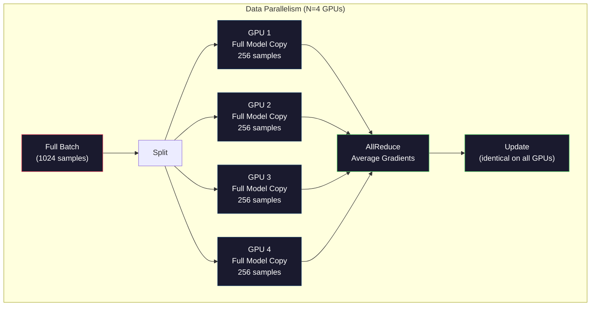
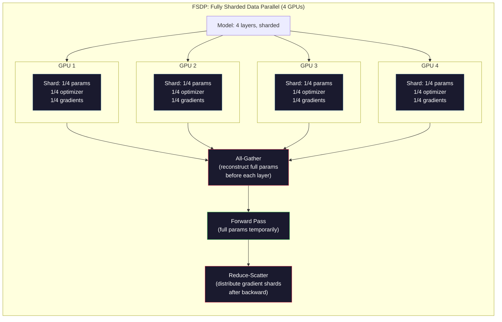
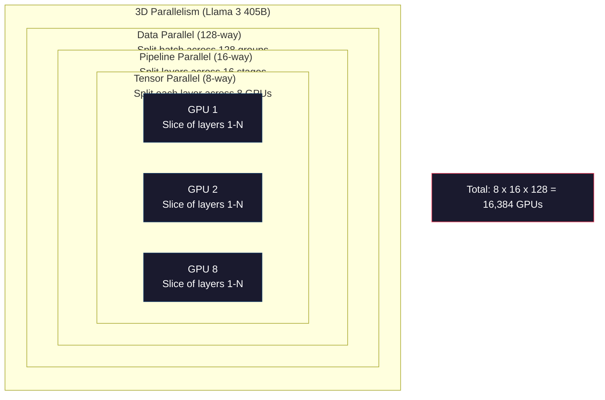

# Escalado: Formación distribuida, FSDP, Velocidad profunda

> Su modelo 124M ya ha completado su entrenamiento en un bloque de GPU. Ahora prueba 70 mil millones de parámetros.

**Type:** Build
**Languages:** Python
**Prerequisites:** Phase 10, Lesson 04 (Pre-Training a Mini GPT)
**Time:** ~120 minutes

## El objetivo del aprendizaje
- 解释三种平行性 (Data、Tensor、Pipeline), así como el momento en que se necesitan usarlos según la escala del modelo y la escala del grupo
- Utiliza PyTorch DDP  Implementar el entrenamiento paralelo de datos, y en muchos bloques de GPU  entre sí Gradiente
- 计算给定模型规模的显存预算(pesos + estados de optimización + gradientes + activaciones), para determinar la demanda mínima de hardware
- Configurar FSDP o etapas de ZeRO de DeepSpeed, separar el estado del modelo a varios bloques de GPU, para así poder albergar más de un modelo de un solo cartón de memoria

##  problemas
Un modelo de parámetros 7B utiliza FP16 时, sólo los pesos necesitan 14GB──Adam optimizador irá para cada parámetros extra almacenamiento dos copias ((primero momento y segundo momento estimaciones)── esto también necesita 28GB──Repropagación 期间 Gradientes volver a aumentar 14GB──No hay almacenamiento de ninguna activación, ya has usado 56GB──

Un bloque de NVIDIA A100 tiene 80 GB de almacenamiento.

80GB se han consumido 56GB. Sólo quedan 24GB. 给激活,也就是前传期间计算的中间值,它们必须保留到后传使用.

Ahora prueba 70B 参数── sólo pesas:FP16 下 140GB── un solo bloque de GPU 放不下── Usted necesita al menos 2 bloques de A100(2 x 80GB = 160GB) para poder sólo dejar abajo pesas──加上优化状态和梯度,需要的 GPU 远不止这些:最低3+块,实际通常取决于碎片化策略,需要8-16块──

Llama 3 405B utiliza 16.384 bloques de GPUs NVIDIA H100  entrenamiento。 Este entrenamiento se ejecuta con un costo estimado de aproximadamente 1 mil millones de dólares en computación 成本。DeepSeek V3 通过更巧妙的架构(Mixura de Expertos significa cada token sólo activa una pequeña parte de los parámetros) y la eficiencia del entrenamiento, con aproximadamente 560 millones de dólares entrenando un modelo comparable。

Este curso presenta la posibilidad de realizar un entrenamiento a gran escala en cuatro estrategias: Paralelismo de datos, Paralelismo de tensión, Paralelismo de tuberías y Paralelismo de datos completamente fragmentados.

## 概念
### ¿Por qué se necesita distribuido

A continuación se muestra el cálculo de la existencia del modelo real. Cada número es calculado, no una estimación.

| Model | Params | Weights (FP16) | Adam States | Gradients (FP16) | Total (no activations) |
|-------|--------|----------------|-------------|------------------|----------------------|
| GPT-2 Small | 124M | 248 MB | 992 MB | 248 MB | 1.5 GB |
| Llama 3 8B | 8B | 16 GB | 64 GB | 16 GB | 96 GB |
| Llama 3 70B | 70B | 140 GB | 560 GB | 140 GB | 840 GB |
| Llama 3 405B | 405B | 810 GB | 3,240 GB | 810 GB | 4,860 GB |

Adam States 这一列才是真正显存杀手──Adam 会为每个参数存储运行平均 (m) 和运行变量 (v),两者都是FP32──对于70B 模型,这就是70B x 4 bytes x 2 = 560GB──只有优化器就需要七块A100──

单块H100 tiene 80GB──Llama 3 405B 至少需要61块H100 才能容纳权重、优化和梯度──加上激活,数量也将继续增加──Meta Utiliza 16,384块GPU no es porque ellos piensan así, sino porque ellos tienen que hacerlo──

### Paralelamente de datos

La estrategia distribuida más simple es:: "Cuando se ha creado un GPU, cada GPU tiene un gran número de gráficos de gráficos de gráficos de gráficos de gráficos de gráficos de gráficos de gráficos de gráficos de gráficos de gráficos de gráficos de gráficos de gráficos de gráficos de gráficos de gráficos de gráficos de gráficos de gráficos de gráficos de gráficos de gráficos de gráficos de gráficos de gráficos de gráficos de gráficos de gráficos de gráficos de gráficos de gráficos de gráficos de gráficos de gráficos de gráficos de gráficos de gráficos de gráficos de gráficos de gráficos de gráficos de gráficos de gráficos de gráficos de gráficos de gráficos de gráficos de gráficos de gráficos de gráficos de gráficos de gráficos de gráficos de gráficos de gráficos de gráficos de gráficos de gráficos de gráficos de gráficos de gráficos de gráficos de gráficos de gráficos de gráficos de gráficos de gráficos de gráficos de gráficos de gráficos de gráficos de gráficos de gráficos de gráficos de gráficos de gráficos de gráficos de gráficos de gráficos de gráficos de gráficos de gráficos de gráficos de gráficos de gráficos de gráficos de gráficos de gráficos de gráficos de gráficos de gráficos de gráficos de gráficos de gráficos de gráficos de gráficos de gráficos de gráficos de gráficos de gráficos de gráficos de gráficos de gráficos de gráficos de gráficos de gráficos de gráficos de gráficos de gráficos de gráficos de gráficos de gráficos de gráficos de gráficos de gráficos de gráficos de gráficos de gráficos de gráficos de gráficos de gráficos de gráficos de gráficos de gráficos de gráficos de gráficos de gráficos de gráficos de gráficos de gráficos de gráficos de gráficos de gráficos de gráficos de gráficos de gráficos de gráficos de gráficos de gráficos de gráficos de gráficos de gráficos de gráficos de gráficos de gráficos de gráficos de gráficos de gráficos de gráficos de gráficos de gráficos de gráficos de gráficos de gráficos de gráficos de gráficos de gráficos de gráficos de gráficos de gráficos de

**优点：**Despliegue de potencia 近似线性扩展──N 块 GPU Cada paso 处理 N 倍数据──通信仅限于梯度平均,并且可以与计算重叠──

**缺点：**Cada GPU tiene un modelo completo, estados de optimización y gradientes. Para el modelo 70B, cada GPU necesita 840 GB. El paralelismo de datos no disminuirá la capacidad de almacenamiento de un solo GPU.

**计算：**Tamaño de lote efectivo = por_gpu_batch_size x N。 para N=64 bloques de GPU 且 por lote de GPU 为 16, lote efectivo 为 1,024。Llama 3 Uso de tamaño de lote efectivo es por cada paso 16000000 tokens。



### Paralelas tensoras

Colocar una sola capa de GPU en múltiples bloques. Una vez la multiplicación de la matriz se divide en múltiples bloques de GPU, cada uno de ellos forma parte del resultado de cálculo.

考虑 feedforward layer 中一个形 为 (8192, 8192) de la matriz de peso. 时使用四向 tensor paralelism 时, cada bloque de GPU 持有一个 (8192, 2048) fragmento. 时, cada bloque de GPU 采用输入乘以自己的碎片,产生一个部分结果.

**优点：**Reducir los pesos de los modelos de cada GPU 显存占用──un modelo de 70B 拆分到8块 GPU 上, significa que cada GPU 持有约8.75B 参数规模的重量──

**缺点：**Cada uno de los niveles requiere GPU 间通信. Cada uno de los últimos niveles reduce todo lo que se puede hacer. Esto aumenta la latencia. Esto es muy bueno en NVLink.

**真实用法：**Megatron-LM                                                                                                                                                                                                                                                                                                                                                                                                                                                                                                                         

### Paralelamente de las tuberías

按层 拆分模型──GPU 1 运行层 1-8──GPU 2 运行层 9-16──GPU 3 运行层 17-24──GPU 4 运行层 25-32──数据流经管道:GPU 1 计算自己的层并把激活 发送给GPU 2,GPU 2 计算自己的层 后发送给GPU 3,依此类推──

**优点：**GPU 间通信极少, sólo transmite capa 边界处的激活;相比梯度或重量, estos datos son muy pequeños.

**缺点：**Bubbles de tubería──cuando GPU 4 está en la calculación del paso hacia adelante de micro-partidos 1, GPU 1、2、3 están en estado de vacío(han completado su propio paso hacia adelante 部分)──cuando el paso hacia atrás 期间, mode反过来──utilizar la tubería 时,N 个管道阶段的 GPU utilización 只有1/N──

**GPipe and PipeDream**通過把批發 拆分成微批來解決泡泡 问题──GPU 1 一完成微批 1 的前進,就開始處理微批 2──这让不同的管道阶段的计算发生重叠──使用M 个微批 和 N 个阶段 时,泡分数 降为 (N-1) /M──N=4阶段、M=16 micro批 时,泡 为 3/16 = 18.75% tiempo inactivo──

### FSDP: Datos totalmente fragmentados paralelamente

FSDP combina la expansibilidad y la eficiencia de almacenamiento de los datos paralelo de fragmentación. Cada bloque de GPU no tiene más copia completa del modelo, sino sólo tiene parámetros 1/N, gradientes y estados de optimizador.

En una capa de pase hacia adelante, FSDP 会运行**all-gather**, , , , , , , , , , , , , , , , , , , , , , , , , , , , , , , , , , , , , , , , , , , , , , , , , , , , , , , , , , , , , , , , , , , , , , , , , , , , , , , , , , , , , , , , , , , , , , , , , , , , , , , , , , , , , , , , , , , , , , , , , , , , , , , , , , , , , , , , , , , , , , , , , , , , , , , , , , , , , , , , , , , , , , , , , , , , , , , , , , , , , , , , , , , , , , , , , , , , , , , , , , , , , , , , , , , , , , , , , , , , , , , , , , , , , , , , , , , , , , , , , , , , , , , , , , , , , , , , , , , , , , , , , , , , , , , , , , , , , , , , , , , , , , , , , , , , , , , , , , , , , , , , , , , , , , , , , , , , , , , , , , , , , , , , , , , , , , , , , , , , , , , , , , , , , , , , , , , , , , , , , , , , , , , , , , , , , , , , , , , , , , , , , , , , , , , , , , , , , , , , , , , , , , , , , , , , , , , , , , , , , , , , , , , , , , , , , , , , , , , , , , , , , , , , , , , , , , , , , , , , , , , , , , , , , , , , , , , , , , , , , , , , , , , , , , , , , , , y , , , , , , , , , , , , , ,**reduce-scatter**Distribuye fragmentos de gradientes, permita que cada bloque de GPU sólo almacene gradientes de 1/N.

**70B 模型在 8 块 GPU 上的计算：**

| Component | Without FSDP | With FSDP |
|-----------|-------------|-----------|
| Weights (FP16) | 140 GB per GPU | 17.5 GB per GPU |
| Adam States (FP32) | 560 GB per GPU | 70 GB per GPU |
| Gradients (FP16) | 140 GB per GPU | 17.5 GB per GPU |
| **Total** | **840 GB per GPU** | **105 GB per GPU** |

 sin FSDP , no puedes colocar el modelo 70B en un solo bloque de GPU de 80GB . Después de usar 8 bloques de GPU de FSDP , cada bloque de GPU utiliza 105GB, etc., esto sigue sin bajar. . necesitas al menos 16 bloques de GPU  para hacer que cada bloque de GPU sea inferior a 80GB, o puedes combinar FSDP con el punto de control de activación . .

通信成本高于瓦尼莉数据平行性,因为 cada uno de los niveles previos requiere todo reunido.



### Profundidad de la velocidad

ZeRO de DeepSpeed (Zero Redundancy Optimizer) es conceptualmente similar a FSDP, pero desarrollado por Microsoft independientemente.

| Stage | Shards | Memory Savings | Communication |
|-------|--------|---------------|---------------|
| ZeRO-1 | 仅 Optimizer states | ~4x reduction | 与 data parallel 相同 |
| ZeRO-2 | + Gradients | ~8x reduction | 略多 |
| ZeRO-3 | + Parameters | ~Nx reduction (N GPUs) | 每层 All-gather |

ZeRO-3 等价于 FSDP──命名不同,机械相同──DeepSpeed 证明这个概念后,PyTorch 添加了FSDP 作为原生实现──

DeepSpeed también introdujo ZeRO-Offload (en inglés) (en inglés) (en inglés) (en inglés) (en inglés) (en inglés) (en inglés) (en inglés) (en inglés) (en inglés) (en inglés) (en inglés) (en inglés) (en inglés) (en inglés) (en inglés) (en inglés) (en inglés) (en inglés) (en inglés) (en inglés) (en inglés) (en inglés) (en inglés) (en inglés) (en inglés) (en inglés) (en inglés) (en inglés) (en inglés) (en inglés) (en inglés) (en inglés) (en inglés) (en inglés) (en inglés) (en inglés) (en inglés) (en inglés) (en inglés) (en inglés) (en inglés) (en inglés) (en inglés) (en inglés) (en inglés) (en inglés) (en inglés) (en inglés) (en inglés) (en inglés) (en inglés) (en inglés) (en inglés) (en inglés) (en inglés) (en inglés) (en inglés) (en inglés) (en inglés) (en inglés) (en inglés) (en inglés) (en inglés) (en inglés) (en inglés) (en inglés) (en inglés) (en inglés) (en inglés) (en inglés) (en inglés) (en inglés) (en inglés) (en inglés) (en inglés) (en inglés) (en inglés) (en inglés) (en inglés) (en inglés) (en inglés) (en inglés) (en inglés) (en inglés) (en inglés) (en inglés) (en inglés) (en inglés) (en inglés) (en inglés) (en inglés).

### Formación de precisión mixta

现代训练会同时使用多种浮点格式:

- **Forward pass**:FP16 o BF16(16 bits)。 Se muestra que el almacenamiento es la mitad de FP32──Matmulas en núcleos tensores
- **Master weights**:FP32(32 bits)。 por el optimizador 维护, utilizado durante las actualizaciones de peso 保持数值精度──
- **Loss scaling**En el paso hacia atrás, la pérdida se multiplica por un gran número de frecuencias, para evitar los gradientes FP16.

BF16(Brain Float 16) tiene un rango exponencial similar al FP32 (8, pero la precisión es menor) (7, mientras que FP32 es 23);; muy poco necesita una escala de pérdida, ya que puede representar el mismo rango de valores;;FP16 tiene 5 bits exponentes y 10 bits mantissa, puede representar un valor de menor detalle, pero en la escala de la extremidad se supervierte / subvierte;;

Las TPU de Google utilizan originalmente BF16──NVIDIA A100 y H100, y apoyan también FP16 y BF16──El sector básicamente ha cambiado hacia BF16, ya que elimina los problemas de pérdida de escala.

**7B 模型的显存对比：**

| Precision | Weights | Optimizer | Gradients | Total |
|-----------|---------|-----------|-----------|-------|
| FP32 everywhere | 28 GB | 56 GB | 28 GB | 112 GB |
| Mixed (BF16 + FP32 master) | 14 GB | 56 GB | 14 GB | 84 GB |

En este modelo, la precisión mixta ahorra 28 GB.

### Megatron-LM con el paralelismo 3D

El entrenamiento de gran escala real se combina con tres paralelismos:

- **Data parallelism**跨节点组(扩展 tamaño del lote)
- **Tensor parallelism**En el punto de entrada, las capas se despejan en 8 bloques de GPU.
- **Pipeline parallelism**跨节点(把 grupos de capas 拆到多台机器)

Llama 3 405B en 16,384 bloques H100 上:
- Cada punto de 8 vías de paralelismo tensor en cada punto de 8 bloques de GPU)
- 跨节点 16 vías de la línea de tuberías paralelismo(16 个
- 余余维度上 128 direcciones de datos paralelismo(16,384 / 8 / 16 = 128)

Esta descomposición 3D ((8 x 16 x 128 = 16,384) é é é é é é é é é é é é é é é é é é é é é é é é é é é é é é é é é é é é é é é é é é é é é é é é é é é é é é é é é é é é é é é é é é é é é é é é é é é é é é é é é é é é é é é é é é é é é é é é é é é é é é é é é é é é é é é é é é é é é é é é é é é é é é é é é é é é é é é é é é é é é é é é é é é é é é é é é é é é é é é é é é é é é é é é é é é é é é é é é é é é é é é é é é é é é é é é é é é é é é é é é é é é é é é é é é é é é é é é é é é é é é é é é é é é é é é é é é é é é é é é é é é é é é é é é é é é é é é é é é é é é é é é é é é é é é é é é é é é é é é é é é é é é é é é é é é é é é é é é é é é é é é é é é é é é é é é é é é é é é é é é é é é é é é é é é é é é é é é é é é é é é é é é é é é é é é é é é é é é é é é é é é é é é é é é é é é é é é é é é é é é é é é é é é é é é é é é é é é é é é é é é é é é é é é é é é é é é é é é é é é é é é é é é é é é é é é é é é é é é é é é é é é é é é é é é é é é é é é é é é é é é é é é é é é é é é é é é é é é é é é é é é é é é é é é é é é é é

DeepSeek V3  adoptó diferentes métodos. Su arquitectura de expertos mezcla en cada token para activar 671B parámetros de 37B  Esto significa que cada bloque de GPU sólo necesita calcular  y para sus activaciones de almacenamiento  active parámetros .




```figure
paged-kv-cache
```

## Construirlo
### Paso 1: Simulación de la parallelización de datos

Colocar un lote de GPUs en su propio fragmento de GPUs en su propio fragmento de GPUs en su propio fragmento de GPUs en su propio fragmento de GPUs en su propio segmento de GPUs en su propio segmento de GPUs en su propio segmento de GPUs en su propio segmento de GPUs en su propio segmento de GPUs en su propio segmento de GPUs en su propio segmento de GPUs en su propio segmento de GPUs en su propio segmento de GPUs en su propio segmento de GPUs en su propio segmento de GPUs en su propio segmento de GPUs en su propio segmento de GPUs en su propio segmento de GPUs en su propio segmento de GPUs en su propio segmento de GPUs en su propio segmento de GPUs en su propio segmento de GPUs en su segmento de GPUs en su segmento de GPUs en su segmento de GPUs en su segmento de GPUs.

```python
import numpy as np

def simulate_data_parallelism(data, num_gpus, model_fn):
    batch_size = len(data)
    shard_size = batch_size // num_gpus
    remainder = batch_size % num_gpus

    gpu_losses = []
    gpu_gradients = []

    offset = 0
    for gpu_id in range(num_gpus):
        extra = 1 if gpu_id < remainder else 0
        shard = data[offset:offset + shard_size + extra]
        offset += shard_size + extra

        loss, grad = model_fn(shard)
        gpu_losses.append(loss)
        gpu_gradients.append(grad)

    avg_loss = np.mean(gpu_losses)
    avg_gradient = np.mean(gpu_gradients, axis=0)

    return avg_loss, avg_gradient
```

En la práctica, NVIDIA GPU 上会使用NCCL library,它实现了环全减少:每块 GPU 把自己梯度的1/N 发送给相邻 GPU,从另一边相邻 GPU 接收1/N,经过N-1 步后,每块 GPU 都拥有完整的平均――总通信量:2 x gradient_size x (N-1) /N,当N 很大时接近梯度大小的2倍――

### Paso 2: Simula el paralelismo de la tensión

Colocar la matriz de peso  desglosar en varios bloques de GPU 上。 cada bloque de GPU 计算部分 Matrix multiplicación。组合结果。

```python
def simulate_tensor_parallelism(input_data, weight_matrix, num_gpus):
    d_in, d_out = weight_matrix.shape
    assert d_out % num_gpus == 0, f"d_out {d_out} not divisible by num_gpus {num_gpus}"
    shard_size = d_out // num_gpus

    partial_results = []
    for gpu_id in range(num_gpus):
        start = gpu_id * shard_size
        end = start + shard_size
        weight_shard = weight_matrix[:, start:end]

        partial = input_data @ weight_shard
        partial_results.append(partial)

    full_output = np.concatenate(partial_results, axis=-1)

    direct_output = input_data @ weight_matrix
    error = np.abs(full_output - direct_output).max()

    return full_output, error
```

error 应该严格为零((或机器epsilon) ――Parallelismo de tensor En matemáticas es preciso, el resultado que se produce es el de calcular un conjunto completo de datos en un bloque de GPU en comparación con el de realizar un proceso de cálculo de la dimensión de salida, por lo que cada bloque de GPU produce diferentes columnas en un pedazo, una concatenación, un resultado completo de la reconstrucción.

对于列平行线线性层面 (切分输出维度),你执行 concatenate──对列平行 (切分输入维度),你执行 sum── 在变压器 FFN 中,第一个线性层面 (第一个线性层面) 扩展 (第一个线性层面) 使用列平行 (列平行),第二个线性层面 (第一个线性层面) 合同 (第一个线性层面) 换个线性层面 (第一个线性层面) 换个线性层面 (第一个线性层面) 换个线性层面 (第一个线性层面) 换个线性层面 (切分输出维度),你执行连连连点 (你执行连连连连点) 换个线性层面 (切分输入维度),你执行总量──在变压器 FFN 中,第一个线性层面 (第一个线性层面) 扩展 (第一个线性层面) 换个线性层面 (第二个线性合约) 换个线性层面 (二个线性层面) 换个层面) 换个层间的线性层面 (二层间) 减减) 避免了两层间的发生一次的变化

### Paso 3: Simulación de la paralelismo de la tubería

Colocar las capas de modelo  desmantelar a GPU virtual ︎ mostrar el problema de burbuja: etapas tempranas 会在后续阶段 计算时处于空︎

```python
def simulate_pipeline_parallelism(num_layers, num_stages, num_microbatches):
    layers_per_stage = num_layers // num_stages

    timeline = {}
    clock = 0

    for mb in range(num_microbatches):
        for stage in range(num_stages):
            start_time = max(
                timeline.get((stage, mb - 1, "fwd"), (0, 0))[1] if mb > 0 else 0,
                timeline.get((stage - 1, mb, "fwd"), (0, 0))[1] if stage > 0 else 0,
            )
            end_time = start_time + layers_per_stage
            timeline[(stage, mb, "fwd")] = (start_time, end_time)

    last_fwd_end = max(v[1] for v in timeline.values())

    for mb in range(num_microbatches - 1, -1, -1):
        for stage in range(num_stages - 1, -1, -1):
            deps = [last_fwd_end]
            if mb < num_microbatches - 1 and (stage, mb + 1, "bwd") in timeline:
                deps.append(timeline[(stage, mb + 1, "bwd")][1])
            if stage < num_stages - 1 and (stage + 1, mb, "bwd") in timeline:
                deps.append(timeline[(stage + 1, mb, "bwd")][1])
            start_time = max(deps)
            end_time = start_time + layers_per_stage
            timeline[(stage, mb, "bwd")] = (start_time, end_time)

    total_time = max(v[1] for v in timeline.values())
    compute_time = num_microbatches * num_stages * layers_per_stage * 2
    bubble_fraction = 1.0 - compute_time / (total_time * num_stages)

    return timeline, total_time, bubble_fraction
```

Cuando se usan 4 etapas y 1 micro-batch, la fracción de burbujas es del 75%, es decir, en cualquier momento hay tres bloques en cuatro bloques de GPU. Cuando se usan 16 micro-batches, se reduce a aproximadamente el 19%.

### Paso 4: Calculador de memoria

计算任意模型规模训练时的精确显存需求──

```python
def memory_calculator(
    params_billions,
    precision_bytes=2,
    optimizer="adam",
    num_gpus=1,
    sharding="none",
    sequence_length=2048,
    batch_size_per_gpu=1,
    hidden_dim=None,
    num_layers=None,
):
    params = params_billions * 1e9

    weight_memory = params * precision_bytes

    if optimizer == "adam":
        optimizer_memory = params * 4 * 2
    elif optimizer == "sgd":
        optimizer_memory = params * 4
    else:
        optimizer_memory = 0

    gradient_memory = params * precision_bytes

    total_no_activation = weight_memory + optimizer_memory + gradient_memory

    if hidden_dim and num_layers:
        activation_per_layer = (
            sequence_length * batch_size_per_gpu * hidden_dim * precision_bytes * 4
        )
        activation_memory = activation_per_layer * num_layers
    else:
        activation_memory = params * precision_bytes * 0.5

    if sharding == "fsdp" or sharding == "zero3":
        weight_memory /= num_gpus
        optimizer_memory /= num_gpus
        gradient_memory /= num_gpus
    elif sharding == "zero2":
        optimizer_memory /= num_gpus
        gradient_memory /= num_gpus
    elif sharding == "zero1":
        optimizer_memory /= num_gpus

    per_gpu_total = weight_memory + optimizer_memory + gradient_memory + activation_memory

    return {
        "params_billions": params_billions,
        "weights_gb": weight_memory / 1e9,
        "optimizer_gb": optimizer_memory / 1e9,
        "gradients_gb": gradient_memory / 1e9,
        "activations_gb": activation_memory / 1e9,
        "per_gpu_total_gb": per_gpu_total / 1e9,
        "total_across_gpus_gb": per_gpu_total * num_gpus / 1e9,
        "fits_on_80gb": per_gpu_total / 1e9 <= 80,
        "num_gpus": num_gpus,
        "sharding": sharding,
    }
```

Esta calculadora  respondió a cada ingeniero de ML que le preguntó: I need how many blocks of GPU? input model size, see see if you put it down― 调整 sharding strategy, until per-GPU total 低于80GB―

### 步骤 5: Simulación de precisión mixta

Comparar el uso de la FP32、FP16 y el uso de la formación de precisión mixta

```python
def mixed_precision_comparison(params_billions):
    params = params_billions * 1e9

    fp32_weights = params * 4
    fp32_optimizer = params * 4 * 2
    fp32_gradients = params * 4
    fp32_total = fp32_weights + fp32_optimizer + fp32_gradients

    fp16_weights = params * 2
    fp16_master = params * 4
    fp16_optimizer = params * 4 * 2
    fp16_gradients = params * 2
    fp16_total = fp16_weights + fp16_master + fp16_optimizer + fp16_gradients

    mixed_weights = params * 2
    mixed_optimizer = params * 4 * 2
    mixed_gradients = params * 2
    mixed_total = mixed_weights + mixed_optimizer + mixed_gradients

    return {
        "fp32_total_gb": fp32_total / 1e9,
        "fp16_with_master_gb": fp16_total / 1e9,
        "mixed_bf16_gb": mixed_total / 1e9,
        "savings_vs_fp32": 1 - mixed_total / fp32_total,
    }
```

Para la mayoría de las personas, la mayor sorpresa es: la precisión mixta no se reduce a la mitad.

## Usalo
### Ejecutar todas las simulaciones

```python
def run_all_demos():
    print("=" * 70)
    print("DATA PARALLELISM SIMULATION")
    print("=" * 70)

    np.random.seed(42)
    data = np.random.randn(64, 32)
    weight = np.random.randn(32, 16)

    def model_fn(batch):
        output = batch @ weight
        loss = np.mean(output ** 2)
        grad = 2 * batch.T @ (batch @ weight) / len(batch)
        return loss, grad

    for n_gpus in [1, 2, 4, 8]:
        loss, grad = simulate_data_parallelism(data, n_gpus, model_fn)
        print(f"  {n_gpus} GPUs: loss={loss:.4f}, grad_norm={np.linalg.norm(grad):.4f}")

    print()
    print("=" * 70)
    print("TENSOR PARALLELISM SIMULATION")
    print("=" * 70)

    x = np.random.randn(4, 8192)
    W = np.random.randn(8192, 8192)

    for n_gpus in [1, 2, 4, 8]:
        output, error = simulate_tensor_parallelism(x, W, n_gpus)
        print(f"  {n_gpus} GPUs: output_shape={output.shape}, max_error={error:.2e}")

    print()
    print("=" * 70)
    print("PIPELINE PARALLELISM SIMULATION")
    print("=" * 70)

    for n_mb in [1, 4, 8, 16, 32]:
        _, total_t, bubble = simulate_pipeline_parallelism(32, 4, n_mb)
        print(f"  {n_mb:2d} micro-batches: total_time={total_t:4d}, bubble={bubble:.1%}")

    print()
    print("=" * 70)
    print("MEMORY CALCULATOR")
    print("=" * 70)

    configs = [
        (7, "none", 1),
        (7, "fsdp", 8),
        (70, "none", 1),
        (70, "fsdp", 8),
        (70, "fsdp", 16),
        (405, "fsdp", 64),
        (405, "fsdp", 128),
    ]

    print(f"  {'Model':>8} {'Sharding':>8} {'GPUs':>5} {'Per-GPU':>10} {'Fits 80GB':>10}")
    print("  " + "-" * 50)
    for params, shard, gpus in configs:
        result = memory_calculator(params, num_gpus=gpus, sharding=shard)
        fits = "Yes" if result["fits_on_80gb"] else "No"
        print(f"  {params:>6}B {shard:>8} {gpus:>5} {result['per_gpu_total_gb']:>8.1f}GB {fits:>10}")

    print()
    print("=" * 70)
    print("MIXED PRECISION COMPARISON")
    print("=" * 70)

    for params_b in [7, 13, 70, 405]:
        result = mixed_precision_comparison(params_b)
        print(f"  {params_b}B: FP32={result['fp32_total_gb']:.0f}GB, "
              f"Mixed BF16={result['mixed_bf16_gb']:.0f}GB, "
              f"Savings={result['savings_vs_fp32']:.0%}")
```

##  entregarlo
本课会产出                                                                                                                                                                                                                                                                                                                                                                                                                                                                                                                         `outputs/prompt-distributed-training-planner.md`Una respuesta rápida, recibe el tamaño del modelo y el hardware disponible, y luego genera un plan de formación distribuido completo: estrategia de paralelismo, presupuesto de memoria, gastos generales de comunicación y rendimiento esperado.

##  ejercicios
1. Modificar la calculadora de memoria, añadir control de activación. Usar control de control. Solo en cada una de las activaciones de almacenamiento de nivel K.

2. 扩展管道平行模拟,实现 PipeDream 使用的 1F1B(uno hacia adelante, uno hacia atrás)horario。 a 4 etapas 和 8 micro-batches, compararlo con la fracción de burbuja del cronograma ingenuo。 1F1B cronograma  debería tener una menor memoria de pico, ya que comienza más temprano a pasar hacia atrás。

3.  Realizar un simulador de acumulación de gradientes― no en cada micro-parcela 后都 todo-reducir, sino en la acumulación local de gradientes K 步, luego todo-reducir― mostrar cómo esto reduce la comunicación K 倍, al mismo tiempo que se producen los mismos gradientes finales 

4. Construir un estimador de costos―Dado el tamaño del modelo―conteo de tokens objetivo―tipo de GPU(A100 en $2/hr，H100 at $3.50/h) y estrategia de paralelismo, estimación total de costos de entrenamiento (USD)$100M，DeepSeek V3 成本约 $5.6M.

5. En la calculadora de memoria, se incluye ZeRO-Offload. Suponga que cada punto tenga 512 GB de RAM de CPU y 2 TB de NVMe. Muestre cómo hacer que los estados de optimización se descarguen hasta la CPU. Después, cómo hacer que el modelo 70B se convierta en una GPU de 16 bloques.

## 关键术语: "El hombre es un hombre"
| Term | What people say | What it actually means |
|------|----------------|----------------------|
| Data parallelism | “把模型复制到每块 GPU” | 每块 GPU 处理不同的 data shard；每一步之后通过 all-reduce 平均 gradients |
| Tensor parallelism | “把一层拆到多块 GPU 上” | 切分 weight matrices，让每块 GPU 计算 matmul 的一部分；需要高速 NVLink interconnect |
| Pipeline parallelism | “把 layers 拆到多块 GPU 上” | 每块 GPU 运行不同的一组 layers；数据通过 pipeline 流动，并使用 micro-batches 减少 bubbles |
| FSDP | “Shard everything” | Fully Sharded Data Parallel：每块 GPU 持有 1/N 的 weights、gradients 和 optimizer states；计算前执行 all-gather |
| ZeRO | “DeepSpeed 版本的 FSDP” | Zero Redundancy Optimizer，包含 3 个 stages：shard optimizer（Stage 1）、+ gradients（Stage 2）、+ parameters（Stage 3） |
| All-reduce | “在 GPU 之间求平均” | collective operation，让每块 GPU 最终都拥有所有 GPU 输入的 sum（或 average），通常实现为 ring all-reduce |
| All-gather | “从所有 GPU 收集” | collective operation，让每块 GPU 最终都拥有所有 GPU 数据的 concatenation；FSDP 中用于重建完整 parameters |
| Reduce-scatter | “求和并分发” | collective operation，对数据进行 reduce（sum）并把不同 chunks scatter 到不同 GPU；FSDP 中用于 gradient sharding |
| Mixed precision | “用 half precision 训练” | forward/backward 使用 FP16/BF16，optimizer states 使用 FP32；节省约 25% 显存，而不是 50%，因为 optimizer 占主导 |
| Pipeline bubble | “pipeline 中的 idle time” | GPU 等待上一 stage 数据时处于空闲的时间比例；可通过使用更多 micro-batches 降低 |

## 延伸阅读
- [Rajbhandari et al., 2020 -- "ZeRO: Memory Optimizations Toward Training Trillion Parameter Models"](https://arxiv.org/abs/1910.02054)-- definición de tres etapas de fragmentación de papel ZeRO de DeepSpeed
- [Shoeybi et al., 2020 -- "Megatron-LM: Training Multi-Billion Parameter Language Models Using Model Parallelism"](https://arxiv.org/abs/1909.08053)-- NVIDIA 面向变压器 的 tensor paralelismo
- [Narayanan et al., 2021 -- "Efficient Large-Scale Language Model Training on GPU Clusters Using Megatron-LM"](https://arxiv.org/abs/2104.04473)-- 结合 datos、tensor y paralelismo 3D de la tubería
- [Zhao et al., 2023 -- "PyTorch FSDP: Experiences on Scaling Fully Sharded Data Parallel"](https://arxiv.org/abs/2304.11277)-- PyTorch's original FSDP   ejecutar
- [Llama 3 Technical Report](https://arxiv.org/abs/2407.21783)-- 16,384 GPU de entrenamiento de paralelismo 3D 细节
- [DeepSeek-V3 Technical Report](https://arxiv.org/abs/2412.19437)-- Arquitectura de la UE  cómo reducir el coste de entrenamiento a un nivel cuantitativo
