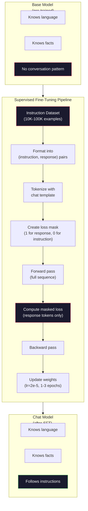

# El sistema de ajuste de instrucciones (SFT)

> El modelo base 会预测下一个 Token──仅此而已── no seguirá las instrucciones, responderá a las preguntas, ni rechazará las peticiones nocivas──SFT es el símbolo 预测器和有用助手 之间的桥梁──cada uno de los modelos con los que has hablado −Claude、GPT、Llama Chat − han pasado por este paso──

**类型：**Construir
**语言：**Python (con numpy)
**前置要求：**Fase 10, Lección 04 (Pre-entrenamiento de un mini GPT)
**时间：**- 90 minutos

## El objetivo del aprendizaje

- 实现 supervisado de ajuste fino (SFT),将 base modelo de lenguaje 转换为遵循指令的助手
- Utiliza contener sistema, usuario y asistente 角色的聊天模板 格式化训练数据,并对非助手代币 屏蔽 Loss
-  Explicar por qué es necesario el SFT: los modelos básicos continuarán con el texto, en lugar de responder a los problemas
- 通过在保留的说明套上比较基模型与细调模型的回复,评估SFT质量

##  problemas

Usted en la Lección 04 entrenó un modelo. Dado una secuencia, puede predecir el siguiente token.

Ahora prueba esto: a este modo de entrada "¿Qué es la capital de Francia?" el modelo base no responderá a "Paris". Continuará este modo. Puede generar "¿Qué es la capital de Alemania? ¿Qué es la capital de España?", ya que se ha aprendido de este modo.

Éste es el diferencial entre el modelo base GPT-3 (en inglés) y el modelo de base ChatGPT (en inglés) (en inglés) (en inglés) (en inglés) (en inglés) (en inglés) (en inglés) (en inglés) (en inglés) (en inglés) (en inglés) (en inglés) (en inglés) (en inglés) (en inglés) (en inglés) (en inglés) (en inglés) (en inglés) (en inglés) (en inglés) (en inglés) (en inglés) (en inglés) (en inglés) (en inglés) (en inglés) (en inglés) (en inglés) (en inglés) (en inglés) (en inglés) (en inglés) (en inglés) (en inglés) (en inglés) (en inglés) (en inglés) (en inglés) (en inglés) (en inglés) (en inglés) (en inglés) (en inglés) (en inglés) (en inglés) (en inglés) (en inglés) (en inglés) (en inglés) (en inglés) (en inglés) (en inglés) (en inglés) (en inglés) (en inglés) (en inglés) (en inglés) (en inglés) (en inglés) (en inglés) (en inglés) (en inglés) (en inglés) (en inglés) (en inglés) (en inglés) (en inglés) (en inglés) (en inglés) (en inglés) (en inglés).

Stanford Alpaca  prueba que no necesitas millones de ejemplos. En marzo de 2023, sólo utilizaron GPT-3.5 para realizar una mejora de las instrucciones de 52,000 instrucciones de respuesta a Llama 7B. El costo total de 600 dólares. El resultado es un chatbot capaz de seguir las instrucciones, responder a las preguntas y mantener el diálogo.

Meta's Llama 2 Chat en la fase inicial de SFT solo utilizó unos 27.000 ejemplos de alta calidad.

## 概念

### SFT  实际做了什么

Supervisado Fine-Tuning continuó el mismo ciclo de entrenamiento en el pre-entrenamiento - pase hacia adelante ̊ pérdida de cálculo ̊ pase hacia atrás ̊ actualización de pesas ̊ - pero utiliza otro tipo de datos―.

```json
{
  "system": "You are a helpful assistant.",
  "user": "What is the capital of France?",
  "assistant": "The capital of France is Paris."
}
```

El modelo  ya sabe que París es la capital de Francia. Se ha aprendido esto en Wikipedia, el material y la página web.

Se puede entender así. Pre-entrenamiento.

### Forma de datos

En la industria hay tres tipos de formato: cada tipo de formato codifica la misma información: 谁说什么: 只是使用不同的分隔符:

**Alpaca Format**(Stanford, marzo 2023):

```json
{
  "instruction": "Summarize the following article in 3 sentences.",
  "input": "The European Central Bank raised interest rates...",
  "output": "The ECB increased rates by 25 basis points..."
}
```

简单且被广泛使用──`input`字段是可选的-- 许多指令不需要额外上下文──Stanford 发布了52,000 ejemplos de este formato, generados por GPT-3.5 以 600 美元的成本── esto abrió el proceso de ajuste de instrucciones de código abierto 运动──

**ShareGPT Format**(Comunidad, 2023):

```json
{
  "conversations": [
    {"from": "system", "value": "You are a helpful assistant."},
    {"from": "human", "value": "What causes tides?"},
    {"from": "gpt", "value": "Tides are caused by the gravitational pull of the Moon..."},
    {"from": "human", "value": "How often do they occur?"},
    {"from": "gpt", "value": "Most coastal areas experience two high tides and two low tides per day..."}
  ]
}
```

支持多轮对话──按照惯例,"from"字段使用"human" 和"gpt",不管实际模型是什么──Vicuna 使用从用户共享的ChatGPT transcripts 中抓取的70,000条 ShareGPT 对话进行训练──

**ChatML Format**(OpenAI, utilizado por muchos modelos de código abierto):

```
<|im_start|>system
You are a helpful assistant.<|im_end|>
<|im_start|>user
What is the capital of France?<|im_end|>
<|im_start|>assistant
The capital of France is Paris.<|im_end|>
```

Uso especial de los tokens`<|im_start|>`¿Qué es esto?`<|im_end|>`Estos Token se agregarán al vocabulario de Tokenizer durante el ajuste fino.

Tres formas logran lo mismo: les dicen al modelo que es instrucción, es respuesta, aprender este modelo.

### ¿Por qué funciona?

El modelo  ya ha sido utilizado desde la pre-entrenamiento en la escuela de idiomas . Se han observado miles de millones de preguntas y respuestas .

El SFT se centrará en esta capacidad potencial. El modelo no necesita más juzgarse por el texto anterior o por el texto siguiente, el SFT se entrenará claramente en el modo de diálogo.

Es por eso que 27.000 ejemplos son suficientes. Usted no está enseñando un modelo de inglés. Usted no está enseñándole hechos del mundo. Usted está enseñándole un simple comportamiento: respuesta instrucción.

### Perdida enmascarada

Es el detalle técnico más importante de la SFT, y la mayoría de los cursos lo saltan.

Durante el período de pre-entrenamiento, usted se encargará de cada token  calcular pérdida. Durante el período de SFT, usted sólo se encargará de*respuesta* a los tokens  calcular pérdida.

¿Por qué? Porque no quieres que el modelo 学会*生成* instrucción。 Tú quieres que el modelo 学会*响应* instrucción。 Si se observa la instrucción Token 计算 Loss, estás en un modelo de entrenamiento 预测 "Cuál es la capital de Francia?", como si fuera sólo un preguntador。 Esto va a perder un gradio 信号,并可能让模型产生混对自己的角色──

實踐中,你會创建一个损失面具:response Token 为 1,instruction Token 为 0──在取平均之前,将每 Token 的损失 乘以这个面具──

```
Tokens:    [SYS] You are helpful [USER] What is the capital? [ASST] Paris is the capital [EOS]
Loss mask:   0    0    0     0      0     0   0  0     0       1     1    1   1     1      1
```

Sólo .`[ASST]`后后的Token 会贡献 Loss──model 在前进传递期间将看到完整对话(requiere instrucción 才能产生正确反应), pero sólo según el efecto de su respuesta de predicción para actualizar pesos──

### 训练 Hiperparámetros

Los hiperparámetros de uso de la FTS son muy diferentes a los de pre-entrenamiento.

| Parameter | Pre-Training (Llama 2 7B) | SFT (Llama 2 Chat) |
|-----------|---------------------------|---------------------|
| Learning rate | 3e-4 (peak) | 2e-5 |
| Epochs | 1（单次遍历数据） | 2 |
| Batch size | 4M tokens | 64 examples |
| Warmup steps | 2,000 | 0-100 |
| Weight decay | 0.1 | 0.0-0.1 |
| Data size | 2T tokens | 27,000 examples |

La tasa de aprendizaje de SFT es muy importante. La tasa de aprendizaje excesiva durante el ajuste fino destruye el conocimiento pre-entrenado. El modelo se olvida de lo aprendido y se supera a un conjunto de datos de ajuste fino pequeño.

两个时代意味着模型会看到每个训练示例两次――在小数据集上超过3时代会导致记忆化--model 开始逐字复现训练示例,而不是泛化――

### El olvido catastrófico

El ajuste fino puede dañar la capacidad general de entrenamiento en datos después de instrucciones demasiado tiempo, el modelo puede perder la capacidad de escribir código, hacer matemáticas o generar textos creativos.

Tres tipos de aceleradores:

1. **低 learning rate。**1e-5 hasta 5e-5── una actualización más pequeña significa menos daño a las características pre-entrenadas─

2. **短训练。**1-3 épocas── en el modelo de sobremesa 之前停止──

3. **混入 pre-training 数据。**Llama 2 Chat 将一小部分(2-5%) original pre-entrenamiento 数据混入 SFT dataset──这样可以在学习新指令后行时,提醒模型 保持通用能力──

### Número verdadero

En 10.000 pares de instrucciones de alta calidad, para ajustar el diseño de un modelo 7B, se utiliza una sola NVIDIA A100 GPU de 80 GB.

- 10.000 ejemplos x 平均 512 tokens = 5,12M tokens
- 2 épocas = 总计 10.24M tokens
- A100 para 7B modelo de ajuste fino de la desglose: ~ 3.000 tokens/segundo
- 10.24M / 3.000 = ~ 3.400 segundos = ~ 57 minutos

Para nuestro mini GPT (cuatro capas, 128 dims), el entrenamiento es casi instantáneo.




```figure
loss-masking
```

## Construcción

### 步骤 1: Datos de instrucciones

Crear un conjunto de datos de instrucciones sintéticas ∙ En el entorno de producción, empresas como AI y Anthropic contratarán marcadores artificiales para redactar estos datos ∙ Usaremos un modo programado para crearlos, en formato de demostración ∙

```python
import numpy as np

INSTRUCTION_DATA = [
    {
        "instruction": "What is the capital of France?",
        "response": "The capital of France is Paris."
    },
    {
        "instruction": "Explain gravity in one sentence.",
        "response": "Gravity is the force that attracts objects with mass toward each other."
    },
    {
        "instruction": "Write a haiku about the ocean.",
        "response": "Waves crash on the shore, salt and foam beneath the sun, endless blue expanse."
    },
    {
        "instruction": "What is 15 multiplied by 7?",
        "response": "15 multiplied by 7 is 105."
    },
    {
        "instruction": "Name three programming languages.",
        "response": "Three programming languages are Python, Rust, and TypeScript."
    },
    {
        "instruction": "Summarize photosynthesis.",
        "response": "Photosynthesis converts sunlight, water, and carbon dioxide into glucose and oxygen."
    },
    {
        "instruction": "What year did World War II end?",
        "response": "World War II ended in 1945."
    },
    {
        "instruction": "Define machine learning.",
        "response": "Machine learning is a field where algorithms learn patterns from data to make predictions."
    },
]
```

Ocho ejemplos muy pocos. La Stanford Alpaca utilizó 52,000 ejemplos. Pero sin importar si tienes 8 o 52,000 ejemplos, el mecanismo es el mismo: tokenizar, máscarar, sólo para las respuestas, calcular pérdidas.

### 步骤 2: Utiliza Template de chat  realizar el tokenización

Para que los pares de instrucciones y respuestas se transformen en tokens con marcadores de rol especiales estos marcadores le dicen a la instrucción del modelo en dónde termina, la respuesta en dónde comienza.

```python
SPECIAL_TOKENS = {
    "INST_START": 253,
    "INST_END": 254,
    "RESP_START": 255,
}


def tokenize_instruction_pair(instruction, response, vocab_size=256):
    inst_tokens = list(instruction.encode("utf-8"))
    resp_tokens = list(response.encode("utf-8"))

    inst_tokens = [min(t, vocab_size - 4) for t in inst_tokens]
    resp_tokens = [min(t, vocab_size - 4) for t in resp_tokens]

    tokens = (
        [SPECIAL_TOKENS["INST_START"]]
        + inst_tokens
        + [SPECIAL_TOKENS["INST_END"]]
        + [SPECIAL_TOKENS["RESP_START"]]
        + resp_tokens
    )

    return tokens


def create_loss_mask(tokens):
    mask = np.zeros(len(tokens), dtype=np.float32)
    in_response = False

    for i, token in enumerate(tokens):
        if token == SPECIAL_TOKENS["RESP_START"]:
            in_response = True
            continue
        if in_response:
            mask[i] = 1.0

    return mask
```

Máscara de pérdida para la instrucción Token 全部为零, Token de respuesta 全部为一。`RESP_START`El símbolo de la máscara es 0, porque es un separador, no parte del contenido de la respuesta.

### Paso 3: pérdida de entropía cruzada enmascarada

標準 cruz entropy, pero乘以损失面具──只有响应代币 会贡献 Gradient──

```python
def masked_cross_entropy_loss(logits, targets, loss_mask):
    batch, seq_len, vocab_size = logits.shape
    logits_flat = logits.reshape(-1, vocab_size)
    targets_flat = targets.reshape(-1)
    mask_flat = loss_mask.reshape(-1)

    max_logits = logits_flat.max(axis=-1, keepdims=True)
    log_softmax = logits_flat - max_logits - np.log(
        np.exp(logits_flat - max_logits).sum(axis=-1, keepdims=True)
    )

    per_token_loss = -log_softmax[np.arange(len(targets_flat)), targets_flat]

    masked_loss = per_token_loss * mask_flat
    num_response_tokens = mask_flat.sum()
    if num_response_tokens == 0:
        return 0.0
    loss = masked_loss.sum() / num_response_tokens

    return loss
```

¿ Qué es eso ?`num_response_tokens`¿ Qué es ?`seq_len` Si se separa de la longitud de la serie, las instrucciones de mayor duración se rararían 信号―― Gradiente 信号―― Si se separa de la secuencia de instrucciones                                                                                                                                                                                                                                                                                                                                                                                                                                                                                     

### Paso 4: ciclo de entrenamiento de la FFT

复用 Lesson 04 中的 MiniGPT── entrenamiento ciclo parece casi igual a la pre-entrenamiento, simplemente se ha incorporado el formato de instrucción y la pérdida enmascarada──

```python
import sys
import os
sys.path.insert(0, os.path.join(os.path.dirname(__file__), "..", "..", "04-pre-training-mini-gpt", "code"))
from main import MiniGPT, LayerNorm, FeedForward, MultiHeadAttention, TransformerBlock, Embedding


def sft_train(model, dataset, num_epochs=2, lr=2e-5, seq_len=64):
    formatted_data = []
    for example in dataset:
        tokens = tokenize_instruction_pair(example["instruction"], example["response"])
        mask = create_loss_mask(tokens)
        formatted_data.append((tokens, mask))

    print(f"SFT Training: {len(formatted_data)} examples, {num_epochs} epochs, lr={lr}")
    print(f"Total tokens: {sum(len(t) for t, _ in formatted_data):,}")
    print()

    losses = []

    for epoch in range(num_epochs):
        epoch_loss = 0.0
        num_batches = 0

        indices = np.random.permutation(len(formatted_data))

        for idx in indices:
            tokens, mask = formatted_data[idx]

            if len(tokens) < 3:
                continue
            if len(tokens) > seq_len:
                tokens = tokens[:seq_len]
                mask = mask[:seq_len]

            input_ids = np.array(tokens[:-1]).reshape(1, -1)
            target_ids = np.array(tokens[1:]).reshape(1, -1)
            loss_mask = np.array(mask[1:]).reshape(1, -1)

            logits = model.forward(input_ids)
            loss = masked_cross_entropy_loss(logits, target_ids, loss_mask)

            batch_size, s_len, v_size = logits.shape
            probs = np.exp(logits - logits.max(axis=-1, keepdims=True))
            probs = probs / probs.sum(axis=-1, keepdims=True)
            dlogits = probs.copy()
            dlogits[np.arange(batch_size)[:, None], np.arange(s_len), target_ids] -= 1.0

            mask_expanded = loss_mask[:, :, np.newaxis]
            num_resp = loss_mask.sum()
            if num_resp > 0:
                dlogits = dlogits * mask_expanded / num_resp

            for block in model.blocks:
                block.ffn.W1 -= lr * np.random.randn(*block.ffn.W1.shape) * 0.01
                block.ffn.W2 -= lr * np.random.randn(*block.ffn.W2.shape) * 0.01
                block.ffn.b1 -= lr * np.random.randn(*block.ffn.b1.shape) * 0.01
                block.ffn.b2 -= lr * np.random.randn(*block.ffn.b2.shape) * 0.01

            epoch_loss += loss
            num_batches += 1
            losses.append(loss)

        avg_loss = epoch_loss / max(num_batches, 1)
        print(f"Epoch {epoch + 1}/{num_epochs} | Avg Loss: {avg_loss:.4f}")

    return model, losses
```

Rate de aprendizaje es 2e-5, Llama 2 Chat 匹配──将它与预训中使用的 3e-4 对比-- 小 15 倍──Gradient 被面具:instruction Token 产生零 Gradient──只有响应 Token 推动重量──

### Paso 5: Comparación de la base con el modelo SFT

Todo el significado de SFT está en el cambio de comportamiento.

```python
def generate_response(model, prompt_tokens, max_new_tokens=50, temperature=0.8):
    tokens = list(prompt_tokens)
    seq_len = model.embedding.pos_embed.shape[0]

    for _ in range(max_new_tokens):
        context = np.array(tokens[-seq_len:]).reshape(1, -1)
        logits = model.forward(context)
        next_logits = logits[0, -1, :]

        next_logits = next_logits / max(temperature, 1e-8)
        probs = np.exp(next_logits - next_logits.max())
        probs = probs / probs.sum()
        probs = np.clip(probs, 1e-10, 1.0)
        probs = probs / probs.sum()

        next_token = np.random.choice(len(probs), p=probs)
        tokens.append(int(next_token))

    return tokens


def evaluate_instruction_following(model, instructions):
    print("Evaluating instruction following:")
    print("-" * 50)

    for instruction in instructions:
        tokens = (
            [SPECIAL_TOKENS["INST_START"]]
            + [min(t, 252) for t in list(instruction.encode("utf-8"))]
            + [SPECIAL_TOKENS["INST_END"]]
            + [SPECIAL_TOKENS["RESP_START"]]
        )

        output = generate_response(model, tokens, max_new_tokens=30, temperature=0.6)
        response_start = len(tokens)
        response_tokens = output[response_start:]
        response_bytes = bytes([t for t in response_tokens if t < 128])
        response_text = response_bytes.decode("utf-8", errors="replace")

        print(f"  Q: {instruction}")
        print(f"  A: {response_text[:80]}")
        print()
```

En sólo 8 ejemplos de modelos pequeños, la respuesta no tendrá ningún significado real. Esto es de esperar.

### Paso 6: Medir el olvido catastrófico

Comparar la capacidad de predicción de los siguientes tokens del modelo anterior de SFT. Si SFT daña la capacidad general, la pérdida del texto bruto arriba se elevará.

```python
def measure_forgetting(model, test_text, seq_len=64):
    tokens = np.array(list(test_text.encode("utf-8")[:512]))

    total_loss = 0.0
    num_windows = 0

    for start in range(0, len(tokens) - seq_len - 1, seq_len):
        input_ids = tokens[start:start + seq_len].reshape(1, -1)
        target_ids = tokens[start + 1:start + seq_len + 1].reshape(1, -1)

        logits = model.forward(input_ids)

        batch, s_len, vocab_size = logits.shape
        logits_flat = logits.reshape(-1, vocab_size)
        targets_flat = target_ids.reshape(-1)

        max_logits = logits_flat.max(axis=-1, keepdims=True)
        log_softmax = logits_flat - max_logits - np.log(
            np.exp(logits_flat - max_logits).sum(axis=-1, keepdims=True)
        )

        loss = -log_softmax[np.arange(len(targets_flat)), targets_flat].mean()
        total_loss += loss
        num_windows += 1

    return total_loss / max(num_windows, 1)
```

En el real ajuste fino, usted seguirá esta métrica durante todo el proceso de entrenamiento. Si el texto bruto aumenta más del 10-15%, su SFT se ha vuelto demasiado activo.

## Uso

### 完整 SFT Pipeline Demo

```python
if __name__ == "__main__":
    np.random.seed(42)

    test_text = """The transformer architecture processes sequences through self-attention.
Each layer applies multi-head attention followed by a feedforward network.
Residual connections and layer normalization stabilize deep networks.
The model learns to predict the next token given all previous tokens."""

    print("=" * 70)
    print("INSTRUCTION TUNING (SFT) DEMO")
    print("=" * 70)
    print()

    model = MiniGPT(
        vocab_size=256, embed_dim=128, num_heads=4,
        num_layers=4, max_seq_len=128, ff_dim=512
    )
    print(f"Model: {model.count_parameters():,} parameters")
    print(f"Config: 4 layers, 4 heads, 128 dims (mini GPT from Lesson 04)")
    print()

    print("PRE-SFT: Measuring base model loss on raw text")
    base_loss = measure_forgetting(model, test_text)
    print(f"  Base model loss: {base_loss:.4f}")
    print()

    print("=" * 70)
    print("SFT TRAINING")
    print("=" * 70)

    model, losses = sft_train(
        model, INSTRUCTION_DATA, num_epochs=3, lr=2e-5, seq_len=128
    )

    print()
    print("POST-SFT: Measuring fine-tuned model loss on raw text")
    sft_loss = measure_forgetting(model, test_text)
    print(f"  SFT model loss: {sft_loss:.4f}")
    print(f"  Change: {((sft_loss - base_loss) / base_loss * 100):+.1f}%")
    if abs(sft_loss - base_loss) / base_loss < 0.15:
        print("  Minimal forgetting (< 15% change)")
    else:
        print("  Significant forgetting detected")
    print()

    print("=" * 70)
    print("INSTRUCTION FOLLOWING EVALUATION")
    print("=" * 70)
    print()

    test_instructions = [
        "What is the capital of France?",
        "Name a programming language.",
        "Define gravity.",
    ]
    evaluate_instruction_following(model, test_instructions)

    print("=" * 70)
    print("DATA FORMAT EXAMPLES")
    print("=" * 70)
    print()

    for i, example in enumerate(INSTRUCTION_DATA[:3]):
        tokens = tokenize_instruction_pair(example["instruction"], example["response"])
        mask = create_loss_mask(tokens)
        resp_count = int(mask.sum())
        total_count = len(tokens)
        print(f"  Example {i + 1}: {total_count} tokens, {resp_count} response tokens ({resp_count/total_count:.0%} of sequence)")
        print(f"    Instruction: {example['instruction']}")
        print(f"    Response: {example['response']}")
        print()

    print("=" * 70)
    print("TRAINING LOSS CURVE")
    print("=" * 70)
    print()

    if losses:
        window = max(1, len(losses) // 5)
        for i in range(0, len(losses), window):
            chunk = losses[i:i + window]
            avg = sum(chunk) / len(chunk)
            print(f"  Steps {i:3d}-{i + len(chunk) - 1:3d}: avg loss = {avg:.4f}")
```

## 交付

本课会产出                                                                                                                                                                                                                                                                                                                                                                                                                                                                                                                         `outputs/prompt-sft-data-curator.md`-- Un prompt, que te ayudará a diseñar y diseñar conjuntos de datos de instrucciones SFT.

##  ejercicios

1. 添加 sistema de inmediato 支持──修改 `tokenize_instruction_pair`, hacer que acepte el mensaje del sistema,并将其放在指示之前──创建 5 个带有不同系统提示("Eres un poeta"",Eres un profesor de matemáticas") ejemplos,并验证模型 在训练期间会看到不同的系统提示──

2. 实现 mixing de datos── crear una función, recibir un conjunto de datos SFT 和 un corpus de texto crudo, y luego generar lotes de entrenamiento, de los cuales el 5% de ejemplos son texto crudo(no enmascarado), el 95% son pares de instrucciones(mascarado)──运行 3 个时代,并将忘记 metrics与纯SFT training 进行比较──

3. 构建数据质量评分器──对每个 instrucción-respuesta par,计算:(a) longitud de respuesta en tokens,(b) relación instrucción-respuesta,(c) diversidad de vocabulario(tokens únicos / tokens totales)──过掉 respuesta longitud < 10 tokens 或 diversidad < 0.3 的示例──展示过如何影响最终 Loss──

4. 实现 multi-turn conversación de entrenamiento── ampliar la tokenización, hacer que procesen las conversaciones de 3 turnos(usuario-asistente-usuario-asistente-usuario-asistente)──perdida de máscara 应覆盖全部三个助手转──通过打印一个示例的代币-mask alignment 来验证面具 是否正确──

5. Comparar las tasas de aprendizaje. La velocidad de aprendizaje de la Lr=1e-4、lr=2e-5 和 lr=1e-6 分別训练同一个模型 三次──绘制损失曲线──1e-4 的运行应显示快速初始下降但最终 Loss 更高(overfitting)──1e-6 的运行应几乎没有变化──2e-5 的运行应是最佳点──

## 关键术语: "El hombre es un hombre"

| Term | 常见说法 | 实际含义 |
|------|----------------|----------------------|
| SFT | “在对话上 fine-tuning” | Supervised Fine-Tuning：在 (instruction, response) pairs 上继续训练，并且只对 response Token 计算 Loss |
| Instruction tuning | “教 model 遵循指令” | 在显式 instruction-response pairs 上训练，使 base model 学会对话模式，而不是新知识 |
| Loss masking | “忽略 prompt” | 将 instruction Token 的 Loss 设为零，使 Gradient 只来自 response Token 预测 |
| ChatML | “Chat Markup Language” | 一种 Token 格式，使用 `<\|im_start\|>` 和 `<\|im_end\|>` 分隔符标记 conversation data 中的说话者角色 |
| Alpaca format | “Stanford 的格式” | 一种包含 instruction/input/output 字段的 JSON 格式，用于 52K 个由 GPT-3.5 生成、成本为 600 美元的示例 |
| Catastrophic forgetting | “model 变笨了” | Fine-tuning 会破坏 pre-trained capabilities，因为 Gradient 更新会用 task-specific patterns 覆盖 general knowledge |
| Weight tying | “共享 Embeddings” | 对 input Token Embeddings 和 output prediction head 使用同一个 Matrix，从而节省参数并提升一致性 |
| Chat template | “prompt 的格式化方式” | 用于为 model 结构化对话的特定 Token 序列（role markers、delimiters） |

## 延伸阅读

- [Ouyang et al., 2022 -- "Training language models to follow instructions with human feedback" (InstructGPT)](https://arxiv.org/abs/2203.02155)-- 在 OpenAI 引入 instrucción sintonización + RLHF 的论文
- [Taori et al., 2023 -- "Stanford Alpaca: An Instruction-following LLaMA Model"](https://github.com/tatsu-lab/stanford_alpaca)-- a partir de 600 $ generados 52K ejemplos de instrucciones, prueba SFT en pequeño conjunto de datos también válido
- [Touvron et al., 2023 -- "Llama 2: Open Foundation and Fine-Tuned Chat Models"](https://arxiv.org/abs/2307.09288)-- Meta utiliza 27K ejemplos de alta calidad de SFT + RLHF
- [Chiang et al., 2023 -- "Vicuna: An Open-Source Chatbot Impressing GPT-4"](https://lmsys.org/blog/2023-03-30-vicuna/)-- en 70K ShareGPT conversaciones en el entrenamiento
- [Zhou et al., 2023 -- "LIMA: Less Is More for Alignment"](https://arxiv.org/abs/2305.11206)--  probar 1000 ejemplos de planificación precisa que pueden coincidir con SFT en un conjunto de datos más grande
