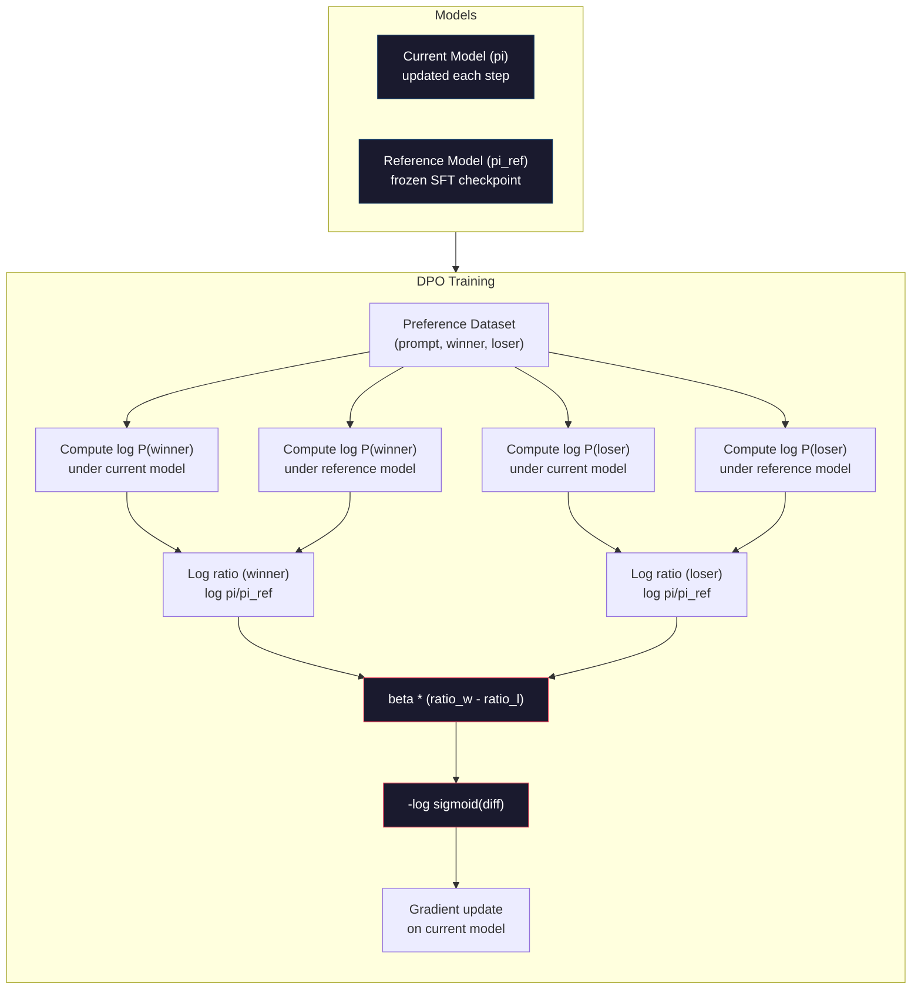

# DPO: Optimización directa de preferencias

> RLHF tiene efectos. Pero también necesita entrenar tres modelos (SFT, premio modelo, política), gestionar la inestabilidad de PPO,并调节 KL penalty, DPO 会问:

**Type:** Build
**Languages:** Python (with numpy)
**Prerequisites:** Phase 10, Lesson 07 (RLHF)
**Time:** ~90 分钟

## El objetivo del aprendizaje
-                                                                                                                                                                                                                                                                                                                                                                                                                                                                                                                              
- 推导 DPO Función de pérdida,并解释 cómo pasa por la política de log probabilidades 隐式表示奖励模型
- En el campo de la estabilidad de entrenamiento, el coste de cálculo y la cantidad de modelos requeridos, el DPO se compara con el RLHF.
- 调节 beta 参数, control training 偏离参考模型 的程度

##  problemas
Usted construyó un modelo de RLHF en la lección 07 ∙∙∙∙∙∙∙∙∙∙∙ , en las lecciones 07 ∙∙∙∙∙ , en las lecciones 07 ∙∙∙∙ , en las lecciones 07 ∙∙∙∙∙ , en las lecciones 07 ∙∙∙∙∙ , en las lecciones 07 ∙∙∙∙∙ , en las lecciones 07 ∙∙∙∙∙ , en las lecciones 07 ∙∙∙∙∙∙ , en las lecciones 07 ∙∙∙∙ , en las lecciones 07 ∙∙∙ , en las lecciones 07 ∙∙∙∙ , en las lecciones 07 ∙∙∙ , en las lecciones 07 ∙∙∙ , en las lecciones 07 ∙∙∙ , en las lecciones 07 ∙∙ , en las lecciones 07 ∙∙∙ , en las lecciones 07 ∙ , en las lecciones 07 ∙ , en las lecciones 07 ∙ , en las lecciones 07 ∙ , en las lecciones 07 ∙ , en las lecciones 07 ∙ , en las lecciones 07 ∙ , en las lecciones 07 ∙ , en las lecciones 07 ∙ , en las lecciones 07 ∙ , en las lecciones 07 ∙ , en las lecciones 07 ∙ , en las lecciones 07 ∙ , las lecciones 07 ∙ , y en las lecciones 07 ∙ , y en las lecciones ∙

En la práctica, el entrenamiento de la OPPE 以不稳定著称──很小的超参数 变化就可能导致训练发散──奖励模型是人类偏好的不完美代理,而政策会找到利用其弱点的方式──KL penalidad tiene ayuda, pero en sí misma también necesita regular: demasiado bajo conducirá al hackeo de recompensas, demasiado alto则模型几乎不学到东西──

Esta complejidad explica por qué en los años posteriores a la publicación de InstructGPT, la mayoría de los modelos de código abierto fueron difíciles de usar RLHF.

El año 2023 en mayo, Rafael Rafailov, de Stanford, Archit Sharma y sus colegas publicaron Optimización de Preferencias Directas: Su Modelo de Lenguaje es Secretamente un Modelo de Recompensa──核心洞见是:你不需要单独的奖励模型──最佳奖励功能 在数学上由语言模型自体的代币 概率决定──你可以完全跳过奖励模型,直接在偏好对上优化语言模型──

DPO simplificará RLHF en un aprendizaje supervisado 步骤――一个模型――一个损失功能――一个训练循环――没有强化学学习――Zephyr-7B es uno de los primeros modelos de DPO en uso a gran escala, en varios puntos de referencia, sobre el modelo de RLHF 训练的追平或超过了. Meta utilizó DPO――Antropic también en su investigación de alineación en la línea de alineación de Llama 3 mencionó métodos de estilo DPO―.

## 概念
### El punto clave

RLHF 优化这个目标:

```
maximize: E[R(x, y)] - beta * KL(pi || pi_ref)
```

Entre ellos R es el modelo de recompensa, pi es política, pi_ref es modelo de referencia, beta es coeficiente KL。

Documento de DPO prova, este objetivo existe cerrado de la mejor solución. Para cualquier función de recompensa R, la mejor política es:

```
pi*(y | x) = pi_ref(y | x) * exp(R(x, y) / beta) / Z(x)
```

Entre ellos Z(x) es el número habitual de regeneración.

```
R(x, y) = beta * log(pi*(y | x) / pi_ref(y | x)) + beta * log Z(x)
```

Esto es lo que se dice en el libro de la Comisión de Recompensas.

Lo sustituirá por el modelo de preferencia Bradley-Terry:

```
P(y_w > y_l | x) = sigmoid(R(x, y_w) - R(x, y_l))
                  = sigmoid(beta * (log pi(y_w|x)/pi_ref(y_w|x) - log pi(y_l|x)/pi_ref(y_l|x)))
```

Z(x) 项会抵消, pues dos respuestas son de la misma respuesta x 为条件――剩下只是政策模型和参考模型 在优先和拒绝答案上的日记概率函数――

### La pérdida de DPO

```
L_DPO = -log(sigmoid(beta * (log pi(y_w|x)/pi_ref(y_w|x) - log pi(y_l|x)/pi_ref(y_l|x))))
```

Vamos a deshacer cada parte:

- **y_w**= respuesta preferida
- **y_l**= rechazado (perder) respuesta
- **x**= rápido
- **pi**= 当前模型( está entrenando)
- **pi_ref**= modelo de referencia ((结的 SFT control point)
- **beta**=  control de la temperatura de referencia 参数(generalmente entre 0,1 y 0,5)

Por valor`log pi(y|x) / pi_ref(y|x)`Es la relación de probabilidad de registro. Cuando este ratio es válido, la probabilidad de que el modelo actual dé respuesta y es mayor que la de referencia.

DPO Loss promoverá el modelo para mejorar la relación de probabilidad de registro de las respuestas preferidas, y reducir la relación de probabilidad de registro de las respuestas rechazadas.



### Por qué la DPO es más simple

| Aspect | RLHF (PPO) | DPO |
|--------|-----------|-----|
| 需要训练的模型 | 3（SFT + reward + policy） | 1（仅 policy） |
| Training loops | 3（SFT、RM training、PPO） | 2（SFT、DPO） |
| Hyperparameters | lr、KL coeff、clip ratio、RM lr、epochs x3 | lr、beta、epochs |
| Reward model | 必需（单独训练） | 隐式存在于模型概率中 |
| RL algorithm | PPO（复杂、不稳定） | Supervised learning（稳定） |
| GPU memory | PPO 期间内存中有 3-4 个模型 | 2 个模型（current + reference） |
| 训练稳定性 | 对 hyperparameters 敏感 | 稳健，类似 SFT |

DPO  entrenamiento  necesita poner en memoria dos modelos: actual modelo y 结的参考──RLHF 需要三或四个: política、参考、奖励模型,以及可选的价值函数基线──对于70B 模型, cada副本在FP16 下需要140GB──删除奖励模型 带来的内存节省非常可观──

### Cuando el DPO supera a la RLHF

**小数据集。**En la escala de 5.000-20.000 pares de preferencias, el modelo de recompensa en el RLHF puede alcanzar o superar RLHF.

**计算资源有限。**DPO sólo necesita un RLHF completo. Para un equipo sin grandes grupos de GPU, es una opción más práctica.

**快速迭代。**想尝试10 diferentes conjuntos de datos de preferencias,看看哪个能产生最佳模型?DPO 让你能在几个小时内完成每一个实验──RLHF 则需要重新训练奖励模型──

### Cuando RLHF supera a DPO

**大规模训练。**En la escala de GPT-4 o Claude, el modelo de recompensa individual de RLHF puede capturar más detalles de las señales de preferencia.

**复杂 reward signals。**Cuando se trata de varias dimensiones (helpfulness, harmlessness, honesty), el modelo de recompensa puede aprender este tipo de balance de objetivos múltiples.

**迭代式 alignment。**Los canales de RLHF pueden utilizar la política actual para generar nuevas respuestas, hacer que los humanos evalúen, y luego volver a entrenar el modelo de recompensa en el ciclo en línea.

### DPO 之外: KTO, ORPO, SimPO

DPO 启发了一系列简化排列方法──

**KTO (Kahneman-Tversky Optimization, 2024)：**Usted ni siquiera necesita hacer frente a los datos. KTO utiliza un diseño de contraste: sólo necesita marcar cada respuesta bueno o malo, y no necesita compararla con otra alternativa. Esto simplifica considerablemente la recopilación de datos. Esto no es mostrar a los marcadores dos respuestas y preguntar cuál es mejor?, sino mostrar una respuesta y preguntar cuál es mejor?Función de pérdida  Aplicación de la pérdida en la teoría de la perspectiva: respuestas malas recibirán más de las respuestas buenas recompensas 

**ORPO (Odds Ratio Preference Optimization, 2024)：**La alineación de SFT y SFT se combina con un entrenamiento en un paso. ORPO no es primero hacer SFT y volver a hacer DPO, sino modificar SFT Loss, lo que incluye la señal de preferencia.

**SimPO (Simple Preference Optimization, 2024)：**完全取消引用模型──SIMPO 不再针对结的引用 计算日志概率比例,而是使用响应的平均日志概率 (按长度归结) 作为隐式回报──这省内存(不需要参考模型)并简化训练──长度归结防止模型偏好更短的响应──

| Method | Year | Models in Memory | Needs Pairs? | Needs Reference? | Training Loops |
|--------|------|-----------------|-------------|-----------------|----------------|
| RLHF | 2022 | 3-4 | Yes（用于 RM） | Yes | 3 |
| DPO | 2023 | 2 | Yes | Yes | 2 |
| KTO | 2024 | 2 | No（未配对） | Yes | 2 |
| ORPO | 2024 | 1 | Yes | No | 1 |
| SimPO | 2024 | 1 | Yes | No | 1 |

 Tendencias claras: cada método elimina una parte de la complejidad. RLHF  necesita modelo de recompensa y PPO  DPO  elimina el segundo. KTO  elimina la integración en datos  ORPO  elimina la fase SFT                                                                                                                                                                                                                                                                                                                                                                                                                                                                       

### En el caso de los Estados miembros, el DPO debe ser el único agente de seguridad.

**Zephyr-7B (HuggingFace, October 2023)：**En base a esto, en UltraChat (exemplos 200K) se hace SFT, luego en UltraFeedback (pares de preferencias 60K) se hace DPO. En MT-Bench, el puntaje es 6.47, es el modelo 7B más alto de la época. En comparación, en Llama 2 Chat 70B se obtiene 6.86, lo que significa que Zephyr sólo utiliza la alineación DPO, alcanza un nivel de 10 veces mayor que el modelo 6% en el interior.

**Llama 3 (Meta, April 2024)：**En la fase inicial de RLHF, después de utilizar DPO, esta combinación indica que DPO y RLHF pueden complementarse:

**Neural Magic / nm-chat (2024)：**Se aplicará a múltiples modelos de código abierto, y se mostrará un aumento del 5-15% en comparación con el SFT baseline en los puntos de referencia de alineación.


```figure
dpo-loss
```

## Construirlo
### 步骤 1: Dataset de preferencias

RLHF utiliza el mismo formato: ((pronto, preferido, rechazado) 三元组──DPO 直接消费这些数据,不需要中间的奖励模型──

```python
import numpy as np
import sys
import os
sys.path.insert(0, os.path.join(os.path.dirname(__file__), "..", "..", "04-pre-training-mini-gpt", "code"))
from main import MiniGPT, LayerNorm, Embedding, TransformerBlock

PREFERENCE_DATA = [
    {
        "prompt": "What is the capital of France?",
        "preferred": "The capital of France is Paris.",
        "rejected": "France is a country in Europe. It has many cities. The capital is Paris. Paris is known for the Eiffel Tower.",
    },
    {
        "prompt": "Explain gravity in one sentence.",
        "preferred": "Gravity is the force that attracts objects with mass toward each other.",
        "rejected": "Gravity is something that makes things fall down when you drop them.",
    },
    {
        "prompt": "What is 15 times 7?",
        "preferred": "15 times 7 is 105.",
        "rejected": "Let me think about this. 15 times 7. Well, 10 times 7 is 70, and 5 times 7 is 35, so the answer might be around 105.",
    },
    {
        "prompt": "Name three programming languages.",
        "preferred": "Python, Rust, and TypeScript.",
        "rejected": "There are many programming languages. Some popular ones include various languages like Python and others.",
    },
    {
        "prompt": "What year did World War II end?",
        "preferred": "World War II ended in 1945.",
        "rejected": "World War II was a major global conflict. It involved many countries. The war ended in the mid-1940s, specifically in 1945.",
    },
    {
        "prompt": "Define machine learning.",
        "preferred": "Machine learning is a field where algorithms learn patterns from data to make predictions without being explicitly programmed.",
        "rejected": "Machine learning is a type of AI. AI stands for artificial intelligence. Machine learning uses data to learn.",
    },
]
```

### 步骤 2: Probabilidad de registro de secuencias

DPO Loss 需要计算给定提示时某个响应的总日记概率──这意味着要在完整的(快速+响应)序列上运行模型,并对每个响应代币的日记概率求和──

```python
def tokenize_sequence(text, vocab_size=256):
    return [min(t, vocab_size - 1) for t in list(text.encode("utf-8"))]


def compute_sequence_log_prob(model, prompt_tokens, response_tokens, max_seq_len=128):
    full_sequence = prompt_tokens + response_tokens
    if len(full_sequence) > max_seq_len:
        full_sequence = full_sequence[:max_seq_len]

    if len(full_sequence) < 2:
        return 0.0

    input_ids = np.array(full_sequence[:-1]).reshape(1, -1)
    target_ids = np.array(full_sequence[1:])

    logits = model.forward(input_ids)
    logits = logits[0]

    max_logits = logits.max(axis=-1, keepdims=True)
    log_probs = logits - max_logits - np.log(
        np.exp(logits - max_logits).sum(axis=-1, keepdims=True)
    )

    prompt_len = len(prompt_tokens)
    response_start = max(0, prompt_len - 1)
    response_end = len(target_ids)

    if response_start >= response_end:
        return 0.0

    response_log_probs = log_probs[response_start:response_end, :]
    response_targets = target_ids[response_start:response_end]

    total_log_prob = 0.0
    for i, target in enumerate(response_targets):
        total_log_prob += response_log_probs[i, target]

    return total_log_prob
```

Esta función es el instrumento central del DPO. Para cada par de preferencias, se ejecuta cuatro veces: modelo 计算 preferencia respuesta, modelo 计算 rechazado respuesta, referencia 计算 preferencia respuesta, referencia 计算 rechazado respuesta.

### 步骤 3: La pérdida de DPO

论文核心用代码表示──一个函数──一个 Loss──不需要奖励模型──

```python
def sigmoid(x):
    return np.where(
        x >= 0,
        1.0 / (1.0 + np.exp(-x)),
        np.exp(x) / (1.0 + np.exp(x))
    )


def dpo_loss(policy_logprob_preferred, policy_logprob_rejected,
             ref_logprob_preferred, ref_logprob_rejected, beta=0.1):
    preferred_ratio = policy_logprob_preferred - ref_logprob_preferred
    rejected_ratio = policy_logprob_rejected - ref_logprob_rejected

    logit = beta * (preferred_ratio - rejected_ratio)

    loss = -np.log(sigmoid(logit) + 1e-8)

    preferred_reward = beta * preferred_ratio
    rejected_reward = beta * rejected_ratio

    return loss, {
        "preferred_ratio": float(preferred_ratio),
        "rejected_ratio": float(rejected_ratio),
        "logit": float(logit),
        "implicit_preferred_reward": float(preferred_reward),
        "implicit_rejected_reward": float(rejected_reward),
        "reward_margin": float(preferred_reward - rejected_reward),
    }
```

`preferred_ratio`Y `rejected_ratio`Es la razón por la cual el modelo de referencia se ha convertido en un modelo de probabilidad de logro.

`implicit_preferred_reward`Y `implicit_rejected_reward`Las recompensas de la DPO Loss  Hiddenly Distribute Rewards  pueden ser extraídas para comprobar si el entrenamiento es efectivo: el margen entre las recompensas preferidas y rechazadas   debe aumentar durante el proceso de entrenamiento 

### Paso 4: Ciclo de formación de los DPO

Un ciclo de entrenamiento supervisado estándar. No hay PPO. No hay modelo de recompensa. Sólo pasa hacia adelante y actualizaciones de gradientes.

```python
def copy_model_weights(source, target):
    target.embedding.token_embed = source.embedding.token_embed.copy()
    target.embedding.pos_embed = source.embedding.pos_embed.copy()
    target.ln_f.gamma = source.ln_f.gamma.copy()
    target.ln_f.beta = source.ln_f.beta.copy()
    for s_block, t_block in zip(source.blocks, target.blocks):
        t_block.attn.W_q = s_block.attn.W_q.copy()
        t_block.attn.W_k = s_block.attn.W_k.copy()
        t_block.attn.W_v = s_block.attn.W_v.copy()
        t_block.attn.W_out = s_block.attn.W_out.copy()
        t_block.ffn.W1 = s_block.ffn.W1.copy()
        t_block.ffn.W2 = s_block.ffn.W2.copy()
        t_block.ffn.b1 = s_block.ffn.b1.copy()
        t_block.ffn.b2 = s_block.ffn.b2.copy()
        t_block.ln1.gamma = s_block.ln1.gamma.copy()
        t_block.ln1.beta = s_block.ln1.beta.copy()
        t_block.ln2.gamma = s_block.ln2.gamma.copy()
        t_block.ln2.beta = s_block.ln2.beta.copy()


def dpo_train(policy_model, reference_model, preference_data,
              num_epochs=5, lr=5e-6, beta=0.1, max_seq_len=128):
    print(f"DPO Training: {len(preference_data)} pairs, {num_epochs} epochs, "
          f"lr={lr}, beta={beta}")
    print()

    losses = []
    margins = []

    for epoch in range(num_epochs):
        epoch_loss = 0.0
        epoch_margin = 0.0
        num_examples = 0

        indices = np.random.permutation(len(preference_data))

        for idx in indices:
            pair = preference_data[idx]

            prompt_tokens = tokenize_sequence(pair["prompt"])
            preferred_tokens = tokenize_sequence(pair["preferred"])
            rejected_tokens = tokenize_sequence(pair["rejected"])

            pi_logprob_w = compute_sequence_log_prob(
                policy_model, prompt_tokens, preferred_tokens, max_seq_len
            )
            pi_logprob_l = compute_sequence_log_prob(
                policy_model, prompt_tokens, rejected_tokens, max_seq_len
            )
            ref_logprob_w = compute_sequence_log_prob(
                reference_model, prompt_tokens, preferred_tokens, max_seq_len
            )
            ref_logprob_l = compute_sequence_log_prob(
                reference_model, prompt_tokens, rejected_tokens, max_seq_len
            )

            loss, metrics = dpo_loss(
                pi_logprob_w, pi_logprob_l,
                ref_logprob_w, ref_logprob_l, beta
            )

            update_direction = 1.0 if metrics["logit"] < 0 else -0.1
            for block in policy_model.blocks:
                block.ffn.W1 += lr * update_direction * np.random.randn(*block.ffn.W1.shape) * 0.01
                block.ffn.W2 += lr * update_direction * np.random.randn(*block.ffn.W2.shape) * 0.01

            epoch_loss += loss
            epoch_margin += metrics["reward_margin"]
            num_examples += 1
            losses.append(float(loss))
            margins.append(metrics["reward_margin"])

        avg_loss = epoch_loss / max(num_examples, 1)
        avg_margin = epoch_margin / max(num_examples, 1)

        print(f"  Epoch {epoch + 1}/{num_epochs} | Loss: {avg_loss:.4f} | "
              f"Avg Margin: {avg_margin:.4f}")

    return policy_model, losses, margins
```

En comparación con RLHF, este ciclo de entrenamiento 简洁得令人耳目一新── para cada par de preferencias: calcular cuatro log-probabilidades(dos modelos、 dos respuestas), los dará a cabo en la pérdida de DPO, calcular Gradient, actualizar la política── no hay paso de generación── no hay inferencia del modelo de recompensa── no hay estimación de ventaja── no hay recorte──

### Paso 5: Comparación entre DPO y RLHF

测量隐式奖励利率和日志概率转变,将DPO comparar con el modelo RLHF del Lección 07 en el medio 进行比较──

```python
def evaluate_preference_accuracy(model, reference_model, preference_data, beta=0.1, max_seq_len=128):
    correct = 0
    total = 0

    for pair in preference_data:
        prompt_tokens = tokenize_sequence(pair["prompt"])
        preferred_tokens = tokenize_sequence(pair["preferred"])
        rejected_tokens = tokenize_sequence(pair["rejected"])

        pi_w = compute_sequence_log_prob(model, prompt_tokens, preferred_tokens, max_seq_len)
        pi_l = compute_sequence_log_prob(model, prompt_tokens, rejected_tokens, max_seq_len)
        ref_w = compute_sequence_log_prob(reference_model, prompt_tokens, preferred_tokens, max_seq_len)
        ref_l = compute_sequence_log_prob(reference_model, prompt_tokens, rejected_tokens, max_seq_len)

        preferred_reward = beta * (pi_w - ref_w)
        rejected_reward = beta * (pi_l - ref_l)

        if preferred_reward > rejected_reward:
            correct += 1
        total += 1

    return correct / max(total, 1)


def analyze_implicit_rewards(model, reference_model, preference_data, beta=0.1, max_seq_len=128):
    print("Implicit Reward Analysis:")
    print("-" * 65)
    print(f"  {'Prompt':<30} {'Pref Reward':>12} {'Rej Reward':>12} {'Margin':>10}")
    print("  " + "-" * 60)

    for pair in preference_data:
        prompt_tokens = tokenize_sequence(pair["prompt"])
        preferred_tokens = tokenize_sequence(pair["preferred"])
        rejected_tokens = tokenize_sequence(pair["rejected"])

        pi_w = compute_sequence_log_prob(model, prompt_tokens, preferred_tokens, max_seq_len)
        pi_l = compute_sequence_log_prob(model, prompt_tokens, rejected_tokens, max_seq_len)
        ref_w = compute_sequence_log_prob(reference_model, prompt_tokens, preferred_tokens, max_seq_len)
        ref_l = compute_sequence_log_prob(reference_model, prompt_tokens, rejected_tokens, max_seq_len)

        pref_reward = beta * (pi_w - ref_w)
        rej_reward = beta * (pi_l - ref_l)
        margin = pref_reward - rej_reward

        truncated = pair["prompt"][:28] + ".." if len(pair["prompt"]) > 30 else pair["prompt"]
        print(f"  {truncated:<30} {pref_reward:>12.4f} {rej_reward:>12.4f} {margin:>10.4f}")

    print()
```

### Paso 6: Análisis de la sensibilidad beta

El beta 参数 es el DPO en el RLHF 里 KL coeficiente ∞. El modelo de control puede desviarse de la referencia ∞.

```python
def beta_sensitivity_analysis(sft_model, preference_data, betas, max_seq_len=128):
    print("Beta Sensitivity Analysis")
    print("-" * 60)
    print(f"  {'Beta':>8} {'Final Loss':>12} {'Final Margin':>14} {'Accuracy':>10}")
    print("  " + "-" * 55)

    results = []

    for beta in betas:
        policy = MiniGPT(
            vocab_size=256, embed_dim=128, num_heads=4,
            num_layers=4, max_seq_len=max_seq_len, ff_dim=512
        )
        reference = MiniGPT(
            vocab_size=256, embed_dim=128, num_heads=4,
            num_layers=4, max_seq_len=max_seq_len, ff_dim=512
        )
        copy_model_weights(sft_model, policy)
        copy_model_weights(sft_model, reference)

        policy, losses, margins_list = dpo_train(
            policy, reference, preference_data,
            num_epochs=3, lr=5e-6, beta=beta, max_seq_len=max_seq_len
        )

        accuracy = evaluate_preference_accuracy(
            policy, reference, preference_data, beta, max_seq_len
        )

        final_loss = losses[-1] if losses else 0
        final_margin = margins_list[-1] if margins_list else 0

        print(f"  {beta:>8.3f} {final_loss:>12.4f} {final_margin:>14.4f} {accuracy:>10.1%}")
        results.append({
            "beta": beta,
            "final_loss": final_loss,
            "final_margin": final_margin,
            "accuracy": accuracy,
        })

        print()

    return results
```

较小的beta(0.01) permite que el modelo libre de orientación de referencia: aprender rápido, pero con un deterioro de riesgo.

## Usalo
### Demo de la línea de tuberías de la DPO

```python
if __name__ == "__main__":
    np.random.seed(42)

    print("=" * 70)
    print("DPO: DIRECT PREFERENCE OPTIMIZATION")
    print("=" * 70)
    print()

    print("STEP 1: Initialize SFT Model (from Lesson 06)")
    print("-" * 50)
    sft_model = MiniGPT(
        vocab_size=256, embed_dim=128, num_heads=4,
        num_layers=4, max_seq_len=128, ff_dim=512
    )
    print(f"  Parameters: {sft_model.count_parameters():,}")
    print()

    print("STEP 2: DPO Training")
    print("-" * 50)

    policy_model = MiniGPT(
        vocab_size=256, embed_dim=128, num_heads=4,
        num_layers=4, max_seq_len=128, ff_dim=512
    )
    reference_model = MiniGPT(
        vocab_size=256, embed_dim=128, num_heads=4,
        num_layers=4, max_seq_len=128, ff_dim=512
    )
    copy_model_weights(sft_model, policy_model)
    copy_model_weights(sft_model, reference_model)

    policy_model, losses, margins = dpo_train(
        policy_model, reference_model, PREFERENCE_DATA,
        num_epochs=5, lr=5e-6, beta=0.1
    )
    print()

    print("=" * 70)
    print("STEP 3: Evaluate")
    print("=" * 70)
    print()

    pre_accuracy = evaluate_preference_accuracy(
        sft_model, reference_model, PREFERENCE_DATA, beta=0.1
    )
    post_accuracy = evaluate_preference_accuracy(
        policy_model, reference_model, PREFERENCE_DATA, beta=0.1
    )

    print(f"  Preference accuracy (pre-DPO):  {pre_accuracy:.1%}")
    print(f"  Preference accuracy (post-DPO): {post_accuracy:.1%}")
    print()

    analyze_implicit_rewards(policy_model, reference_model, PREFERENCE_DATA, beta=0.1)

    print("=" * 70)
    print("STEP 4: Training Dynamics")
    print("=" * 70)
    print()

    if losses:
        print("  Loss curve:")
        window = max(1, len(losses) // 5)
        for i in range(0, len(losses), window):
            chunk = losses[i:i + window]
            avg = sum(chunk) / len(chunk)
            print(f"    Steps {i:3d}-{i + len(chunk) - 1:3d}: loss = {avg:.4f}")
        print()

    if margins:
        print("  Reward margin curve:")
        window = max(1, len(margins) // 5)
        for i in range(0, len(margins), window):
            chunk = margins[i:i + window]
            avg = sum(chunk) / len(chunk)
            print(f"    Steps {i:3d}-{i + len(chunk) - 1:3d}: margin = {avg:.4f}")
        print()

    print("=" * 70)
    print("STEP 5: Beta Sensitivity")
    print("=" * 70)
    print()

    beta_results = beta_sensitivity_analysis(
        sft_model, PREFERENCE_DATA, betas=[0.01, 0.1, 0.3, 1.0]
    )

    print("=" * 70)
    print("DPO vs RLHF COMPARISON")
    print("=" * 70)
    print()
    print("  DPO advantages:")
    print("    - 1 training loop (vs 3 for RLHF)")
    print("    - 2 models in memory (vs 3-4 for RLHF)")
    print("    - Supervised learning (vs RL, more stable)")
    print("    - No reward model to train or maintain")
    print()
    print("  RLHF advantages:")
    print("    - Separate reward model captures complex preferences")
    print("    - Online learning: generate, rate, retrain")
    print("    - Better for multi-objective alignment")
    print("    - Proven at largest scales (GPT-4, Claude)")
    print()
    print("  Practical guidance:")
    print("    - Start with DPO. It's simpler and often sufficient.")
    print("    - Switch to RLHF if DPO plateaus on your eval metrics.")
    print("    - Many production systems use both: RLHF first, DPO to refine.")
```

##  entregarlo
本课会产出                                                                                                                                                                                                                                                                                                                                                                                                                                                                                                                         `outputs/prompt-alignment-method-selector.md`Una ayuda para que usted pueda elegir el correcto alineamiento 方法(SFT、RLHF、DPO、KTO、ORPO、SimPO) de la solicitud.

##  ejercicios
1.  Implementar KTO (Kahneman-Tversky Optimization) ・ KTO no necesita estar en datos, sólo necesita marcar cada respuesta buen omal──la pérdida de una buena respuesta es `-log(sigmoid(beta * log_ratio))`, mala respuesta de la pérdida es`-log(1 - sigmoid(beta * log_ratio))`,并对不良反应 Loss 使用损失厌恶乘数(generalmente 1,5x) ⋅ en la misma parte de datos entrenamiento(分别将优先 当作好、拒绝 当作坏),并与DPO比较精度──

2. 实现 DPO-normalizado de longitud― no utilizar las probabilidades de registro originales, sino que se divide en el número de tokens de respuesta:`normalized_logprob = total_logprob / num_tokens` Esto puede evitar que los modelos prefieran respuestas más cortas

3. 构建一个ORPO 风格的组合损失──向DPO Loss 中添加首选反应 上的标准下一个代号预测损失:`L = L_sft(preferred) + alpha * L_dpo` intentar 0.1、0.5 y 1.0 de alfa 值── pérdida combinada 应产生一个既能遵循指令 (既能遵循指令)  de los SFT 项) y de las preferencias mejores de las respuestas (又偏好更好的反应)  de los DPO 项), para así eliminar la demanda de una fase individual de SFT 

4.  Implementar DPO iterativo―: ejecutar DPO 3 épocas, luego generar nuevas respuestas desde el modelo de entrenamiento posterior, combinarlas con las respuestas preferidas originales : para nuevos pares de preferencias, volver a ejecutar DPO―: ejecutar dos rodaje de este tipo : auto-juego: proceso―:

5. Comparar con diferentes modelos de referencia de DPO── no utilizar el punto de control de SFT  como referencia, sino intentar: a) modelo base  pre-SFT), b) punto de control de la época de DPO 第 1 个, c) promedio móvil exponencial del modelo de política── report哪个参考 产生最高的偏好精度 和最稳定的训练曲线──

## 关键术语: "El hombre es un hombre"
| Term | What people say | What it actually means |
|------|----------------|----------------------|
| DPO | “没有 RL 的 RLHF” | Direct Preference Optimization：一种 supervised learning algorithm，直接在 preference pairs 上优化语言模型，绕过 reward model 和 PPO |
| Implicit reward | “reward 在模型里” | reward function 由 policy 与 reference models 之间的 log-probability ratio 决定，不需要单独的 reward model |
| Beta (DPO) | “temperature” | 控制 policy 可以偏离 reference model 的程度：小 beta 允许大偏离，大 beta 让模型保持接近 |
| Log-probability ratio | “模型变化了多少” | log pi(y\|x) - log pi_ref(y\|x)：正值表示当前模型分配的概率高于 reference |
| Reference model | “冻结的 checkpoint” | SFT model 的一个副本，其 weights 永不改变，用作计算概率比的锚点 |
| KTO | “没有成对数据的 DPO” | Kahneman-Tversky Optimization：使用未配对的“good”或“bad”labels，而不是要求 preference pairs |
| ORPO | “一步 alignment” | Odds Ratio Preference Optimization：通过向 SFT Loss 添加 preference term，将 SFT 和 alignment 合并到单个 training loop |
| SimPO | “不需要 reference” | Simple Preference Optimization：通过使用长度归一化的平均 log-probability 作为隐式 reward，消除 reference model |
| Alignment tax | “让模型安全的成本” | 从 base model 到 aligned model 所需的额外计算、数据和复杂性；DPO 显著降低了这一成本 |

## 延伸阅读
- [Rafailov et al., 2023 -- "Direct Preference Optimization: Your Language Model is Secretly a Reward Model"](https://arxiv.org/abs/2305.18290)-- Alinear el papel del DPO desde RLHF  simplificación al aprendizaje supervisado
- [Tunstall et al., 2023 -- "Zephyr: Direct Distillation of LM Alignment"](https://arxiv.org/abs/2310.16944)-- Zephyr-7B, mostró UltraFeedback de DPO en los puntos de referencia de seguimiento RLHF
- [Ethayarajh et al., 2024 -- "KTO: Model Alignment as Prospect Theoretic Optimization"](https://arxiv.org/abs/2402.01306)-- eliminar la demanda de preferencias
- [Hong et al., 2024 -- "ORPO: Monolithic Preference Optimization without Reference Model"](https://arxiv.org/abs/2403.07691)-- 将 SFT 和 alignment 合并为一步
- [Meng et al., 2024 -- "SimPO: Simple Preference Optimization with a Reference-Free Reward"](https://arxiv.org/abs/2405.14734)-- completamente eliminar el modelo de referencia
- [Llama 3 Technical Report](https://arxiv.org/abs/2407.21783)-- Meta 结合 RLHF y DPO de la línea de alineación
