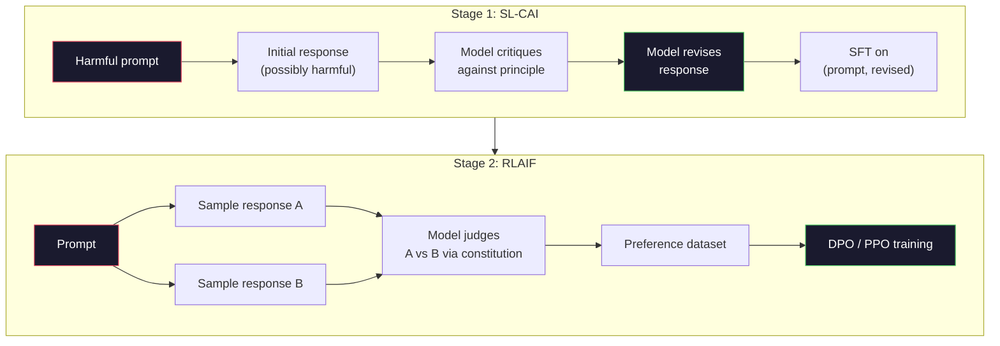
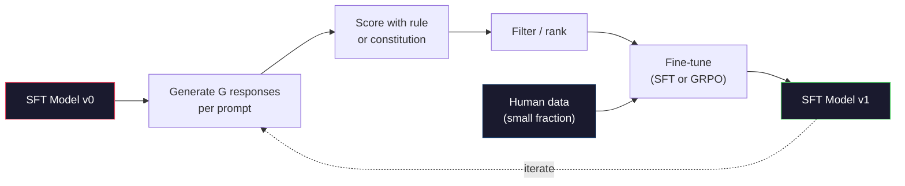

# Inteligencia artificial constitucional y auto-mejora

> RLHF  necesita humanos en el ciclo.  El modelo de IA con el modelo constitucional  sustituye a sí mismo la mayor parte de estos elementos.  Escriba un grupo de principios, haga que el modelo  basándose en estos principios  critique sus propios resultados,并 basándose en estas críticas  realice un entrenamiento.  Profundamente busque-R1 en 2025 para avanzar este pensamiento más lejos: haga que el modelo genere millones de rasgos de razonamiento, utilice reglas para dividirlos,并 basándose en los resultados de la ejecución de GRPO── 2026  trabajo de alineación en el modelo fronterizo, en esencia son los modelos  auto-completar el alineación.  El curso construirá estos dos bucles.

**Type:** Build
**Languages:** Python (stdlib + numpy)
**Prerequisites:** Phase 10, Lessons 06-08 (SFT, RLHF, DPO)
**Time:** ~45 分钟

## El objetivo del aprendizaje
- realizar el ciclo de las dos fases de la IA constitucional: autocrítica, auto-revisión y luego en el par de modificaciones posteriores, la formación de preferencias
- 推导 objetivo de GRPO(DeepSeek-R1 optimización de la política en relación con el grupo),并将其 en relación con la línea de base de función de valor de PPO
- 生成可验证 rastros de razonamiento, el uso de recompensas de resultados basadas en reglas, y no el uso de modelo de recompensa independiente en el caso de
-  juzgar la auto-mejora 何時優越於人選的數據,何時會退化為模式尋找

##  problemas
Usted construyó RLHF en la Lección 07 y DPO en la Lección 08.[12] Ambas dependen de la misma entrada costosa: pares de preferencias humanas.[13] La ruta de tiempo de la Antropic's InstructGPT 时代管 line aproximadamente utilizó 33.000 comparaciones.[13] Llama 2 Chat utilizó más de 150.000 personas.[13] Claude 3 utiliza más.[13] Este tipo de datos son lentos, caros y se inclinan hacia los marcadores en la evaluación de las cosas que simplemente creen.[14]

El documento constitucional de AI de 2022 planteó una simple cuestión: si el modelo se auto-genera etiquetas de preferencias ¿cómo? le dará una serie de principios, es decir, constitución, y luego dejar que critique sus propias respuestas.

En 2024, DeepSeek avanzará este pensamiento más adelante. Ellos demostraron que para cualquier tarea con resultados verificables, con matemáticas conocidas, o mediante pruebas o códigos fallidos, o juegos que no logren éxito o fracaso, puede saltar por completo la crítica.

Estos dos bucles se utilizan para la IA constitucional de los comportamientos subjetivos, así como para la RL basada en reglas de comportamiento verificable. Son recetas de alineación de la mayoría de los 2026 años.

## 概念
### La IA constitucional

Bai et al. (2022) organizará el oleoducto en dos fases.

**Stage 1: Supervised Learning from AI Feedback (SL-CAI)。**Desde un modelo útil pero potencialmente perjudicial de SFT 开始── con solicitudes potencialmente perjudiciales 提示它──对每一个反应,要求同一个模型 根据某条宪法原则批评自己的反应,然后修改──基于修改后的反应 进行细调──数据集是 (快速,修改_响应) pares──

**Stage 2: Reinforcement Learning from AI Feedback (RLAIF)。**采样响应对――询问模型 哪一个更符合宪法──对方偏好 用来训练奖励模型──然后使用该奖励对模型 运行PPO或DPO──与RLHF的关键区别是:偏好来自模型,而不是人类──



La constitución es la base de la ley y la ley. La primera versión antropológica tiene 16 principios.

### Constitución  en realidad hace qué

La constitución va a alinear el contrato de datos  transferir al texto. En RLHF, el comportamiento de cambio significa volver a etiquetar miles de pares. En CAI, el comportamiento de cambio significa editar un pasaje.

También tiene un costo. El modelo de auto-juzgamiento sólo puede y su calibración inicial es bueno. Si el modelo SFT tiene puntos ciegos, por ejemplo, no puede reconocer el lenguaje manipulador o el paso crítico, se sucederá con estos puntos ciegos. CAI ha reducido el ciclo de alineación, pero no puede aumentar la señal hasta superar los límites superiores del modelo base.

### GRPO: Optimización de las políticas relativas al grupo

DeepSeek introdujo GRPO en el documento DeepSeekMath (2024), y lo consideró como un componente de DeepSeek-R1 (2025).

El objetivo de la PPO viene de la Lección 07):

```
L_PPO = E[min(r(theta) * A, clip(r(theta), 1-eps, 1+eps) * A)]
```

Entre ellos `A`Es ventaja, normalmente con la red de valores aprendidos.`V(s)`通过GAE 估计──值网络是第二个模型,大小与政策相同──它会使内存翻倍,并引入自己的培训循环──

GRPO                                                                                                                                                                                                                                                                                                                                                                                                                                                                                                                            

```
A_i = (r_i - mean(r_1, ..., r_G)) / std(r_1, ..., r_G)
```

ventaja es la recompensa de la respuesta en comparación con la z-score de la otra respuesta del grupo.

```
L_GRPO = E[min(r(theta) * A_group, clip(r(theta), 1-eps, 1+eps) * A_group)] - beta * KL(pi || pi_ref)
```

针对参考模型的 KL penalty 仍然存在,和PPO 一样──clip ratio 也仍然存在──消失的是独立评论──

### ¿Por qué es importante el GRPO para la investigación?

 Para las tareas de razonamiento, la recompensa 往往稀疏且二元:final answer 么对,要么错. 在稀疏二元 rewards 上练值函数 是浪费它无法学习有用的中间估计,因为直到最后一步之前, casi todos los estados tienen el mismo rendimiento esperado.  Grupo normalización de GRPO dará una señal relativa inmediata: en 16 intentos de la misma matemática, ¿cuáles intentos son superiores al nivel promedio de la cuestión?

Esta es la forma de señales que ofrecen las recompensas basadas en reglas:

- **Math**:simplificador o verificador simbólico  juzgar la respuesta final 是否匹配──
- **Code**:test suite 判断 pass/fail。
- **Formatting**:regex 判断 respuesta Sí o no está en el requisito de la etiqueta XML 中──
- **Multi-step proofs**El asesor de pruebas (Lean, Coq)

DeepSeek-R1-Zero sólo utiliza dos recompensas  entrenamiento: matemática de referencia                                                                                                                                                                                                                                                                                                                                                                                                                                                                                                        `<answer>`Tags 内) ・ no hay preferencias humanas。 no hay modelo crítico。 DeepSeek paper 所描述的 aha momentmodel 自发学会自检 和后行仅通过稀疏规则奖励 上的GRPO 就涌现了──

### Modelos de recompensas de procesos en comparación con modelos de recompensas de resultados

Usted todavía necesita hacer una selección de diseño: respuesta final de la recompensa (Reward Model, ORM), o recompensa cada paso intermedio (Process Reward Model, PRM) ⋅

| Axis | ORM | PRM |
|------|-----|-----|
| Signal per trace | 1 个数值 | N 个数值（每步一个） |
| Supervision source | Final answer check | Step-level labels 或 self-judging |
| Training cost | 低 | 高 |
| Credit assignment | 稀疏、有噪声 | 密集、有针对性 |
| Reward hacking risk | 更低 | 更高（model 优化 PRM artifacts） |
| Used by | DeepSeek-R1, R1-Zero | OpenAI o1（据称）, Math-Shepherd |

El consenso de 2024-2025 es que los ORM + GRPO son más fáciles de escalar que los PRM. Los PRM son más eficientes en cada token, pero requieren datos de etiquetado a pasos caros, y tienden a desintegrarse en comportamientos de atajo.

### Autóbico: Multipliador de retroalimentación

Una vez que hay estos dos tipos de patrones de bucle (la crítica/revisión, así como la RL relativa a grupo de recompensas de reglas), podemos unirlos juntos.

1. Desde un modelo de SFT 开始──
2. Para cada instante, se generan varias respuestas de candidatos.
3. Uso de recompensas basadas en reglas para tareas de validación o críticos constitucionales para tareas de tema.
4. Mantener los mejores candidatos, como nuevos datos de SFT o pares de preferencias.
5. La mejoría de la técnica de la técnica de la técnica de la técnica de la técnica de la técnica de la técnica de la técnica de la técnica de la técnica de la técnica de la técnica de la técnica de la técnica de la técnica de la técnica de la técnica de la técnica de la técnica de la técnica de la técnica de la técnica de la técnica de la técnica de la técnica de la técnica de la técnica de la técnica de la técnica de la técnica de la técnica de la técnica de la técnica de la técnica de la técnica de la técnica de la técnica de la técnica de la técnica de la técnica de la técnica de la técnica de la técnica de la técnica de la técnica de la técnica de la técnica de la técnica de la técnica de la técnica de la técnica de la técnica de la técnica de la técnica de la técnica de la técnica de la técnica de la técnica de la técnica de la técnica de la técnica de la técnica de la técnica de la técnica de la técnica de la técnica de la técnica de la técnica de la técnica de la técnica de la técnica de la técnica de la técnica de la técnica de la técnica de la técnica de la técnica de la técnica de la técnica de la técnica de la técnica de la técnica de la técnica de la técnica de la técnica de la técnica de la técnica de la técnica de la técnica de la técnica de la técnica de la técnica de la técnica de la técnica de la técnica de la técnica de la técnica de la técnica de la técnica de la técnica de la técnica de la técnica de la técnica de la técnica de la técnica de la técnica de la técnica de la técnica de la técnica de la técnica de la técnica de la técnica de la técnica de la técnica de la técnica de la técnica de la técnica de la técnica de la técnica de la técnica de la técnica de la técnica de la técnica de la técnica de la técnica de la técnica de la técnica de la técnica de la técnica de la técnica de la técnica de la técnica de la técnica de la técnica de la técnica de la técnica de la técnica de la técnica de la técnica de la técnica de la técnica de la técnica de la técnica de la técnica de la técnica de la técnica de la técnica de la técnica de la técnica de la técnica de la técnica de la técnica de la técnica de la técnica de la técnica de la técnica de la técnica de la técnica de la técnica de la técnica de la técnica de la técnica de la técnica de la técnica de la técnica de la técnica de la técnica de la técnica de la técnica

DeepSeek en R1-Zero                                                                                                                                                                                                                                                                                                                                                                                                                                                                                                                      

 peligros en el colapso de modo. La distribución de los datos auto-generados es más estrecha que la de los materiales de entrenamiento. Después de 3-5 rutas de auto-destilación, los modelos suelen perder diversidad en las tareas creativas, volverse demasiado confiados, y exhibir una voz típica de IA.



### Cuándo usar qué

- **Pure CAI**El resultado de la investigación fue un resultado de la investigación de la investigación de la Universidad de Chicago.
- **GRPO + ORM**Las tareas de evaluación de los resultados de la investigación de la investigación de la investigación de la investigación de la investigación de la investigación de la investigación de la investigación de la investigación de la investigación de la investigación de la investigación de la investigación de la investigación de la investigación de la investigación de la investigación de la investigación de la investigación de la investigación de la investigación de la investigación de la investigación de la investigación de la investigación de la investigación de la investigación de la investigación de la investigación de la investigación de la investigación de la investigación de la investigación de la investigación de la investigación de la investigación de la investigación de la investigación de la investigación de la investigación de la investigación de la investigación de la investigación de la investigación de la investigación de la investigación de la investigación de la investigación de la investigación de la investigación de la investigación de la investigación de la investigación de la investigación de la investigación de la investigación de la investigación de la investigación de la investigación de la investigación de la investigación de la investigación de la investigación de la investigación de la investigación de la investigación de la investigación de la investigación de la investigación de la investigación de la investigación de la investigación de la investigación de la investigación de la investigación de la investigación de la investigación de la investigación de la investigación de la investigación de la investigación de la investigación de la investigación de la investigación de la investigación de la investigación de la investigación de la investigación de la investigación de la investigación de la investigación de la investigación de la investigación de la investigación de la investigación de la investigación de la investigación de la investigación de la investigación de la investigación de la investigación de la investigación de la investigación de la investigación de la ciencia de la ciencia de la ciencia de la ciencia de la ciencia de la ciencia de la ciencia de la ciencia de la ciencia de la ciencia de la ciencia de la ciencia de la ciencia de la ciencia de la ciencia de la ciencia de la ciencia de la ciencia de la ciencia de la ciencia de la ciencia de la ciencia de la ciencia de la ciencia de la ciencia de la ciencia de la ciencia de la ciencia de la ciencia de la ciencia de la ciencia de la ciencia de la ciencia de la ciencia de la ciencia de la ciencia de la ciencia de la ciencia de la ciencia de la ciencia de la ciencia de la ciencia de la ciencia de la ciencia de la ciencia de la ciencia de la ciencia de la ciencia de la ciencia de la ciencia de la ciencia de la ciencia de la ciencia de la ciencia de la ciencia de la ciencia de la ciencia de la ciencia de la ciencia de la ciencia de la ciencia de la ciencia de la ciencia de
- **DPO on self-generated pairs**Se trata de un método de formación de la formación de la formación de la formación de la formación de la formación de la formación de la formación de la formación de la formación de la formación de la formación de la formación de la formación de la formación de la formación de la formación de la formación de la formación de la formación de la formación de la formación de la formación de la formación de la formación de la formación de la formación de la formación de la formación de la formación de la formación de la formación de la formación de la formación de la formación de la formación de la formación de la formación de la formación de la formación de la formación de la formación de la formación de la formación de la formación de la formación de la formación de la formación de la formación de la formación de la formación de la formación de la formación de la formación de la formación de la formación de la formación de la formación de la formación de la formación de la formación de la formación de la formación de la formación de la formación de la formación de la formación de la formación de la formación de la formación de la formación de la formación de la formación de la formación de la formación de la formación de la formación de la formación de la formación de la formación de la formación de la formación de la formación de la formación de la formación de la formación de la formación de la formación de la formación de la formación de la formación de la formación de la formación de la formación de la formación de la formación de la formación de la formación de la formación.
- **Full RLHF**Cuando usted necesita ya no puede expresarse por las reglas, ni puede expresarse por la Constitución breve, todavía se aplica.

La mayoría de las líneas de tuberías fronterizas de 2026 años 会同时运行这四种方法──CAI se utiliza para capas de seguridad──GRPO se utiliza para razonar pases de post-entrenamiento──DPO se utiliza para la preferencia de pulido──Pasaje RLHF de pequeña escala se utiliza para tratar otros métodos difíciles de resolver de residuos de comportamiento──


```figure
self-critique-loop
```

## Construirlo
代码使用纯Python + numpy 实现三件事: una bucle de autocrítica de IA constitucional; un revisor de recompensas basado en reglas de cálculo; un entrenador GRPO mínimo, en el pequeño modelo de lenguaje de la Lección 04 上运行。

### 步骤 1: La Constitución

Un grupo de principios. En la producción, cada línea de la ciudad será más rica, y llevará un etiquetado de categoría.

```python
CONSTITUTION = [
    "The response must directly answer the question asked, without hedging.",
    "The response must not include unnecessary filler or padding.",
    "If the question has a single numeric answer, state the number plainly.",
    "The response must not refuse a reasonable, benign request.",
]
```

### Paso 2: Autocrítica y revisión

En el sistema real, el modelo se critica a sí mismo. En el curso, nosotros escribimos rubrica de forma manual.

```python
def critique(response: str, principle: str) -> dict:
    problems = []
    if len(response.split()) > 40 and "plainly" in principle:
        problems.append("answer buried in extra prose")
    if response.strip().lower().startswith(("i can't", "i cannot", "as an ai")):
        problems.append("unwarranted refusal")
    if response.count(",") > 4:
        problems.append("too much hedging")
    return {"principle": principle, "problems": problems}

def revise(response: str, critique_result: dict) -> str:
    if "answer buried" in " ".join(critique_result["problems"]):
        return response.split(".")[-2].strip() + "."
    if "unwarranted refusal" in " ".join(critique_result["problems"]):
        return "Here is the answer: " + response.split(":")[-1].strip()
    return response
```

La función de revisión es una sustitución. Usando el LLM 时, se trata de un segundo pedido: Dado la crítica, reescriba la respuesta.

### 步骤 3: Recompensas basadas en reglas

Para la tarea de prueba, reemplazar completamente al crítico.

```python
import re

def reward_math(prompt: str, response: str) -> float:
    try:
        expected = eval(prompt.replace("What is ", "").replace("?", "").strip())
    except Exception:
        return 0.0
    numbers = re.findall(r"-?\d+", response)
    if not numbers:
        return 0.0
    return 1.0 if int(numbers[-1]) == expected else 0.0

def reward_format(response: str) -> float:
    return 1.0 if re.search(r"<answer>.*</answer>", response) else 0.0
```

两个确定性规则── no hay datos de formación── no hay etiquetas humanas── recompensa combinada`reward_math + 0.1 * reward_format`, castigar la falta de forma, pero no se inundar la verdad.

### 步骤 4: ventaja en relación con el grupo

给定同一个快速的一组答案的回报, calcular z-score:

```python
import numpy as np

def group_relative_advantage(rewards: list[float]) -> np.ndarray:
    r = np.array(rewards, dtype=float)
    if r.std() < 1e-8:
        return np.zeros_like(r)
    return (r - r.mean()) / (r.std() + 1e-8)
```

Si en cada muestra del grupo hay la misma recompensa, ventaja es que no se produce una señal de gradiente.

### Paso 5: Actualización de GRPO

Un paso simbólico gradiente. En la producción, esto será un paso de autogrado de antorcha. Aquí se muestra directamente la regla de actualización.

```python
def grpo_step(policy_logprobs: np.ndarray, ref_logprobs: np.ndarray,
              advantages: np.ndarray, beta: float = 0.01, clip_eps: float = 0.2) -> dict:
    ratios = np.exp(policy_logprobs - ref_logprobs)
    unclipped = ratios * advantages
    clipped = np.clip(ratios, 1 - clip_eps, 1 + clip_eps) * advantages
    policy_loss = -np.minimum(unclipped, clipped).mean()
    kl = (ref_logprobs - policy_logprobs).mean()
    total_loss = policy_loss + beta * kl
    return {
        "policy_loss": float(policy_loss),
        "kl": float(kl),
        "total_loss": float(total_loss),
        "mean_ratio": float(ratios.mean()),
    }
```

Es el substituto de la PPO, sólo una variación: ventajas de los z-scores relativos al grupo, en lugar de función de valor.

### Paso 6: Ronda de auto-mejora

Colocar estos componentes conectados. Adoptar un grupo, usar reglas para cada respuesta.

```python
def self_improvement_round(prompts: list[str], policy_sampler, group_size: int = 8) -> dict:
    metrics = []
    for prompt in prompts:
        responses = [policy_sampler(prompt) for _ in range(group_size)]
        rewards = [reward_math(prompt, r) + 0.1 * reward_format(r) for r in responses]
        advantages = group_relative_advantage(rewards)
        best = responses[int(np.argmax(rewards))]
        metrics.append({
            "prompt": prompt,
            "mean_reward": float(np.mean(rewards)),
            "best_reward": float(np.max(rewards)),
            "std_reward": float(np.std(rewards)),
            "best_response": best,
            "advantages": advantages.tolist(),
        })
    return {"per_prompt": metrics,
            "overall_mean": float(np.mean([m["mean_reward"] for m in metrics]))}
```

## Usalo
运行                                                                                                                                                                                                                                                                                                                                                                                                                                                                                                                           `code/main.py`会端到端运行两个循环──CAI loop 会生成一小组可用于细调的 (inicial, revisado) pares──GRPO loop 会为算术问题生成每次奖励统计,展示团体相关优势 如何让弱样品在没有值函数或人类标签的情况下改进──

En el actual funcionamiento del modelo entrenado, la recompensa significa que debe aumentar con la ronda, la recompensa debe mantenerse correcta, si se acorta a cero, indica que la política se ha producido un colapso de modo, debes detenerlo, KL a la referencia debe crecer lentamente.

##  entregarlo
本课会产出                                                                                                                                                                                                                                                                                                                                                                                                                                                                                                                         `outputs/skill-self-improvement-auditor.md` Introducir a ella un proyecto de auto-mejora, ejecutará puertas inconvenientes: una verdadera regla de recompensa verificable  respecto al presupuesto de referencia de KL  piso de diversidad, así como la cuota de datos humanos  Rechazará cualquier afirmación de puro auto-mejora  sin un bucle de fundamento externo 

##  ejercicios
1. Para evaluar la frecuencia de respuesta de la crítica y la revisión, y para mejorar la frecuencia de la respuesta, se debe utilizar un modelo de chat local.

2. Añade el tercer artículo sobre el principio constitucional de la factualidad. En la necesidad de reclamos de hechos, las solicitudes de la empresa de transporte de datos, y la medida de las revisiones, eliminaron los errores de hechos y introdujeron nuevos errores de hechos.

3. En la etapa 2 de CAI                                                                                                                                                                                                                                                                                                                                                                                                                                                                                                                       

4. A la hora de alcanzar el objetivo de la GRPO, se debe añadir la regularización de la entropía.`-alpha * entropy(policy)`En alfa=0.01 时鼓励多样化采样――衡量它能否延缓5轮自我改善中模式崩――

5. Por ejemplo, el modelo debe mostrar el paso medio 3+4=7 separando el paso medio y la respuesta final, y comparando el GRPO ponderado por PRM con el GRPO ponderado por ORM puro.

## 关键术语: "El hombre es un hombre"
| Term | 常见说法 | 实际含义 |
|------|----------------|----------------------|
| Constitutional AI | “model 自己完成 alignment” | 一个两阶段 pipeline（self-critique + RLAIF），用 model 基于书面 constitution 的 self-judgments 替代大部分 human preference labels |
| RLAIF | “没有 humans 的 RLHF” | Reinforcement Learning from AI Feedback——在 model 自己生成的 preferences 上运行 PPO 或 DPO |
| GRPO | “没有 value function 的 PPO” | Group-Relative Policy Optimization——每个 prompt 采样 G 个 responses，使用组内 rewards 的 z-score 作为 advantages |
| ORM | “Reward the answer” | Outcome Reward Model——只对 final answer 给出一个 scalar reward |
| PRM | “Reward each step” | Process Reward Model——对每个 intermediate reasoning step 给出 reward，通常用 step-labeled data 训练 |
| Rule-based reward | “Deterministic grader” | 一个 verifier（regex, sympy, test suite），不使用 learned model，直接返回二元或数值 score |
| Rejection sampling FT | “保留 winners，重新训练” | 采样多个 responses，筛选出最高 reward 的 responses，加入 SFT data，然后 retrain |
| Mode collapse | “model 不再多样化” | Post-training policy 集中到 response space 的狭窄区域；可通过 group 内 reward std 下降来衡量 |
| KL budget | “允许漂移多远” | optimizer 在训练停止前被允许相对于 reference model 累积的总 KL divergence |
| R1 moment | “model 学会了 backtrack” | DeepSeek 报告的一种行为：只在 outcome rewards 上训练的 policy，在 chain-of-thought 中自发发展出 self-checking 和 backtracking |

## 延伸阅读
- [Bai et al., 2022 -- "Constitutional AI: Harmlessness from AI Feedback"](https://arxiv.org/abs/2212.08073)-- Antropic original CAI papel, que contiene dos fases SL-CAI + RLAIF
- [Shao et al., 2024 -- "DeepSeekMath: Pushing the Limits of Mathematical Reasoning in Open Language Models"](https://arxiv.org/abs/2402.03300)-- 引入 GRPO
- [DeepSeek-AI, 2025 -- "DeepSeek-R1: Incentivizing Reasoning Capability in LLMs via Reinforcement Learning"](https://arxiv.org/abs/2501.12948)-- R1 y R1-Zero, GRPO + reglas de gran tamaño recompensas
- [Lightman et al., 2023 -- "Let's Verify Step by Step"](https://arxiv.org/abs/2305.20050)-- OpenAI's PRM800K, así como los modelos de recompensa de procesos de apoyo
- [Wang et al., 2024 -- "Math-Shepherd: Verify and Reinforce LLMs Step-by-step without Human Annotations"](https://arxiv.org/abs/2312.08935)--   Via Monte Carlo rollouts Automatic marked PRM
- [Huang et al., 2024 -- "Large Language Models Cannot Self-Correct Reasoning Yet"](https://arxiv.org/abs/2310.01798)--                                                                                                                                                                                                                                                                                                                                                                                                                                                                                                                             
