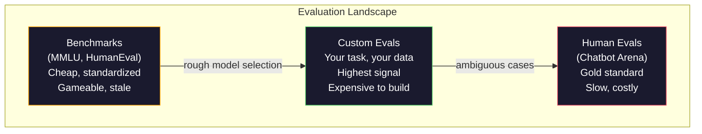
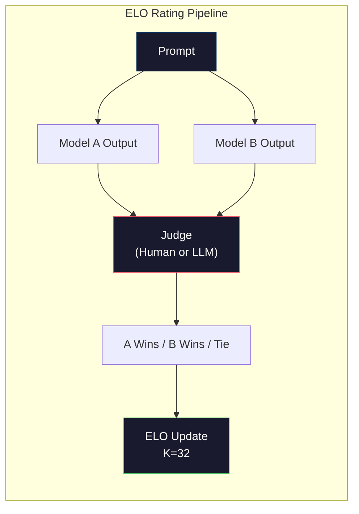

# Evaluación:Certificaciones, Evalos, LM

> Ley de Goodhart: Cuando un indicador se convierte en objetivo, ya no es un buen indicador. Cada laboratorio fronterizo se enfoca en benchmarks para hacer optimización.

**Type:** Build
**Languages:** Python
**前置要求:**Fase 10, curso 01-05 (LLM desde cero)
**Time:** ~90 minutes

## El objetivo del aprendizaje
- Construir un arnés de evaluación autodeterminado, utilizado para el modelo de lenguaje 运行 múltiples opciones y referencias abiertas
- 解释为什么标准基准(MMLU、HumanEval) 会和, y no puede distinguir los modelos fronterizos
- Utilizaciones de métricas adecuadas  Realizar evaluaciones específicas de tareas:cumplimiento exacto 、F1、BLEU y puntuación de LLM como juez
- 设计面向您特定使用案例的自定义评估套件, en lugar de depender solo de los tablones de clasificación públicos

##  problemas
MMLU  fue lanzado en 2020, conteniendo 57 个学科的 15,908 道题──三年内, fronterizos modelos 就让它和了──GPT-4 得分 86.4%──Claude 3 Opus 得分 86.8%──Llama 3 405B 得分 88.6%──leaderboard fue comprimido a 3 分范围内, entre los cuales la diferencia era sólo ruido estadístico, y no brechas de capacidad reales──

Al mismo tiempo, estos modelos fallarán en una tarea que un niño de 10 años no necesita pensar en que puede completar. Claude 3.5 Sonnet obtiene un puntaje de 88.7% en MMLU, pero inicialmente no puede contar el número de letras en "fresa". Esta tarea no requiere ningún conocimiento mundial, ni razonamiento, solo requiere una iteración a nivel de caracteres. HumanEval utiliza 164 problemas para la generación de código de prueba. El modelo obtiene más de 90% de puntajes, pero todavía genera código que se desmorona en situaciones de frontera, mientras que cualquier desarrollador primario puede descubrir estas fronteras.

Los benchmarks sólo pueden decirte cómo se desempeña el modelo en el benchmark. Prácticamente no pueden decirte cómo se desempeña este modelo en tus tareas específicas, tus datos específicos, tus modos de falla específicos. Si estás construyendo un bot de atención al cliente, MMLU es un poco importante. Si estás construyendo un asistente de código, HumanEval sólo cubre la generación de nivel de función, no hay ninguna explicación sobre el debugging, refactoring o código de interpretación a través de documentos.

Necesitas evaluaciones personalizadas. No es porque los puntos de referencia no sean útiles, los puntos de referencia para la selección de modelos más o menos útiles, sino porque la evaluación final debe ser precisa para adaptarse a las condiciones de implementación.

## 概念
### El paisaje de Eval

La evaluación se divide en tres categorías, cada una de las cuales tiene un coste y una calidad de señal diferentes.

**Benchmarks**Es el problema de la formación de los modelos y los datos de entrenamiento, que se vuelven más fáciles de contaminar estos benchmarks. Los laboratorios se encuentran en el entrenamiento de los datos de los problemas de referencia.

**Custom evals**Es usted el que construye su propio caso de uso de pruebas. Usted define los insumos, las salidas esperadas y la función de puntuación.

**Human evals**Utiliza pay费 anotadores, según la utilidad, corrección, fluidez y seguridad, etc. Evaluación de los modelos de evaluación. Para las tareas de puntuación automática, este es el estándar de oro. Chatbot Arena ha reunido más de 200 millones de votos de preferencias de más de 100 modelos.$0.10-$2.00) y velocidad (((cuantas horas hasta varios días)



### Por qué se rompen los índices de referencia

Tres mecanismos conducen a que el índice de referencia de la cantidad de datos no refleje la capacidad real.

**Data contamination。**                                                                                                                                                                                                                                                              

**Teaching to the test。**Los laboratorios se enfocan en el rendimiento de referencia  optimización de los entrenamientos de datos mixtos  Si el 5% de los datos mixtos de entrenamiento es una opción múltiple al estilo MMLU, el modelo se encuentra en este formato y distribución de la respuesta  MMLU es una opción múltiple de cuatro vías  El modelo se encuentra en una distribución de la respuesta en A/B/C/D 

**Saturation。**Cuando cada modelo fronterizo en un punto de referencia arriba puede obtener 85-90% , este punto de referencia se detiene la capacidad de distinción. El resto del 10-15% de los problemas puede ser ambiguo, marcado erróneo, o necesita conocimiento del dominio frío. MMLU de 87% se eleva al 89%, puede significar que el modelo recuerde dos temas fríos, en lugar de ser más inteligente.

### Perplejidad: 快速健康检查

Perplejidad  mide el modelo de una serie de tokens There are many unexpected. En forma, es un índice de probabilidad de registro promedio negativo:

```
PPL = exp(-1/N * sum(log P(token_i | context)))
```

Perplejidad 为 10 表示模型在平均意义上,就像在每个代币位置中均选择一样不确定──越低越好──GPT-2 在 WikiText-103 上的困惑 约为 30──GPT-3 约为 20──Llama 3 8B 约为 7──

La perplejidad  para el mismo conjunto de pruebas  上比较模型很有用,但它有盲点. El modelo puede obtener baja perplejidad por el buen pronóstico de los modelos comunes, pero también es muy poco bueno en los modelos raros pero importantes. También no puede explicar la instrucción siguiendo la razón o la exactitud de los hechos.

### Licenciatura en Derecho como juez

Usar un modelo fuerte para evaluar 弱模型的输出──想法很简单:让GPT-4o o Claude Sonnet 根据 1-5 分评价反应的正确度,有用度和安全──使用GPT-4o-mini 时,每次判断成本约0.01美元,以及与人类判断的相关性出人意意地高,大多数任务约有80%的同意──

El ponente de puntuación es más importante que el modelo en sí mismo. El ponente de modelación es más importante. El ponente de puntuación genera un número de ruidos. El ponente de puntuación genera un número de puntuaciones estructuradas.

Modo de fracaso: los modelos de juez mostrarán sesgo de posición (((en comparaciones pares de preferencias (en la primera respuesta)  sesgo de verbosidad (en la primera respuesta)  sesgo de preferencias (en la segunda respuesta)  preferencias (en la segunda respuesta)  preferencias (en la segunda)  y auto-preferencia (en la segunda)  GPT-4 a los resultados de GPT-4  GPT-4  GPT-4  GPT-4  GPT-4  GPT-4  GPT-4  GPT-4  GPT-4  GPT-4  GPT-4  GPT-4  GPT-4  GPT-4  GPT-4  GPT-4  GPT-4  GPT-4  GPT-4  GPT  GPT  GPT  GPT  GPT  GPT  GPT  GPT  GPT  GPT  GPT  GPT  GPT  GPT  GPT  GPT  GPT  GPT  GPT  GPT  GPT  GPT  GPT  GPT  GPT  GPT  GPT  GPT  GPT  GPT  GPT  GPT  GPT  GPT  GPT  GPT  GPT  GPT  GPT  GPT  GPT  GPT  GPT  GPT  GPT  GPT  GPT  GPT  GPT  GPT  GPT  GPT  GPT  GPT  GPT  GPT  GPT  GPT  GPT  GPT  GPT  GPT  GPT  GPT  GPT  GPT  GPT  GPT  GPT  GPT  GPT  GPT  GPT  GPT  GPT  GPT  GPT  GPT  GPT 

###  Basado en comparaciones de las calificaciones de ELO

Este es el método de Chatbot Arena. A la misma hora, se presentan dos respuestas de diferentes modelos.

ELO tiene ventajas: clasificación relativa por encima de la puntuación absoluta más fiable, puede tratar mejor los lazos, y comparado con independientemente a cada salida打分需要更少比较就能收── hasta principios de 2026 años, Chatbot Arena 排名显示GPT-4o、Claude 3.5 Sonnet 和 Gemini 1.5 Pro 在榜首彼此相差不不到20 ELO puntos──



### Cuadro de Evaluación

**lm-evaluation-harness**(EleutherAI): estándar de código abierto marco de evaluación. Apoya más de 200 puntos de referencia.

**RAGAS**: especial para el marco de evaluación de las tuberías RAG.

**promptfoo**Para la evaluación de configuración de la ingeniería rápida, evalúan los casos de prueba definidos en YAML, para múltiples modelos de ejecución, obtengan un informe de paso/fallo, y se adaptan a las pruebas de regresión de las instrucciones, asegurando que el cambio rápido no destruya los casos de prueba ya existentes.

### Construir Evals personalizados

Esta es la única evaluación importante para la producción.

1. **Define the task。**模型到底应该做什么?要精确──"Responda preguntas" 太模糊──"Dado un correo electrónico de queja del cliente, extraer el nombre del producto, la categoría del problema y el sentimiento" 才是一个可以评估的任务──

2. **Create test cases。**El prototipo evalúa al menos 50 个, producción al menos 200 个. Cada caso de prueba es uno (entrada, espera_salida) para.

3. **Define scoring。**Resultados estructurados Utiliza la coincidencia exacta.

4. **Automate。**Cada evaluación se puede ejecutar con una orden de ejecución.

5. **Track over time。**单独一个评分 没有意义――你需要趋势线――上一次快速变化后分数是否提升?切换模型后是否回归?把评与提示 一起版本――

| Eval Type | 每次 judgment 成本 | 与人类的一致性 | 最适合 |
|-----------|------------------|----------------------|----------|
| Exact match | ~$0 | 100%（适用时） | Structured output、classification |
| BLEU/ROUGE | ~$0 | ~60% | Translation、summarization |
| LLM-as-judge | ~$0.01 | ~80% | Open-ended generation |
| Human eval | $0.10-$2.00 | N/A（即 ground truth） | Ambiguous、high-stakes tasks |


```figure
perplexity-loss
```

## Construirlo
### 步骤 1: mínimo Eval  marco

定义核心抽象──一个 eval case 有输入、预期输出 和可选的元数据 dict──一个得分者 接收预测 和参考,并返回 0 到 1 之间的分数──

```python
import json
from collections import Counter

class EvalCase:
    def __init__(self, input_text, expected, metadata=None):
        self.input_text = input_text
        self.expected = expected
        self.metadata = metadata or {}

class EvalSuite:
    def __init__(self, name, cases, scorers):
        self.name = name
        self.cases = cases
        self.scorers = scorers

    def run(self, model_fn):
        results = []
        for case in self.cases:
            prediction = model_fn(case.input_text)
            scores = {}
            for scorer_name, scorer_fn in self.scorers.items():
                scores[scorer_name] = scorer_fn(prediction, case.expected)
            results.append({
                "input": case.input_text,
                "expected": case.expected,
                "prediction": prediction,
                "scores": scores,
            })
        return results
```

### 步骤 2: Puntualización de funciones

Construir una coincidencia exacta de los tokens F1 y un puntero LLM como juez.

```python
def exact_match(prediction, expected):
    return 1.0 if prediction.strip().lower() == expected.strip().lower() else 0.0

def token_f1(prediction, expected):
    pred_tokens = set(prediction.lower().split())
    exp_tokens = set(expected.lower().split())
    if not pred_tokens or not exp_tokens:
        return 0.0
    common = pred_tokens & exp_tokens
    precision = len(common) / len(pred_tokens)
    recall = len(common) / len(exp_tokens)
    if precision + recall == 0:
        return 0.0
    return 2 * (precision * recall) / (precision + recall)

def llm_judge_simulated(prediction, expected):
    pred_words = set(prediction.lower().split())
    exp_words = set(expected.lower().split())
    if not exp_words:
        return 0.0
    overlap = len(pred_words & exp_words) / len(exp_words)
    length_penalty = min(1.0, len(prediction) / max(len(expected), 1))
    return round(overlap * 0.7 + length_penalty * 0.3, 3)
```

### 步骤 3: Sistema de clasificación de ELO

Utiliza las actualizaciones de ELO para lograr comparaciones en pares. Este es el sistema de clasificación de modelos utilizado en Chatbot Arena.

```python
class ELOTracker:
    def __init__(self, k=32, initial_rating=1500):
        self.ratings = {}
        self.k = k
        self.initial_rating = initial_rating
        self.history = []

    def _ensure_player(self, name):
        if name not in self.ratings:
            self.ratings[name] = self.initial_rating

    def expected_score(self, rating_a, rating_b):
        return 1 / (1 + 10 ** ((rating_b - rating_a) / 400))

    def record_match(self, player_a, player_b, outcome):
        self._ensure_player(player_a)
        self._ensure_player(player_b)

        ea = self.expected_score(self.ratings[player_a], self.ratings[player_b])
        eb = 1 - ea

        if outcome == "a":
            sa, sb = 1.0, 0.0
        elif outcome == "b":
            sa, sb = 0.0, 1.0
        else:
            sa, sb = 0.5, 0.5

        self.ratings[player_a] += self.k * (sa - ea)
        self.ratings[player_b] += self.k * (sb - eb)

        self.history.append({
            "a": player_a, "b": player_b,
            "outcome": outcome,
            "rating_a": round(self.ratings[player_a], 1),
            "rating_b": round(self.ratings[player_b], 1),
        })

    def leaderboard(self):
        return sorted(self.ratings.items(), key=lambda x: -x[1])
```

### Paso 4: Calculo de la perplejidad

Utiliza probabilidades simbólicas  calcular perplejidad― en la práctica, obtendrás estos valores de los logitos del modelo― aquí utilizamos la distribución de probabilidades―

```python
import numpy as np

def perplexity(log_probs):
    if not log_probs:
        return float("inf")
    avg_neg_log_prob = -np.mean(log_probs)
    return float(np.exp(avg_neg_log_prob))

def token_log_probs_simulated(text, model_quality=0.8):
    np.random.seed(hash(text) % 2**31)
    tokens = text.split()
    log_probs = []
    for i, token in enumerate(tokens):
        base_prob = model_quality
        if len(token) > 8:
            base_prob *= 0.6
        if i == 0:
            base_prob *= 0.7
        prob = np.clip(base_prob + np.random.normal(0, 0.1), 0.01, 0.99)
        log_probs.append(float(np.log(prob)))
    return log_probs
```

### 步骤 5: Resultados agregados

计算一次 eval run: media, media, umbral, índice de aprobación, así como las desglosas de métricas

```python
def summarize_results(results, threshold=0.8):
    all_scores = {}
    for r in results:
        for metric, score in r["scores"].items():
            all_scores.setdefault(metric, []).append(score)

    summary = {}
    for metric, scores in all_scores.items():
        arr = np.array(scores)
        summary[metric] = {
            "mean": round(float(np.mean(arr)), 3),
            "median": round(float(np.median(arr)), 3),
            "std": round(float(np.std(arr)), 3),
            "min": round(float(np.min(arr)), 3),
            "max": round(float(np.max(arr)), 3),
            "pass_rate": round(float(np.mean(arr >= threshold)), 3),
            "n": len(scores),
        }
    return summary

def print_summary(summary, suite_name="Eval"):
    print(f"\n{'=' * 60}")
    print(f"  {suite_name} Summary")
    print(f"{'=' * 60}")
    for metric, stats in summary.items():
        print(f"\n  {metric}:")
        print(f"    Mean:      {stats['mean']:.3f}")
        print(f"    Median:    {stats['median']:.3f}")
        print(f"    Std:       {stats['std']:.3f}")
        print(f"    Range:     [{stats['min']:.3f}, {stats['max']:.3f}]")
        print(f"    Pass rate: {stats['pass_rate']:.1%} (threshold >= 0.8)")
        print(f"    N:         {stats['n']}")
```

### Paso 6: ejecutar el oleoducto completo

Definir una tarea, crear casos de prueba, simula dos modelos, ejecutar evaluaciones, hacer comparaciones de pares  calcular ELO,并打印榜单――

```python
def demo_model_good(prompt):
    responses = {
        "What is the capital of France?": "Paris",
        "What is 2 + 2?": "4",
        "Who wrote Hamlet?": "William Shakespeare",
        "What language is PyTorch written in?": "Python and C++",
        "What is the boiling point of water?": "100 degrees Celsius",
    }
    return responses.get(prompt, "I don't know")

def demo_model_bad(prompt):
    responses = {
        "What is the capital of France?": "Paris is the capital city of France",
        "What is 2 + 2?": "The answer is four",
        "Who wrote Hamlet?": "Shakespeare",
        "What language is PyTorch written in?": "Python",
        "What is the boiling point of water?": "212 Fahrenheit",
    }
    return responses.get(prompt, "Unknown")

cases = [
    EvalCase("What is the capital of France?", "Paris"),
    EvalCase("What is 2 + 2?", "4"),
    EvalCase("Who wrote Hamlet?", "William Shakespeare"),
    EvalCase("What language is PyTorch written in?", "Python and C++"),
    EvalCase("What is the boiling point of water?", "100 degrees Celsius"),
]

suite = EvalSuite(
    name="General Knowledge",
    cases=cases,
    scorers={
        "exact_match": exact_match,
        "token_f1": token_f1,
        "llm_judge": llm_judge_simulated,
    },
)

results_good = suite.run(demo_model_good)
results_bad = suite.run(demo_model_bad)

print_summary(summarize_results(results_good), "Model A (concise)")
print_summary(summarize_results(results_bad), "Model B (verbose)")
```

"bueno" 模型 dá respuesta precisa. "malo" 模型 da paráfrases de redundancia. La coincidencia exacta será severamente castigar redundancia.

### Paso 7: Torneo ELO

En varias rondas, las comparaciones en pares entre modelos de ejecuciones se realizan.

```python
elo = ELOTracker(k=32)

for case in cases:
    pred_a = demo_model_good(case.input_text)
    pred_b = demo_model_bad(case.input_text)

    score_a = token_f1(pred_a, case.expected)
    score_b = token_f1(pred_b, case.expected)

    if score_a > score_b:
        outcome = "a"
    elif score_b > score_a:
        outcome = "b"
    else:
        outcome = "tie"

    elo.record_match("model_a_concise", "model_b_verbose", outcome)

print("\nELO Leaderboard:")
for name, rating in elo.leaderboard():
    print(f"  {name}: {rating:.0f}")
```

### Paso 8: Comparecimiento de la perplejidad

La complejidad de los modelos en comparación con los diferentes niveles de calidad.

```python
test_text = "The quick brown fox jumps over the lazy dog in the garden"

for quality, label in [(0.9, "Strong model"), (0.7, "Medium model"), (0.4, "Weak model")]:
    log_probs = token_log_probs_simulated(test_text, model_quality=quality)
    ppl = perplexity(log_probs)
    print(f"  {label} (quality={quality}): perplexity = {ppl:.2f}")
```

## Usalo
### El uso de la tecnología de evaluación (EleutherAI)

En cualquier modelo de funcionamiento de los puntos de referencia.

```python
# pip install lm-eval
# Command line:
# lm_eval --model hf --model_args pretrained=meta-llama/Llama-3.1-8B --tasks mmlu --batch_size 8

# Python API:
# import lm_eval
# results = lm_eval.simple_evaluate(
#     model="hf",
#     model_args="pretrained=meta-llama/Llama-3.1-8B",
#     tasks=["mmlu", "hellaswag", "arc_easy"],
#     batch_size=8,
# )
# print(results["results"])
```

### de inmediato

Utilizando evaluaciones basadas en configuración de ingeniería rápida, las pruebas definidas en YAML se dirigen a varios proveedores.

```yaml
# promptfoo.yaml
providers:
  - openai:gpt-4o-mini
  - anthropic:claude-3-haiku

prompts:
  - "Answer in one word: {{question}}"

tests:
  - vars:
      question: "What is the capital of France?"
    assert:
      - type: contains
        value: "Paris"
  - vars:
      question: "What is 2 + 2?"
    assert:
      - type: equals
        value: "4"
```

### RAGAS para la evaluación de RAG

```python
# pip install ragas
# from ragas import evaluate
# from ragas.metrics import faithfulness, answer_relevancy, context_precision
#
# result = evaluate(
#     dataset,
#     metrics=[faithfulness, answer_relevancy, context_precision],
# )
# print(result)
```

RAGAS Mejora de evaluaciones generales 会遗漏的内容: ¿se basa el modelo respuesta en el contexto recuperado, no sólo en el sentido abstracto si es correcto o no?

##  entregarlo
本课会产出                                                                                                                                                                                                                                                                                                                                                                                                                                                                                                                         `outputs/prompt-eval-designer.md`, es un prompt replicable, utilizado para diseñar suites de evaluación personalizadas para cualquier tarea.

También se producirá.`outputs/skill-llm-evaluation.md`, es un marco de decisión, utilizado en función de su tipo de tarea, presupuesto y requisitos de latencia, seleccionar la estrategia de evaluación adecuada.

##  ejercicios
1. Añadir un puntero de "concordancia": con la misma entrada 让模型运行 5 times,并衡量输出 匹配的频率──determinístico 的不一致答案会暴露脆弱的提示或过高的温度设置──

2.  ampliar el rastreador ELO, que lo hace apoyar múltiples funciones de juez (exact match 、F1、LLM-as-judge) y aumentar su poder para ellos.

3. Para una tarea específica, construir una suite de evaluaciones: clasificar los correos electrónicos a 5 categorías. Crear 100 casos de prueba, que incluyen muchos ejemplos y casos de borde. Puede pertenecer a varias categorías de correos electrónicos.

4.  Realizar la detección de contaminación: dado un conjunto de preguntas de evaluación y un corpus de formación, examinar cuál es la proporción de preguntas de evaluación (o parafrases cercanas) que aparecen en los datos de formación.

5. Construir una herramienta de "modelo diferente" ⋅ Dado los resultados de evaluación de dos versiones de modelos, ¿qué casos específicos de prueba han aumentado, qué han regresado, qué no han cambiado ⋅ es importante para entender un cambio si es útil o perjudicial ⋅

## 关键术语: "El hombre es un hombre"
| Term | 人们的说法 | 它实际上的含义 |
|------|----------------|----------------------|
| MMLU | "The benchmark" | Massive Multitask Language Understanding，包含 57 个学科的 15,908 道 multiple choice questions，到 2025 年已在 88% 以上饱和 |
| HumanEval | "Code eval" | OpenAI 的 164 个 Python function-completion problems，只测试 isolated function generation |
| SWE-bench | "Real coding eval" | 来自 12 个 Python repos 的 2,294 个 GitHub issues，衡量包括 test generation 在内的 end-to-end bug fixing |
| Perplexity | "How confused the model is" | exp(-avg(log P(token_i given context)))，越低表示模型给实际 tokens 分配的概率越高 |
| ELO rating | "Chess ranking for models" | 根据 pairwise win/loss records 计算的 relative skill rating，Chatbot Arena 用它对 100+ models 排名 |
| LLM-as-judge | "Using AI to grade AI" | 强模型按照 rubric 评价弱模型 outputs，与人类 judges 约 80% agreement，成本约 $0.01/judgment |
| Data contamination | "The model saw the test" | Training data 包含 benchmark questions，在不提升真实 capability 的情况下抬高分数 |
| Eval suite | "A bunch of tests" | 一个 versioned collection，由 (input, expected_output, scorer) triples 组成，用于衡量特定 capability |
| Pass rate | "What percentage it gets right" | Eval cases 中得分超过阈值的比例，比 mean score 更可操作，因为它衡量 reliability |
| Chatbot Arena | "Model ranking website" | LMSYS 平台，拥有 2M+ human preference votes，并通过 ELO ratings 生成最可信的 LLM leaderboard |

## 延伸阅读
- [Hendrycks et al., 2021 -- "Measuring Massive Multitask Language Understanding"](https://arxiv.org/abs/2009.03300)-- documento de la MMLU, a pesar de haber sido y sigue siendo el referente de LLM más citado
- [Chen et al., 2021 -- "Evaluating Large Language Models Trained on Code"](https://arxiv.org/abs/2107.03374)-- OpenAI's HumanEval paper, estableció una metodología de evaluación de generación de código
- [Zheng et al., 2023 -- "Judging LLM-as-a-Judge"](https://arxiv.org/abs/2306.05685)-- para el uso de LLM evaluación LLM de análisis sistémico, incluyendo el sesgo de posición y el sesgo de verbosidad
- [LMSYS Chatbot Arena](https://chat.lmsys.org/)-- plataforma de comparación de modelos de crowdsourcing, con más de 2M votos, es el ranking de LLM más creíble en el mundo real
