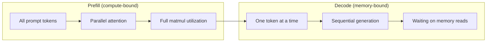
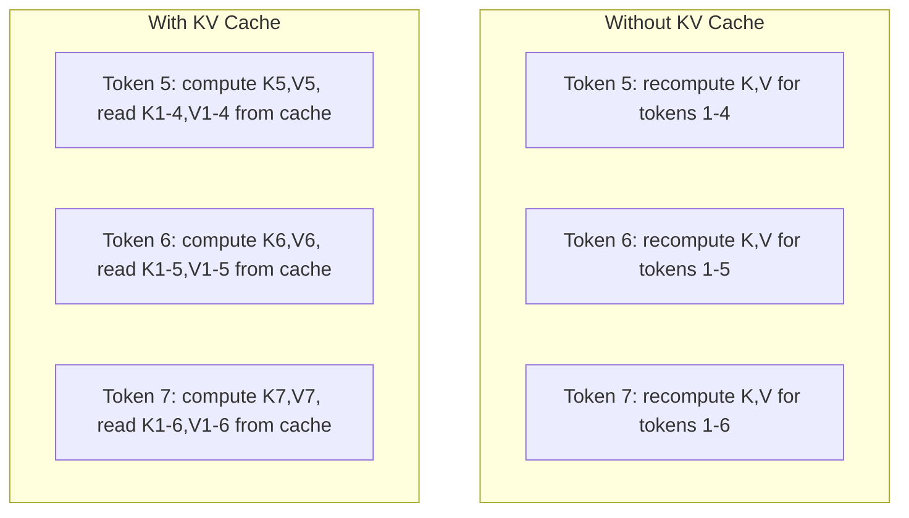
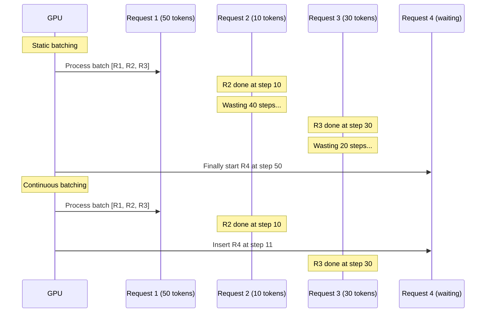
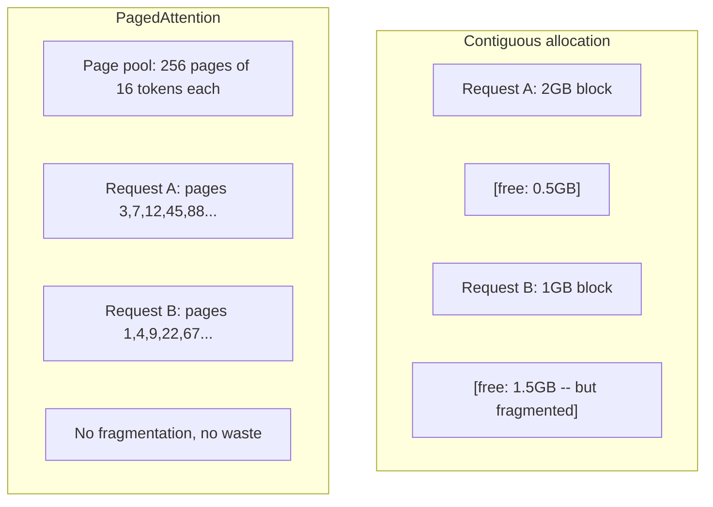
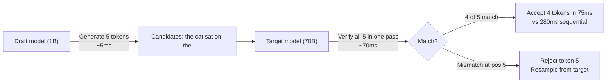

# Inferencia 优化

> 两个阶段定义了LLM inference──Prefill 并行处理你的提示――计算-bound──Decode 一次生成一个代币――记忆-bound──每种优化都针对其中一个或两个阶段──

**Type:** Build
**Languages:** Python
**Prerequisites:** Phase 10, Lessons 01-08 (Transformer architecture, attention)
**Time:** ~120 分钟

## El objetivo del aprendizaje

- realizar KV-cache, para eliminar el cálculo redundante durante el período de producción de Token autoregresivos
-  Explicar la inferencia de LLM preemplazo y decodificación fase, y por qué los dos tienen diferentes botellas (computación-ligada vs memoria-ligada)
- 实现 batching continuo 和 PagedAttention 概念, para maximizar la tasa de uso de la GPU bajo la solicitud de desarrollo
- Con respecto a la inferencia 优化技术(KV-cache, descifrado especulativo, atención flash) y su rendimiento/latencia 取舍

##  problemas

Usted está en 4xA100 GPUs en la implementación de Llama 3 70B. Un usuario puede obtener aproximadamente 50 tokens por segundo.

El modelo en sí mismo no cambió entre 1 usuario y 100 usuarios. Los mismos pesos, la misma arquitectura, la misma matemática. Cambió cómo se organiza el trabajo. Inferencias simples, perderán el 90% de la computación de GPU disponible. Un usuario de un token de espera 47 ocupará todo el espacio de lote, mientras que el bus de memoria de GPU está en el espacio entre los matmulos.

Esto no es una cuestión de escalado. Esto es una cuestión de programación. La técnica de esta clase - KV caching, batching continuo, PagedAttention, decodificación especulativa, prefijo caching - está siendo una conclusión de 25 mil dólares al mes, cuentas y 5 mil dólares al mes, servicios, el mismo flujo de cuentas.

vLLM en 4xA100-80GB en la servidumbre de Llama 3 70B 时, en bajo并发下 alcanzar alrededor de 50 tokens/segundo/usuario,并通过连续批发 和 PagedAttention en 100 个并发请求维持 15-25 TPS/usuario。没有这些优化,同样硬件在该并发下只能提供 5 TPS/usuario。

## 概念

### Preemplaje vs decodificación

Cada inferencia de LLM tiene dos fases diferentes.

**Prefill**处理整个输入提示──所有代币都已知,因此注意可以在完整序列上并行计算──这是一个大型矩阵乘法--GPU cores 会保持忙碌──瓶是计算:你的硬件每秒能提供多少FLOPS──A100可达到312 TFLOPS (BF16)──在单张 A100 上,70B 模型对 4,096-代币提示做做预填 约需要400ms──

**Decode**Una vez se genera un token de salida. Cada nuevo token se acompaña a todos los tokens anteriores, pero cada paso adelante sólo se produce un token. Las matrices de peso tienen el mismo tamaño que el preempleo. Pero se utiliza un solo vector en lugar de una matriz para transportarlos. Los núcleos de GPU se completan en micro segundos, y luego se espera a la siguiente serie de pesos desde la memoria hasta el botellón.



**ops:byte ratio**(también se llama intensidad aritmética) dibujó este tipo de objetos.

```
ops:byte ratio = FLOPs per token / bytes read from memory
```

En el lote de 4.096 tokens hacer preempleo 时, por carga un peso, usted ejecutará aproximadamente 4.096 veces multiplicar-acumular operaciones 很高----------- Usted es computación-bound── en el lote de tamaño 为 1 de decodificar, por carga un peso sólo ejecutar aproximadamente 1 vez operación──--- esta proporción 很低------- Usted es memoria-bound──

核心洞察:* el decode es limitado a la memoria, ya que el modelo entero se utiliza para generar un solo token*── cada optimización de la siguiente, o para reducir el contenido de lectura, o para aumentar el lote de tokens procesados por las lecturas, o para evitar completamente leer──

### Cache de KV

En la atención, cada consulta de los tokens se atenderá a cada uno de los vectores de clave y valor de los tokens anteriores. No hay caché. Cuando se genera un token, se necesita volver a calcular la primera parte de los tokens N-1 个 个 个 个 个 个 个 个 个 个 个 个 个 个 个 个 个 个 个 个 个 个 个 个 个 个 个 个 个 个 个 个 个 个 个 个 个 个 个 个 个 个 个 个 个 个 个 个 个 个 个 个 个 个 个 个 个 个 个 个 个 个 个 个 个 个 个 个 个 个 个 个 个 个 个 个 个 个 个 个 个 个 个 个 个 个 个 个 个 个 个 个 个 个 个 个 个 个 个 个 个 个 个 个 个 个 个 个 个 个 个 个 个 个 个 个 个 个 个 个 个 个 个 个 个 个 个 个 个 个 个 个 个 个 个 个 个 个 个 个 个 个 个 个 个 个 个 个 个 个 个 个 个 个 个 个 个 个 个 个 个 个 个 个 个 个 个 个 个 个 个 个 个 个 个 个 个 个 个 个 个 个 个 个 个 个 个 个 个 个 个 个 个 个 个 个 个 个 个 个 个 个 个 个 个 个 个 个 个 个 个 个 个 个 个 个 个 个 个 个 个 个 个 个 个 个 个

KV cache  almacenamiento de todas las proyecciones de clave y valor de los tokens anteriores― generar token N 时, tú sólo calcular el valor y clave de token N, y luego ponerlos en caché con los tokens 1 a N-1 拼拼拼拼起来 K/V 拼拼拼拼拼



**KV cache 的 memory 公式：**

```
KV cache size = 2 * num_layers * num_kv_heads * head_dim * seq_len * bytes_per_param
```

对于Llama 3 70B(80 capas、8 KV cabezas con GQA、head_dim=128、BF16):

```
per token: 2 * 80 * 8 * 128 * 2 bytes = 327,680 bytes = 320 KB
at 4,096 tokens: 320 KB * 4,096 = 1.28 GB
at 128K tokens: 320 KB * 131,072 = 40 GB
```

Una conversación de contexto 128K de Llama 3 70B 会消耗40 GB de caché KV -- 半张 A100的内存──100 个并发用户、每人4K代币时,只需要128 GB的KV caché──这就是为什么KV caché管理是推断优化的核心挑战──

### El batido continuo

El batch estático esperará a que llegue un lote de N 个 solicitudes, las tratará juntas, y esperará hasta que *todas* se completen para aceptar una nueva solicitud. Si una solicitud necesita 500 tokens, otra necesita 10, después de que se complete la solicitud también debe colocar 490 pasos de decodificación.

Batchamiento continuo (también llamado batchamiento a nivel de iteración) se realizará en cualquier solicitud después de su finalización inmediatamente para introducir una nueva solicitud en el lote.



La potencia de producción 提升 depende del grado de variación de la longitud de salida. Cuando la longitud coincide, el batch continuo y el batch estático 相当──长度可变时(常见情况), el batch continuo puede proporcionar un rendimiento 2-5 veces mayor, ya que las ranuras de GPU 永远不会空置──

### Página Atención

Cada solicitud de KV cache es un bloque de memoria contiguosa. Con la solicitud de llegada y salida, la memoria se fragmenta - tal como la fragmentación de la RAM en el sistema operativo. Una solicitud de 4K-token necesita 1.28 GB contiguos. Incluso si el total de 2 GB es gratuito, también es posible que no tenga 1.28 GB *contiguos*.

PagedAttention (desde vLLM) se utilizará la memoria virtual de estilo OS para el caché KV。 no se distribuye para cada solicitud un bloque contiguo, sino que se distribuye un tamaño fijo de "páginas" (normalmente cada página 16 tokens)。 Las páginas se pueden ubicar en cualquier lugar de la memoria física de la GPU。



PagedAttention también apoya los prefijos compartidos de **copy-on-write** Si 50 solicitudes comparten el mismo sistema de instrucciones, este sistema de instrucciones de KV de caché páginas sólo se almacenan una vez, y son citadas en común por 50 solicitudes  sólo cuando una solicitud de instrucciones de usuario diferentes) se obtendrá sus propias páginas  Esto significativamente reduce el uso de memoria de las aplicaciones de las instrucciones de sistema de intercambio 

vLLM  report称, a través de PagedAttention se puede lograr casi zero de desperdicio de memoria (~4%, mientras que la asignación ingenua es de aproximadamente 60-80%) 👇

### Descripción especulativa

Decodificar es lento porque es secuencial - usted genera un token, lo revuelve, lo reproduce en el siguiente. Pero si usted puede con poco dinero adivinar los siguientes 5 tokens, y luego una vez que los verifique?

Descifrado especulativo usando una pequeña y rápida **draft model**生成 K 个 candidato tokens── grandes **target model**Luego, en un solo pase adelante, se procesan todos los K 个候选人(parece como prefill -- paralelo、computación-bound、高效)  Si el modelo objetivo es el modelo del proyecto de pronóstico, usted está en un tiempo de un pase hacia adelante objetivo aceptando todos los K 个代币── si está en posición j no está de acuerdo, usted acepta los tokens 1 hasta j-1, y pierde el resto de la parte──



El acelerador 取决于**acceptance rate**-- Previsión del modelo de proyecto con frecuencia de coincidencia con el objetivo― con Llama 3 8B para Llama 3 70B en la elaboración del proyecto , en lengua natural, las tasas de aceptación típicas son de 70-85%―, esto se traduce en 2-3 veces la velocidad de decodificación―.

Especulativo de la descifrado de los tres métodos:

| Method | Draft source | Acceptance rate | Overhead |
|--------|-------------|-----------------|----------|
| Draft-target (Leviathan et al.) | 独立小模型 | 70-85% | Draft model memory |
| EAGLE (Li et al.) | Target 上的轻量 head | 75-90% | ~1% extra parameters |
| N-gram lookup | Token n-gram table | 40-60% | 可忽略 |

**EAGLE**En los estados ocultos del modelo objetivo 之上训练一个小型 autoregressive head──它使用目标模型 倒数第二层功能来预测下一个代币的嵌入式──因为它操作的是目标模型 自身的表示(而不是独立模型的),所以能以极极少的额外内存获得更高的接受率──EAGLE-2 增加了动态草案树,可根据背景调整候选人数量──

**N-gram speculative decoding**维护来自当前背景或预构建 corpus的 n-gram continuations table──如果草案匹配同样的对话中此前出现的内容(重复模式、代码、结构化输出), se utilizará con 触发──零 Neural Network overhead 触发── tasas de aceptación promedio más bajas, pero el costo de la especulación por vez es básicamente de 零──

La descodificación especulativa es matemáticamente precisa * - 输出分布与目标模型的分布完全相同──────────────────────────────────────────────────────────────────────────────────────────────────────────────────────────────────────────────────────────────────────────────────────────────────────────────────────────────────────────────────────────────────────────────────────────────────────────────────────────────────────────────────────────────────────────────────────────────────────────────────────────────────────────────────────────────────────────────────────────────────────────────────────────────────────────────────────────────────────────────────────────────────────────────────────────────────────────────────────────────────────────────────────────────────────────────────────────────────────────────────────────────────────────────────────────────────────────────────────────────────────────────────────────────────────────────────────────────────────────────────────────────────────────────────────────────────────────────────────────────────────────

### Prefijo Caching

许多请求共享相同前──Chatbot system prompt──RAG context block──Few-shot example set──没有前缓存时,每个请求都会从头重新计算这些共享代币的KV缓存──

Prefijo caché  almacenamiento de prefijos comunes KV caché, y en la solicitud entre duplicación。 Cuando la nueva solicitud con el prefijo conocido hasta llegar, el sistema se duplica(o cita) entradas caché KV,并仅计算唯一的后音的 KV。

对于所有请求共享的2000代币系统提示,预先缓存会消除每一个请求约400ms的预先填写――在100请求/秒时,这每秒节省40秒的GPU计算--超过一张GPU的工作量――

Utiliza el árbol radix (trie) para implementar el caché de prefijos, según el contenido de los tokens 索引 prefixes。 cualquier aplicación almacenada del prefijo de la solicitud de todos los sitios web obtendrá su caché KV。 este árbol 支持部分 prefijo matches -- If you share 2,000 个 prefijo tokens out of 1,500 个,就复用这1,500 个,只重新计算 500 个──

### Motores de inflexión

Tres motores 主导 producción LLM sirviendo:

| Engine | Key innovation | Best for |
|--------|---------------|----------|
| vLLM | PagedAttention、continuous batching | 通用 serving、最高兼容性 |
| SGLang | RadixAttention（prefix caching）、structured generation | Multi-turn chatbots、constrained decoding |
| TensorRT-LLM | NVIDIA kernel fusion、FP8 quantization | NVIDIA hardware 上的最大 single-GPU throughput |

**vLLM**Es un punto de inicio de la aplicación. Soporta el modelo más amplio, puede funcionar en cualquier proveedor de GPU (NVIDIA, AMD, Intel), y a través de PagedAttention + batching continuo  lograr un alto rendimiento.

**SGLang**建立在与vLLM相似的基础之上, pero aumentó RadixAttention para el caching de prefijos, así como para el lenguaje específico de dominio de los programas de LLM estructurados. Si su carga de trabajo contiene conversaciones de múltiples vueltas, el uso de herramientas o el decodificación restringida, la generación guiada por regex de JSON, SGLang 往往能通过 prefijo reuse比vLLM 快 2-5 倍──

**TensorRT-LLM**将模型编译成优化NVIDIA GPU kernels──它融合运算( Atención + lineal + activación en un kernel), en H100 GPUs 上使用FP8,并与NVIDIA Triton Inference Server 集集成进行生产部署──它在NVIDIA hardware 上实现最高单GPU吞吐量,但设置更多,并且只适用于NVIDIA GPUs──

Llama 3 70B 的真实世界数字(4xA100-80GB,BF16):

| Metric | vLLM | SGLang | TensorRT-LLM |
|--------|------|--------|---------------|
| Throughput（1 user） | ~50 TPS | ~55 TPS | ~65 TPS |
| Throughput（100 users） | ~2,500 total TPS | ~3,200 total TPS | ~3,000 total TPS |
| Time to first token | ~400ms | ~300ms（prefix hit） | ~350ms |
| Max context | 128K | 128K | 128K |

### Ops:Byte 框架

No puedes optimizarte sin medir cosas. Oops: la relación de bajos te dirá que la carga de trabajo es computacional o memoria, y eso determina qué optimizaciones son realmente importantes.

```
Compute roof: peak FLOPS of the GPU
Memory roof:  peak bandwidth * ops:byte ratio
```

Cuando ops:byte 较低时(decode、小批), usted se tocará sobre el techo de ancho de banda de memoria。 aumentar más computación(更高钟、更多核心) no ayuda。 usted necesita reducir las lecturas de memoria(quantization、KV cache compression), o aumentar el tamaño del lote, se leerá repartición a más útiles trabajos。

Cuando opciones:byte 较高时(prefill、大批), usted se tocará en el techo de la computación──optimización de ancho de banda de memoria 没有帮助──you need faster GPUs、kernel fusion o reducción de precisión para extraer más FLOPS──

| Scenario | ops:byte | Bound | Optimize with |
|----------|----------|-------|---------------|
| Prefill, batch=1 | ~4,096 | Compute | Kernel fusion, FP8 |
| Decode, batch=1 | ~1 | Memory | Quantization, KV compression |
| Decode, batch=32 | ~32 | Memory | Larger batch, continuous batching |
| Decode, batch=256 | ~256 | Transitioning | 两者都重要 |
| Decode, batch=1024 | ~1,024 | Compute | Kernel fusion, tensor parallelism |

A100 上的交叉点 大约是 ops:byte = 156(312 TFLOPS / 2 TB/s) ⋅低于156 时,你是记忆绑定──高于156 时,你是计算绑定──持续批发 通过每次回复 打包更多代币,将解码 推向这个交叉――


```figure
context-window-slide
```

## Construirlo

### Paso 1: Implementar el caché KV desde cero

Construimos una caché KV multi-head, que se realiza por capa, cabeza, llave de almacenamiento y proyecciones de valor, y muestra memoria, modo de crecimiento.

```python
import numpy as np

class KVCache:
    def __init__(self, num_layers, num_heads, head_dim, max_seq_len, dtype=np.float16):
        self.num_layers = num_layers
        self.num_heads = num_heads
        self.head_dim = head_dim
        self.max_seq_len = max_seq_len
        self.dtype = dtype

        self.k_cache = np.zeros(
            (num_layers, num_heads, max_seq_len, head_dim), dtype=dtype
        )
        self.v_cache = np.zeros(
            (num_layers, num_heads, max_seq_len, head_dim), dtype=dtype
        )
        self.seq_len = 0

    def update(self, layer_idx, new_keys, new_values):
        num_new = new_keys.shape[1]
        end = self.seq_len + num_new
        self.k_cache[layer_idx, :, self.seq_len:end, :] = new_keys
        self.v_cache[layer_idx, :, self.seq_len:end, :] = new_values
        return (
            self.k_cache[layer_idx, :, :end, :],
            self.v_cache[layer_idx, :, :end, :]
        )

    def advance(self, num_tokens):
        self.seq_len += num_tokens

    def memory_bytes(self):
        return self.k_cache.nbytes + self.v_cache.nbytes

    def used_bytes(self):
        per_token = 2 * self.num_layers * self.num_heads * self.head_dim * np.dtype(self.dtype).itemsize
        return per_token * self.seq_len
```

### Paso 2: Utiliza el caché KV Atención

Una atención simplificada de múltiples cabezas, en los pasos de decodificación, usar el caché KV.

```python
def scaled_dot_product_attention(query, keys, values):
    head_dim = query.shape[-1]
    scores = np.matmul(query, keys.transpose(0, 1, 3, 2)) / np.sqrt(head_dim)
    seq_len_q = scores.shape[-2]
    seq_len_k = scores.shape[-1]
    if seq_len_q > 1:
        mask = np.triu(np.ones((seq_len_q, seq_len_k), dtype=np.float32), k=seq_len_k - seq_len_q + 1)
        scores = scores + mask * (-1e9)
    max_scores = np.max(scores, axis=-1, keepdims=True)
    exp_scores = np.exp(scores - max_scores)
    attn_weights = exp_scores / np.sum(exp_scores, axis=-1, keepdims=True)
    return np.matmul(attn_weights, values)


class MultiHeadAttention:
    def __init__(self, d_model, num_heads):
        self.num_heads = num_heads
        self.head_dim = d_model // num_heads
        scale = np.sqrt(2.0 / d_model)
        self.W_q = np.random.randn(d_model, d_model).astype(np.float32) * scale
        self.W_k = np.random.randn(d_model, d_model).astype(np.float32) * scale
        self.W_v = np.random.randn(d_model, d_model).astype(np.float32) * scale
        self.W_o = np.random.randn(d_model, d_model).astype(np.float32) * scale

    def forward(self, x, kv_cache=None, layer_idx=0):
        batch, seq_len, d_model = x.shape
        Q = np.matmul(x, self.W_q).reshape(batch, seq_len, self.num_heads, self.head_dim).transpose(0, 2, 1, 3)
        K = np.matmul(x, self.W_k).reshape(batch, seq_len, self.num_heads, self.head_dim).transpose(0, 2, 1, 3)
        V = np.matmul(x, self.W_v).reshape(batch, seq_len, self.num_heads, self.head_dim).transpose(0, 2, 1, 3)

        if kv_cache is not None:
            K_full, V_full = kv_cache.update(layer_idx, K[0], V[0])
            K = K_full[np.newaxis, :, :, :]
            V = V_full[np.newaxis, :, :, :]
            if seq_len == 1:
                kv_cache.advance(1)

        attn_out = scaled_dot_product_attention(Q, K, V)
        attn_out = attn_out.transpose(0, 2, 1, 3).reshape(batch, -1, d_model)
        return np.matmul(attn_out, self.W_o)
```

### Paso 3: Batchamiento continuo 模拟器

Se parece a la batería estática y la batería continua.

```python
import heapq

class Request:
    def __init__(self, request_id, prompt_tokens, output_tokens, arrival_step):
        self.request_id = request_id
        self.prompt_tokens = prompt_tokens
        self.output_tokens = output_tokens
        self.arrival_step = arrival_step
        self.tokens_generated = 0
        self.start_step = None
        self.end_step = None

    def is_done(self):
        return self.tokens_generated >= self.output_tokens


def simulate_static_batching(requests, batch_size):
    step = 0
    completed = []
    queue = list(requests)
    queue.sort(key=lambda r: r.arrival_step)

    while queue:
        batch = []
        while queue and len(batch) < batch_size:
            r = queue.pop(0)
            r.start_step = max(step, r.arrival_step)
            batch.append(r)

        if batch:
            step = max(step, max(r.start_step for r in batch))
            max_output = max(r.output_tokens for r in batch)
            for r in batch:
                r.tokens_generated = r.output_tokens
                r.end_step = step + max_output
            step += max_output
            completed.extend(batch)

    return completed


def simulate_continuous_batching(requests, batch_size):
    step = 0
    completed = []
    queue = sorted(requests, key=lambda r: r.arrival_step)
    queue_idx = 0
    active = []
    waiting = []

    while queue_idx < len(queue) or active or waiting:
        while queue_idx < len(queue) and queue[queue_idx].arrival_step <= step:
            waiting.append(queue[queue_idx])
            queue_idx += 1

        while waiting and len(active) < batch_size:
            r = waiting.pop(0)
            r.start_step = step
            active.append(r)

        if not active:
            if waiting:
                step += 1
                continue
            elif queue_idx < len(queue):
                step = queue[queue_idx].arrival_step
                continue
            else:
                break

        for r in active:
            r.tokens_generated += 1

        done = [r for r in active if r.is_done()]
        for r in done:
            r.end_step = step + 1
            completed.append(r)
        active = [r for r in active if not r.is_done()]

        step += 1

    return completed


def batching_stats(completed):
    latencies = [r.end_step - r.arrival_step for r in completed]
    total_time = max(r.end_step for r in completed) - min(r.arrival_step for r in completed)
    total_tokens = sum(r.output_tokens for r in completed)
    return {
        "avg_latency": np.mean(latencies),
        "p50_latency": np.median(latencies),
        "p99_latency": np.percentile(latencies, 99),
        "total_time": total_time,
        "throughput": total_tokens / total_time if total_time > 0 else 0,
    }
```

### 步骤 4: Prefijo Cache

Una caché de prefijos basado en trie, para almacenar entradas de KV de prefijos compartidos.

```python
class TrieNode:
    def __init__(self):
        self.children = {}
        self.kv_data = None
        self.hit_count = 0


class PrefixCache:
    def __init__(self, max_entries=1000):
        self.root = TrieNode()
        self.max_entries = max_entries
        self.total_entries = 0
        self.hits = 0
        self.misses = 0

    def _walk(self, token_ids):
        node = self.root
        depth = 0
        for tid in token_ids:
            if tid not in node.children:
                break
            node = node.children[tid]
            depth += 1
        return node, depth

    def lookup(self, token_ids):
        node, depth = self._walk(token_ids)
        if depth > 0:
            self.hits += 1
            current = self.root
            for tid in token_ids[:depth]:
                current = current.children[tid]
                current.hit_count += 1
            kv_entries = []
            current = self.root
            for tid in token_ids[:depth]:
                current = current.children[tid]
                if current.kv_data is not None:
                    kv_entries.append(current.kv_data)
            return depth, kv_entries
        self.misses += 1
        return 0, []

    def insert(self, token_ids, kv_per_token):
        node = self.root
        for i, tid in enumerate(token_ids):
            if tid not in node.children:
                if self.total_entries >= self.max_entries:
                    return i
                node.children[tid] = TrieNode()
                self.total_entries += 1
            node = node.children[tid]
            if i < len(kv_per_token):
                node.kv_data = kv_per_token[i]
        return len(token_ids)

    def hit_rate(self):
        total = self.hits + self.misses
        return self.hits / total if total > 0 else 0.0
```

### Paso 5: Descripción especulativa 模拟器

Usamos tasas de aceptación configurables para hacer un descifrado especulativo de proyectos-objetivos.

```python
class DraftModel:
    def __init__(self, vocab_size, acceptance_rate=0.8):
        self.vocab_size = vocab_size
        self.acceptance_rate = acceptance_rate

    def generate(self, context, num_tokens):
        tokens = np.random.randint(0, self.vocab_size, size=num_tokens)
        return tokens

    def get_probs(self, context, token):
        probs = np.random.dirichlet(np.ones(self.vocab_size))
        return probs


class TargetModel:
    def __init__(self, vocab_size):
        self.vocab_size = vocab_size

    def get_probs(self, context, tokens=None):
        if tokens is not None:
            return [np.random.dirichlet(np.ones(self.vocab_size)) for _ in tokens]
        return np.random.dirichlet(np.ones(self.vocab_size))


def speculative_decode(draft_model, target_model, context, num_speculative=5,
                       draft_cost=1.0, target_cost=10.0, verify_cost=12.0):
    total_tokens = 0
    total_cost = 0.0
    accepted_counts = []
    context = list(context)

    max_tokens = 100

    while total_tokens < max_tokens:
        draft_tokens = draft_model.generate(context, num_speculative)
        total_cost += draft_cost * num_speculative

        target_probs = target_model.get_probs(context, draft_tokens)
        total_cost += verify_cost

        accepted = 0
        for i, token in enumerate(draft_tokens):
            draft_p = draft_model.get_probs(context + list(draft_tokens[:i]), token)
            target_p = target_probs[i]

            r = np.random.random()
            acceptance_prob = min(1.0, target_p[token] / (draft_p[token] + 1e-10))

            if r < draft_model.acceptance_rate:
                accepted += 1
                context.append(token)
                total_tokens += 1
            else:
                new_token = np.random.choice(draft_model.vocab_size, p=target_p)
                context.append(new_token)
                total_tokens += 1
                break

        accepted_counts.append(accepted)

        if accepted == num_speculative:
            bonus_probs = target_model.get_probs(context)
            bonus_token = np.random.choice(draft_model.vocab_size, p=bonus_probs)
            context.append(bonus_token)
            total_tokens += 1

    sequential_cost = total_tokens * target_cost
    return {
        "total_tokens": total_tokens,
        "speculative_cost": total_cost,
        "sequential_cost": sequential_cost,
        "speedup": sequential_cost / total_cost if total_cost > 0 else 1.0,
        "avg_accepted": np.mean(accepted_counts),
        "acceptance_rate": np.mean(accepted_counts) / num_speculative,
    }


def compare_speculation_strategies(vocab_size=1000, num_trials=20):
    results = {}

    for name, acceptance_rate, spec_tokens in [
        ("Draft-target (8B->70B)", 0.78, 5),
        ("EAGLE", 0.85, 6),
        ("N-gram", 0.50, 4),
        ("No speculation", 0.0, 0),
    ]:
        if spec_tokens == 0:
            results[name] = {
                "speedup": 1.0,
                "acceptance_rate": 0.0,
                "avg_accepted": 0.0,
            }
            continue

        trial_results = []
        for _ in range(num_trials):
            draft = DraftModel(vocab_size, acceptance_rate=acceptance_rate)
            target = TargetModel(vocab_size)
            context = list(np.random.randint(0, vocab_size, size=10))
            result = speculative_decode(draft, target, context, num_speculative=spec_tokens)
            trial_results.append(result)

        results[name] = {
            "speedup": np.mean([r["speedup"] for r in trial_results]),
            "acceptance_rate": np.mean([r["acceptance_rate"] for r in trial_results]),
            "avg_accepted": np.mean([r["avg_accepted"] for r in trial_results]),
        }

    return results
```

### Paso 6: KV Cache Profilador de memoria

计算真实模型配置的 KV cache memorias requerimientos。

```python
MODEL_CONFIGS = {
    "Llama-3-8B": {
        "num_layers": 32, "num_kv_heads": 8, "head_dim": 128,
        "model_params_b": 8, "gqa": True,
    },
    "Llama-3-70B": {
        "num_layers": 80, "num_kv_heads": 8, "head_dim": 128,
        "model_params_b": 70, "gqa": True,
    },
    "Llama-3-405B": {
        "num_layers": 126, "num_kv_heads": 8, "head_dim": 128,
        "model_params_b": 405, "gqa": True,
    },
    "Mistral-7B": {
        "num_layers": 32, "num_kv_heads": 8, "head_dim": 128,
        "model_params_b": 7, "gqa": True,
    },
    "GPT-4-est": {
        "num_layers": 120, "num_kv_heads": 96, "head_dim": 128,
        "model_params_b": 1800, "gqa": False,
    },
}


def kv_cache_memory(config, seq_len, dtype_bytes=2):
    per_token = 2 * config["num_layers"] * config["num_kv_heads"] * config["head_dim"] * dtype_bytes
    total = per_token * seq_len
    return {
        "per_token_bytes": per_token,
        "per_token_kb": per_token / 1024,
        "total_bytes": total,
        "total_mb": total / (1024 ** 2),
        "total_gb": total / (1024 ** 3),
    }


def memory_budget(config, gpu_memory_gb, model_dtype_bytes=2, kv_dtype_bytes=2):
    model_memory_gb = config["model_params_b"] * 1e9 * model_dtype_bytes / (1024 ** 3)
    overhead_gb = gpu_memory_gb * 0.1
    available_for_kv = gpu_memory_gb - model_memory_gb - overhead_gb

    if available_for_kv <= 0:
        return {"error": "Model does not fit in GPU memory", "model_memory_gb": model_memory_gb}

    per_token = 2 * config["num_layers"] * config["num_kv_heads"] * config["head_dim"] * kv_dtype_bytes
    max_tokens = int(available_for_kv * (1024 ** 3) / per_token)

    return {
        "gpu_memory_gb": gpu_memory_gb,
        "model_memory_gb": round(model_memory_gb, 1),
        "overhead_gb": round(overhead_gb, 1),
        "available_for_kv_gb": round(available_for_kv, 1),
        "max_total_tokens": max_tokens,
        "max_users_at_2k": max_tokens // 2048,
        "max_users_at_4k": max_tokens // 4096,
        "max_users_at_32k": max_tokens // 32768,
    }
```

## Usalo

Uso de la tecnología:

```python
from vllm import LLM, SamplingParams

llm = LLM(
    model="meta-llama/Llama-3-70B-Instruct",
    tensor_parallel_size=4,
    enable_prefix_caching=True,
    max_model_len=8192,
    gpu_memory_utilization=0.9,
)

params = SamplingParams(temperature=0.7, max_tokens=256)
outputs = llm.generate(["Explain inference optimization in one paragraph."], params)
```

Utiliza SGLang hacer prefijo caching + salida estructurada:

```python
import sglang as sgl

@sgl.function
def classify(s, text):
    s += sgl.system("You are a classifier. Output JSON only.")
    s += sgl.user(f"Classify this text: {text}")
    s += sgl.assistant(sgl.gen("result", regex=r'\{"label": "(positive|negative|neutral)"\}'))

runtime = sgl.Runtime(model_path="meta-llama/Llama-3-70B-Instruct", tp_size=4)
sgl.set_default_backend(runtime)

results = classify.run_batch([
    {"text": "This product is amazing!"},
    {"text": "Terrible experience."},
    {"text": "It was okay I guess."},
])
```

Utilización de TensorRT-LLM:

```python
import tensorrt_llm
from tensorrt_llm.runtime import ModelRunner

runner = ModelRunner.from_dir("./llama-70b-trt-engine/", rank=0)

outputs = runner.generate(
    batch_input_ids=[tokenizer.encode("Explain KV caching.")],
    max_new_tokens=256,
    temperature=0.7,
)
```

##  entregarlo

本课产 出:
- `outputs/skill-inference-optimization.md`-- una habilidad para el diagnóstico y optimización de la inferencia del LLM

##  ejercicios

1.  Modificar el perfil de caché KV, comparar cuantización de caché KV FP16 vs FP8 vs INT4 ⋅ para el contexto 4K 下的 Llama 3 70B, calcular cada configuración en 4xA100-80GB ⋅ para el número de usuarios más grande并发的.

2. 扩展持续批发 模拟器,以跟踪 GPU utilización(cada paso 被填满的批发插槽比如) ⋅对静态 和持续批发 分别绘制利用时间,其中 50 个请求的输出长度服从Pareto distribución(形=1.5,规模=20) ――Continuous batching 应保持>80%利用──

3. 实现 una versión de KV cache de la atención de consulta agrupada, entre ellos `num_kv_heads < num_query_heads`◊ Llama 3 70B Utiliza 64 cabezas de consulta, pero sólo 8 cabezas de KV── calcular en comparación con el ahorro de memoria de atención multi-cabezas completa( tamaño de caché de KV  reducido 8 veces)。

4. Construir un prefijo de desalojo de LRU  Con el uso de prefijo de desalojo de LRU  Se establecerán 500 entradas max_s, y se generarán 1.000 个请求, de los cuales el 60% compartirá 5 prefijos comunes                                                                                                                                                                                                                               

5. 扩展投机解码 模拟器,实现树基投机(EAGLE-2 风格) ―― no es una cadena de tokens de proyectos de K 个, sino que genera árbol candidato(por ejemplo, cada 3 niveles de 2 ramas = 8 candidatos de hojas) △ Compare cada ronda de verificación 接受的 total tokens con la diferencia de la especulación lineal。

## 关键术语: "El hombre es un hombre"

| Term | 人们怎么说 | 它实际意味着什么 |
|------|----------------|----------------------|
| Prefill | "Processing the prompt" | 在所有输入 tokens 上并行计算 attention -- compute-bound，因为完整 matrix multiplication 会让 GPU cores 保持忙碌 |
| Decode | "Generating tokens" | 每次 forward pass 产生一个 token，每次都读取完整 model weights -- memory-bound，因为 compute 会在下一批 weights 到达前完成 |
| KV cache | "Caching attention states" | 存储所有 previous tokens 的 key 和 value projections，使它们不会在每个 decode step 被重新计算 -- 用 memory 换 compute |
| Continuous batching | "Dynamic batching" | 在任何请求完成后立即将新请求插入 running batch，每个 decode iteration 都进行评估，而不是等待整个 batch |
| PagedAttention | "Virtual memory for KV cache" | 用固定大小 pages 而不是 contiguous blocks 分配 KV cache，消除 memory fragmentation，并为 shared prefixes 启用 copy-on-write |
| Speculative decoding | "Draft and verify" | 使用快速 draft model 提出多个 tokens，然后在一次 target model forward pass 中全部验证 -- 数学上精确，2-3 倍 speedup |
| EAGLE | "Self-speculative decoding" | 一种 speculative decoding 变体，在 target model 自身的 hidden states 上训练 lightweight head，相比独立 draft model 获得更高 acceptance rates |
| Prefix caching | "Reusing system prompt KV" | 为 common prefixes（system prompts、few-shot examples）存储已计算的 KV cache entries，并跨请求复用它们以跳过冗余 prefill |
| Ops:byte ratio | "Arithmetic intensity" | Compute operations 与读取的 memory bytes 之比 -- 决定 workload 是 compute-bound（高 ratio）还是 memory-bound（低 ratio） |
| Time to first token | "TTFT" | 从接收请求到产生第一个输出 token 的延迟 -- 对于长 prompts，主要由 prefill time 主导 |

## 延伸阅读

- Kwon et al., "Gestión eficiente de la memoria para el modelo de lenguaje grande que sirve con PagedAttention" (2023) -- 介绍 paged KV cache management 的 vLLM 论文,如今它已成为推理服务的行业标准
- Leviathan et al., "Inferencia rápida de los transformadores a través de la descodificación especulativa" (2023) -- documento fundacional, prueba de proyecto-verificar la especulación en la realización de 2-3 veces de velocidad al mismo tiempo, se producirá una distribución de modelo objetivo preciso
- Li et al., "EAGLE: Muestreo especulativo requiere repensar la incertidumbre de las características" (2024) -- 通过在目标模型 自身特征 上训练头,而不是使用独立草案模型,获得更高接受率
- Zheng et al., "SGLang: Ejecución Eficiente de Programas Modelos de Lenguaje Estructurados" (2024) -- 介绍用于前置缓存的RadixAttention,以及用于多调LLM programas的编程模型
- Williams et al., "Roofline: Un modelo de rendimiento visual de visión para arquitecturas multicore" (2009) -- original papel de techo, formalizado para la elaboración de cuellos de botella de computación vs memoria
