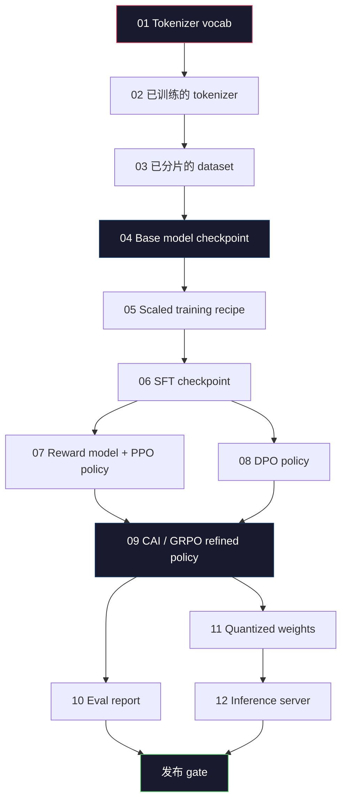
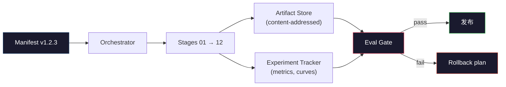

# Construir un oleoducto completo de LLM

> Las lecciones 01 a 12 contienen todo, son una fase de la misma línea de conducción. La principal es transformar estas fases en un guión de ejecución de un extremo a otro:tokenize, pre-train, escala, SFT, align, evaluar, cuantizar, servir.

**Type:** Build
**Languages:** Python (stdlib)
**Prerequisites:** All Phase 10 lessons 01-12
**Time:** ~120 minutes

## El objetivo del aprendizaje
- Se trata de un proyecto de investigación que se desarrolla en el ámbito de la tecnología y de la tecnología.
- definición de los contratos de artefactos entre cada etapa: cada etapa consume lo que produce, y la siguiente etapa cómo verificar la entrada
- Construir un orquestrador, para seguir experiencias  realizar hashes de artefactos, y basarse en los umbrales de evaluación decidir si se aprueba la puerta de publicación
- Diseñar un plan de retroceso: qué artefactos volver a construir cuestan menos, cuáles cuestan más y qué un punto de control dañado traerá un costo.

##  problemas
Previo curso Cada clase puede trabajar de forma independiente. Tokenizer 已训练完成──Tiny GPT 已完成预训练──SFT Dataset 已组装──Reward Model 已训练──DPO 已运行──Evalos 已测量──Quantificados pesos 已导出──Inferencia servidor 已启动──Cada uno de los elementos es un portátil──Cada uno tiene su propio modo de determinar、 su propio modo de emitir、 su propia semilla──

La carrera de entrenamiento fronterizo no es un portátil. Llama 3 405B aproximadamente consumió 30 millones de horas H100, duró aproximadamente 54 天──DeepSeek-V3 utilizó aproximadamente 2,8 millones de horas H800──En este período, un punto de control de deterioro, una contaminación de datos, una regresión de evaluación, todo podría hacer que el equipo pierda un reloj de pared y un presupuesto de GPU de un mes──El equipo depende de la higiene del tubo de vida: cada etapa tiene una entrada, una salida, un manifiesto, un hash y una puerta de entrada definidos─

Es la piedra angular. No se ejecutará todo el pipeline de un ordenador de ordenador. Se redactará el coordinador de cada etapa, describirá el manifiesto de la operación, decidirá la publicación de la puerta de verificación y permitirá a terceros volver a ejecutar su trabajo desde un solo documento.

Este modelo de parámetros de 100M a 1T no cambia. Los mismos cuatro componentes - manifestador, orquestrador, puerta de emergencia, tienda de artefactos - ya pueden funcionar en Llama 3, también pueden funcionar en el GPT residual. La diferencia es en la dimensión de cada fase de configuración, no en la forma de la tubería.

## 概念
### Las doce etapas

Cada uno de los capítulos de la Fase 10 es un grafo de dependencia completo.



阶段 07 和 08 pueden并行运行── todas las demás fases son de dura dependencia──阶段 02(tokenizer) de cambios hará que todos los artefactos de abajo游 失效──阶段 10(eval) de cambios sólo hará que la decisión de publicación sea ineffectiva──

### El Manifiesto

El manifesto es un único documento, que debe ser completo para que la descripción de una operación sea reproducida. Todo el contenido que se produzca en la línea de tuberías no debe depender del estado externo del manifesto.

```
pipeline_version: 1.2.3
seed: 42
git_commit: a1b2c3d4
stages:
  01_tokenizer:
    recipe: bpe_32k
    input_hash: sha256:...
    output_hash: sha256:...
    wall_clock_sec: 3600
    cost_usd: 12
```

阶段 N's output hash 就是阶段 N+1's input hash── siempre y cuando haya algún desvio, la tubería se detendrá── ése es el modo en que descubres la corrupción de datos tan pronto como puedas── ése es el modo en que los compañeros de equipo de diferentes continentes comprueban si su repetición ha producido el mismo artefacto que tú──

En la práctica, el equipo usará un pequeño esquema YAML, además de un checker manifest, para hacer diferencias en la operación exitosa de la última vez.

### Tipografía de artefactos

Cada etapa de salida es un artefacto tipado. No es una mancha de catálogo, no es un pickle, sino un tipo de nombre con un esquema conocido.

| Stage | Artifact Type | Key Fields |
|-------|--------------|-----------|
| 01-02 | Tokenizer | vocab.json, merges.txt, config.json, hash |
| 03 | Dataset | shards[], row count, token count, dedup stats |
| 04-05 | Checkpoint | weights.safetensors, config.json, optimizer state, step count |
| 06 | SFT Model | checkpoint + SFT recipe + data mix |
| 07 | Reward Model | RM checkpoint + preference data hash |
| 08-09 | Policy | checkpoint + reference hash + beta + KL budget consumed |
| 10 | Eval Report | benchmark scores + regression diffs + eval data hash |
| 11 | Quantized Model | quantized weights + calibration data + accuracy delta vs FP16 |
| 12 | Server Spec | endpoint + model hash + config + observability hooks |

Tipografía 能 prevenir el modo de falla más común:把阶段 08 的输出当成阶段 06 的输入, a través de SFT 路径发布一个DPO 训练过的模型――Typed artefacts和 typed stage signatures 会让这些错误变成编译时失败,而不是第五天才发现的失败――

### La puerta de Eval

发布不是培训完成──发布是培训完成和评估门通过──Gate 在运行开始前就定义好──

```
gates:
  mmlu:      >= baseline + 0.5   # 无 regression
  humaneval: >= baseline + 1.0
  truthfulqa: >= baseline         # 无下降
  safety_refusal_rate: <= 0.05
  kl_from_reference: <= 25.0
  cost_total_usd: <= 50000
```

Cada puerta es un umbral numérico. No hay un buen número de puertas. No hay un signo de diseño. Si todas las puertas pasan, el artefacto será marcado como enviable. Si cualquier puerta fracasa, esta operación se detendrá.

两个门 能抓住大多数灾难──*Regression* gate(new模型在核心基准上必须至少和之前一样好) 能抓住培训 bugs──*KL budget* gate(aligned policy 偏离参考程度不能超过 X) 能抓住对齐 过度加工──每一个生产管道都同时拥有这两者──

### El Orquestrador

Este es un pequeño código, leer manifestos, fases de envío, rastrear artefactos y cualquier violación de contrato, para parar. Esto no es Airflow.

La responsabilidad del orquestrador es muy limitada:

1. Desde el manifiesto 解析 DAG。
2. Para cada etapa, el chequeo de espera de salida se realiza en forma correcta.
3. 运行该阶段, capture stdout/stderr, medidas del reloj de pared 和 cost──
4. 根据下游阶段预期的输入哈希 验证输出哈希──
5. 失败时,写入包含精确失败阶段的部分宣言,并以非零状态退出──

Es de 200 grados de Python. Parece que está en la clase.`code/main.py`文件──底层真实管道 会使用 `torchrun`O `ray`En los grupos, ejecutar cada etapa, pero el orquestrador en sí mismo se ejecuta en un solo equipo.

### Experimento de seguimiento y almacenamiento de artefactos

Dos sistemas externos que se ejecutan en el sistema de tuberías.

**Experiment tracker (wandb, neptune, mlflow).**按阶段记录损失曲线,eval metrics,system telemetry──当你三周后需要比较运行 A 和运行 B 时,tracker就是你查看的地方──团队几乎总是使用主机追踪器--自写会浪费本应用于训练的时间──

**Artifact store (S3, R2, GCS).**Used for checkpoints, datasets, tokenizers, eval reports of immutable object store──Artifacts 通过 hash 寻址,而不是 通过文件名──像 `latest.pt`Este nombre de archivo es el arma de pies;`ckpt-7b-step-20000-sha256:abc123.safetensors`Sólo es un contrato.

Orquestación 会同时写入二者──Tracker 面向看图片 的人──Artifact store 面向需要查找输入的下一个阶段──

### Costo

La ejecución fronteriza está ligada a un número de dólares.

**Pre-run estimate.**Desde el manifiesto  calcular los FLOPs esperados  pre-entrenamiento: 6 x parámetros x tokens)  horas de GPU esperadas  FLOPs / rendimiento máximo / utilización), así como según la tasa de alquiler actual  calcular el costo en dólares― Si la estimación  supera la puerta de presupuesto, la tubería 会拒启──

**In-run tracking.** Cada etapa de un reloj de pared y el costo se registrará hasta el manifiesto Después de cada etapa, todo el mundo revisará el presupuesto restante Si en una etapa superpago, la puerta de la siguiente etapa utilizará el nuevo presupuesto restante para evaluar Usted no esperará hasta que VC 打电话当才发现钱已经用完了

El coste del informe de Llama 3 es$61M。DeepSeek-V3 报告 main pre-training run 为 $5.6M. La proporción proviene principalmente de la eficiencia del hardware y de la mezcla de expertos, pero el costo concreto es visible porque los dos equipos siguen por etapa, no solo por la ejecución completa.

### Reproducibilidad vs. Determinismo

Dos personas diferentes. *Reproducible* significa el mismo manifiesto, el mismo código y la misma infraestructura, generará un punto de control en las métricas de aguas abajo de precios superiores.

现代 LLM training es reproducible, pero no determinista. La formación distribuida de reducción de orden, no-determinismo del kernel de GPU (cuBLAS, flash-attn) y redondeo de precisión mixta, se producen en conjunto entre 1e-5 y diferentes floats de la dimensión.



### Plan de retroceso

En el comienzo de la operación, escribe lo que ocurrirá cuando cada etapa fracase.

- **重新运行成本低**(horas):tokenizer、eval、cuantización、servidor de inferencia。 directa重新运行。
- **中等成本**(días):SFT、DPO、CAI──reservar el modelo base; sólo volver a implementar las etapas de alineación―
- **成本高**(semanas y millones de dólares):pre-entrenamiento. El plan de retroceso de este no es una re-excursión.

Debido a que las dependencias de etapa se mecanografian y se hashan, el orquestrador puede calcular automáticamente el conjunto de rollback: make failure阶段 y todos sus descendientes 失效.阶段 06(SFT) failure will make 06、07、08、09、10、11、12 失效.阶段 11(quantización) failure will only make 11 和 12 失效.

### Recipe de producción observado en 2026

La mayoría de los equipos de la frontera han recibido el mismo esqueleto.

- Tokenizer:128k BPE con fallback de byte.
- Pre-entrenamiento: 10-20T tokens, principalmente por web 加 code 加 sintético 组成──Muon o AdamW optimizador──FSDP2 o DeepSpeed ZeRO-3──Gradiente controlponente──BF16 pesos,FP32 maestro──
- SFT:500k-2M pares de instrucciones, mixtos humanos y sintéticos,并严格对 eval set做 dedup──
- Alineación: DPO o CAI + GRPO― sólo en la señal de preferencia para DPO para medir el exceso de tiempo que se utiliza RLHF―
- Eval:MMLU-Pro、MATH、HumanEval+、GPQA、SWE-Bench Verificado、LiveBench, además de un conjunto público 永远看不到的私人持有
- Cuantización:servicio Utilizaciones de 4 bits GPTQ o AWQ;acurate deltas importantes evaluaciones de seguridad Utilizaciones de 8 bits。
- Servicio: vLLM、TensorRT-LLM o interno。Partido continuo。Descifrado especulativo。Evicción de caché KV。

El número cada seis meses cambia. El esqueleto no cambia.


```figure
beam-search
```

## Construirlo
Este código es el orquesta y el chequeo de manifiesto, en lugar de 12 guiones de entrenamiento. Cada etapa es con un marcador de lugar.

完整实现见 `code/main.py`❖ La clave:

- `Manifest`Dataclass: versión de la tubería, semilla, comit, etapas, puertas.
- `Stage`Dataclass:nombre,tipo,ingresos,hashes,salida,hashes, relojes de pared, costes,
- `Orchestrator.run()`: resolver DAG, fases de envío, hachas de verificación, actualización de manifiesto.
- `EvalGate.check()`:读取 thresholds、与最新评估报告比较、回归通过/失败──
- `ArtifactStore`(en memoria): según hash put/get,模拟 S3。
- `CostTracker`El coste acumulado y de cada fase, excediendo el límite de tiempo de detención.

`main.py`El tubo central se ejecutará en 12 etapas de lugar, generará un manifiesto, y mostrará una puerta de evaluación fallida, para mostrar el estilo de ejecución realizada.

## Usalo
El flujo de trabajo canónico tiene tres órdenes.

```
python code/main.py plan    # 验证 manifest，计算 cost estimate，打印 DAG
python code/main.py run     # 执行 stages，写入 manifest.out.yaml
python code/main.py gate    # 读取 manifest.out.yaml，应用 eval gates，ship-or-hold
```

Cada vez que lo hace .`plan`◊ La mayoría de los errores de tuberías 会在 planear tiempo 出現 -- 缺失门门, hashes estable, sobrepasos presupuestarios, 运行`plan`Es gratis.`run`Es muy caro. Por el lado barato, atrapar a los insectos para ahorrar dinero.

`gate`de la salida es`SHIP`¿ Qué es eso ?`HOLD: <reason>`❖ Se ejecutó no es un fracaso; es un punto de decisión― ❖ Reviewers ❖ Override (en inglés) ❖ Override (en inglés) 会被记录), ❖ ❖ ❖ ❖ ❖ ❖ ❖ ❖ ❖ ❖ ❖ ❖ ❖ ❖ ❖ ❖ ❖ ❖ ❖ ❖ ❖ ❖ ❖ ❖ ❖ ❖ ❖ ❖ ❖ ❖ ❖ ❖ ❖ ❖ ❖ ❖ ❖ ❖ ❖ ❖ ❖ ❖ ❖ ❖ ❖ ❖ ❖ ❖ ❖ ❖ ❖ ❖ ❖ ❖ ❖ ❖ ❖ ❖ ❖ ❖ ❖ ❖ ❖ ❖ ❖ ❖ ❖ ❖ ❖ ❖ ❖ ❖ ❖ ❖ ❖ ❖ ❖ ❖ ❖ ❖ ❖ ❖ ❖ ❖ ❖ ❖ ❖ ❖ ❖ ❖ ❖ ❖ ❖ ❖ ❖ ❖ ❖ ❖ ❖ ❖ ❖ ❖ ❖ ❖ ❖ ❖ ❖ ❖ ❖ ❖ ❖ ❖ ❖ ❖ ❖ ❖ ❖ ❖ ❖ ❖ ❖ ❖ ❖ ❖ ❖ ❖ ❖ ❖ ❖ ❖ ❖ ❖ ❖ ❖ ❖ ❖ ❖ ❖ ❖ ❖ ❖ ❖ ❖ ❖ ❖ ❖ ❖ ❖ ❖ ❖ ❖ ❖ ❖ ❖ ❖ ❖ ❖ ❖ ❖ ❖ ❖ ❖ ❖ ❖ ❖ ❖ ❖ ❖ ❖ ❖ ❖ ❖ ❖ ❖ ❖ ❖ ❖ ❖ ❖ ❖ ❖ ❖ ❖ ❖ ❖ ❖ ❖ ❖ ❖ ❖ ❖ ❖ ❖ ❖ ❖ ❖ ❖ ❖ ❖ ❖ ❖ ❖ ❖ ❖ ❖ ❖ ❖ ❖ ❖ ❖ ❖ ❖ ❖ ❖ ❖

##  entregarlo
本课会产出                                                                                                                                                                                                                                                                                                                                                                                                                                                                                                                         `outputs/skill-llm-pipeline-reviewer.md` Si se le da un manifiesto de tubería propuesto, se comprueba todos los contratos: fase de tipografía, cadena de hash, puertas, plan de retroceso, estimación de costes.

##  ejercicios
1. 扩展乐团员,让它支持阶段 07 和 08 的并行执行──使用 stdlib `concurrent.futures`El módulo ██ confirma el manifiesto final ██ registra las salidas de dos etapas, y el hash de entrada de la etapa 09 ███████████████████████████████████████████████████████████████████████████████████████████████████████████████████████████████████████████████████████████████████████████████████████████████████████████████████████████████████████████████████████████████████████████████████████████████████████████████████████████████████████████████████████████████████████████████████████████████████████████████████████████████████████████████████████████████████████████████████████████

2. 添加一个污染检查门──给定 eval数据集 hash 和训练数据集碎片,计算重叠(exact string match 或13gram match)──Si la sobreposición 超过 0.1%,gate 失败──进入一个被污染的训练集,并确认门将保持这个次运行──

3. Desde los primeros principios  realizar una estimación de costos ∙∙ para la fase 04  pre-entrenamiento),  FLOPs  estimar  6 x parámetros x tokens, suposición H100  BF16  989 TFLOPs, MFU  FLOPs de modelo  Utilización)  40%, precio  2,50$/GPU-hora ∙ report a                                                                                                                                                                                                               

4. 构建部分滚倒――模拟阶段 09(CAI) fracaso, luego en conservación 01-08 caché en caso de re-cargar 阶段 09 hasta 12──Orchestrator 应通过哈希检查 检查缓存文物并跳过它们──测量与完整重新运行相比省的墙-钟──

5. 添加可观看性──发发发 OpenTelemetry spans, for each phase, attributes including parameters、tokens seen、loss 和 cost──将 spans 管道传到本地收集器──重点不是仪表板;重点是每个阶段的健康 都能通过单个追踪ID 追踪──

## 关键术语: "El hombre es un hombre"
| Term | What people say | What it actually means |
|------|----------------|----------------------|
| Manifest | “recipe file” | 描述 pipeline version、seed、per-stage config 和 gate thresholds 的 YAML 或 JSON，足以 replay 一次 run |
| Content-addressed | “按 hash 而不是 name” | Artifacts 按其内容的 SHA-256 存储，因此你永远不会把 version A 和 version B 混淆 |
| Eval gate | “发布标准” | Benchmark metrics 和 safety scores 上的 numeric thresholds，必须通过后 artifact 才会被标记为 shippable |
| KL budget | “alignment drifted 有多远” | 对 alignment stages 上累计 KL(policy || reference) 的 cap，并作为 gate 强制执行 |
| MFU | “你用了多少 GPU” | Model FLOPs Utilization，即 achieved FLOPs 除以 theoretical peak。70B scale 典型值为 40%，7B 为 55% |
| Rollback plan | “出问题时我们做什么” | 每个阶段失败时预先写好的 actions：re-run、fall back、使用修订后的 inputs retrain |
| Orchestrator | “conductor” | 读取 manifest、dispatch stages、验证 hashes，并在任何 contract violation 时停止的 process |
| Artifact store | “用于 weights 的 versioned S3” | Immutable content-addressed object store，是 checkpoints、datasets、eval reports 的 single source of truth |
| Reproducible | “Replay 时 metrics 相同” | Bit-level weights 不同但 downstream metrics 等价，这是 distributed LLM training 的现实目标 |
| Cost gate | “不能超过 X” | Pre-run cost estimate 加 in-run tracker；如果 estimate 超过 budget，pipeline 会拒绝启动 |

## 延伸阅读
- [Dubey et al., 2024 -- "The Llama 3 Herd of Models"](https://arxiv.org/abs/2407.21783)- la mayor información disponible sobre la línea de tuberías fronterizas, que incluye datos, formación, alineación,
- [DeepSeek-AI, 2024 -- "DeepSeek-V3 Technical Report"](https://arxiv.org/abs/2412.19437)-- en el proceso de formación de la clase Llama 3 en el sector de la eficiencia, el coste es aproximadamente 1/10
- [Kaplan et al., 2020 -- "Scaling Laws for Neural Language Models"](https://arxiv.org/abs/2001.08361)-- la relación inicial de escalación de parámetros de datos-computación
- [Hoffmann et al., 2022 -- "Training Compute-Optimal Large Language Models (Chinchilla)"](https://arxiv.org/abs/2203.15556)-- para la modificación de Kaplan, re-clasificar los presupuestos de datos modernos
- [PyTorch FSDP2 documentation](https://pytorch.org/docs/stable/fsdp.html)-- en PyTorch 2.4+ 中替代 FSDP1 de formación distribuida primitiva
- [Weights & Biases LLM Reports](https://wandb.ai/site/llms)-- Open-source LLM ejecuta de manifiestos reales y experimentos de seguimiento de salida, como modelos de préstamo
