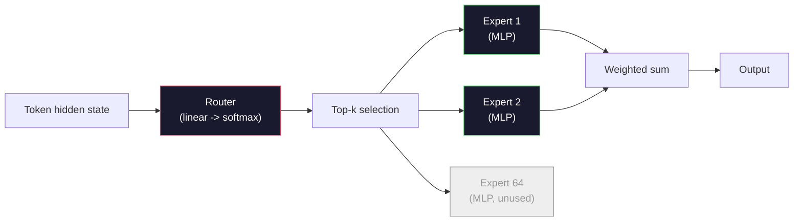

# Modelos abiertos: 架构讲解

> Usted en la cuarta clase   desde cero construido un GPT-2 Small──2026 años de vanguardia de modelos abiertos  pertenecen a la misma familia, sólo hay cinco o seis cambios específicos──utilizar RMSNorm 取代LayerNorm──utilizar SwiGLU 取代GELU──utilizar RoPE 取代学 position──utilizar GQA o MLA 取代完整MHA──utilizar una amplia gama de MHA──utilizar Mixture-of-Experts──ya tienes dominio de las matemáticas que cubren el 95% de ellas──本会并排阅读Llama 3、DeepSeek-V3、Mixtral、Qwen 和 Gemma,并指出每一个结构发生分歧的确切位置──

**Type:** Learn
**Languages:** Python (stdlib)
**Prerequisites:** Phase 10, Lessons 04, 05, 12 (Pre-training, Scaling, Inference)
**Time:** ~45 minutes

## El objetivo del aprendizaje
- 阅读 Llama 3、Mistral、Mixtral、Gemma 2、Qwen 2.5 和 DeepSeek-V3 的 config.json,并解释每一个字段
- Explicar cada modelo en relación con GPT-2 pequeños cambios en la estructura concreta hechos, y de la primera naturaleza
- basado en la configuración  calcular el modelo abierto arbitrario ∞ KV cache ∞
- En un tiempo determinado de latencia, memoria y capacidad, para la implementación de objetivos elegir el modelo abierto adecuado

##  problemas
En la cuarta clase, escribiste 350 líneas de numpy, obtuviste un modelo de forma GPT-2 ⋅ Llama 3 405B tiene un informe técnico de 200 páginas⋅ Tu intuición podría pensar que son especies diferentes⋅ En realidad no es así─ esas 200 páginas describen el mismo objeto, simplemente hay cinco o seis movimientos modificados, además de detalles de gran cantidad de implementación sobre la escalación── estructura no cambia:embedding、transformer bloquesattention、MLP、normhead、──

Este curso es diferente. Para cada modelo abierto principal, la familia, vamos a identificarlo en relación con GPT-2 改了什么,为什么改,代价是什么. Después de terminar, puedes leer una nueva tarjeta de modelo y traducirla en la línea de base de GPT-2.

 Recaudación real es: cuando Meta lanza Llama 5, o DeepSeek lanza V4, no necesitas un nuevo modelo mental.

## 概念
### El núcleo invariable

Todos los modelos abiertos autoregresivos están compartidos:

- Señales de incorporación Matriz ((vocab_size x hidden_dim) 』
- N 个 decodificador bloques de la composición:norma, auto-atención, residual, norma, MLP, residual
- La norma final 和投影到 vocab_size 的直线头 (normalmente con los embebidos ligados por el peso) ⋅
- Máscara causal, pérdida de entropía cruzada de signos siguientes.

Éste es el tipo de forma.

### Hay 6 botones que funcionan.

En todos los modelos abiertos de vanguardia de 2024-2026, también aparecen seis opciones de diseño:

1. **Normalization.**LayerNorm -> RMSNorm。
2. **Positional encoding.**Aprendió absoluto -> RoPE(加上变体:YaRN、NTK)
3. **Activation.**GELU -> SwiGLU(or GeGLU)
4. **Attention head sharing.**MHA -> GQA -> MQA -> MLA。
5. **Dense vs sparse MLP.**Densa -> Mezcla de expertos。
6. **Pre-norm placement.**保持 Pre-norma―Post-norma 已消失―

其他一切(hora de aprendizaje, mezcla de datos, tamaño de lote, longitud de contexto) pertenecen a la configuración de entrenamiento, y no a la estructura.

### Nodo 1: RMSNorm

LayerNorm se reduce en el promedio de valores, se reduce en el promedio de valores, se reduce en el promedio de valores, se reduce en el promedio de valores, se reduce en el promedio de valores, se reduce en el promedio de valores, se reduce en el promedio de valores, se reduce en el promedio de valores, se reduce en el promedio de valores, se reduce en el promedio de valores, se reduce en el promedio de valores, se reduce en el promedio de valores, se reduce en el promedio de valores, se reduce en el promedio de valores, se reduce en el promedio de valores, se reduce en el promedio de valores, se reduce en el promedio de los promedio de valores, se reduce en el promedio de los promedio de los promedios de los promedios de la norma:

```
RMSNorm(x) = x / sqrt(mean(x^2) + eps) * gamma
```

没有均值消除──没有偏见──每个代币少一次 matmul──Zhang and Sennrich (2019) 认为它在机器翻译上可以匹配LayerNorm,同时快 10%──所有现代开放模型都使用它──

代价:没有──收益:小幅吞吐量 提升,代码更简单──

### Nudo 2: RoPE

Embedings de posición aprendidas en GPT-2 en un 1024 槽位的搜找表.

RoPE, Su et al. 2021) a través de un producto de punto de atención, se ejecutará cada VECTOR Q y K en función de la dimensión de la rotación para inyectar la posición.

```
q_rotated = rotate(q, angle(pos))
k_rotated = rotate(k, angle(pos))
score = q_rotated . k_rotated
```

Cada Llama, Mistral, Quwen, DeepSeek y Gemma usan RoPE.

### Noto 3: SwiGLU

La MLP de GPT-2 es`x -> gelu(xW1 + b1) -> (...)W2 + b2`──SwiGLU(Shazeer 2020) con producto cerrado  sustitución de activación:

```
SwiGLU(x) = (xW1) * sigmoid(xW1) * xV
```

两个并行投射, en lugar de una, por activación de Swish 进行 gate。实证上, it in per parameter perplexity 上更强。Llama 2 采用它,随后大家都跟进──MLP 隐藏尺寸通常会设置让总参数匹配原始密集 MLP:如果 GPT-2 使用 `ff_dim = 4 * hidden`,SwiGLU `ff_dim = (2/3) * 4 * hidden = 8/3 * hidden`¿Qué es eso?

### Nudo 4: Cuidado compartido

GPT-2 使用 **Multi-Head Attention (MHA)**Cada cabeza tiene su propia proyección Q 、K 、V.

**Multi-Query Attention (MQA, Shazeer 2019)**En todos los cabezas  compartiendo una K y una V ⋅ se reducirá el caché KV  según el número de cabezas                                                                                                                                                                                                                                                                                                                                                                                                                                                                                                

**Grouped-Query Attention (GQA, Ainslie et al. 2023)**Es el medio de la solución: G 组 Q heads 共享一个 K 和一个 V。Llama 3 8B 使用 GQA, contiene 32 个 Q heads 和 8 个 KV heads(G=8), por lo que相比较完整MHA,KV cache 缩小4x。

**Multi-Head Latent Attention (MLA, DeepSeek 2024)**Cumplir K y V                                                                                                                                                                                                                                                                                                                                                                                                                                                                                                                        

| Scheme | KV Heads | KV Cache | Accuracy |
|--------|----------|----------|----------|
| MHA    | num_heads | full | 最好 |
| GQA    | num_groups (G < num_heads) | num_heads / G 缩减 | 接近 MHA |
| MQA    | 1 | num_heads 缩减 | 小幅损失 |
| MLA    | latent, per-head decompression | 小于 MQA | 接近 MHA |

 Para cualquier modelo de más de 13B parámetros, GQA o MLA  en realidad son necesarios  MHA a gran escala completa causaría caché KV  catástrofe 

### Nudo 5: Mezcla de expertos

MLP denso se ejecuta para cada token  activar todos los parámetros。 MoE MLP en cada bloque hay K 个 expertos, así como un router, se ejecuta para cada token  seleccionar los expertos top-k 

```
router_logits = xW_r
indices, weights = top_k(router_logits, k=2)
output = sum_i weights[i] * expert[indices[i]](x)
```

吸引力在于: puedes tener 64 个各自 7B 大小的专家(((por lo tanto, el total de参数 es enorme), pero cada Token sólo se ejecuta 2 个(por lo tanto, el cálculo por token 匹配 denso 7B 模型)  Mixtra 8x7B 总参数 es 47B, pero cada Token sólo activa 13B──DeepSeek-V3 总参数 es 671B, pero cada Token sólo activa 37B──



优点: igual computación 更多参数 更多强容量──缺点:expert memory 仍然必须放在某处所以服务需要比密等价模型更多的VRAM) 路由器的负载平衡很难,而且在调整期间调整路由器 本身就是一个研究领域──

### Nudo 6: Pre-norma permanece

Desde GPT-2, cada modelo abierto lo coloca en cada subcapas * antes*―Pre-norma en entrenamiento en profundidad es más fácil― no hay disputa―

### Diferencias modelo por modelo

En el siguiente cuadro se especifica todo el contenido.

| Model | Year | Total Params | Active Params | Norm | Activation | Position | Attention | MoE | Context |
|-------|------|-------------|---------------|------|-----------|----------|-----------|-----|---------|
| GPT-2 Small | 2019 | 124M | 124M | LayerNorm | GELU | Learned | MHA (12 heads) | no | 1k |
| Llama 3 8B | 2024 | 8B | 8B | RMSNorm | SwiGLU | RoPE | GQA (32/8) | no | 128k |
| Llama 3 70B | 2024 | 70B | 70B | RMSNorm | SwiGLU | RoPE | GQA (64/8) | no | 128k |
| Llama 3 405B | 2024 | 405B | 405B | RMSNorm | SwiGLU | RoPE | GQA (128/16) | no | 128k |
| Mistral 7B | 2023 | 7.2B | 7.2B | RMSNorm | SwiGLU | RoPE | GQA | no | 32k |
| Mixtral 8x7B | 2023 | 47B | 13B | RMSNorm | SwiGLU | RoPE | GQA | yes (8 experts, top-2) | 32k |
| Gemma 2 9B | 2024 | 9B | 9B | RMSNorm (pre+post) | GeGLU | RoPE + sliding | GQA | no | 8k |
| Qwen 2.5 72B | 2024 | 72B | 72B | RMSNorm | SwiGLU | RoPE (YaRN) | GQA (64/8) | no | 128k |
| DeepSeek V2 236B | 2024 | 236B | 21B | RMSNorm | SwiGLU | RoPE | MLA | yes (160 experts, top-6) | 128k |
| DeepSeek V3 | 2024 | 671B | 37B | RMSNorm | SwiGLU | RoPE | MLA | yes (256 experts, top-8) | 128k |

扫描这些列──RMSNorm es común.──SwiGLU o su GeGLU 近亲是通用.──RoPE es común.──7B 以上 GQA es común.

### Leyendo una config.json

Configuración de Llama 3 8B:

```
{
  "hidden_size": 4096,
  "intermediate_size": 14336,
  "num_hidden_layers": 32,
  "num_attention_heads": 32,
  "num_key_value_heads": 8,
  "max_position_embeddings": 131072,
  "rope_theta": 500000.0,
  "rms_norm_eps": 1e-5,
  "vocab_size": 128256
}
```

Cada pasaje está a la altura de lo que ya has logrado.

- `hidden_size`: dimensiones de incorporación.
- `intermediate_size`: MLP tamaño oculto(3.5x oculto -- SwiGLU 数学) 』
- `num_hidden_layers`: profundidad de pila.
- `num_attention_heads`: cabezas de Q
- `num_key_value_heads`: cabezas de KV (GQA)
- `max_position_embeddings`La duración del contexto de la formación:
- `rope_theta`: Frecuencia base de RoPE──Meta la ampliará desde la escala de 10k hasta 500k, para la extrapolación de contexto largo──
- `rms_norm_eps`: estabilidad numérica。
- `vocab_size`: fichas

 Con estos, puedes calcular la cantidad total de parametros  KV cache y memoria de activación de valor máximo `code/main.py`¿Qué es eso?

### Presupuesto de memoria de activación

En más de varios billones de parámetros, las activaciones se dirigen a la memoria de entrenamiento.

```
activation_mem ~ batch_size * seq_len * hidden_size * num_layers * bytes_per_element
```

对于Llama 3 8B,在批 1、seq 8192、BF16、32层、隐藏 4096 时:仅激活就约需要8GB(使用检查点),不使用则约40GB──这就是闪光注意和环环注意 重要原因:它们重写注意计算,让激活能够放下──

### Presupuesto de KV Cache

对于最大的背景下的推论:

```
kv_cache = 2 * num_layers * num_kv_heads * head_dim * max_seq_len * bytes_per_element
```

Llama 3 8B en el contexto 128k ЅF16 Ѕhead_dim = oculto / num_heads = 128 时:
`2 * 32 * 8 * 128 * 131072 * 2 = 17.2 GB`Cada secuencia.

Los pesos de 8B en BF16 son de 16 GB. El caché KV de una sola secuencia de 128 k es mayor que los pesos. Esto es lo que impulsa la cuantificación de la memoria de GQA, MLA y KV.

### Cuando cada modelo gana

- **单张 80GB GPU，无 MoE**Llama 3 8B、Mistral 7B、Gemma 2 9B── fácil de servir, herramienta 广泛──
- **单节点（8x80GB），大 capacity**Llama 3 70B、Qwen 2.5 72B― la capacidad de apertura más densa―
- **最大的 open capability，可接受 MoE 复杂度**: Profundo Buscar V3、Mixtral 8x22B― cada capacidad activa de FLOP― 最佳―
- **Long-context 需求**El objetivo de la investigación es mejorar la calidad de la información y la calidad de la información.
- **Low-latency serving**:Gemma 2 9B(ventana deslizante 降低 computación de contexto largo)


```figure
rmsnorm-vs-layernorm
```

## Construirlo
El código de este curso es un calculador. Dado que config.json se imprime según el componente de distribución de parámetros en el contexto máximo, el caché KV, la relación de MLP de SwiftLU, así como un breve juicio sobre la estructura.

```python
config = {
    "hidden_size": 4096, "intermediate_size": 14336,
    "num_hidden_layers": 32, "num_attention_heads": 32,
    "num_key_value_heads": 8, "vocab_size": 128256,
    "max_position_embeddings": 131072,
}
```

脚本会逐字段遍历架构,计算嵌入,注意, GQA reducción, MLP expansión, SwiGLU expansión, y la norma de capas y los parámetros de la cabeza.

实现见 `code/main.py`¿Qué es eso?

## Usalo
运行计算器, usando el script de Llama 3 8B、Mistral 7B、Mixtral 8x7B 和 DeepSeek V3 configuraciones。 Compare los parámetros desglosados。 note la suma de los modelos MoE de parámetros es muy densa, pero el número de parámetros activos es más pequeño。 note el cache KV de DeepSeek V3 虽然总参数更多,但小于 Llama 3 405B de KV cache −这是 MLA 的效果──

Luego inserta la configuración de tu modelo local, lee el resumen y decide si es adecuado para tu GPU.

##  entregarlo
本课会生成                                                                                                                                                                                                                                                                                                                                                                                                                                                                                                                          `outputs/skill-open-model-picker.md` Establecer un objetivo de implementación (GPU tipo, VRAM, longitud de contexto, presupuesto de latencia) y una tarea (Chat, código, razonamiento, largo contexto), que se propone un modelo abierto, esquema de cuantificación en la clase 11, así como la pila de inferencias en la clase 12, y explican claramente las seis teorías relacionadas con la estructura.

##  ejercicios
1. Desde HuggingFace 阅读 Qwen 2.5 72B config.

2. DeepSeek V3 utiliza 256 expertos,并 adopta routing top-8 expertos activados en cálculo y proporción de expertos totales,并 compara con 8 de los top-2 de Mixtral 8x7B.

3. 计算 Llama 3 405B en un contexto de 128k 下使用FP8 和 BF16 时的 KV cache──FP8 es la mitad del valor de BF16 ⋅在单个8xH100 节点上(每张 80GB = 总计 640GB,减重内存), ¿podrás servir varias secuencias paralelas?

4. Gemma 2 交替使用全注意 和滑鼠窗户注意层──当一半层 使用4096-token滑鼠窗户而不是 full context 时,写出 KV cache 的数学公式──在 8k total context 下能节省多少内存?

5.  encontrar un modelo abierto de vanguardia de reciente período publicado después de la finalización de este curso―identificar cuál de los seis giros ha elegido, y si ha introducido el séptimo giros― el curso se manifestó en el momento en que se publicó la nueva estructura―  el objetivo es actualizar tu plantilla bajo el supuesto de no reconstruir el modelo intelectual―

## 关键术语: "El hombre es un hombre"
| Term | What people say | What it actually means |
|------|----------------|----------------------|
| RMSNorm | “没有均值的 LayerNorm” | 只按 root mean square 进行 normalize，并使用 learned scale -- 更便宜且可与 LayerNorm 相比 |
| RoPE | “Rotary positions” | 将每个 Q 和 K Vector 按 2D pairs 旋转，角度取决于 position -- 结合 scaling 技巧可外推到训练长度之外 |
| SwiGLU | “新的 MLP activation” | 带 Swish 的 gated linear unit：`(xW1) * sigmoid(xW1) * xV` -- 是每个 2024+ open model 的标准配置 |
| GQA | “中间路线 attention” | Grouped-Query Attention：G 组 Q heads 共享一个 K 和一个 V head -- 在避免 MQA accuracy 损失的同时缩小 KV cache |
| MLA | “DeepSeek 的 attention” | Multi-Head Latent Attention：将 K/V 压缩到共享 low-rank latent，再按 head 解压 -- 大模型中最小的 KV cache |
| MoE | “Sparse experts” | Mixture of Experts：每个 block 有 N 个 MLPs，router 为每个 Token 选择 top-k -- 巨大的 total params，较小的 active params |
| Top-k routing | “每个 Token 选择 k 个 experts” | Router 为每个 expert 计算分数，并激活最高的 k 个 -- 典型 k 从 2（Mixtral）到 8（DeepSeek） |
| YaRN | “拉伸 RoPE” | Yet another RoPE extension -- 通过插值 rotary angles，在 inference 时将 context 从 8k 扩展到 128k+ |
| Sliding-window attention | “不要 attend to everything” | 每个 Token 只 attend 到最近 W 个 Tokens -- 将 attention cost 限制为每 Token O(W)，用于 Gemma 2 和早期 Mistral |
| Active params | “每个 Token 实际运行的部分” | 对于 MoE models，指每个 Token 会经历 forward pass 的参数量（远小于 total params）-- 决定 per-token FLOPs |

## 延伸阅读
- [Dubey et al., 2024 -- "The Llama 3 Herd of Models"](https://arxiv.org/abs/2407.21783)-- densa Llama 3 Familia de la estructura y la formación referencia
- [DeepSeek-AI, 2024 -- "DeepSeek-V3 Technical Report"](https://arxiv.org/abs/2412.19437)-- MLA加 auxiliar sin pérdidas de balance de carga 加 671B MoE
- [Jiang et al., 2024 -- "Mixtral of Experts"](https://arxiv.org/abs/2401.04088)-- 经典 MoE modelo abierto 论文
- [Su et al., 2021 -- "RoFormer: Enhanced Transformer with Rotary Position Embedding"](https://arxiv.org/abs/2104.09864)-- RoPE 论文
- [Shazeer, 2020 -- "GLU Variants Improve Transformer"](https://arxiv.org/abs/2002.05202)-- SwiGLU、GeGLU 及相关方法
- [Ainslie et al., 2023 -- "GQA: Training Generalized Multi-Query Transformer Models"](https://arxiv.org/abs/2305.13245)-- GQA 论文
- [Gemma 2 Team, 2024 -- "Gemma 2: Improving Open Language Models at a Practical Size"](https://arxiv.org/abs/2408.00118)-- híbrido de atención completa+deslizante
- [Qwen Team, 2024 -- "Qwen 2.5 Technical Report"](https://arxiv.org/abs/2412.15115)-- Extensión del contexto de la RNY y recetas de formación en largo contexto
