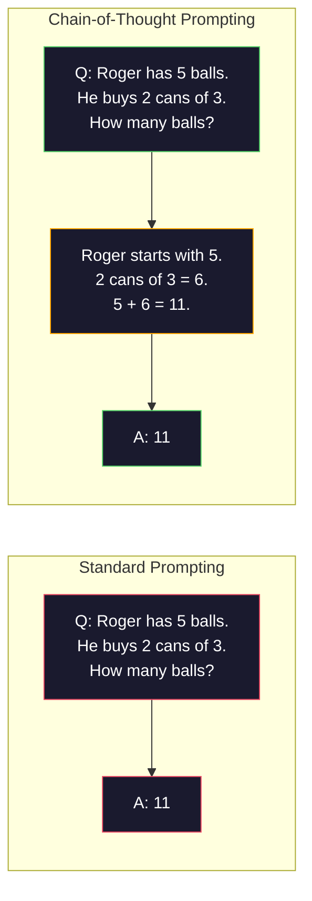
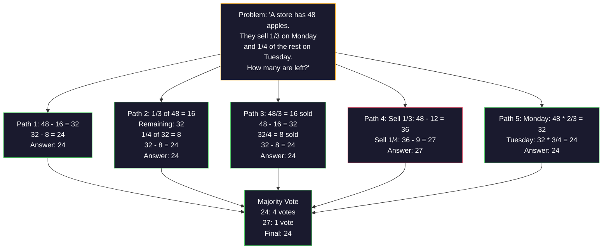
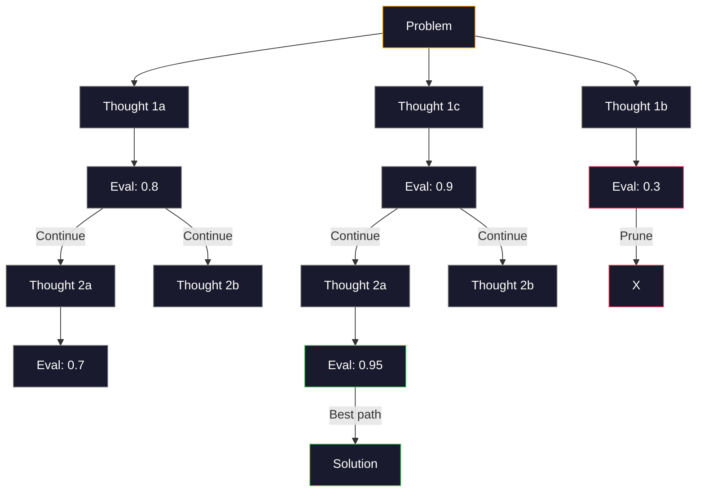

# Pocos disparos, cadena de pensamiento, árbol de pensamiento

> Dime al modelo lo que debe hacer es incitarlo. Muéstrelo cómo pensar es ingeniería. El mismo modelo, la misma tarea, los mismos datos, la diferencia entre el 78% y el 91% de la precisión, no es un mejor modelo, sino una mejor estrategia de raciocinio.

**类型：**Construcción
**语言：**Python
**先修要求：**Lección 11.01 (Ingeniería rápida)
**时间：** 45 minutos

## El objetivo del aprendizaje

-                                                                                                                                                                                                                                                               
-  aplicación de la cadena de pensamiento (CoT)  sugerir, mejorar el número de preguntas de aplicación matemática y otros pasos
- Construir un árbol de pensamiento rápido, explorar muchos métodos y elegir el mejor camino
- En el estándar de referencia, se mide la precisión de la dosis de cero, de pocos, y de la tasa de precisión de la tasa de aumento de la tasa de CTO.

##  problemas

Estás construyendo una aplicación de asesoramiento matemático. Tu mensaje dice: Solve este problema de palabra. En GSM8K este estándar de referencia matemática, GPT-5 tiene un 94% de tiempo de respuesta.

Además de cinco palabras, pensemos paso a paso que la tasa de precisión se eleva al 91%.

Esto no es un hack. Esto es el trabajo de la hipótesis. La humanidad no se centrará en resolver el problema de múltiples pasos. El transformador también no. Cuando se obliga a un modelo a generar un token intermedio, estos tokens se convertirán en el siguiente token.

Pero pensar paso a paso solo comienza, no final. Si se adoptan cinco rutas de la racionalización, entonces se vota la mayoría ¿cómo? Si se permite que el modelo explore un árbol de posibilidades, evaluar y cortar las ramas ¿cómo? Si se entrelazan las racionalizaciones y los instrumentos?

## 核心概念 核心概念 核心概念 核心概念

### Cero-Shot vs Pocos-Shot: ejemplos ¿Cuándo ganó instrucciones

La llamada de tiro cero sólo da al modelo una tarea, además de eso nada nada da. La llamada de tiro pocos dará un ejemplo del modelo.

Wei et al. (2022) en 8 benchmarks han medido este punto. Para tareas simples como emoción, tiro cero y tiro poco, la diferencia de rendimiento es del 2% en el interior. Para tareas complejas como algoritmo y cálculo de símbolos, el porcentaje de precisión de tiro poco puede aumentar del 10 al 25%.

直觉是: ejemplos son instrucciones después de comprimir. Con su descripción de un formato de salida, no se muestra directamente. Con su explicación del proceso de cálculo, no se muestra directamente.


**few-shot 适合的场景：**Los términos específicos en el ámbito de las tareas de forma sensible, de las categorías, de la extracción estructural, así como de cualquier tarea que requiera un modelo que se ajuste a un modelo específico.

**zero-shot 适合的场景：**简单事实问题, 示例会限制创造力创意任务,以及找到好例比写好命令更难的任务――

### Muestras de elección: similar a ganar

No es lo mismo en todos los ejemplos. En ejemplos similares a los de la entrada de objetivos, la selección en las tareas de clasificación es de 5-15% superior a la elección de las tareas de las demás categorías.

1. **语义相似性**:选择 Embedding 空间中最接近输入的示例
2. **标签多样性**: ejemplos para cubrir todas las categorías de salida
3. **难度匹配**• nivel de complejidad del problema de la adaptación

Para la mayoría de las tareas, el número de ejemplos óptimo es de 3-5 ⋅ menos de 3 ⋅ horas, el modelo no tiene un modelo de extracción de señal suficiente ⋅ más de 5 ⋅ horas, los beneficios disminuyen, y los desperdicios de la ventana de contexto Token ⋅ para más etiquetas ⋅ clases, cada etiqueta utiliza un ejemplo ⋅

### La cadena de pensamiento: darle un proyecto de trabajo

La cadena de pensamiento (CoT) impulsada por Google Brain's Wei et al. (2022)  propuesta──idea es simple: no sólo requiere que el modelo dé la respuesta, sino que primero requiere que muestre los pasos que se proponen―



Desde el mecanismo, ¿por qué es esto efectivo?El transformador produce cada token que se convierta en el siguiente token de la siguiente versión. Sin CoT, el modelo debe comprimir todas las teorías en un estado oculto de paso hacia adelante.

**GSM8K benchmark（小学数学，8.5K 道题）：**

| Model | Zero-Shot | Zero-Shot CoT | Few-Shot CoT |
|-------|-----------|---------------|--------------|
| GPT-4o | 78% | 91% | 95% |
| GPT-5 | 94% | 97% | 98% |
| o4-mini (reasoning) | 97% | — | — |
| Claude Opus 4.7 | 93% | 97% | 98% |
| Gemini 3 Pro | 92% | 96% | 98% |
| Llama 4 70B | 80% | 89% | 94% |
| DeepSeek-V3.1 | 89% | 94% | 96% |

**关于 reasoning models 的说明。**Los modelos de OpenAI (o-series) y DeepSeek-R1 (deepseek-r1) se ejecutarán en la cadena de pensamiento de la cadena de pensamiento de la cadena de pensamiento.

La CTP tiene dos formas:

**Zero-shot CoT**En el siguiente post, se muestra la siguiente información:

**Few-shot CoT**El modelo puede ver el formato de la evaluación exacta de sus expectativas.

**CoT 会伤害表现的场景**La velocidad es más importante que la tasa de precisión. Cada consulta aumenta la venta de 50-200 puntos de venta de tokens. Para las tareas de alta capacidad y baja complejidad, esto es un gasto de desperdicio.

### Autoconsistencia: muchas veces, una votación

Wang et al. (2023)  propusieron la autoconsistencia.  El punto central de vista es que los caminos de la CTT pueden contener errores de cálculo.



En el experimento original PaLM 540B, la autoconstancia aumentará la tasa de precisión de GSM8K de 56.5% a 74.4% de N=40 时. En GPT-5 se elevará muy poco.

权衡是:N 个样本意味着N 倍 API 成本和延迟――en la práctica,N=5 能获得大部分收益――N=3 es el valor mínimo de voto significativo――en la mayoría de las tareas,N > 10 收益递减――

### Árbol de pensamiento:分支式探索

Yao et al. (2023) propusieron el Árbol de Pensamiento (ToT) ⋅CoT – a lo largo de una línea de lineal –siderar el camino hacia el progreso, mientras que ToT – exploraría múltiples ramificaciones y evaluaría antes las ramificaciones que tienen más perspectivas ⋅



Tiene tres componentes:

1. **Thought generation**: generar muchos candidatos siguiente paso
2. **State evaluation**Para cada candidato, puede utilizar el LLM como evaluador)
3. **Search algorithm**Por medio de BFS o DFS  través del árbol,并剪枝低分分支

En el juego de 24 tareas, el uso de la GPT-4 para resolver problemas de búsqueda es un problema de 4,0% (porque el espacio de búsqueda es muy amplio).

Para cada uno de los tramos, el tramo de 3 árboles de mayor profundidad requiere 39 tramos de tramos de 3 árboles de mayor profundidad. Solo se puede utilizar en el espacio de búsqueda grande pero evaluable para resolver problemas de diseño.

### Reacción: Pensar + Hacer

Yao et al. (2022) se convertirá en un modelo de trabajo entre el trabajo de trabajo y el trabajo de trabajo.

```mermaid
graph LR
    Q["Question:\nWhat is the\npopulation of the\ncountry where\nthe Eiffel Tower\nis located?"]
    T1["Thought: I need to\nfind which country\nhas the Eiffel Tower"]
    A1["Action: search\n'Eiffel Tower location'"]
    O1["Observation:\nParis, France"]
    T2["Thought: Now I need\nFrance's population"]
    A2["Action: search\n'France population 2024'"]
    O2["Observation:\n68.4 million"]
    T3["Thought: I have\nthe answer"]
    F["Answer:\n68.4 million"]

    Q --> T1 --> A1 --> O1 --> T2 --> A2 --> O2 --> T3 --> F

    style Q fill:#1a1a2e,stroke:#ffa500,color:#fff
    style T1 fill:#1a1a2e,stroke:#51cf66,color:#fff
    style A1 fill:#1a1a2e,stroke:#e94560,color:#fff
    style O1 fill:#1a1a2e,stroke:#808080,color:#fff
    style T2 fill:#1a1a2e,stroke:#51cf66,color:#fff
    style A2 fill:#1a1a2e,stroke:#e94560,color:#fff
    style O2 fill:#1a1a2e,stroke:#808080,color:#fff
    style T3 fill:#1a1a2e,stroke:#51cf66,color:#fff
    style F fill:#1a1a2e,stroke:#51cf66,color:#fff
```



ReAct en tareas de tipo de conocimiento intenso es superior al puro CoT, ya que puede establecer la hipótesis en datos reales. En HotpotQA, el uso de ReAct en GPT-4 alcanza un 35,1% de coincidencia exacta, mientras que el solo CoT es 29,4%.

ReAct es la base de los agentes modernos de IA. Cada marco de agentes (LangChain, CrewAI, AutoGen) realizará algún tipo de ciclo de pensamiento-acción-observación.

### Prompting estructurado:Tags XML, Delimitadores, Cabezas

Con las instrucciones 变复杂, estructura能防止模型混不同部分──三种方法:

**XML tags**(más adecuado para Claude, en todas partes están estable):
```
<context>
You are reviewing a pull request.
The codebase uses TypeScript and React.
</context>

<task>
Review the following diff for bugs, security issues, and style violations.
</task>

<diff>
{diff_content}
</diff>

<output_format>
List each issue with: file, line, severity (critical/warning/info), description.
</output_format>
```

**Markdown headers**(general):
```
## Role
Senior security engineer at a fintech company.

## Task
Analyze this API endpoint for vulnerabilities.

## Input
{api_code}

## Rules
- Focus on OWASP Top 10
- Rate each finding: critical, high, medium, low
- Include remediation steps
```

**Delimiters**(极简但有效):
```
---INPUT---
{user_text}
---END INPUT---

---INSTRUCTIONS---
Summarize the above in 3 bullet points.
---END INSTRUCTIONS---
```

### Enlace rápido:顺序分解

Algunas tareas se realizan en un solo instante y son demasiado complejas.


En cadena 优于单快 有三个原因:

1. **每一步更简单**Modelo: procesar una tarea enfocada, en lugar de contemplar todo al mismo tiempo
2. **中间输出可检查**Puedes verificar y corregir entre pasos
3. **不同步骤可以使用不同模型**: con modelos baratos hacer extracción, con modelos caros hacer recomendaciones

###  Performance en relación con

| Technique | Best For | GSM8K Accuracy (GPT-5) | API Calls | Token Overhead | Complexity |
|-----------|----------|------------------------|-----------|----------------|------------|
| Zero-Shot | 简单任务 | 94% | 1 | 无 | 极低 |
| Few-Shot | 格式匹配 | 96% | 1 | 200-500 tokens | 低 |
| Zero-Shot CoT | 快速推理提升 | 97% | 1 | 50-200 tokens | 极低 |
| Few-Shot CoT | 最高单次调用准确率 | 98% | 1 | 300-600 tokens | 低 |
| Self-Consistency (N=5) | 高风险推理 | 98.5% | 5 | 5x token cost | 中 |
| Reasoning model (o4-mini) | CoT 的直接替代 | 97% | 1 | hidden (2-10x internal) | 极低 |
| Tree-of-Thought | 搜索/规划问题 | N/A (74% on Game of 24) | 10-40+ | 10-40x token cost | 高 |
| ReAct | 基于知识的推理 | N/A (35.1% on HotpotQA) | 3-10+ | 可变 | 高 |
| Prompt Chaining | 复杂多步骤任务 | 96% (pipeline) | 2-5 | 2-5x token cost | 中 |

La exact tecnología depende de tres factores: precisión de la tasa de exigencia, retraso presupuestario y tolerancia de costes. Para la mayoría de los sistemas de producción, el retraso de la autoconsistencia de 3 muestras puede cubrir el 90% de los casos de uso.


```figure
few-shot-curve
```

## Construirlo

Vamos a construir un problema matemático, poner algunos disparos de la pregunta, cadena de pensamiento, la reflexión y la autoconsistencia de voto, formar un pipeline, y luego para los problemas, añadir el árbol de pensamiento.

                                                                                                                                                                                                                                                                                                                                                                                                                                                                                                                             `code/advanced_prompting.py`En el interior... abajo...

### 步骤 1: Ejemplo de pocos disparos

Primero, el componente de gestión de ejemplos de pocos disparos, y el ejemplos más relacionados.

```python
GSM8K_EXAMPLES = [
    {
        "question": "Janet's ducks lay 16 eggs per day. She eats three for breakfast every morning and bakes muffins for her friends every day with four. She sells every egg at the farmers' market for $2. How much does she make every day at the farmers' market?",
        "reasoning": "Janet's ducks lay 16 eggs per day. She eats 3 and bakes 4, using 3 + 4 = 7 eggs. So she has 16 - 7 = 9 eggs left. She sells each for $2, so she makes 9 * 2 = $18 per day.",
        "answer": "18"
    },
    ...
]
```

Cada ejemplo contiene tres partes: problema, cadena de sugerencias y respuesta final.

### 步骤 2: Constructor de Promptos de la cadena de pensamiento

El constructor de preguntas rápidas pondrá el mensaje del sistema, con algunos ejemplos de la cadena de preguntas, así como el objetivo de los problemas en un mensaje rápidos.

```python
def build_cot_prompt(question, examples, num_examples=3):
    system = (
        "You are a math problem solver. "
        "For each problem, show your step-by-step reasoning, "
        "then give the final numerical answer on the last line "
        "in the format: 'The answer is [number]'."
    )

    example_text = ""
    for ex in examples[:num_examples]:
        example_text += f"Q: {ex['question']}\n"
        example_text += f"A: {ex['reasoning']} The answer is {ex['answer']}.\n\n"

    user = f"{example_text}Q: {question}\nA:"
    return system, user
```

格式约束(La respuesta es [número])至关重要──没有它,自连就无法跨样本抽取并比较答案──

### 步骤 3: Votación de autoconsistencia

采样 N 条推理路径,并取多数答案──

```python
def self_consistency_solve(question, examples, client, model, n_samples=5):
    system, user = build_cot_prompt(question, examples)

    answers = []
    reasonings = []
    for _ in range(n_samples):
        response = client.chat.completions.create(
            model=model,
            messages=[
                {"role": "system", "content": system},
                {"role": "user", "content": user}
            ],
            temperature=0.7
        )
        text = response.choices[0].message.content
        reasonings.append(text)
        answer = extract_answer(text)
        if answer is not None:
            answers.append(answer)

    vote_counts = Counter(answers)
    best_answer = vote_counts.most_common(1)[0][0] if vote_counts else None
    confidence = vote_counts[best_answer] / len(answers) if best_answer else 0

    return best_answer, confidence, reasonings, vote_counts
```

La temperatura 0,7 es importante. Cuando la temperatura 0,0 es la misma, todos los modelos se vuelven idénticos, perdiendo así su significado. Necesitas suficiente arbitrariedad para producir diferentes rutas de cálculo, pero no puedes tener la oportunidad de hacer que el modelo salga.

### Paso 4:Solver de árbol de pensamiento

En cuanto a la cuestión del fracaso de la racionalización lineal, se explorará varias formas y se evaluará en qué dirección hay más perspectivas

```python
def tree_of_thought_solve(question, client, model, breadth=3, depth=3):
    thoughts = generate_initial_thoughts(question, client, model, breadth)
    scored = [(t, evaluate_thought(t, question, client, model)) for t in thoughts]
    scored.sort(key=lambda x: x[1], reverse=True)

    for current_depth in range(1, depth):
        next_thoughts = []
        for thought, score in scored[:2]:
            extensions = extend_thought(thought, question, client, model, breadth)
            for ext in extensions:
                ext_score = evaluate_thought(ext, question, client, model)
                next_thoughts.append((ext, ext_score))
        scored = sorted(next_thoughts, key=lambda x: x[1], reverse=True)

    best_thought = scored[0][0] if scored else ""
    return extract_answer(best_thought), best_thought
```

评估器本身也是一次 LLM 调用──你问模型:En una escala de 0.0 a 1.0, ¿qué tan prometedora es esta ruta de razonamiento para resolver el problema?

### Paso 5: Gasoducto completo

El proyecto de desarrollo de la tecnología de la información y de la información

```python
def solve_with_escalation(question, examples, client, model):
    system, user = build_cot_prompt(question, examples)
    single_response = call_llm(client, model, system, user, temperature=0.0)
    single_answer = extract_answer(single_response)

    sc_answer, confidence, _, _ = self_consistency_solve(
        question, examples, client, model, n_samples=5
    )

    if confidence >= 0.8:
        return sc_answer, "self_consistency", confidence

    tot_answer, _ = tree_of_thought_solve(question, client, model)
    return tot_answer, "tree_of_thought", None
```

升级逻辑:先尝试便宜方案(单次 CoT) ・・・ Si la confianza en la autoconstancia 低于0.8(5 样本中少于4 个一致), entonces se eleva a ToT──这样能平衡成本和准确率大多数问题便宜地解决,难题获得更多计算──

## Usalo

### Con LangChain

LangChain para plantillas rápidas y parsear de salida  proporcionar soporte interno, puede simplificar algunos disparos y patrones de CoT:

```python
from langchain_core.prompts import FewShotPromptTemplate, PromptTemplate
from langchain_openai import ChatOpenAI

example_prompt = PromptTemplate(
    input_variables=["question", "reasoning", "answer"],
    template="Q: {question}\nA: {reasoning} The answer is {answer}."
)

few_shot_prompt = FewShotPromptTemplate(
    examples=examples,
    example_prompt=example_prompt,
    suffix="Q: {input}\nA: Let's think step by step.",
    input_variables=["input"]
)

llm = ChatOpenAI(model="gpt-4o", temperature=0.7)
chain = few_shot_prompt | llm
result = chain.invoke({"input": "If a train travels 120 km in 2 hours..."})
```

LangChain también se utiliza para la selección de la similitud de palabras.`ExampleSelector`clases:

```python
from langchain_core.example_selectors import SemanticSimilarityExampleSelector
from langchain_openai import OpenAIEmbeddings

selector = SemanticSimilarityExampleSelector.from_examples(
    examples,
    OpenAIEmbeddings(),
    k=3
)
```

### Con DSPy

DSPy va a pedir estrategias 视为可优化模块──你无需手写CoT提示,而是定义一个签名,然后让DSPy 优化提示:

```python
import dspy

dspy.configure(lm=dspy.LM("openai/gpt-4o", temperature=0.7))

class MathSolver(dspy.Module):
    def __init__(self):
        self.solve = dspy.ChainOfThought("question -> answer")

    def forward(self, question):
        return self.solve(question=question)

solver = MathSolver()
result = solver(question="Janet's ducks lay 16 eggs per day...")
```

DSPy de `ChainOfThought`Se añade automáticamente el trayecto.`dspy.majority`realizar la autoconcordancia:

```python
result = dspy.majority(
    [solver(question=q) for _ in range(5)],
    field="answer"
)
```

### Por el contrario, el sistema de control de las redes de datos de los usuarios es un sistema de control de datos de datos de datos de los usuarios.

| Feature | From-Scratch (this lesson) | LangChain | DSPy |
|---------|--------------------------|-----------|------|
| 对 prompt format 的控制 | 完全控制 | 基于 template | 自动 |
| Self-consistency | 手动投票 | 手动 | 内置（`dspy.majority`） |
| Example selection | 自定义逻辑 | `ExampleSelector` | `dspy.BootstrapFewShot` |
| Tree-of-Thought | 自定义 tree search | Community chains | 未内置 |
| Prompt optimization | 手动迭代 | 手动 | 自动编译 |
| 最适合 | 学习、自定义 pipelines | 标准 workflows | 研究、优化 |

##  entregarlo

Este curso se produce con dos artefactos.

**1. Reasoning Chain Prompt**(El artículo`outputs/prompt-reasoning-chain.md`): Una plantilla de respuesta lista para la producción, utilizada para llevar una autoconstancia de CoT de pocos disparos.

**2. CoT Pattern Selection Skill**(El artículo`outputs/skill-cot-patterns.md`): un marco de decisión, utilizado basado en el tipo de tarea, los requisitos de precisión y el coste de la selección de la técnica de la evaluación adecuada.

##  ejercicios

1. **衡量差距**:Tenga 10 vías GSM8K 题──分别使用零射,少射,零射, CoT 和少射 CoT 解每一题──记录每种方法的准确率──哪种技术带来最大提升在你的模型上?

2. **示例选择实验**Para el mismo 10 temas, comparar la selección de ejemplos con la selección manual similar a ejemplos. ¿Cuándo es más importante la calidad de ejemplos que la cantidad de ejemplos?

3. **Self-consistency 成本曲线**En 20 formas GSM8K en el tema de N=1、3、5、7、10 运行自一致性──绘制准确率 vs 成本(总代币)── para tu modelo, ¿dónde está el punto de inflexión de la curva?

4. **构建 ReAct loop**: con herramienta de calculadora  ampliar la línea de datos― cuando el modelo genera una expresión matemática, con Python `eval()`(en caja de arena) ejecutarlo, y el resultado se retrocede.

5. **ToT 用于创意任务**:将 Tree-of-Thought solver 改造用于创意写作任务:Escribe una historia de 6 palabras que sea divertida y triste. Utiliza LLM 作为评估器──分支式探索是否比单弹一代产生更好的创意输出?

## 关键术语: "El hombre es un hombre"

| Term | 人们通常说 | 实际含义 |
|------|----------------|----------------------|
| Few-shot prompting | “给它一些示例” | 在 prompt 中包含 input-output demonstrations，用于锚定模型的输出格式和行为 |
| Chain-of-Thought | “让它一步步思考” | 引出中间推理 Token，在生成最终答案前延长模型的有效计算 |
| Self-Consistency | “多运行几次” | 在 temperature > 0 下采样 N 条多样推理路径，并通过多数投票选择最常见的最终答案 |
| Tree-of-Thought | “让它探索选项” | 对推理分支进行结构化搜索，每个部分解法都会被评估，只有有前景的路径会被扩展 |
| ReAct | “思考 + 工具使用” | 在 Thought-Action-Observation loop 中交织推理轨迹与外部动作（搜索、计算、API calls） |
| Prompt chaining | “拆成步骤” | 将复杂任务分解为顺序 prompts，每一步输出都会馈入下一步输入 |
| Zero-shot CoT | “只加上 ‘think step by step’” | 不提供任何示例，只在 prompt 后追加推理触发短语，依赖模型的潜在推理能力 |

## 延伸阅读

- [Chain-of-Thought Prompting Elicits Reasoning in Large Language Models](https://arxiv.org/abs/2201.11903)-- Wei et al. 2022―Google Brain's original CoT 论文―leer la sección 2-3 para conocer los resultados centrales―
- [Self-Consistency Improves Chain of Thought Reasoning in Language Models](https://arxiv.org/abs/2203.11171)-- Wang et al. 2023―autoconsistencia 论文―表 1
- [Tree of Thoughts: Deliberate Problem Solving with Large Language Models](https://arxiv.org/abs/2305.10601)-- Yao et al. 2023──ToT 论文──第 4 节的 24 juego 结果是亮点──
- [ReAct: Synergizing Reasoning and Acting in Language Models](https://arxiv.org/abs/2210.03629)-- Yao et al. 2022―Modern AI agents 基础―第 3 节解释了思维-行动-观察循环―
- [Large Language Models are Zero-Shot Reasoners](https://arxiv.org/abs/2205.11916)-- Kojima et al. 2022―Pensemos paso a paso 论文―− en un modo tan simple para lograr los resultados esperados―
- [DSPy: Compiling Declarative Language Model Calls into Self-Improving Pipelines](https://arxiv.org/abs/2310.03714)-- Khattab et al. 2023──will provocando 视为编译问题── Si usted piensa en la ingeniería de la rápida movilización, vale la pena leer──
- [OpenAI — Reasoning models guide](https://platform.openai.com/docs/guides/reasoning)-- 关于何时链-of-thought 会从快速级技巧 变成内部 根据Token 计价的 理性模式的供应商指导――
- [Lightman et al., "Let's Verify Step by Step" (2023)](https://arxiv.org/abs/2305.20050)-- modelos de recompensas de proceso (PRM), utilizados para dar un resultado a cada paso de la cadena; es más que recompensas de resultados más exitosas.
- [Snell et al., "Scaling LLM Test-Time Compute Optimally" (2024)](https://arxiv.org/abs/2408.03314)-- para el análisis de muestras de longitud de la CoT, de autoconsistencia y el estudio del sistema de MCTS; cuando la precisión es más importante que la demora, piensa paso a paso hacia dónde se dirige.
