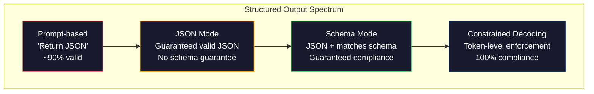
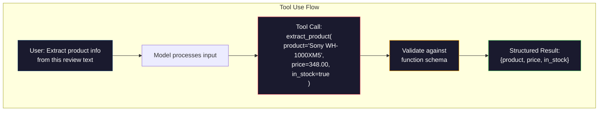

# 结构化输出:JSON、Schema Validación、Decodificación restringida

> Su LLM  Retorno es un hilo  Su aplicación necesita JSON  Este descenso ha provocado el colapso del sistema de producción, más que cualquier modelo                                                                                                                                                                                                                                            

**类型：**Construir
**语言：**Python
**先修要求：**Fase 10, Lecciones 01-05 (LLM desde cero)
**时间：**90 minutos
**相关内容：**Fase 5 · 20 (Outputs estructurados y decodificación restringida) 涵盖解码器层面的理论(FSM/CFG logit processors、Outlines、XGrammar)`response_format`、Uso de herramientas antropicas 、Instructor)  Si quieres entender lo que ocurre bajo la API, por favor, lee primero la Fase 5 · 20。

## El objetivo del aprendizaje

- Utiliza OpenAI y API Antropico 参数 para lograr JSON-modo y salida con esquema restringido
- Construir una capa de validación Pydantic, para rechazar los resultados de LLM erróneos, y realizar un nuevo ensayo a través de errores
-  Explicar el decodificación limitada  cómo en la nivel de Token  forzar a generar JSON válido, sin necesidad de posterior procesamiento
-  diseñar instantes de extracción estable, se convertirá en texto no estructurado de forma fiable en estructuras de datos clasificadas

##  problemas

Usted pregunta LLM: de este artículo se extraen productos nombre, precio y estado de inventario.

```
The product is the Sony WH-1000XM5 headphones, which cost $348.00 and are currently in stock.
```

Esta es una respuesta completamente correcta. Para tu aplicación, tampoco es de uso.`{"product": "Sony WH-1000XM5", "price": 348.00, "in_stock": true}`◊ necesitas un objeto JSON con una clave específica, tipo específico y un conjunto de valores específicos.

朴素解法: 在快速里加上响应在 JSON──这在90%的情况下有效──另外10%的情况下,模型将 JSON包在标记代码围内,或者加上类似. Aquí está el preénom de JSON:, o porque提前关闭括号并生成语法无效的 JSON──你的 JSON parser 崩──你的管道中断──加上试/除你和重试──重试有时会产生不同的数据──现在你在解析循环问题上又一个一致性问题──

Esto no es un problema de ingeniería rápida. Este es un problema de decodificación. El modelo genera Token de izquierda a derecha. En cada posición, se seleccionará el siguiente Token más probable entre el vocabulario de más de 100.000 opciones. En cualquier posición determinada, la mayoría de las opciones generarán JSON sin efecto.`{"price":`, 下一个 Token 必须是数字、引号(para usar la cadena) 、`null`¿Qué es esto?`true`¿Qué es esto?`false`O negativo número. Todo lo demás generará JSON inefficiente. Sin restricciones, el modelo puede elegir una palabra en inglés que parezca completamente razonable, pero en la gramática es un error catastrófico.

## 概念

###  estructurado de las exportaciones

 Control estructurado de salida tiene cuatro niveles, cada uno más fiable que el anterior.



**基于 Prompt**(Respuesta en JSON válido): no hay un límite obligatorio. Los modelos se respetan normalmente, pero a veces no.

**JSON mode**:API garantiza que el resultado es válido JSON。OpenAI `response_format: { type: "json_object" }`Se habilitará este modelo. La salida puede ser sin errores de resolución. Pero no necesariamente se ajusta al esquema que usted espera. Puede haber una clave adicional, tipo de error, falta de segmentos.

**Schema mode**API  Recibir un esquema JSON,并保证输出与匹配── hasta 2026 años, todos los principales proveedores están en la actualidad apoyando este punto: OpenAI `response_format: { type: "json_schema", json_schema: {...} }`(también puede pasar)`tool_choice="required"`)、Uso de herramientas antropicas 配合 `input_schema`, y los Gemini `response_schema`¿ Qué es eso ?`response_mime_type: "application/json"`◊输见包含你指定的精确键,类型和约束──

**Constrained decoding**En el proceso de generación, el decodificador bloqueará todas las posiciones de cada token y las acciones de los mismos. Si el esquema requiere un número y el modelo acaba de emitir una letra, la probabilidad de que el token sea generado será de cero. El modelo solo puede generar un token de salida efectiva.

### JSON Schema:契约语言

JSON Schema es el método que se utiliza para decir al modelo (o la capa de validación) que el resultado debe tener una forma o una forma. Todos los principales sistemas de salida estructurados lo utilizan.

```json
{
  "type": "object",
  "properties": {
    "product": { "type": "string" },
    "price": { "type": "number", "minimum": 0 },
    "in_stock": { "type": "boolean" },
    "categories": {
      "type": "array",
      "items": { "type": "string" }
    }
  },
  "required": ["product", "price", "in_stock"]
}
```

Este esquema muestra: output debe ser un objeto, contiene una cadena  tipo `product`、 número no negativo  tipo `price`、boolean 类型 `in_stock`, y una cadena de número de opciones `categories`Cualquier salida que no coincida será rechazada.

Los esquemas pueden tratar las dificultades:嵌套 objetos、contenidos en los tipos de elementos de las matrices、enums(将 string 约束到特定取值) 模式匹配(对 strings 使用 regex), así como combinadores(用于多态输出 oneOf、anyOf、allOf) ⋅

### Pydantic 模式

En Python, no escribirás JSON Schema. Definirás un modelo Pydantic, que te generará esquema.

```python
from pydantic import BaseModel

class Product(BaseModel):
    product: str
    price: float
    in_stock: bool
    categories: list[str] = []
```

Esto generará el mismo esquema JSON que arriba. La biblioteca de instructores (y el SDK de OpenAI) puede aceptar directamente los modelos Pydantic:

### Llamadas de funciones / uso de herramientas

Esta es otra forma de interfaz de la misma pregunta. Usted no hace que el modelo genere directamente JSON, sino que define con herramientas de clasificación de los parámetros.



Cuando el modelo necesita elegir la función que debe utilizar, no sólo llenar los parámetros, el uso de herramientas es más adecuado. Si tienes 10 tipos diferentes de esquemas de extracción, el modelo debe basarse en la entrada y seleccionar la correcta, el uso de herramientas le dará a la vez la selección de esquemas y la salida estructurada.

### 常见失败模式 常见失败模式 常见失败模式 常见失败模式 常见失败模式 常见失败模式 常见失败模式

Incluso si hay aplicación de esquemas, la salida estructurada puede fracasar de manera pequeña.

**幻觉值**En el texto se escribe que $348, el modelo se genera `{"price": 299.99}` Validación de esquema 捕捉不到这一点类型正确,但值错误──

**Enum 混淆**¿Cómo es que no lo haces?`["in_stock", "out_of_stock", "preorder"]` Modelo de exportación`"available"`语义正确, pero no está permitido en el conjunto.

**嵌套 object 深度**Los esquemas de los emplazamientos de profundidad (de 4 niveles a la derecha) generarán más errores.

**Array 长度**Modelo puede generar demasiados o demasiados pocos elementos en la matriz.`minItems`Y `maxItems`Pero no todos los proveedores están en la decodificación de nivel obligatorios para ejecutarlos.

**可选字段省略**Los modelos omitirán las técnicas opcionales, pero en su caso de uso hay un segmento significativo en el sentido de la palabra. Incluso si los datos están ausentes, también los establecerá en el esquema para la generación de modelos obligatorios.`null`¿Qué es eso?


```figure
mx-schema-funnel
```

## Construirlo

### Paso 1: Validador de esquema de JSON

Desde el punto de construcción de un validador, se utiliza para verificar si un objeto de Python es compatible con el esquema JSON.

```python
import json

def validate_schema(data, schema):
    errors = []
    _validate(data, schema, "", errors)
    return errors

def _validate(data, schema, path, errors):
    schema_type = schema.get("type")

    if schema_type == "object":
        if not isinstance(data, dict):
            errors.append(f"{path}: expected object, got {type(data).__name__}")
            return
        for key in schema.get("required", []):
            if key not in data:
                errors.append(f"{path}.{key}: required field missing")
        properties = schema.get("properties", {})
        for key, value in data.items():
            if key in properties:
                _validate(value, properties[key], f"{path}.{key}", errors)

    elif schema_type == "array":
        if not isinstance(data, list):
            errors.append(f"{path}: expected array, got {type(data).__name__}")
            return
        min_items = schema.get("minItems", 0)
        max_items = schema.get("maxItems", float("inf"))
        if len(data) < min_items:
            errors.append(f"{path}: array has {len(data)} items, minimum is {min_items}")
        if len(data) > max_items:
            errors.append(f"{path}: array has {len(data)} items, maximum is {max_items}")
        items_schema = schema.get("items", {})
        for i, item in enumerate(data):
            _validate(item, items_schema, f"{path}[{i}]", errors)

    elif schema_type == "string":
        if not isinstance(data, str):
            errors.append(f"{path}: expected string, got {type(data).__name__}")
            return
        enum_values = schema.get("enum")
        if enum_values and data not in enum_values:
            errors.append(f"{path}: '{data}' not in allowed values {enum_values}")

    elif schema_type == "number":
        if not isinstance(data, (int, float)):
            errors.append(f"{path}: expected number, got {type(data).__name__}")
            return
        minimum = schema.get("minimum")
        maximum = schema.get("maximum")
        if minimum is not None and data < minimum:
            errors.append(f"{path}: {data} is less than minimum {minimum}")
        if maximum is not None and data > maximum:
            errors.append(f"{path}: {data} is greater than maximum {maximum}")

    elif schema_type == "boolean":
        if not isinstance(data, bool):
            errors.append(f"{path}: expected boolean, got {type(data).__name__}")

    elif schema_type == "integer":
        if not isinstance(data, int) or isinstance(data, bool):
            errors.append(f"{path}: expected integer, got {type(data).__name__}")
```

### 步骤 2:Pidantic 风格 Modelo hasta esquema

构建一个最小的类到方案转换器──定义一个Python类,并自动生成它的JSON Schema──

```python
class SchemaField:
    def __init__(self, field_type, required=True, default=None, enum=None, minimum=None, maximum=None):
        self.field_type = field_type
        self.required = required
        self.default = default
        self.enum = enum
        self.minimum = minimum
        self.maximum = maximum

def python_type_to_schema(field):
    type_map = {
        str: "string",
        int: "integer",
        float: "number",
        bool: "boolean",
    }

    schema = {}

    if field.field_type in type_map:
        schema["type"] = type_map[field.field_type]
    elif field.field_type == list:
        schema["type"] = "array"
        schema["items"] = {"type": "string"}
    elif isinstance(field.field_type, dict):
        schema = field.field_type

    if field.enum:
        schema["enum"] = field.enum
    if field.minimum is not None:
        schema["minimum"] = field.minimum
    if field.maximum is not None:
        schema["maximum"] = field.maximum

    return schema

def model_to_schema(name, fields):
    properties = {}
    required = []

    for field_name, field in fields.items():
        properties[field_name] = python_type_to_schema(field)
        if field.required:
            required.append(field_name)

    return {
        "type": "object",
        "properties": properties,
        "required": required,
    }
```

### 步骤 3: Filtro de fichas restringidas

模拟限制解码──给定一个部分 JSON string 和一个 schema,判断当前位点哪些代币 类别是有效的──

```python
def next_valid_tokens(partial_json, schema):
    stripped = partial_json.strip()

    if not stripped:
        return ["{"]

    try:
        json.loads(stripped)
        return ["<EOS>"]
    except json.JSONDecodeError:
        pass

    last_char = stripped[-1] if stripped else ""

    if last_char == "{":
        return ['"', "}"]
    elif last_char == '"':
        if stripped.endswith('":'):
            return ['"', "0-9", "true", "false", "null", "[", "{"]
        return ["a-z", '"']
    elif last_char == ":":
        return [" ", '"', "0-9", "true", "false", "null", "[", "{"]
    elif last_char == ",":
        return [" ", '"', "{", "["]
    elif last_char in "0123456789":
        return ["0-9", ".", ",", "}", "]"]
    elif last_char == "}":
        return [",", "}", "]", "<EOS>"]
    elif last_char == "]":
        return [",", "}", "<EOS>"]
    elif last_char == "[":
        return ['"', "0-9", "true", "false", "null", "{", "[", "]"]
    else:
        return ["any"]

def demonstrate_constrained_decoding():
    partial_states = [
        '',
        '{',
        '{"product"',
        '{"product":',
        '{"product": "Sony"',
        '{"product": "Sony",',
        '{"product": "Sony", "price":',
        '{"product": "Sony", "price": 348',
        '{"product": "Sony", "price": 348}',
    ]

    print(f"{'Partial JSON':<45} {'Valid Next Tokens'}")
    print("-" * 80)
    for state in partial_states:
        valid = next_valid_tokens(state, {})
        display = state if state else "(empty)"
        print(f"{display:<45} {valid}")
```

### Paso 4: extraer el oleoducto

En el caso de los programas de investigación, el programa de investigación de la Universidad de Chicago (U.S.) se utiliza para el desarrollo de una serie de proyectos de investigación y desarrollo de proyectos de investigación.

```python
def simulate_llm_extraction(text, schema, attempt=0):
    if "headphones" in text.lower() or "sony" in text.lower():
        if attempt == 0:
            return '{"product": "Sony WH-1000XM5", "price": 348.00, "in_stock": true, "categories": ["audio", "headphones"]}'
        return '{"product": "Sony WH-1000XM5", "price": 348.00, "in_stock": true}'

    if "laptop" in text.lower():
        return '{"product": "MacBook Pro 16", "price": 2499.00, "in_stock": false, "categories": ["computers"]}'

    return '{"product": "Unknown", "price": 0, "in_stock": false}'

def extract_with_retry(text, schema, max_retries=3):
    for attempt in range(max_retries):
        raw = simulate_llm_extraction(text, schema, attempt)

        try:
            data = json.loads(raw)
        except json.JSONDecodeError as e:
            print(f"  Attempt {attempt + 1}: JSON parse error -- {e}")
            continue

        errors = validate_schema(data, schema)
        if not errors:
            return data

        print(f"  Attempt {attempt + 1}: Schema validation errors -- {errors}")

    return None

product_schema = {
    "type": "object",
    "properties": {
        "product": {"type": "string"},
        "price": {"type": "number", "minimum": 0},
        "in_stock": {"type": "boolean"},
        "categories": {"type": "array", "items": {"type": "string"}},
    },
    "required": ["product", "price", "in_stock"],
}
```

### Paso 5:运行完整管道

```python
def run_demo():
    print("=" * 60)
    print("  Structured Output Pipeline Demo")
    print("=" * 60)

    print("\n--- Schema Definition ---")
    product_fields = {
        "product": SchemaField(str),
        "price": SchemaField(float, minimum=0),
        "in_stock": SchemaField(bool),
        "categories": SchemaField(list, required=False),
    }
    generated_schema = model_to_schema("Product", product_fields)
    print(json.dumps(generated_schema, indent=2))

    print("\n--- Schema Validation ---")
    test_cases = [
        ({"product": "Test", "price": 10.0, "in_stock": True}, "Valid object"),
        ({"product": "Test", "price": -5.0, "in_stock": True}, "Negative price"),
        ({"product": "Test", "in_stock": True}, "Missing price"),
        ({"product": "Test", "price": "ten", "in_stock": True}, "String as price"),
        ("not an object", "String instead of object"),
    ]

    for data, label in test_cases:
        errors = validate_schema(data, product_schema)
        status = "PASS" if not errors else f"FAIL: {errors}"
        print(f"  {label}: {status}")

    print("\n--- Constrained Decoding Simulation ---")
    demonstrate_constrained_decoding()

    print("\n--- Extraction Pipeline ---")
    texts = [
        "The Sony WH-1000XM5 headphones are priced at $348 and currently available.",
        "The new MacBook Pro 16-inch laptop costs $2499 but is sold out.",
        "This is a random sentence with no product info.",
    ]

    for text in texts:
        print(f"\n  Input: {text[:60]}...")
        result = extract_with_retry(text, product_schema)
        if result:
            print(f"  Output: {json.dumps(result)}")
        else:
            print(f"  Output: FAILED after retries")
```

## Usalo

### Resultados estructurados de OpenAI

```python
# from openai import OpenAI
# from pydantic import BaseModel
#
# client = OpenAI()
#
# class Product(BaseModel):
#     product: str
#     price: float
#     in_stock: bool
#
# response = client.beta.chat.completions.parse(
#     model="gpt-5-mini",
#     messages=[
#         {"role": "system", "content": "Extract product information."},
#         {"role": "user", "content": "Sony WH-1000XM5, $348, in stock"},
#     ],
#     response_format=Product,
# )
#
# product = response.choices[0].message.parsed
# print(product.product, product.price, product.in_stock)
```

El modo de salida estructurada de OpenAI se utiliza internamente para la decodificación limitada. Cada token generado por el modelo está garantizado para que se produzca una salida de esquema Pydantic.

### El uso de herramientas antropológicas

```python
# import anthropic
#
# client = anthropic.Anthropic()
#
# response = client.messages.create(
#     model="claude-opus-4-7",
#     max_tokens=1024,
#     tools=[{
#         "name": "extract_product",
#         "description": "Extract product information from text",
#         "input_schema": {
#             "type": "object",
#             "properties": {
#                 "product": {"type": "string"},
#                 "price": {"type": "number"},
#                 "in_stock": {"type": "boolean"},
#             },
#             "required": ["product", "price", "in_stock"],
#         },
#     }],
#     messages=[{"role": "user", "content": "Extract: Sony WH-1000XM5, $348, in stock"}],
# )
```

Antropic                                                                                                                                                                                                                                                                                                                                                                                                                                                                                                                           

### Biblioteca de instructores

```python
# pip install instructor
# import instructor
# from openai import OpenAI
# from pydantic import BaseModel
#
# client = instructor.from_openai(OpenAI())
#
# class Product(BaseModel):
#     product: str
#     price: float
#     in_stock: bool
#
# product = client.chat.completions.create(
#     model="gpt-5-mini",
#     response_model=Product,
#     messages=[{"role": "user", "content": "Sony WH-1000XM5, $348, in stock"}],
# )
```

Instructor  empaquetar cualquier cliente LLM,并加入带验证的自动重试──如果第一次尝试验证 失败,将错误作为背景发送给模型,并要求模型修复输出── esto se aplica a cualquier proveedor, no solo a OpenAI──

##  entregarlo

本课会产出                                                                                                                                                                                                                                                                                                                                                                                                                                                                                                                         `outputs/prompt-structured-extractor.md` Una plantilla de respuesta replicable, utilizada según la definición de esquema para extraer datos estructurados de cualquier texto.

También se producirá.`outputs/skill-structured-outputs.md` Un marco de decisión, utilizado en función de los requisitos de fiabilidad y esquema de su proveedor  complejidad para elegir la estrategia de salida estructurada correcta 

##  ejercicios

1. 扩展 validador de esquema,使其支持 `oneOf`(Los datos deben coincidir con uno de varios esquemas)  Esto puede procesar múltiples modos de salida  Por ejemplo, un                                                                                                                                                                                                                                                 `Product`Objeto, también puede ser de forma diferente.`Service`Objeto

2. Construir una herramienta de diferenciación de esquema, para comparar dos esquemas,并识别破解变化 (extraer los campos requeridos, modificar los tipos) con cambios no rotos (extraer nuevos campos opcionales, ampliar las restricciones) .

3. 实现 un simulador de decodificación limitada más real──给定一个JSON Schema 和一个包含100 个 Tokens的词汇库 (en inglés: JSON Schema 和一个包含100 个 Tokens的词汇库)  (en inglés: JSON Schema 和一个包含100 个 Tokens的词汇库)  (en inglés: JSON Schema 和一个包含100 个 Tokens的词汇库)  (en inglés: JSON Schema 和一个包含100 个 Tokens的词汇库)  (en: 字母,数字,分点,关键字),逐步走过代,在每个位置屏蔽无效的 Tokens──衡量每一步词汇库中有效的 Token比例──

4. Construir una suite de extracción de eval¬¬¬¬¬¬¬¬¬¬¬¬¬¬¬¬¬¬¬¬¬¬¬¬¬¬¬¬¬¬¬¬¬¬¬¬¬¬¬¬¬¬¬¬¬¬¬¬¬¬¬¬¬¬¬¬¬¬¬¬¬¬¬¬¬¬¬¬¬¬¬¬¬¬¬¬¬¬¬¬¬¬¬¬¬¬¬¬¬¬¬¬¬¬¬¬¬¬¬¬¬¬¬¬¬¬¬¬¬¬¬¬¬¬¬¬¬¬¬¬¬¬¬¬¬¬¬¬¬¬¬¬¬¬¬¬¬¬¬¬¬¬¬¬¬¬¬¬¬¬¬¬¬¬¬¬¬¬¬¬¬¬¬¬¬¬¬¬¬¬¬¬¬¬¬¬¬¬¬¬¬¬¬¬¬¬¬¬¬¬¬¬¬¬¬¬¬¬¬¬¬¬¬¬¬¬¬¬¬¬¬¬¬¬¬¬¬¬¬¬¬¬¬¬¬¬¬¬¬¬¬¬¬¬¬¬¬¬¬¬¬¬¬¬¬¬¬¬¬¬¬¬¬¬¬¬¬¬¬¬¬¬¬¬¬¬¬¬¬¬¬¬¬¬¬¬¬¬¬¬¬¬¬¬¬¬¬¬¬¬¬¬¬¬¬¬¬¬¬¬¬¬¬¬¬¬¬¬¬¬¬¬¬¬¬¬¬¬¬¬¬¬¬¬¬¬¬¬¬¬¬¬¬¬¬¬¬¬¬¬¬¬¬¬¬¬¬¬¬¬¬¬¬¬¬¬¬¬¬¬¬¬¬¬¬¬¬¬¬¬¬¬¬¬¬¬¬¬¬¬¬¬¬¬¬¬¬¬¬¬¬¬¬¬¬¬¬¬¬¬¬¬¬¬¬¬¬¬¬¬¬¬¬¬¬¬¬¬¬¬¬¬¬¬¬¬¬¬¬¬¬¬¬¬¬¬¬¬¬¬¬¬¬¬¬¬¬¬¬¬¬¬¬¬¬¬¬¬¬¬¬¬¬¬¬¬¬¬¬¬¬¬¬¬¬¬¬¬¬¬¬¬¬¬¬¬¬¬¬¬¬¬¬¬¬¬¬¬¬

5. Para su tubería de extracción 添加信心分──对每抽取字段,估计模型的信心度(基于Token probabilities,或通过运行3次抽取并测量一致性)──将低置信度字段标记给人工审核──

## 关键术语: "El hombre es un hombre"

| Term | 人们通常怎么说 | 它实际意味着什么 |
|------|----------------|----------------------|
| JSON mode | “返回 JSON” | 一个 API flag，保证输出在语法上是有效 JSON，但不强制任何特定 schema |
| Structured output | “类型化 JSON” | 匹配特定 JSON Schema 的输出，具有正确的 key、type 和 constraint |
| Constrained decoding | “引导式生成” | 在每个 Token 位置屏蔽会产生无效输出的 Tokens——保证 100% schema compliance |
| JSON Schema | “一个 JSON template” | 用于描述 JSON 数据结构、type 和 constraint 的声明式语言（被 OpenAPI、JSON Forms 等使用） |
| Pydantic | “Python dataclasses+” | Python library，用于定义带有 type validation 的 data models，FastAPI 和 Instructor 使用它生成 JSON Schemas |
| Function calling | “Tool use” | LLM 输出结构化 function invocation（name + typed arguments），而不是 free text——OpenAI 和 Anthropic 都支持 |
| Instructor | “面向 LLMs 的 Pydantic” | Python library，用于包装 LLM clients 以返回经过验证的 Pydantic instances，并在 validation failure 时自动 retry |
| Token masking | “过滤 vocabulary” | 在 generation 期间将特定 Token probabilities 设为零，使模型无法生成它们 |
| Schema compliance | “匹配形状” | 输出包含每个 required field、正确 types、约束范围内的 values，并且没有额外的不允许字段 |
| Retry loop | “不断重试直到成功” | 将 validation errors 发回给模型，并要求它修复输出——Instructor 会自动执行这一点，最多重试到可配置上限 |

## 延伸阅读

- [OpenAI Structured Outputs Guide](https://platform.openai.com/docs/guides/structured-outputs)OpenAI API en base a JSON Schema de decodificación restringida 官方文档
- [Willard & Louf, 2023——“Efficient Guided Generation for Large Language Models”](https://arxiv.org/abs/2307.09702)Descripciones 论文, descripción de cómo ejecutar esquemas JSON 编译为有限状态机器以实现代币级约束
- [Instructor documentation](https://python.useinstructor.com/) uso de validación pidantica y retries de arbitraria LLM  obtener estructuradas de la producción de la base de normas
- [Anthropic Tool Use Guide](https://docs.anthropic.com/en/docs/tool-use)Claude  cómo a través de la herramienta de uso 和 JSON Schema input_schema  lograr la salida estructurada
- [JSON Schema specification](https://json-schema.org/) todos los principales resultados estructurados  sistemas de uso de lenguaje de esquema 完整规范
- [Outlines library](https://github.com/outlines-dev/outlines) usar regex 和编译为有限状态机的 JSON Schema  llevar a cabo generación de código abierto restringido
- [Dong et al., “XGrammar: Flexible and Efficient Structured Generation Engine for Large Language Models” (MLSys 2025)](https://arxiv.org/abs/2411.15100) El motor de gramática más avanzado de la actualidad; compilación automática de empuje hacia abajo, puede proteger Tokens a una velocidad de aproximadamente 100 ns / Token.
- [Beurer-Kellner et al., “Prompting Is Programming: A Query Language for Large Language Models” (LMQL)](https://arxiv.org/abs/2212.06094)LMQL 论文, será decodificación limitada 表述为带有类型和值限制的查询语言──
- [Microsoft Guidance (framework docs)](https://github.com/guidance-ai/guidance)Generación limitada basada en modelos;Outlines 和 XGrammar's provider-agnostic 补充──
