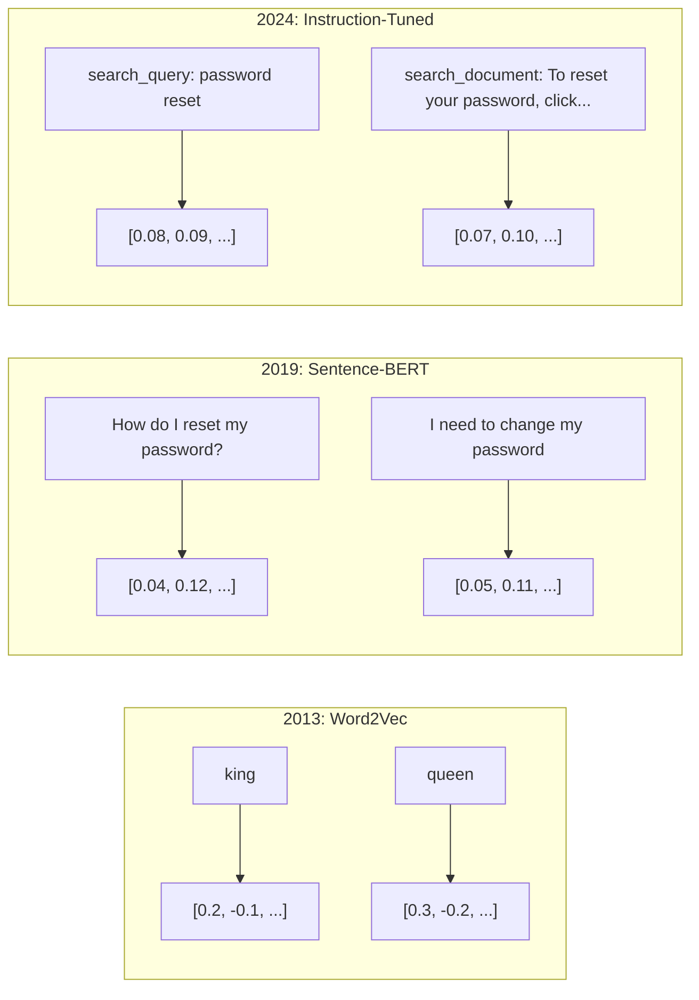
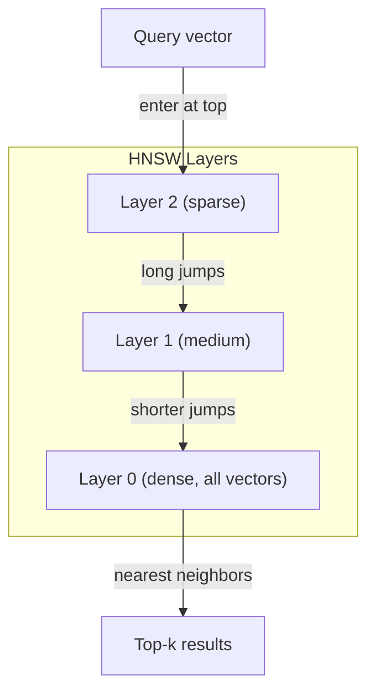

# Embedings y vectores

> 文本是离散的──数学是连续的── 每当你要求LLM 查找相似文档、比较含义,或超越关键词进行搜索时,你都依赖于连接这两个世界的一个桥──这个桥就是嵌入──如果你不理解嵌入──你就不理解现代AI──你只是会使用它──

**Type:** Build
**Languages:** Python
**Prerequisites:** Phase 11, Lesson 01 (Prompt Engineering)
**Time:** ~75 minutes
**Related:**Fase 5 · 22 (Inmembración de modelos de inmersión profunda) 涵盖密集 VS稀稀相多向量模型、Matryoshka 截断,以及按轴选择模型──本课聚焦生产管eline(vector DBs、HNSW、相似度数学)──在选择模型之前,请先阅读Fase 5 · 22──

## El objetivo del aprendizaje
- Utiliza API proveedores y modelos de código abierto 生成文本 Embeddings,并计算 entre ellos similitud cosina
-  explica por qué los embebidos 能 resolver la búsqueda de palabras clave 无法处理的词汇不匹配问题
- Construir un índice de búsqueda semántica, basado en el significado y no en el exact keyword match to search document
- Utiliza benchmarks de recuperación(precision@k、recall) evalúa Embedding 质量,并为你的任务选择合适的 Embedding model

##  problemas
Usted tiene 10.000 张支持工单――一位客户写道:我的支付没有通过. 你需要找到相似的历史工单――关键词搜索 会找到包含 支付 和 没有通过 的工单――它会漏掉 交易失败,  收费被拒绝,  和  facturación error. 这些工单用完全不同的词描述完全相同的问题──

Este es el problema de la falta de coincidencia en el vocabulario. La lengua humana tiene muchas formas de expresar lo mismo. La búsqueda de palabras clave.

Usted necesita un texto que diga que hacer que la similitud sea decidida por la significación, no por la escritura. Usted necesita un método, que mi pago no pasó y la transacción fue rechazada y que se colocó en un espacio matemático cercano, al mismo tiempo que mi pago llegó a tiempo, se retrasó mucho, incluso si compartió el pago.

Esta es la forma de decir que se está incrustando.

## 概念
### ¿Qué es un implante?

La incorporación es un vector denso compuesto por un número de浮点, utilizado para expresar el significado del texto.

El gato se sentó en el colchón.`[0.023, -0.041, 0.087, ..., 0.012]`De acuerdo con el modelo, hay una lista que contiene entre 768 y 3072 números. Estos números codifican el significado.

### El avance de Word2Vec

En 2013, Tomas Mikolov de Google y sus colegas publicaron Word2Vec──核心洞见是: entrenar una red neuronal, según vecino predicción un palabra((o según un palabra predicción vecino palabra), ocultar la capa de peso se convierte en un vector significativo muestra──

著名结果:

```
king - man + woman = queen
```

Para los embebidos de palabras  realizar la aritmética vectorial se puede captar la relación de significado ∼ desde el hombre ∼ la mujer ∼ la dirección, aproximadamente igual a la de rey ∼ reina ∼ es el momento en que el campo se da cuenta de que puede codificar significado ∼

Word2Vec produce 300 维 Vectors── cada palabra independientemente de cómo se escriba, sólo hay un Vector──Bank en la banca del río y en la cuenta bancaria tiene la misma Embedding── esta restricción impulsó la investigación de la década siguiente──

### De las palabras a las frases

Las incorporaciones de palabras indican tokens individuales. Se han desarrollado cuatro métodos:

**Averaging**El valor medio de todos los vectores de palabras en los ejemplos es bajo, pero también está perdido. El texto se muere de forma muy diferente.

**CLS token**:transformer models(BERT, 2018)输出一个特殊的 [CLS] token embedding,表示整个输入──比平均更好,但[CLS] token 是为下句预测 训练的,不是为相似度训练的──

**Contrastive learning**Reimers & Gurevych, 2019) utilizó este método, y se convirtió en la base de los modelos modernos de incorporación.

**Instruction-tuned embeddings**: नवीनतम metodología。E5 和 GTE 等模型接受任务前(search_query:、 search_document:), diga al modelo que debe generar qué tipo de Embedding。 esto hace que un modelo pueda servir a varias tareas。



### Modelos modernos de incorporación

El mercado ha recibido a un número reducido de opciones de producción de MTEB hasta el inicio del año 2026 (MTEB v2):

| Model | Provider | Dimensions | MTEB | Context | Cost / 1M tokens |
|-------|----------|-----------|------|---------|------------------|
| Gemini Embedding 2 | Google | 3072 (Matryoshka) | 67.7 (retrieval) | 8192 | $0.15 |
| embed-v4 | Cohere | 1024 (Matryoshka) | 65.2 | 128K | $0.12 |
| voyage-4 | Voyage AI | 1024/2048 (Matryoshka) | 66.8 | 32K | $0.12 |
| text-embedding-3-large | OpenAI | 3072 (Matryoshka) | 64.6 | 8192 | $0.13 |
| text-embedding-3-small | OpenAI | 1536 (Matryoshka) | 62.3 | 8192 | $0.02 |
| BGE-M3 | BAAI | 1024 (dense+sparse+ColBERT) | 63.0 multilingual | 8192 | Open-weight |
| Qwen3-Embedding | Alibaba | 4096 (Matryoshka) | 66.9 | 32K | Open-weight |
| Nomic-embed-v2 | Nomic | 768 (Matryoshka) | 63.1 | 8192 | Open-weight |

MTEB(Mássive Text Embedding Benchmark) v2                                                                                                                                                                                                                                                                                                                                                                                                                                                                                                               

### Metricas de similitud

Dado dos vectores de incorporación, hay tres formas de medir sus similitudes:

**Cosine similarity**: Dos vectores 间角的余弦值──范围从 -1(相反) 到 1(方向相同)──忽略大小 如果一个10 词句和一个500 词文档指向相同方向,它们可以得到1.0──这是90%的默认选择──

```
cosine_sim(a, b) = dot(a, b) / (||a|| * ||b||)
```

**Dot product**Cuando los vectores se han clasificado, se relacionan con la similitud cosínica 等价――计算更快―― OpenAI tiene los embedidos clasificados, por lo que el producto punto 和 cosín 会给出相同排序――

```
dot(a, b) = sum(a_i * b_i)
```

**Euclidean (L2) distance**:Véctor  direct line distance en el espacio―越小 = 越相似―对大小差异敏感―当空间中的绝对位置很重要,而不是仅仅是方向很重要当使用―

```
L2(a, b) = sqrt(sum((a_i - b_i)^2))
```

¿Cuál es el tipo de uso que se hace?

| Metric | Use when | Avoid when |
|--------|----------|------------|
| Cosine similarity | 比较长度不同的文本；大多数 retrieval 任务 | 大小携带信息 |
| Dot product | Embeddings 已经归一化；需要最高速度 | Vectors 大小不同 |
| Euclidean distance | Clustering；空间 nearest-neighbor 问题 | 比较长度差异巨大的文档 |

### Las bases de datos vectoriales y HNSW

La búsqueda de similitud violenta comparará las consultas con cada vector almacenado ∼1 ∼ 1 ∼ 1536 ∼ 1 ∼ 100 000 ∼ ∼ ∼ ∼ ∼ ∼ ∼ ∼ ∼ ∼ ∼ ∼ ∼ ∼ ∼ ∼ ∼ ∼ ∼ ∼ ∼ ∼ ∼ ∼ ∼ ∼ ∼ ∼ ∼ ∼ ∼ ∼ ∼ ∼ ∼ ∼ ∼ ∼ ∼ ∼ ∼ ∼ ∼ ∼ ∼ ∼ ∼ ∼ ∼ ∼ ∼ ∼ ∼ ∼ ∼ ∼ ∼ ∼ ∼ ∼ ∼ ∼ ∼ ∼ ∼ ∼ ∼ ∼ ∼ ∼ ∼ ∼ ∼ ∼ ∼ ∼ ∼ ∼ ∼ ∼ ∼ ∼ ∼ ∼ ∼ ∼ ∼ ∼ ∼ ∼ ∼ ∼ ∼ ∼ ∼ ∼ ∼ ∼ ∼ ∼ ∼ ∼ ∼ ∼ ∼ ∼ ∼ ∼ ∼ ∼ ∼ ∼ ∼ ∼ ∼ ∼ ∼ ∼ ∼ ∼ ∼ ∼ ∼ ∼ ∼ ∼ ∼ ∼ ∼ ∼ ∼ ∼ ∼ ∼ ∼ ∼ ∼ ∼ ∼ ∼ ∼ ∼ ∼ ∼ ∼ ∼ ∼ ∼ ∼ ∼ ∼ ∼ ∼ ∼ ∼ ∼ ∼ ∼ ∼ ∼ ∼ ∼ ∼ ∼ ∼ ∼ ∼ ∼ ∼ ∼ ∼ ∼ ∼ ∼ ∼ ∼ ∼ ∼ ∼ ∼ ∼ ∼ ∼ ∼ ∼ ∼ ∼ ∼ ∼ ∼ ∼ ∼ ∼ ∼ ∼ ∼ ∼ ∼ ∼ ∼ ∼ ∼ ∼ ∼ ∼ ∼ ∼ ∼ ∼ ∼ ∼ ∼  ∼ ∼ ∼ ∼ ∼ ∼   ∼ ∼  ∼ ∼ ∼                      ∼

Las bases de datos vectoriales usadas en el vecino más cercano aproximado (ANN) algoritmo resolver este problema.

1.  Construir un gráfico de vectores de varias capas
2. La capa superior es escasa de establecer una conexión a larga distancia entre grupos de distancia
3. La base es densa de  entre vectores vecinos  establecer conexión de pequeñas cantidades
4. Buscar desde arriba, empezando, descendiendo y gradualmente detallado
5. 以 O(log n) 时间 regresar resultados casi similares, en lugar de O(n)

HNSW utiliza muy pequeña tasa de precisión de pérdida (normalmente 95-99% de recuerdo) para cambiar a una velocidad enorme de aumento. En 1000 millones de vectores, la búsqueda violenta requiere pocos segundos.



Productos y servicios

| Database | Type | Best for | Max scale |
|----------|------|----------|-----------|
| Pinecone | Managed SaaS | 零运维生产环境 | Billions |
| Weaviate | Open source | 自托管、hybrid search | 100M+ |
| Qdrant | Open source | 高性能、过滤 | 100M+ |
| ChromaDB | Embedded | 原型开发、本地开发 | 1M |
| pgvector | Postgres extension | 已经使用 Postgres | 10M |
| FAISS | Library | 进程内、研究 | 1B+ |

### Estrategias para deshacerse

文档太长,不能作为单个矢量 进行嵌入──一个50页 PDF 覆盖几十主题它的嵌入会变成所有内容的平均值,结果不像任何具体内容──你要把文档切成块,并对每块做嵌入──

**Fixed-size chunking**Cada N 个 Tokens 切分一次,并带 M-token 叠加──简单且可预测──当文档没有清晰结构时效果很好──一个512-token 带50-token 叠加:chunk 1是代币0-511,chunk 2是代币462-973──

**Sentence-based chunking**En la frase límite, cortar la frase hasta alcanzar el límite de token. Cada pieza es al menos una frase completa. Es mejor que un tamaño fijo, porque no cortarás una idea en dos partes.

**Recursive chunking**Si todavía es demasiado grande, vuelve a intentar los límites del párrafo, luego los límites de la oración, finalmente los límites de los caracteres.`RecursiveCharacterTextSplitter`, para el cuerpo de formato mixto , el efecto es bueno.

**Semantic chunking**: para cada frase hacer Embedding, luego embebedos similares a los segmentos de segmentos de segmentos. Cuando la similitud de embedding es inferior a un valor determinado, comienza un nuevo pedazo.

| Strategy | Complexity | Quality | Best for |
|----------|-----------|---------|----------|
| Fixed-size | Low | Decent | 非结构化文本、logs |
| Sentence-based | Low | Good | 文章、emails |
| Recursive | Medium | Good | Markdown、HTML、mixed docs |
| Semantic | High | Best | 对 retrieval 质量要求关键的场景 |

La mayoría de los sistemas de la zona dulce: 256-512 trozos de tokens, con 50 tokens superpuestos.

### Bi-Encoders y Cross-Encoders en comparación

Bi-encoder 会独立对查询 和文件做嵌入,然后比较向量──速度快你只需要对查询做一次嵌入,然后与预先计算好的文档嵌入比较──这是检索的方法──

El codificador cruzado tratará la consulta y un documento como una sola entrada y salida de puntaje de relevancia.

El modelo de producción es: bi-encoder  busque los 100 candidatos más importantes, cross-encoder volver a clasificar hasta el top-10―


Modelos de clasificación:Cohere Rerank 3.5( cada 1000 veces consulta $2) 、BGE-renanker-v2(免费, fuente abierta) 、Jina Reranker v2(免费, fuente abierta) ‖

### Embedings de matryoshka

Los embeddings tradicionales son totalmente disponibles o totalmente disponibles. Un vector de 1536 dimensiones utiliza 1536 floats.

El aprendizaje de representación de matrioshka ((Kusupati et al., 2022) ha resuelto este problema. El modelo se ha entrenado para que el primer N 个维度 capture el más importante de los datos, como Rusia 套娃──, pero todavía es posible.

OpenAI de texto-embedado-3-pequeño 和 texto-embedado-3-gran 通过 `dimensions`参数支持 Matryoshka 截断──请求 256 维而不是 1536 维, almacenamiento reducido 6 veces, en benchmarks MTEB 准确率大约损失 3-5%──

### Cuantización binaria

Una 1536 维 embebido en float32  almacenamiento necesita 6,144 字节── multiplicado por 1000 millones de documentos: sólo vectores necesita 61 GB──

Cuantización binaria Colocar cada float 转成单个位:正值变成1,负值变成0── almacenamiento de 6,144 字节降至192 字节减少32 倍──相似度使用 Hamming distance(统计不同位数数)计算, CPU puede utilizar单条命令完成──

El tipo de recuperación de datos es de aproximadamente 5-10%. El modelo común es: primero, se hace una primera búsqueda con cuantificación binaria en millones de vectores, y luego se utiliza un vector de precisión completa para los top-1000 重新打分. Así se puede obtener un 95% de precisión completa con menos de 32 veces la memoria.


```figure
cosine-similarity
```

## Construirlo
Nosotros desde zero comenzamos a construir un motor de búsqueda semántica. No usamos una base de datos vectorial.

### Paso 1: Descomposición de texto

```python
def chunk_text(text, chunk_size=200, overlap=50):
    words = text.split()
    chunks = []
    start = 0
    while start < len(words):
        end = start + chunk_size
        chunk = " ".join(words[start:end])
        chunks.append(chunk)
        start += chunk_size - overlap
    return chunks


def chunk_by_sentences(text, max_chunk_tokens=200):
    sentences = text.replace("\n", " ").split(".")
    sentences = [s.strip() + "." for s in sentences if s.strip()]
    chunks = []
    current_chunk = []
    current_length = 0
    for sentence in sentences:
        sentence_length = len(sentence.split())
        if current_length + sentence_length > max_chunk_tokens and current_chunk:
            chunks.append(" ".join(current_chunk))
            current_chunk = []
            current_length = 0
        current_chunk.append(sentence)
        current_length += sentence_length
    if current_chunk:
        chunks.append(" ".join(current_chunk))
    return chunks
```

### 步骤 2: Construir los embebidos desde cero

Usamos la normalización TF-IDF y L2 para lograr una simple incorporación densa. Esto no es una incorporación neural, pero sigue el mismo acuerdo:

```python
import math
import numpy as np
from collections import Counter

class SimpleEmbedder:
    def __init__(self):
        self.vocab = []
        self.idf = []
        self.word_to_idx = {}

    def fit(self, documents):
        vocab_set = set()
        for doc in documents:
            vocab_set.update(doc.lower().split())
        self.vocab = sorted(vocab_set)
        self.word_to_idx = {w: i for i, w in enumerate(self.vocab)}
        n = len(documents)
        self.idf = np.zeros(len(self.vocab))
        for i, word in enumerate(self.vocab):
            doc_count = sum(1 for doc in documents if word in doc.lower().split())
            self.idf[i] = math.log((n + 1) / (doc_count + 1)) + 1

    def embed(self, text):
        words = text.lower().split()
        count = Counter(words)
        total = len(words) if words else 1
        vec = np.zeros(len(self.vocab))
        for word, freq in count.items():
            if word in self.word_to_idx:
                tf = freq / total
                vec[self.word_to_idx[word]] = tf * self.idf[self.word_to_idx[word]]
        norm = np.linalg.norm(vec)
        if norm > 0:
            vec = vec / norm
        return vec
```

### 步骤 3: Funciones de similitud

```python
def cosine_similarity(a, b):
    dot = np.dot(a, b)
    norm_a = np.linalg.norm(a)
    norm_b = np.linalg.norm(b)
    if norm_a == 0 or norm_b == 0:
        return 0.0
    return float(dot / (norm_a * norm_b))


def dot_product(a, b):
    return float(np.dot(a, b))


def euclidean_distance(a, b):
    return float(np.linalg.norm(a - b))
```

### 步骤 4: Índice de vectores con búsqueda de fuerza bruta

```python
class VectorIndex:
    def __init__(self):
        self.vectors = []
        self.texts = []
        self.metadata = []

    def add(self, vector, text, meta=None):
        self.vectors.append(vector)
        self.texts.append(text)
        self.metadata.append(meta or {})

    def search(self, query_vector, top_k=5, metric="cosine"):
        scores = []
        for i, vec in enumerate(self.vectors):
            if metric == "cosine":
                score = cosine_similarity(query_vector, vec)
            elif metric == "dot":
                score = dot_product(query_vector, vec)
            elif metric == "euclidean":
                score = -euclidean_distance(query_vector, vec)
            else:
                raise ValueError(f"Unknown metric: {metric}")
            scores.append((i, score))
        scores.sort(key=lambda x: x[1], reverse=True)
        results = []
        for idx, score in scores[:top_k]:
            results.append({
                "text": self.texts[idx],
                "score": score,
                "metadata": self.metadata[idx],
                "index": idx
            })
        return results

    def size(self):
        return len(self.vectors)
```

### Paso 5: El motor de búsqueda semántica

```python
class SemanticSearchEngine:
    def __init__(self, chunk_size=200, overlap=50):
        self.embedder = SimpleEmbedder()
        self.index = VectorIndex()
        self.chunk_size = chunk_size
        self.overlap = overlap

    def index_documents(self, documents, source_names=None):
        all_chunks = []
        all_sources = []
        for i, doc in enumerate(documents):
            chunks = chunk_text(doc, self.chunk_size, self.overlap)
            all_chunks.extend(chunks)
            name = source_names[i] if source_names else f"doc_{i}"
            all_sources.extend([name] * len(chunks))
        self.embedder.fit(all_chunks)
        for chunk, source in zip(all_chunks, all_sources):
            vec = self.embedder.embed(chunk)
            self.index.add(vec, chunk, {"source": source})
        return len(all_chunks)

    def search(self, query, top_k=5, metric="cosine"):
        query_vec = self.embedder.embed(query)
        return self.index.search(query_vec, top_k, metric)

    def search_with_scores(self, query, top_k=5):
        results = self.search(query, top_k)
        return [
            {
                "text": r["text"][:200],
                "source": r["metadata"].get("source", "unknown"),
                "score": round(r["score"], 4)
            }
            for r in results
        ]
```

### Paso 6: Comparar las métricas de similitud

```python
def compare_metrics(engine, query, top_k=3):
    results = {}
    for metric in ["cosine", "dot", "euclidean"]:
        hits = engine.search(query, top_k=top_k, metric=metric)
        results[metric] = [
            {"score": round(h["score"], 4), "preview": h["text"][:80]}
            for h in hits
        ]
    return results
```

## Usalo
Utiliza la producción de API 时,架构保持一致──只有嵌入者 会变:

```python
from openai import OpenAI

client = OpenAI()

def openai_embed(texts, model="text-embedding-3-small", dimensions=None):
    kwargs = {"model": model, "input": texts}
    if dimensions:
        kwargs["dimensions"] = dimensions
    response = client.embeddings.create(**kwargs)
    return [item.embedding for item in response.data]
```

Utiliza Matryoshka de OpenAI 截断同一个模型,更少维度,更低存储:

```python
full = openai_embed(["semantic search query"], dimensions=1536)
compact = openai_embed(["semantic search query"], dimensions=256)
```

256-d Vector Uso de almacenamiento reducido 6 veces. Para 1000 millones de archivos, esto es 10 GB frente a 61 GB.

Utiliza Cohere  realizar un nuevo rango:

```python
import cohere

co = cohere.ClientV2()

results = co.rerank(
    model="rerank-v3.5",
    query="What is the refund policy?",
    documents=["Full refund within 30 days...", "No refunds after 90 days..."],
    top_n=3
)
```

Utilizaciones locales, no depende de API:

```python
from sentence_transformers import SentenceTransformer

model = SentenceTransformer("BAAI/bge-small-en-v1.5")
embeddings = model.encode(["semantic search query", "another document"])
```

La clase de VectorIndex que hemos construido puede combinarse con estos esquemas de uso.

##  entregarlo
本课产 出:
- `outputs/prompt-embedding-advisor.md` Un ejemplo de ejemplo de selección de modelos y estrategias de implantar
- `outputs/skill-embedding-patterns.md`Un profesor de agentes  cómo utilizar eficazmente las habilidades de los embebidos en la producción

##  ejercicios
1. **Metric comparison**Usando la similitud cosínica, el producto de puntos y la distancia euclidiana, se ejecutaron 5 consultas para los documentos de muestra, registrando los tres primeros resultados de cada método, ¿cuáles son las consultas en las que estas métricas no coinciden? ¿Por qué?

2. **Chunk size experiment**Usando 50、100、200 y 500 palabras de tamaño de piezas  índice de documentos de muestra  para cada configuración de 5 consultas,并记录 top-1 similaridad puntuación── dibujar el tamaño de pieza y la calidad de recuperación  relación── encontrar piezas más grandes  comenzar a producir un impacto negativo 

3. **Matryoshka simulation**Construir un simpleembedder de vectores de 500-d. Cuenta con 50、100、200 和 500 dimensiones. Medir cómo disminuye la recuperación de cada recalque de recorte. Esto puede ser simulado en el caso de no necesitar técnicas de entrenamiento real.

4. **Binary quantization**:取搜索引擎中的嵌入式,将它们转换为二进制,并实现 Hamming distance search──将 top-10 results与全精度共数相似比较──衡量重叠百分比比──

5. **Sentence-based chunking**:用 `chunk_by_sentences`替换固定尺寸分分化――运行相同查询并并比较检索分点――尊重句子边界¿ha mejorado el resultado?

## 关键术语: "El hombre es un hombre"
| Term | What people say | What it actually means |
|------|----------------|----------------------|
| Embedding | “文本到数字” | 一种 dense Vector，其中几何接近性编码语义相似性 |
| Word2Vec | “最早的经典 Embedding” | 2013 年通过预测上下文词学习 word vectors 的模型；证明 Vector arithmetic 可以编码含义 |
| Cosine similarity | “两个 Vectors 有多相似” | Vectors 夹角的余弦值；1 = 方向相同，0 = 正交，-1 = 相反 |
| HNSW | “快速 Vector search” | Hierarchical Navigable Small World graph——一种多层结构，可实现 O(log n) 的 approximate nearest neighbor search |
| Bi-encoder | “分开 Embedding，快速比较” | 将 query 和 document 独立编码为 Vectors；支持预计算和快速 retrieval |
| Cross-encoder | “慢但准确的 reranker” | 让 query-document pair 联合通过完整模型处理；准确率更高，但无法预计算 |
| Matryoshka embeddings | “可截断的 Vectors” | 经过训练的 Embeddings，使前 N 个维度捕捉最重要的信息，从而支持可变大小存储 |
| Binary quantization | “1-bit embeddings” | 将 float vectors 转换为 binary（仅保留 sign bit），通过 Hamming distance search 实现 32 倍存储减少 |
| Chunking | “为 Embedding 拆分文档” | 将文档拆成 256-512 token 片段，使每个片段都可以独立 Embedding 和检索 |
| Vector database | “Embeddings 的搜索引擎” | 为存储 Vectors 并在规模化场景下执行 approximate nearest neighbor search 而优化的数据存储 |
| Contrastive learning | “通过比较训练” | 一种训练方法，把相似配对的 Embeddings 拉近，把不相似配对的 Embeddings 推远 |
| MTEB | “Embedding benchmark” | Massive Text Embedding Benchmark——覆盖 8 类任务的 56 个数据集；用于比较 Embedding models 的标准 |

## 延伸阅读
- Mikolov et al., "Eficiente Estimación de las Representaciones de Palabras en el Espacio Vectorial" (2013) Word2Vec 论文, 通过 king-queen 类比开启了 Embedding 革命
- Reimers & Gurevych, "Sentence-BERT: Sentence Embeddings using Siamese BERT-Networks" (2019)  how to train in用于句子级相似度的双码码器,现代 Embedding models 的基础
- Kusupati et al., "Matryoshka Representation Learning" (2022) 可变维度 Embeddings 背后的技术,OpenAI en el texto-embedding-3 lo ha adoptado
- Malkov y Yashunin, "Eficiente y robusto vecino aproximado más cercano utilizando gráficos jerárquicos del mundo pequeño navegables" (2018) HNSW 论文,多数生产 Vector search 背后的算法
- Guía de incorporación de OpenAI (platform.openai.com/docs/guías/embeddings) text-embedding-3 modelos 实用参考, incluida Matryoshka 维度缩减
- MTEB Leaderboard (huggingface.co/spaces/mteb/leaderboard) 实时基准, para comparar todos los modelos de incorporación en diferentes tareas y lenguajes
- [Muennighoff et al., "MTEB: Massive Text Embedding Benchmark" (EACL 2023)](https://arxiv.org/abs/2210.07316) definir 8 类任务(clasificación, agrupamiento, clasificación de pares, re-ranking, recuperación, STS, resumen, minería de texto) de referencia,leaderboard 会报告这些类别; 在信任任何单一MTEB分数 之前请先阅读。
- [Sentence Transformers documentation](https://www.sbert.net/)bi-encoder vs cross-encoder pooling strategies, así como el poder de la implementación de la tubería de RAG de almacenamiento integrado-dividido de ingesta
