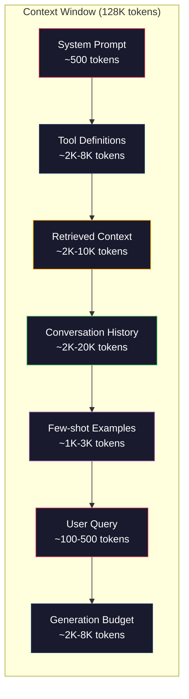
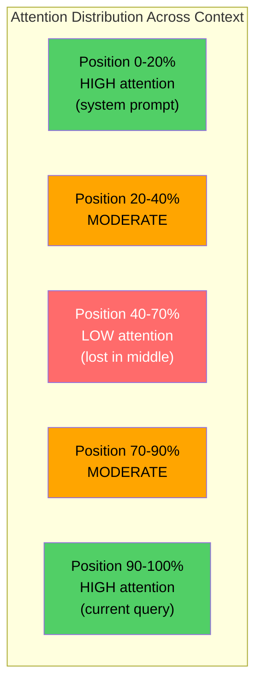
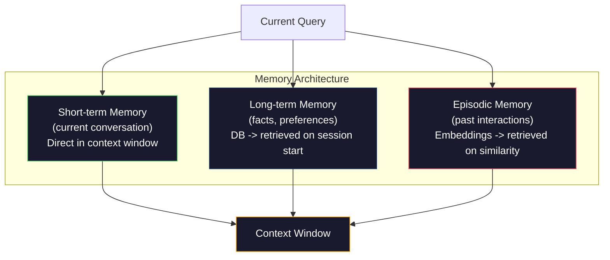

# Ingeniería de contexto: ventanas, presupuesto, memoria y recuperación

> La ingeniería rápida es un subconjunto. La ingeniería de contexto es una serie de diseños. La ingeniería rápida es un elemento de la ventana del modelo. La ingeniería de contexto es un elemento de la ventana del modelo. La ingeniería rápida es un elemento de la ventana del modelo. La ingeniería rápida es un elemento de la ingeniería de contexto. La ingeniería rápida es un elemento de la ventana del modelo. La ingeniería rápida es un elemento de la ventana del modelo. La ingeniería rápida es un elemento de la ingeniería de contexto. La ingeniería de contexto es un elemento de la ventana del modelo. La ingeniería rápida es un elemento de la ingeniería de contexto. La ingeniería rápida es un elemento de la ingeniería de contexto. La ingeniería rápida es un elemento de la ingeniería de contexto. La ingeniería rápida es un elemento de la ingeniería de contexto. La ingeniería rápida es un elemento de la ingeniería de contexto. La ingeniería rápida es un elemento de la ingeniería de contexto. La ingeniería rápida es un elemento de la ingeniería de contexto. La ingeniería rápida es un elemento de contexto. La ingeniería rápida es un elemento de contexto. La ingenieros de contexto es un elemento de contexto.

**类型：**Construir
**语言：**Python
**前置要求：**Fase 10 ((LLM desde cero)  Fase 11 Lección 01-02
**时间：**90 minutos
**相关：**Fase 11 · 15(Caching rápido)  diseño amigable con el caché es la ingeniería de contexto 延伸──Fase 5 · 28(Evaluación de contexto largo)讲解如何使用NIAH/RULER 衡量 lost-in-the-middle──

## El objetivo del aprendizaje

- 计算所有 context window 组件的 Token 预算(sistema de instrucciones, herramientas, historia, documentos recuperados, espacio de generación)
- 实现 contexto ventana 管理策略:截断、摘要, así como para usar la ventana deslizante del historial de conversaciones
- Se realiza una clasificación y clasificación de prioridad de los componentes de contexto, permitiendo que la atención del modelo se concentre al máximo en la información más relevante.
- Construir un ensamblador de contexto, según la consulta  tipo y disponible ventana espacio

##  problemas

Claude Opus 4.7 tiene 200K Token  Window(beta en medio para 1M) ――GPT-5 tiene 400K―Gemini 3 Pro tiene 2M―Llama 4  Clasifica tener 10M― Estos números suenan muy grandes hasta que realmente los llenas―

Se trata de un asistente de codificación de la verdadera separación. Sistema de instrucción: 500 Token──50 个工具的工具的定义: 8,000 Token──检索文件:4,000 Token──对话史(10轮):6,000 Token──当前用户查询:200 Token──生成预算(最大输出):4,000 Token──总计:22,700 Token──这只占 128K 窗口的18%──

Pero la atención no se adapta a la longitud del contexto 线性扩展―― tener un modelo de contexto de 128K Token tiene que pagar una segunda atención 成本(n^2), aunque la mayoría de los modelos de producción utilizan alta eficiencia Atención 变体) ・・・ más importante, la recuperación 准确率会下降──Needle en un Haystack test muestra que el modelo es difícil de encontrar en el contexto largo 信息间的.

 Lección práctica es: 200K Token no significa usar 200K Token 就有效──精心选的10K Token context 往往胜过直接倾倒的100K Token context──文本工程是在文本窗口内最大化信号-噪音比的学科──

Cada token que pones en la ventana, se extrae otro que podría llevar más información relevante. Cada token no relacionado con la definición de herramienta, cada paso de conversación, cada pasaje no puede responder al texto recuperado, y el modelo se desempeña un poco más mal en la tarea.

## 概念

### Ventana de contexto es un recurso escaso

Ponga la ventana de contexto en RAM, no en disco. Es muy rápido, puede acceder directamente, pero la capacidad es limitada.



Cada componente está en la lucha por el espacio. Añadir más definiciones de herramientas significa espacio de historia de conversación cambia menos. Añadir más contexto recuperado significa espacio de pocos ejemplos de disparos.

### Perdido en el medio

Este es el descubrimiento más importante de la experiencia de la ingeniería de contexto. El modelo se centrará mejor en el contexto de la información inicial y final.

Liu et al. ((2023) realizaron un sistema de pruebas. Ellos colocaron un documento relacionado en diferentes posiciones entre 20 documentos no relacionados, y midieron la tasa de precisión de la respuesta. Cuando el documento relacionado se encuentra en la primera o última posición, la tasa de precisión es de 85-90%. Cuando se encuentra en la mitad (de 20 posiciones), la tasa de precisión disminuye a 60-70%.

Esto afectará directamente al diseño de la construcción:

- Colocar la información más importante en la primera página de la instrucción del sistema
- Colocar la consulta actual y el contexto más relevante en el último (prejuicio reciente tiene ayuda)
- Colocar el contexto entre el punto de vista como el área de menor prioridad
- Si hay que poner la información en el medio, estamos en el final.



### Contexto 组件

**System prompt**Se pone en la primera plana y se mantiene invariable en varias rondas. El código de código de código de sistema se vuelve a utilizar en cada API.

**Tool definitions**Cada herramienta aumentará 50-200 Tokens (nombre, descripción, esquema de parámetros) ⋅ 50 herramientas ⋅ cada 150 Tokens, antes de que ocurra cualquier conversación ⋅ 7.500 Tokens ⋅ Selección de herramientas dinámicas, es decir, sólo contiene herramientas relacionadas con la consulta actual ⋅ puede reducir el 60-80% ⋅

**Retrieved context**: de la base de datos vectorial de documentos, resultados de búsqueda, contenido de archivos, Retrieval 质量直接决定 response 质量, poor Retrieval, es peor que no hay una recuperación, ya que se llena de ruido en la ventana, y se ejecuta un modelo de error,

**Conversation history**Cada mensaje del usuario anterior y la respuesta del asistente. Esto se produce con la duración de la conversación.

**Few-shot examples**En el caso de los tokens, los resultados de los resultados de los resultados de los resultados de los resultados de los resultados de los resultados de los resultados de los resultados de los resultados de los resultados de los resultados de los resultados de los resultados de los resultados de los resultados de los resultados de los resultados de los resultados de los resultados de los resultados de los resultados de los resultados de los resultados de los resultados de los resultados de los resultados de los resultados de los resultados de los resultados de los resultados de los resultados de los resultados de los resultados de los resultados de los resultados de los resultados de los resultados de los resultados de los resultados de los resultados de los resultados de los resultados de los resultados de los resultados de los resultados de los resultados de los resultados de los resultados de los resultados de los resultados de los resultados de los resultados de los resultados de los resultados de los resultados de los resultados de los resultados de los resultados de los resultados de los resultados de los resultados de los resultados de los resultados de los resultados de los resultados de los resultados de los resultados de los resultados de los resultados de los resultados de los resultados de los resultados de los resultados de los resultados de los resultados de los resultados de los resultados de los resultados de los resultados de los resultados de los resultados de los resultados de los resultados de los resultados de los resultados de los resultados de los resultados de los resultados de los resultados de los resultados de los resultados de los resultados de los resultados de los resultados de los resultados de los resultados de los resultados de los resultados de los resultados de los resultados de los resultados de los resultados de los resultados de los resultados de los resultados de los resultados de los resultados de los resultados de los resultados de los resultados de los resultados de los resultados de la la la evaluación de la evaluación de la evaluación de la evaluación de la evaluación de la evaluación de la evaluación de la evaluación de la evaluación de la evaluación de la evaluación de la evaluación de la evaluación de la evaluación de la evaluación de la evaluación de la evaluación de la evaluación de la evaluación de la evaluación de la evaluación de la evaluación de la evaluación de la evaluación de la evaluación de la evaluación de la evaluación de la evaluación de la evaluación de la evaluación de la cuento de la cuento de la cuento de la cuento de la cuento de la cuento de la cuento de la cuento de la cuento de la cuento de la cuento de la cuento de la cuento de la cuento de la cuento de la cuento de la cuento de la cuento

**Generation budget**Si llenas la ventana, el modelo no tiene espacio para responder.

### Contexto de compresión 策略

**History summarization**No se puede usar el nombre de la palabra en la conversación de las últimas rondas, sino que se puede usar el nombre de la palabra en la conversación de las últimas rondas.

**Relevance filtering**Según la consulta actual 给每一个检索的文件 打分,并丢弃低于值的文档──如果你 has recuperado 十个块, pero sólo tienes 3 相关,就丢弃另外7个──3个高度相关的块 胜过10个平的块──

**Tool pruning**: 分类用户的查询意图,只包含与该意图相关的工具──代码问题不需要日历工具──排期问题不需要文件系统工具──这可以把工具定义从8,000 Token 降至1,000──

**Recursive summarization**Para un largo archivo, un resumen de cada sección, un resumen de cada sección, un resumen de cada sección, una publicación de 50 páginas se convierte en un diésito de 500 tokens, capturando puntos clave.

### Sistemas de memoria

Ingeniería de contexto 跨越三个时间尺度──

**Short-term memory**Con el tiempo, el proceso de conversión se desarrolla en el contexto de la conversación.

**Long-term memory**El usuario prefiere TypeScript.  El proyecto utiliza PostgreSQL.   almacenado en la base de datos, y se recupera   al inicio de la sesión.

**Episodic memory**El martes pasado, se deshacía de un problema similar en el módulo de autores.



### Asamblea de contexto dinámico

关键洞察: diferentes consultas 需要不同的背景──静态系统提示 + 静态工具 + 静态历史 很浪费──最好的系统会为每一个查询 动态组装背景──

1. Categoría de intención de consulta
2. 选择相关工具(no todas las herramientas)
3. Recuperación  Related documentos(no son conjuntos fijos)
4. 包含相关 historia se vuelve(no toda la historia)
5. 添加与任务类型 匹配的几次举例
6. 按重要性排序所有内容:关键的放最前,重要的放最后,可选的放中

Este es el límite entre la aplicación de IA excelente y la aplicación de IA superior. El modelo es el mismo.


```figure
lost-in-the-middle
```

## Construirlo

### Paso 1: Contador de toques

Usted no puede hacer un presupuesto para cosas que no pueden medirse. Construir un simple contador de tokens.

```python
import json
import numpy as np
from collections import OrderedDict

def count_tokens(text):
    if not text:
        return 0
    return int(len(text.split()) * 1.3)

def count_tokens_json(obj):
    return count_tokens(json.dumps(obj))
```

### 步骤 2:Gestión de presupuesto de contexto

核心抽象──预算管理员 会跟踪每个组件使用多少代币,并强制执行限制──

```python
class ContextBudget:
    def __init__(self, max_tokens=128000, generation_reserve=4000):
        self.max_tokens = max_tokens
        self.generation_reserve = generation_reserve
        self.available = max_tokens - generation_reserve
        self.allocations = OrderedDict()

    def allocate(self, component, content, max_tokens=None):
        tokens = count_tokens(content)
        if max_tokens and tokens > max_tokens:
            words = content.split()
            target_words = int(max_tokens / 1.3)
            content = " ".join(words[:target_words])
            tokens = count_tokens(content)

        used = sum(self.allocations.values())
        if used + tokens > self.available:
            allowed = self.available - used
            if allowed <= 0:
                return None, 0
            words = content.split()
            target_words = int(allowed / 1.3)
            content = " ".join(words[:target_words])
            tokens = count_tokens(content)

        self.allocations[component] = tokens
        return content, tokens

    def remaining(self):
        used = sum(self.allocations.values())
        return self.available - used

    def utilization(self):
        used = sum(self.allocations.values())
        return used / self.max_tokens

    def report(self):
        total_used = sum(self.allocations.values())
        lines = []
        lines.append(f"Context Budget Report ({self.max_tokens:,} token window)")
        lines.append("-" * 50)
        for component, tokens in self.allocations.items():
            pct = tokens / self.max_tokens * 100
            bar = "#" * int(pct / 2)
            lines.append(f"  {component:<25} {tokens:>6} tokens ({pct:>5.1f}%) {bar}")
        lines.append("-" * 50)
        lines.append(f"  {'Used':<25} {total_used:>6} tokens ({total_used/self.max_tokens*100:.1f}%)")
        lines.append(f"  {'Generation reserve':<25} {self.generation_reserve:>6} tokens")
        lines.append(f"  {'Remaining':<25} {self.remaining():>6} tokens")
        return "\n".join(lines)
```

### 步骤 3: Reordenamiento de pérdida en el medio

实现重排策略: los elementos más importantes  colocar en el primero y último, los más no importantes en el medio―

```python
def reorder_lost_in_middle(items, scores):
    paired = sorted(zip(scores, items), reverse=True)
    sorted_items = [item for _, item in paired]

    if len(sorted_items) <= 2:
        return sorted_items

    first_half = sorted_items[::2]
    second_half = sorted_items[1::2]
    second_half.reverse()

    return first_half + second_half

def score_relevance(query, documents):
    query_words = set(query.lower().split())
    scores = []
    for doc in documents:
        doc_words = set(doc.lower().split())
        if not query_words:
            scores.append(0.0)
            continue
        overlap = len(query_words & doc_words) / len(query_words)
        scores.append(round(overlap, 3))
    return scores
```

### 步骤 4:Conversación de historial compresor

总结旧的对话转,以回收 Token 预算。

```python
class ConversationManager:
    def __init__(self, max_history_tokens=5000):
        self.turns = []
        self.summaries = []
        self.max_history_tokens = max_history_tokens

    def add_turn(self, role, content):
        self.turns.append({"role": role, "content": content})
        self._compress_if_needed()

    def _compress_if_needed(self):
        total = sum(count_tokens(t["content"]) for t in self.turns)
        if total <= self.max_history_tokens:
            return

        while total > self.max_history_tokens and len(self.turns) > 4:
            old_turns = self.turns[:2]
            summary = self._summarize_turns(old_turns)
            self.summaries.append(summary)
            self.turns = self.turns[2:]
            total = sum(count_tokens(t["content"]) for t in self.turns)

    def _summarize_turns(self, turns):
        parts = []
        for t in turns:
            content = t["content"]
            if len(content) > 100:
                content = content[:100] + "..."
            parts.append(f"{t['role']}: {content}")
        return "Previous: " + " | ".join(parts)

    def get_context(self):
        parts = []
        if self.summaries:
            parts.append("[Conversation Summary]")
            for s in self.summaries:
                parts.append(s)
        parts.append("[Recent Conversation]")
        for t in self.turns:
            parts.append(f"{t['role']}: {t['content']}")
        return "\n".join(parts)

    def token_count(self):
        return count_tokens(self.get_context())
```

### 步骤 5: Selector de herramientas dinámicas

Sólo contiene con la consulta actual  relacionados con herramientas ∞

```python
TOOL_REGISTRY = {
    "read_file": {
        "description": "Read contents of a file",
        "tokens": 120,
        "categories": ["code", "files"],
    },
    "write_file": {
        "description": "Write content to a file",
        "tokens": 150,
        "categories": ["code", "files"],
    },
    "search_code": {
        "description": "Search for patterns in codebase",
        "tokens": 130,
        "categories": ["code"],
    },
    "run_command": {
        "description": "Execute a shell command",
        "tokens": 140,
        "categories": ["code", "system"],
    },
    "create_calendar_event": {
        "description": "Create a new calendar event",
        "tokens": 180,
        "categories": ["calendar"],
    },
    "list_emails": {
        "description": "List recent emails",
        "tokens": 160,
        "categories": ["email"],
    },
    "send_email": {
        "description": "Send an email message",
        "tokens": 200,
        "categories": ["email"],
    },
    "web_search": {
        "description": "Search the web for information",
        "tokens": 140,
        "categories": ["research"],
    },
    "query_database": {
        "description": "Run a SQL query on the database",
        "tokens": 170,
        "categories": ["code", "data"],
    },
    "generate_chart": {
        "description": "Generate a chart from data",
        "tokens": 190,
        "categories": ["data", "visualization"],
    },
}

def classify_intent(query):
    query_lower = query.lower()

    intent_keywords = {
        "code": ["code", "function", "bug", "error", "file", "implement", "refactor", "debug", "test"],
        "calendar": ["meeting", "schedule", "calendar", "appointment", "event"],
        "email": ["email", "mail", "send", "inbox", "message"],
        "research": ["search", "find", "what is", "how does", "explain", "look up"],
        "data": ["data", "query", "database", "chart", "graph", "analytics", "sql"],
    }

    scores = {}
    for intent, keywords in intent_keywords.items():
        score = sum(1 for kw in keywords if kw in query_lower)
        if score > 0:
            scores[intent] = score

    if not scores:
        return ["code"]

    max_score = max(scores.values())
    return [intent for intent, score in scores.items() if score >= max_score * 0.5]

def select_tools(query, token_budget=2000):
    intents = classify_intent(query)
    relevant = {}
    total_tokens = 0

    for name, tool in TOOL_REGISTRY.items():
        if any(cat in intents for cat in tool["categories"]):
            if total_tokens + tool["tokens"] <= token_budget:
                relevant[name] = tool
                total_tokens += tool["tokens"]

    return relevant, total_tokens
```

### 步骤 6: Completo Contexto de la Asamblea de la tubería

Añade todas las partes conectadas.

```python
class ContextEngine:
    def __init__(self, max_tokens=128000, generation_reserve=4000):
        self.budget = ContextBudget(max_tokens, generation_reserve)
        self.conversation = ConversationManager(max_history_tokens=5000)
        self.system_prompt = (
            "You are a helpful AI assistant. You have access to tools for "
            "code editing, file management, web search, and data analysis. "
            "Use the appropriate tools for each task. Be concise and accurate."
        )
        self.knowledge_base = [
            "Python 3.12 introduced type parameter syntax for generic classes using bracket notation.",
            "The project uses PostgreSQL 16 with pgvector for embedding storage.",
            "Authentication is handled by Supabase Auth with JWT tokens.",
            "The frontend is built with Next.js 15 using the App Router.",
            "API rate limits are set to 100 requests per minute per user.",
            "The deployment pipeline uses GitHub Actions with Docker multi-stage builds.",
            "Test coverage must be above 80% for all new modules.",
            "The codebase follows the repository pattern for data access.",
        ]

    def assemble(self, query):
        self.budget = ContextBudget(self.budget.max_tokens, self.budget.generation_reserve)

        system_content, _ = self.budget.allocate("system_prompt", self.system_prompt, max_tokens=1000)

        tools, tool_tokens = select_tools(query, token_budget=2000)
        tool_text = json.dumps(list(tools.keys()))
        tool_content, _ = self.budget.allocate("tools", tool_text, max_tokens=2000)

        relevance = score_relevance(query, self.knowledge_base)
        threshold = 0.1
        relevant_docs = [
            doc for doc, score in zip(self.knowledge_base, relevance)
            if score >= threshold
        ]

        if relevant_docs:
            doc_scores = [s for s in relevance if s >= threshold]
            reordered = reorder_lost_in_middle(relevant_docs, doc_scores)
            doc_text = "\n".join(reordered)
            doc_content, _ = self.budget.allocate("retrieved_context", doc_text, max_tokens=3000)

        history_text = self.conversation.get_context()
        if history_text.strip():
            history_content, _ = self.budget.allocate("conversation_history", history_text, max_tokens=5000)

        query_content, _ = self.budget.allocate("user_query", query, max_tokens=500)

        return self.budget

    def chat(self, query):
        self.conversation.add_turn("user", query)
        budget = self.assemble(query)
        response = f"[Response to: {query[:50]}...]"
        self.conversation.add_turn("assistant", response)
        return budget


def run_demo():
    print("=" * 60)
    print("  Context Engineering Pipeline Demo")
    print("=" * 60)

    engine = ContextEngine(max_tokens=128000, generation_reserve=4000)

    print("\n--- Query 1: Code task ---")
    budget = engine.chat("Fix the bug in the authentication module where JWT tokens expire too early")
    print(budget.report())

    print("\n--- Query 2: Research task ---")
    budget = engine.chat("What is the best approach for implementing vector search in PostgreSQL?")
    print(budget.report())

    print("\n--- Query 3: After conversation history builds up ---")
    for i in range(8):
        engine.conversation.add_turn("user", f"Follow-up question number {i+1} about the implementation details of the system")
        engine.conversation.add_turn("assistant", f"Here is the response to follow-up {i+1} with technical details about the architecture")

    budget = engine.chat("Now implement the changes we discussed")
    print(budget.report())

    print("\n--- Tool Selection Examples ---")
    test_queries = [
        "Fix the bug in auth.py",
        "Schedule a meeting with the team for Tuesday",
        "Show me the database query performance stats",
        "Search for best practices on error handling",
    ]

    for q in test_queries:
        tools, tokens = select_tools(q)
        intents = classify_intent(q)
        print(f"\n  Query: {q}")
        print(f"  Intents: {intents}")
        print(f"  Tools: {list(tools.keys())} ({tokens} tokens)")

    print("\n--- Lost-in-the-Middle Reordering ---")
    docs = ["Doc A (most relevant)", "Doc B (somewhat relevant)", "Doc C (least relevant)",
            "Doc D (relevant)", "Doc E (moderately relevant)"]
    scores = [0.95, 0.60, 0.20, 0.80, 0.50]
    reordered = reorder_lost_in_middle(docs, scores)
    print(f"  Original order: {docs}")
    print(f"  Scores:         {scores}")
    print(f"  Reordered:      {reordered}")
    print(f"  (Most relevant at start and end, least relevant in middle)")
```

## Usalo

### Contexto 策略 de Claude Code

Claude Code utiliza métodos de gestión de contextos de diferentes niveles. Cláudio de sistema contiene reglas de comportamiento y definiciones de herramientas. Cuando abre un archivo, el contenido del archivo se inserta en el contexto. Cuando busca, el resultado se agrega.

关键工程决策是:Claude Code no pondrá toda su base de código 倾倒进文本――它会按需检索 相关文件――这就是实践中的文本工程――

### Carga de contexto dinámico del cursor

El cursor pondrá toda su base de código en la dirección de Embeddings. Cuando usted ingrese una consulta, utilizará Vector similarity Retrieval. Sólo estos fragmentos entrarán en la ventana de contexto. Una base de código de 500K 行 se comprimirá en 5-10 bloques de código más relacionados.

模式就是这样:embed everything,按需检索, sólo contiene contenido importante.

### Memoria de chatGPT

ChatGPT se almacenará las preferencias y hechos de los usuarios para la memoria a largo plazo. En cada conversación se retomará los recuerdos relacionados y se incluirá en el prompt del sistema.

### RAG  como Ingeniería de Contexto

RAG es una ingeniería de contexto formalizada. No es para poner conocimiento en el modelo de capacitación o en el contexto estático, sino para introducirlo en la ventana de contexto.

##  entregarlo

本课会产出                                                                                                                                                                                                                                                                                                                                                                                                                                                                                                                         `outputs/prompt-context-optimizer.md`, es un prompt replicable, para auditar el conjunto de contexto 策略并推优化──把你的系统提示、工具数、平均历史长度 和检索策略 输入给它,它会识别代币 浪费并提出改进建议──

También se producirá.`outputs/skill-context-engineering.md`, es un marco de decisión, utilizado en función del tipo de tarea, tamaño de ventana de contexto y presupuesto de latencia, diseño de canales de ensamblaje de contexto.

##  ejercicios

1. 给 ContextBudget class 添加一个token waste detector──它应标记使用超过30% 预算组件,并针对每组件类型建议具体压缩策略(summarise history、prune tools、re-rank documents) ──

2. Para el contexto recuperado  lograr la deduplicación semántica―Si la similitud de dos documentos recuperados supera el 80%(por superposición de palabras o similaridad cosina de sus embebedidos), sólo conserve el porcentaje más alto―.

3. Construir una transcripción de conversación determinada, a través de ContextEngine 重放,并可视化预算配置 如何逐轮变化──绘制每个组件随时间变化的Token usage──识别文本 开始被压缩的那一轮──

4. 实现 un selector de herramientas basado en prioridades― no usar dos valores incluidos/exclusivos, sino para cada herramienta distribuir su puntaje de relevancia para la consulta actual― según la relevancia 降序包含工具,直到工具预算 耗尽──比较包含 5、10、20 和 50 工具时的任务表现──

5. 构建一个多战略背景压缩机――实现三种压缩策略(truncation、summarization、key sentences extraction), y en 20 个文档集合上 benchmark 它们──衡量压缩比与信息保留之间的权衡(压缩版本是否仍然包含查询的答案?)──

## 关键术语: "El hombre es un hombre"

| Term | 人们通常怎么说 | 它实际意味着什么 |
|------|----------------|----------------------|
| Context window | “模型能读多少内容” | 模型在单次 forward pass 中处理的最大 Token 数（input + output）——GPT-5 为 400K，Claude Opus 4.7 为 200K（1M beta），Gemini 3 Pro 为 2M |
| Context engineering | “高级 prompt engineering” | 决定什么进入 context window、按什么顺序、以什么优先级进入的学科——涵盖 Retrieval、compression、tool selection 和 memory management |
| Lost-in-the-middle | “模型会忘记中间的东西” | 经验发现：LLMs 更关注 context 的开头和结尾，放在中间的信息会出现 10-20% 的准确率下降 |
| Token budget | “你还剩多少 Token” | 对 context window 容量在各组件之间的显式分配（system prompt、tools、history、retrieval、generation），并带有按组件设置的限制 |
| Dynamic context | “临时加载东西” | 根据 intent classification、relevant tool selection 和 retrieval results，为每个 query 以不同方式组装 context window |
| History summarization | “压缩对话” | 用简洁摘要替换逐字记录的旧 conversation turns，在保留关键信息的同时降低 Token 成本 |
| Tool pruning | “只包含相关 tools” | 分类 query intent，并只包含匹配的 tool definitions，将 tool Token 成本降低 60-80% |
| Long-term memory | “跨 sessions 记住内容” | 存储在数据库中并在 session start 时 retrieved 的事实和偏好——CLAUDE.md、ChatGPT Memory 及类似系统 |
| Episodic memory | “记住特定过去事件” | 作为 Embeddings 存储的过去交互，并在当前 query 与过去 conversation 相似时 retrieved |
| Generation budget | “给答案留空间” | 为模型输出预留的 Token——如果 context 完全填满窗口，模型就没有空间响应 |

## 延伸阅读

- [Liu et al., 2023 -- "Lost in the Middle: How Language Models Use Long Contexts"](https://arxiv.org/abs/2307.03172)  Sobre la posición dependiente de la atención estudio de la autoridad, que muestra que el modelo es difícil de tratar el contexto largo medias de información
- [Anthropic's Contextual Retrieval blog post](https://www.anthropic.com/news/contextual-retrieval) Antropic cómo manejar la recuperación de piezas conscientes del contexto, el fracaso de recuperación  disminuir 49%
- [Simon Willison's "Context Engineering"](https://simonwillison.net/2025/Jun/27/context-engineering/)                                                                                                                                                                                                                                                              
- [LangChain documentation on RAG](https://python.langchain.com/docs/tutorials/rag/) Implementar la RAG como un patrón de ingeniería contextual
- [Greg Kamradt's Needle in a Haystack test](https://github.com/gkamradt/LLMTest_NeedleInAHaystack)                                                                                                                                                                                                                                                                                                                                                                                                                                                                                                                            
- [Pope et al., "Efficiently Scaling Transformer Inference" (2022)](https://arxiv.org/abs/2211.05102) ¿Por qué la longitud de contexto 会驱动内存和延迟, así como el caché KV、MQA、GQA 如何改变预算计算──
- [Agrawal et al., "SARATHI: Efficient LLM Inference by Piggybacking Decodes with Chunked Prefills" (2023)](https://arxiv.org/abs/2308.16369) las dos fases de la inferencia, hacen que las instrucciones de la TTFT sean más costosas que las de la TPOT; esto es un contexto de contratiempos 
- [Ainslie et al., "GQA: Training Generalized Multi-Query Transformer Models from Multi-Head Checkpoints" (EMNLP 2023)](https://arxiv.org/abs/2305.13245) Grupo-cuestión de atención 论文, en caso de no perder la calidad, va a la producción de los decodificadores de memoria KV en medio  reducir 8×。
