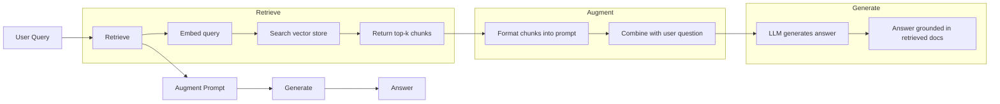
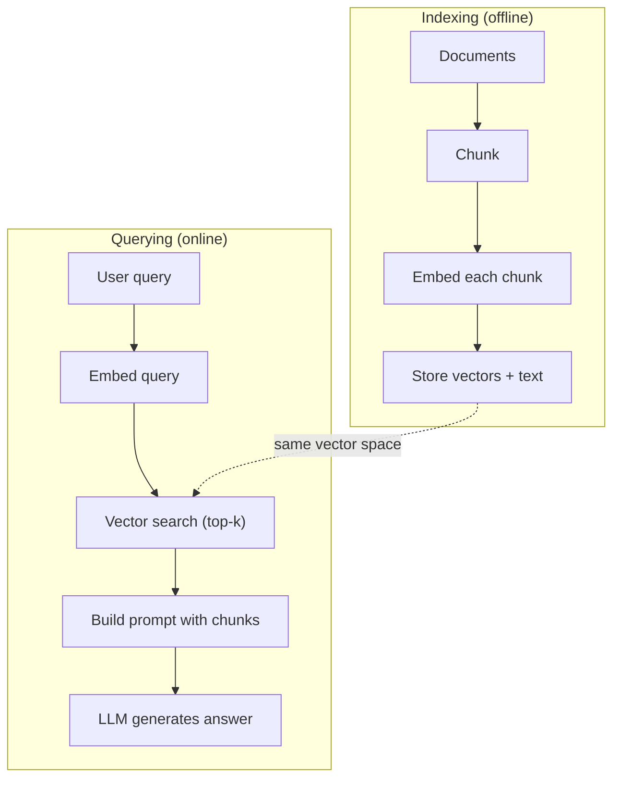

# RAG (Generación aumentada por recuperación)

> Su LLM sabe todo antes de su entrenamiento. No entiende los documentos de su empresa, su código de base, ni los registros de las reuniones de la semana pasada.

**Type:** Build
**Languages:** Python
**Prerequisites:** Phase 10 (LLMs from Scratch), Phase 11 Lessons 01-05
**Time:** ~90 minutes
**Related:**Fase 5 · 23 (Estrategias de descomposición para RAG) 讲解六种 chunking 算法以及各自适用场景──Fase 5 · 22 (Embedding Models Deep Dive) 讲解如何选择嵌入器──Fase 11 · 07 (Advanced RAG) 讲解混合搜索、重排和查询转换──

## El objetivo del aprendizaje
- Construcción de un gasoducto RAG completo:carga de documentos, desmontaje, incorporación, almacenamiento de vectores, recuperación y generación
- Utiliza base de datos vectorial (ChromaDB、FAISS o Pinecone)并配合合适的索引, lograr búsqueda semántica
- explicar por qué en la aplicación basada en el conocimiento  RAG   mejor que la ajuste fino                                                                                                                                                                                                                                                                                                                                                                                                                                                                                                      
- Utiliza métricas de recuperación de datos y de generación de datos y de fidelidad y relevancia para evaluar la calidad de RAG

##  problemas
Usted construyó un chatbot para la empresa.  preguntas de clientes:  ¿Cuál es la política de devolución del programa empresarial?  LLM  dio una respuesta general sobre la política de devolución típica de SaaS  y la política práctica se encuentra en un wiki interno de 200 páginas, que establece que los clientes empresariales tienen 60 ventanas, y se puede devolver en proporción.

El ajuste fino es una solución. Toma este LLM, usa tu archivo interno para entrenarlo, y luego despliega un modelo nuevo. Es posible, pero hay problemas graves. El cálculo del ajuste fino puede llegar a miles de dólares.

RAG es otra solución. Mantener el modelo invariable. Cuando el problema entra, busque pasajes relacionados en su tienda de documentos, pegalos en el prompt de la primera página del problema, haga que el modelo se base en estos pasajes como contexto para responder.

## 概念
### El patrón RAG

Todo el modelo puede ser en general en cuatro pasos:



Encuesta -> Recuperar -> Prompt de aumento -> Generar。 Cada sistema RAG 系统都遵循这个模式。 Producción de niveles RAG 系统之间的差异体现在每步的细节中:如何分块、如何嵌入、如何搜索,以及如何构建提示──

### Por qué RAG es mejor que el ajuste fino

| Concern | Fine-tuning | RAG |
|---------|------------|-----|
| 成本 | 每次 training run 需要 $1,000-$100,000+ | 每次 query 约 $0.01-$0.10（embedding + LLM） |
| 新鲜度 | 重新训练前一直过时 | 通过重新 indexing docs，可在几分钟内更新 |
| 可审计性 | 无法追踪 answer 到 source | 可以展示准确检索到的 passages |
| Hallucination | 仍然会自由 hallucinate | 基于检索到的 documents |
| 数据隐私 | training data 被烘焙进 weights | documents 留在你的 vector store 中 |

La ajuste fino de los pesos del modelo permanente. La RAG cambia el contexto del modelo temporal. Para la mayoría de las aplicaciones, el contexto temporal es lo que quieres.

La única situación en la que se puede lograr el ajuste fino es que se necesita un modelo que adopte un estilo, un lenguaje o un modelo de reflexión específicos, pero esto no puede lograrse simplemente por medio de la solicitud de información.

### Incluir modelos

Modelo de incorporación 会把文本转换成密集向量──相似文本会在这个高维空间产生彼此接近的向量──Cómo restablezco mi contraseña? 和 Necesito cambiar mi contraseña 尽管共享的词很少,却会产生几乎相同的向量── El gato sentado en la alfombra 则会产生非常不同的向量──

常见嵌入型号 (enlace habitual) 2026 阵容  完整分析见 Fase 5 · 22):

| Model | Dimensions | Provider | Notes |
|-------|-----------|----------|-------|
| text-embedding-3-small | 1536 (Matryoshka) | OpenAI | 适合大多数用例的最佳性价比 |
| text-embedding-3-large | 3072 (Matryoshka) | OpenAI | 更高准确率，可截断到 256/512/1024 |
| Gemini Embedding 2 | 3072 (Matryoshka) | Google | 顶级 MTEB retrieval；8K context |
| voyage-4 | 1024/2048 (Matryoshka) | Voyage AI | 领域变体（code、finance、law） |
| Cohere embed-v4 | 1024 (Matryoshka) | Cohere | 强 multilingual，128K context |
| BGE-M3 | 1024 (dense + sparse + ColBERT) | BAAI (open-weight) | 一个模型提供三种视图 |
| Qwen3-Embedding | 4096 (Matryoshka) | Alibaba (open-weight) | 顶级 open-weight retrieval score |
| all-MiniLM-L6-v2 | 384 | Open-weight (Sentence Transformers) | prototyping baseline |

En esta clase, usamos TF-IDF para construir nuestra propia simple incorporación. No es porque TF-IDF sea un programa que se utiliza en el sistema de producción, sino porque hace que el concepto sea concreto: texto de entrada, vector de salida, similar a texto para producir vectores similares.

### Similaridad vectorial

 Dado dos vectores, ¿cómo medir la similitud?

**Cosine similarity**: dos vectores 之间角的余弦值──范围从 -1(相反) 到 1(完全相同)──忽略 magnitud, sólo se concentra en la dirección──这是RAG's默认选择──

```
cosine_sim(a, b) = dot(a, b) / (||a|| * ||b||)
```

**Dot product**: producto interno original. Vectores más grandes obtendrán un número más alto. Cuando la magnitud de los datos llevados a cabo es útil.

```
dot(a, b) = sum(a_i * b_i)
```

**L2 (Euclidean) distance**:espacio vectorial en el centro de la línea recta.

```
L2(a, b) = sqrt(sum((a_i - b_i)^2))
```

La similitud cosínica es el estándar de selección. A través de la magnitud, puede ser fácil de tratar en diferentes documentos de diferentes dimensiones.

### Estrategias para deshacerse

Los documentos 太长, no pueden ser incorporados como un solo vector. Un PDF de 50 páginas puede producir una embebedida muy mala, ya que contiene varias docenas de temas.

**Fixed-size chunking**Cada N 个代币 拆分一次──简单且可预测── una pieza de 512 tokens 配合50 tokens 重叠, significa que el pieza 1 es tokens 0-511, el pieza 2 es tokens 462-973, en este tipo de sugerencias──overlap 确保 usted no estará en la frontera de no circulación en la sección de corte de la frase──

**Semantic chunking**En la naturaleza, los elementos de la línea de referencia son más complejos, pero la recuperación de los resultados es mejor.

**Recursive chunking**Si un párrafo sigue siendo demasiado grande, debe separarse según los límites de la oración. Este es el método de LangChain Recursive CharacterTextSplitter, en la práctica es muy bueno.

El tamaño de la pieza es más importante que lo que la gente imagina:

- 太小(64-128 tokens): cada pieza 缺乏 contexto。Aumentó un 15% el trimestre pasado Si no sabes it指什么,就没有意义──
- 太大(2048+ tokens): cada pieza 覆盖多主题,稀释相关性── Cuando buscas datos de ingresos 时, obtienes un 10% 关于收入、90% 关于人数的部分──
- 理想范围(256-512 tokens):context 足够自包含,同时足够聚焦以保持相关性──

La mayoría de la producción de RAG 系统 utiliza 256-512 trozos de tokens,并配 50 tokens superposición。Antropic RAG 指南推这个范围──

### Base de datos de vectores

Una vez que hay embebidos, necesitas un lugar para almacenar y buscarlos.

| Database | Type | Best for |
|----------|------|----------|
| FAISS | Library (in-process) | Prototyping，中小型 datasets |
| Chroma | Lightweight DB | 本地开发，小型部署 |
| Pinecone | Managed service | 无需运维负担的生产环境 |
| Weaviate | Open source DB | 自托管生产环境 |
| pgvector | Postgres extension | 已经在使用 Postgres |
| Qdrant | Open source DB | 高性能自托管 |

En esta clase, construiremos una simple tienda de vectores en memoria. Coloca vectores en la lista de existencias, y realiza búsquedas de similitud cosinales de fuerza bruta. Esto equivale a usar un índice de FAISS plano.

### El oleoducto completo



En el contexto de la producción, la indexación puede requerir el procesamiento de millones de documentos en cuestión de horas.

### Números reales

La mayoría de las RAG de producción utilizan estos parámetros:

- **k = 5 to 10**: por cada consulta 检索的块 数量
- **Chunk size = 256 to 512 tokens**,并配 50 tokens se superponen
- **Context budget**: por cada consulta utiliza contenido recuperado de 2500 a 5.000 tokens
- **Total prompt**: aproximadamente 8.000-16.000 tokens(promete del sistema + trozos recuperados + historial de conversaciones + consulta del usuario)
- **Embedding dimension**3:84-3072, depende del modelo
- **Indexing throughput**: utilizar API de embebedidos 时每秒 100-1,000 documentos
- **Query latency**:recuperar 50-200ms, generación 500-3000ms


```figure
rag-chunking
```

## Construirlo
### Paso 1: Desguace de documentos

```python
def chunk_text(text, chunk_size=200, overlap=50):
    words = text.split()
    chunks = []
    start = 0
    while start < len(words):
        end = start + chunk_size
        chunk = " ".join(words[start:end])
        chunks.append(chunk)
        start += chunk_size - overlap
    return chunks
```

### 步骤 2: Embedings de la TF-IDF

Construimos una función de incorporación simple. TF-IDF (Term Frequency-Inverse Document Frequency) no es una incorporación neuronal, pero puede capturar la importancia de los textos en un método de transformación de textos en vectores.

```python
import math
from collections import Counter

def build_vocabulary(documents):
    vocab = set()
    for doc in documents:
        vocab.update(doc.lower().split())
    return sorted(vocab)

def compute_tf(text, vocab):
    words = text.lower().split()
    count = Counter(words)
    total = len(words)
    return [count.get(word, 0) / total for word in vocab]

def compute_idf(documents, vocab):
    n = len(documents)
    idf = []
    for word in vocab:
        doc_count = sum(1 for doc in documents if word in doc.lower().split())
        idf.append(math.log((n + 1) / (doc_count + 1)) + 1)
    return idf

def tfidf_embed(text, vocab, idf):
    tf = compute_tf(text, vocab)
    return [t * i for t, i in zip(tf, idf)]
```

### 步骤 3: búsqueda de similitud de cosinos

```python
def cosine_similarity(a, b):
    dot = sum(x * y for x, y in zip(a, b))
    norm_a = math.sqrt(sum(x * x for x in a))
    norm_b = math.sqrt(sum(x * x for x in b))
    if norm_a == 0 or norm_b == 0:
        return 0.0
    return dot / (norm_a * norm_b)

def search(query_embedding, stored_embeddings, top_k=5):
    scores = []
    for i, emb in enumerate(stored_embeddings):
        sim = cosine_similarity(query_embedding, emb)
        scores.append((i, sim))
    scores.sort(key=lambda x: x[1], reverse=True)
    return scores[:top_k]
```

### Paso 4: Construcción rápida

Éste es el lugar donde ocurre en RAG augmented . . ..............................................................................................................................................................................................................................................

```python
def build_rag_prompt(query, retrieved_chunks):
    context = "\n\n---\n\n".join(
        f"[Source {i+1}]\n{chunk}"
        for i, chunk in enumerate(retrieved_chunks)
    )
    return f"""Answer the question based ONLY on the following context.
If the context doesn't contain enough information, say "I don't have enough information to answer that."

Context:
{context}

Question: {query}

Answer:"""
```

### 步骤 5: El oleoducto RAG completo

```python
class RAGPipeline:
    def __init__(self):
        self.chunks = []
        self.embeddings = []
        self.vocab = []
        self.idf = []

    def index(self, documents):
        all_chunks = []
        for doc in documents:
            all_chunks.extend(chunk_text(doc))
        self.chunks = all_chunks
        self.vocab = build_vocabulary(all_chunks)
        self.idf = compute_idf(all_chunks, self.vocab)
        self.embeddings = [
            tfidf_embed(chunk, self.vocab, self.idf)
            for chunk in all_chunks
        ]

    def query(self, question, top_k=5):
        query_emb = tfidf_embed(question, self.vocab, self.idf)
        results = search(query_emb, self.embeddings, top_k)
        retrieved = [(self.chunks[i], score) for i, score in results]
        prompt = build_rag_prompt(
            question, [chunk for chunk, _ in retrieved]
        )
        return prompt, retrieved
```

### 步骤 6: Generación (simulada)

En el entorno de producción, aquí se recurrirá a la API LLM. En esta clase, hemos extraído las frases más relevantes para la generación de simulaciones, pasando del contexto de la investigación hasta la producción.

```python
def simple_generate(prompt, retrieved_chunks):
    query_words = set(prompt.lower().split("question:")[-1].split())
    best_sentence = ""
    best_score = 0
    for chunk in retrieved_chunks:
        for sentence in chunk.split("."):
            sentence = sentence.strip()
            if not sentence:
                continue
            words = set(sentence.lower().split())
            overlap = len(query_words & words)
            if overlap > best_score:
                best_score = overlap
                best_sentence = sentence
    return best_sentence if best_sentence else "I don't have enough information."
```

## Usalo
Utiliza real embedding model 和 LLM 时,代码几乎不变:

```python
from openai import OpenAI

client = OpenAI()

def embed(text):
    response = client.embeddings.create(
        model="text-embedding-3-small",
        input=text
    )
    return response.data[0].embedding

def generate(prompt):
    response = client.chat.completions.create(
        model="gpt-4o-mini",
        messages=[{"role": "user", "content": prompt}],
        temperature=0
    )
    return response.choices[0].message.content
```

O usar Anthropic:

```python
import anthropic

client = anthropic.Anthropic()

def generate(prompt):
    response = client.messages.create(
        model="claude-sonnet-4-20250514",
        max_tokens=1024,
        messages=[{"role": "user", "content": prompt}]
    )
    return response.content[0].text
```

pipeline es igual de... sustituir la función de embebido... sustituir la función de generación... recuperar la lógica... cunking... construcción rápida...

Para el almacenamiento de vectores a gran escala, utilizar una base de datos de vectores adaptada  sustituir la búsqueda de fuerza bruta:

```python
import chromadb

client = chromadb.Client()
collection = client.create_collection("my_docs")

collection.add(
    documents=chunks,
    ids=[f"chunk_{i}" for i in range(len(chunks))]
)

results = collection.query(
    query_texts=["What is the refund policy?"],
    n_results=5
)
```

Chroma 会在内部处理嵌入式 (默认使用全-MiniLM-L6-v2),并把向量 存储在本地数据库中──同样模式,不同的管道实现──

##  entregarlo
Encuentro de trabajo:
- `outputs/prompt-rag-architect.md` Un prompt de RAG 系统 para diseño de casos específicos
- `outputs/skill-rag-pipeline.md` Un agente de formación  Cómo construir y modificar los oleoductos RAG

##  ejercicios
1. Use simple bag-of-words 方法替换TF-IDF embedings(二值:词存在则为1,不存在则为0) ―― en los documentos de muestra 上比较检索质量──TF-IDF 应该表现更好,因为它会给罕见词更高权重──

2. 试验不同分量: en el mismo conjunto de documentos 上尝试 50、100、200 和 500 palabras。 para cada tamaño, ejecutar las mismas 5 consultas,并统计有多少能返回相关分量在前3中── encontrar la calidad de recuperación 达到峰值的甜点──

3. Para cada pieza 添加元数据 (en inglés) ]]> Nombre del documento fuente ]]> posición del pieza) ]]> Modificar la plantilla de solicitud 以包含源属性,让LLM 引用其来源──

4. 实现 una evaluación simple: dar 10 pares de preguntas y respuestas, hacer que cada pregunta 通过RAG管道,并衡量检索到的块中有多少比例含答──这是回忆在k──

5. Construir un canal de RAG con conocimiento de conversaciones:维护最近3轮交易的历史,并将其与检索的块 一起包含在快速中──使用后续问题 测试,例如在询问价格 后再问 ¿Qué pasa con la empresa?──

## 关键术语: "El hombre es un hombre"
| Term | What people say | What it actually means |
|------|----------------|----------------------|
| RAG | “能阅读你文档的 AI” | 检索相关 documents，把它们粘贴到 prompt 中，并生成一个基于这些 documents 的 answer |
| Embedding | “把文本转换成数字” | 文本的 dense vector representation，其中相似含义会产生相似 vectors |
| Vector database | “面向 AI 的搜索引擎” | 为存储 vectors 并按 similarity 找到 nearest neighbors 而优化的数据存储 |
| Chunking | “把 docs 拆成片段” | 将 documents 拆成更小的 segments（通常 256-512 tokens），以便每个 segment 可以独立 embed 和 retrieve |
| Cosine similarity | “两个 vectors 有多相似” | 两个 vectors 之间夹角的余弦值；1 = 方向相同，0 = 正交，-1 = 相反 |
| Top-k retrieval | “取 k 个最佳匹配” | 从 vector store 中返回与 query 最相似的 k 个 chunks |
| Context window | “LLM 能看到多少文本” | LLM 在单次请求中可以处理的最大 tokens 数；retrieved chunks 必须放入这个范围内 |
| Augmented generation | “使用给定 context 回答” | 使用检索到的 documents 作为 context 来生成响应，而不是仅依赖训练得到的知识 |
| TF-IDF | “词语重要性评分” | Term Frequency 乘以 Inverse Document Frequency；根据词语在 corpus 中的区分度为其加权 |
| Indexing | “为搜索准备 docs” | 离线执行 chunking、embedding 和 storing documents 的过程，使它们能在 query time 被搜索 |

## 延伸阅读
- Lewis et al., Retrieval-Augmented Generation for Knowledge-Intensive NLP Tasks (2020)  Facebook AI Research 提出的原始 RAG 论文,形式化了回收-then-generate 模式
- Documentación de RAG de Anthropic (docs.anthropic.com)                                                                                                                                                                                                                                                     
- Centro de Aprendizaje Pinecone, ¿Qué es RAG?    Use clara可视化解释 RAG pipeline,并包含生产环境考量
- Sentencia-BERT: Reimers & Gurevych (2019)  todos los modelos de incorporación MiniLM 背后的论文,展示如何为语义相似之 训练双码器
- [Karpukhin et al., “Dense Passage Retrieval for Open-Domain Question Answering” (EMNLP 2020)](https://arxiv.org/abs/2004.04906) DPR 论文, prueba densa de retrieval de bi-encoder en el dominio abierto QA 上优于 BM25,并确立了现代RAG retrievers的模式──
- [LlamaIndex High-Level Concepts](https://docs.llamaindex.ai/en/stable/getting_started/concepts.html) Construir tuberías RAG 时需要了解的主要概念:cargadores de datos, parseres de nodos, índices, retrievers, sintetizadores de respuesta,
- [LangChain RAG tutorial](https://python.langchain.com/docs/tutorials/rag/) 另一种风格的管弦乐员;以 cadena de ejecutantes 视角理解同一个检索然后生成模式──
