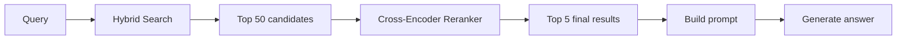
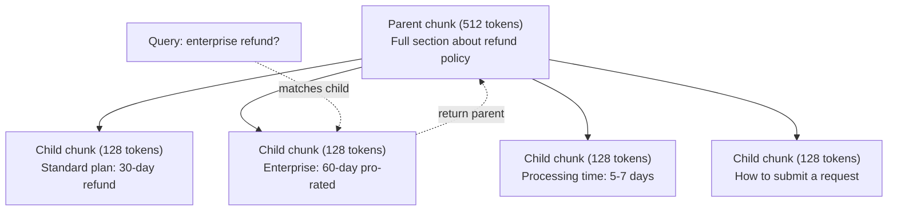
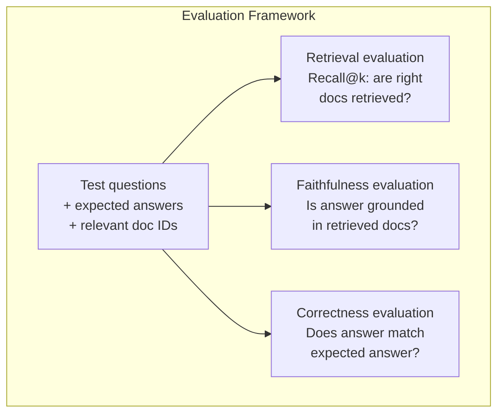

# RAG avanzado ((Chunking、Ranking、Hybrid Search)

> RAG básica se encuentra en el top-k más similar. Esto es válido para un simple problema. Pero en el caso de la racionalización multi-hop, la pregunta está en la mala dirección.

**类型：**Construcción
**语言：**Python
**前置要求：**Fase 11, Lección 06 (RAG)
**时间：**- 90 minutos
**相关：**La fase 5 · 23 (Estrategias de descomposición para RAG)                                                                                                                                                                                                                                                                                                                                                                                                                                                                                                            

## El objetivo del aprendizaje

- 实现能够保留文档结构和上下文的先进分碎策略 语义,递归,家长-孩子)
- Construir una tubería de búsqueda híbrida, combinar BM25 palabras clave con búsqueda semántica vectorial y reencoder cross-ranker 结合起来
- 应用 query transformation 技术(HyDE、multi-query、step-back), mejorar la forma o el resultado de la búsqueda de problemas complejos
- 诊断并修复常见 RAG 失败:检索到错误分片、答案不在背景 中、多跳推理 崩

##  problemas

Usted construyó un oleoducto básico de RAG en la lección 06 .

**模糊 query**:"¿Qué fue el ingreso el trimestre pasado?" Buscar semántico  Retorno sobre la estrategia de ingresos ‒proyecciones de ingresos, así como CFO ‒ por el crecimiento de ingresos ‒ los cuales están relacionados con la palabra "ingreso" ‒ por el contrario ‒ pero no contienen números reales ‒ por el contrario ‒ el artículo es "$47.2M in Q3 2025"，但使用的是 "earnings" 而不是 "revenue"。Embedding model 认为 "revenue strategy" 比 "Q3 earnings were $47.2M" más cerca de la consulta.

**Multi-hop question**:"¿Qué equipo tuvo la mejor mejoría de la calificación de satisfacción del cliente?"  Necesita encontrar la calificación de satisfacción de cada equipo, hacer comparaciones, y identificar el valor máximo.

**大规模 corpus 问题**Tu top-5 de recuperación ha sacado el pieza #14、#89,201、#1,200,000、#44 y #901,333── se acercan en el espacio de inserción, pero no contienen una respuesta── en esta escala, la búsqueda más cercana del vecino aproximada introducirá suficientes errores, lo que lleva a que los resultados relacionados sean eliminados de la parte superior k─

RAG  fracaso de la causa básica es la similitud vectorial no es igual a la correlación. Un fragmento puede ser en sentido literal similar a la consulta, pero para responder a la pregunta no ayuda. RAG avanzado utiliza cuatro técnicas para resolver este problema: búsqueda híbrida (incluye la combinación de palabras clave)  re-ranking (más detenidamente a un candidato 打分)  transformación de la consulta (en búsqueda pre-modificación de la consulta), así como un mejor fragmento (en búsqueda de la investigación de granulometría) 

## 核心概念 核心概念 核心概念 核心概念

### Buscar híbrido: semántica + palabra clave

Busca semántica(Similaridad vectorial)擅长理解含义──"¿Cómo cancelar mi suscripción?" 即使与"Mejores pasos para cancelar tu plan" 没有共享单词,也能匹配──但它会漏掉精确匹配──"Código de error E-4021"可能不能匹配包含"E-4021"的部分,因为嵌入式可能把它当作噪声──

Buscar palabras clave(BM25) es bueno en su contraposición.

Buscar híbrido irá a la vez, y luego juntar los resultados.

**BM25**(Best Matching 25) es el algoritmo estándar de búsqueda de palabras clave. Desde los años 90, ha sido el núcleo del motor de búsqueda.

```
BM25(q, d) = sum over terms t in q:
    IDF(t) * (tf(t,d) * (k1 + 1)) / (tf(t,d) + k1 * (1 - b + b * |d| / avgdl))
```

Entre ellos tf(t,d) es el término t, en el documento d. En el documento d) es el término frecuencia, IDF(t) es la frecuencia del documento inversa, el tiempo de la información es el largo del documento, avgdl es el largo promedio del documento, k1  control término frecuencia saturación(默认 1.2), b 控制 longitud normalización(默认 0.75)。

Como se dice en el pasado: cuando el archivo contiene un término de consulta (especialmente un término raro), el BM25 le da un porcentaje más alto, pero el beneficio del término de repetición es menor.

### Fusión de rango recíproco (RRF)

¿Tienes dos listas clasificadas: una de búsqueda vectorial, otra de BM25... ¿cómo combinarlas?

```
RRF_score(d) = sum over rankings R:
    1 / (k + rank_R(d))
```

Entre ellos k es un número constante (normalmente 60), para evitar que los resultados de la clasificación primero tomen demasiadas ventajas.

Un en búsqueda de vectores en la clasificación #1 ≠ BM25 en la clasificación #5 ≠ 0

Un en búsqueda de vectores en la clasificación #3 ≠ BM25 en la clasificación #2 ≠ 0

RRF encontrará un equilibrio natural entre estos dos tipos de señales. Un archivo que se clasifique en dos listas obtendrá el mejor puntaje. Un archivo que se clasifique en una lista obtendrá el número uno en una lista, pero el archivo que se carezca en otra lista obtendrá un número medio de puntos. Esto es muy estable, ya que utiliza el ranking, en lugar de los puntos originales, por lo que las diferencias en la distribución de los puntos entre los dos sistemas no afectarán.

### Reincorporación

Recuperación (en inglés) (en inglés) (en inglés) (en inglés) (en inglés) (en inglés) (en inglés) (en inglés) (en inglés) (en inglés) (en inglés) (en inglés) (en inglés) (en inglés) (en inglés) (en inglés) (en inglés) (en inglés) (en inglés) (en inglés) (en inglés) (en inglés) (en inglés) (en inglés) (en inglés) (en inglés) (en inglés) (en inglés) (en inglés) (en inglés) (en inglés) (en inglés) (en inglés) (en inglés) (en inglés) (en inglés) (en inglés) (en inglés) (en inglés) (en inglés) (en inglés) (en inglés) (en inglés) (en inglés) (en inglés) (en inglés) (en inglés) (en inglés) (en inglés) (en inglés) (en inglés) (en inglés) (en inglés) (en inglés) (en inglés) (en inglés) (en inglés) (en inglés) (en inglés) (en inglés) (en inglés) (en inglés) (en inglés) (en inglés) (en inglés) (en inglés) (en inglés) (en inglés) (en inglés) (en inglés) (en inglés) (en inglés) (en inglés) (en inglés) (en inglés) (en inglés) (en inglés) (en inglés) (en inglés) (en) (en inglés) (en inglés) (en inglés) (en inglés) (en inglés) (en anglais) (en anglais) (en anglais) (en anglais) (en anglais) (en anglaislaislaislaislaislaislaislaislaislaislaislaislaislaislaislaislaislaislaislaislaislaislaislaislaislaislaislaislaislaislaislaislaislaislaislaislaislaislaislaislaislaislaislaislaislaislaislaislaislaislaislaislaislaislaislaislaislais).

Rango de clasificación Utilización de codificador cruzado:query 和 candidato document 会一起输入模型,模型输出相关性分数――模型能同时看到两段文本,因此可以捕捉它们之间的细粒度交互――Cross-encoder 能理解"Cuáles fueron los ingresos del tercer trimestre?"

权衡是:cross-encoder es 100-1000 veces más lento que bi-encoder, ya que requiere un conjunto de procesamiento de par de consultas-documentos.



常见 relanzamiento modelo(2026 阵容):
- Cohere Rerank 3.5: API administrada,多语言, en el corpus mixto
- Rencontre de viaje-2.5:API administrada,la latencia en los proyectos de gestión,minimo
- Jina-Reranker-v2 Multilingüe:open-weight,支持 100+ 语言
- bge-renquer-v2-m3: peso abierto, línea de base fuerte
- código cruzado/ms-marco-MiniLM-L-6-v2: peso abierto, puede funcionar en la CPU, adaptado a la creación de prototipos
- ColBERTv2 / Jina-ColBERT-v2: retrasado de interacción re-ranqueador multi-vector, en el tiempo de evaluación son O(tokens) y no O(docs)

### Transformación de la consulta

Hay veces el problema no es la recuperación, sino en la consulta en sí misma. "¿Qué fue eso del nuevo cambio de política?" es una pregunta de búsqueda muy mala. No contiene ningún término concreto.

**Query rewriting**:把用户查询 改写成更好的搜索查询――LLM puede hacer esto:

```
User: "What was that thing about the new policy change?"
Rewritten: "Recent policy changes and updates"
```

**HyDE（Hypothetical Document Embeddings）**No se utiliza la consulta, sino que se utiliza una respuesta hipotética, se incrusta en ella, y luego se busca similar a la verdadera documentación.

```
Query: "What is the refund policy for enterprise?"
Hypothetical answer: "Enterprise customers are eligible for a full refund
within 60 days of purchase. Refunds are pro-rated based on the remaining
subscription period and processed within 5-7 business days."
```

Para hacer una respuesta hipotética Embedding, y buscar en el archivo real similar a él. Invicio es:相比原始問題, ipotetic answer 在 Embedding 空间中更接近真答案──问题和答案具有不同的语言结构──通过生成假答,你在 Embedding 中架建立了"question space"和"answer space"之间的桥梁──

HyDE 会在检索前增加一次LLM调调――这将增加500-2000ms latency――当原始查询检索质量较差时,这是值得的――

### Los padres y los hijos se deshacen

标准 chunking 迫使你做取舍: pequeño pedazo Usó para la recuperación precisa, gran pedazo Usó para proporcionar suficiente contexto.

索引小块(128 tokens) para la recuperación. Cuando se recomienda a la pequeña parte, devuelve su parte matriz.



¿La pregunta "reembolso de la empresa?" 会精确匹配儿童部分 C2――但提示 收到的是完整的父母部分 P,其中包含关于处理时间和提交流程的周边背景──

### Filtración de metadatos

En la búsqueda vectorial, antes de hacer la búsqueda, se puede hacer un corpus de metadatos, como: fecha, fuente, categoría, autor, lenguaje, esto reduce el espacio de búsqueda y evita los resultados.

"Qué cambió en la política de seguridad el mes pasado?"  debería sólo buscar en la última 30 天、categoría de seguridad 中的文档──Si no hay filtración de metadatos, buscará todo el corpus, puede buscar en un documento de seguridad de hace 2 años, simplemente porque es similar en sentido común──

Producción RAG 系统将将将元数据与每个块一个起存储:document来源、创建日期、类别、作者、版本──Vector database 支持在相似性搜索 前按元数据 进行预过, esto es esencial para el rendimiento a gran escala──

### Evaluación

¿Has construido un sistema RAG? ¿Cómo saber si es efectivo?

**Retrieval relevance（Recall@k）**Para un grupo de preguntas de prueba con documentos relacionados conocidos, ¿cuál es la proporción de documentos relacionados que aparecen en el top k? ¿Si la respuesta a una pregunta está en el número 47, el número 47 se encuentra en el top 5?

**Faithfulness**Si la pieza de la búsqueda es "ventana de reembolso de 60 días", mientras que el modelo responde "ventana de reembolso de 90 días", esto es fidelidad 失败―, el modelo sigue alucinando en el contexto correcto―.

**Answer correctness**¿Es que la respuesta generada coincide con la respuesta esperada? es un indicador de extremo a extremo.

Una simple fidelidad 检查:取生成答案中的每个索赔,并验证它是否(实质上) aparece en el pedazo recuperado. Si la respuesta contiene cualquier pedazo recuperado en el que no hay hechos, es muy probable que sea alucinado.




```figure
agentic-rag-loop
```

## Construcción

### 步骤 1:BM25  realización

```python
import math
from collections import Counter

class BM25:
    def __init__(self, k1=1.2, b=0.75):
        self.k1 = k1
        self.b = b
        self.docs = []
        self.doc_lengths = []
        self.avg_dl = 0
        self.doc_freqs = {}
        self.n_docs = 0

    def index(self, documents):
        self.docs = documents
        self.n_docs = len(documents)
        self.doc_lengths = []
        self.doc_freqs = {}

        for doc in documents:
            words = doc.lower().split()
            self.doc_lengths.append(len(words))
            unique_words = set(words)
            for word in unique_words:
                self.doc_freqs[word] = self.doc_freqs.get(word, 0) + 1

        self.avg_dl = sum(self.doc_lengths) / self.n_docs if self.n_docs else 1

    def score(self, query, doc_idx):
        query_words = query.lower().split()
        doc_words = self.docs[doc_idx].lower().split()
        doc_len = self.doc_lengths[doc_idx]
        word_counts = Counter(doc_words)
        score = 0.0

        for term in query_words:
            if term not in word_counts:
                continue
            tf = word_counts[term]
            df = self.doc_freqs.get(term, 0)
            idf = math.log((self.n_docs - df + 0.5) / (df + 0.5) + 1)
            numerator = tf * (self.k1 + 1)
            denominator = tf + self.k1 * (1 - self.b + self.b * doc_len / self.avg_dl)
            score += idf * numerator / denominator

        return score

    def search(self, query, top_k=10):
        scores = [(i, self.score(query, i)) for i in range(self.n_docs)]
        scores.sort(key=lambda x: x[1], reverse=True)
        return scores[:top_k]
```

### 步骤 2: Fusión de rango recíproco

```python
def reciprocal_rank_fusion(ranked_lists, k=60):
    scores = {}
    for ranked_list in ranked_lists:
        for rank, (doc_id, _) in enumerate(ranked_list):
            if doc_id not in scores:
                scores[doc_id] = 0.0
            scores[doc_id] += 1.0 / (k + rank + 1)
    fused = sorted(scores.items(), key=lambda x: x[1], reverse=True)
    return fused
```

### Paso 3: Pipeline de búsqueda híbrida

```python
def hybrid_search(query, chunks, vector_embeddings, vocab, idf, bm25_index, top_k=5, fusion_k=60):
    query_emb = tfidf_embed(query, vocab, idf)
    vector_results = search(query_emb, vector_embeddings, top_k=top_k * 3)
    bm25_results = bm25_index.search(query, top_k=top_k * 3)
    fused = reciprocal_rank_fusion([vector_results, bm25_results], k=fusion_k)
    return fused[:top_k]
```

### Paso 4: Simple Reranker

En la producción, usamos un modelo de codificación cruzada. Aquí construimos un re-ranqueador, usando la superposición de palabras, la importancia de los términos y la combinación de frases.

```python
def rerank(query, candidates, chunks):
    query_words = set(query.lower().split())
    stop_words = {"the", "a", "an", "is", "are", "was", "were", "what", "how",
                  "why", "when", "where", "do", "does", "for", "of", "in", "to",
                  "and", "or", "on", "at", "by", "it", "its", "this", "that",
                  "with", "from", "be", "has", "have", "had", "not", "but"}
    query_terms = query_words - stop_words

    scored = []
    for doc_id, initial_score in candidates:
        chunk = chunks[doc_id].lower()
        chunk_words = set(chunk.split())

        term_overlap = len(query_terms & chunk_words)

        query_bigrams = set()
        q_list = [w for w in query.lower().split() if w not in stop_words]
        for i in range(len(q_list) - 1):
            query_bigrams.add(q_list[i] + " " + q_list[i + 1])
        bigram_matches = sum(1 for bg in query_bigrams if bg in chunk)

        position_boost = 0
        for term in query_terms:
            pos = chunk.find(term)
            if pos != -1 and pos < len(chunk) // 3:
                position_boost += 0.5

        rerank_score = (
            term_overlap * 1.0
            + bigram_matches * 2.0
            + position_boost
            + initial_score * 5.0
        )
        scored.append((doc_id, rerank_score))

    scored.sort(key=lambda x: x[1], reverse=True)
    return scored
```

### 步骤 5:HyDE(Inmoblidaciones de documentos hipotéticos)

```python
def hyde_generate_hypothesis(query):
    templates = {
        "what": "The answer to '{query}' is as follows: Based on our documentation, {topic} involves specific policies and procedures that define how the process works.",
        "how": "To address '{query}': The process involves several steps. First, you need to initiate the request. Then, the system processes it according to the defined rules.",
        "default": "Regarding '{query}': Our records indicate specific details and policies related to this topic that provide a comprehensive answer."
    }
    query_lower = query.lower()
    if query_lower.startswith("what"):
        template = templates["what"]
    elif query_lower.startswith("how"):
        template = templates["how"]
    else:
        template = templates["default"]

    topic_words = [w for w in query.lower().split()
                   if w not in {"what", "is", "the", "how", "do", "does", "a", "an",
                                "for", "of", "to", "in", "on", "at", "by", "and", "or"}]
    topic = " ".join(topic_words) if topic_words else "this topic"

    return template.format(query=query, topic=topic)


def hyde_search(query, chunks, vector_embeddings, vocab, idf, top_k=5):
    hypothesis = hyde_generate_hypothesis(query)
    hypothesis_emb = tfidf_embed(hypothesis, vocab, idf)
    results = search(hypothesis_emb, vector_embeddings, top_k)
    return results, hypothesis
```

### Paso 6: Parente-Hijo de la Chunking

```python
def create_parent_child_chunks(text, parent_size=200, child_size=50):
    words = text.split()
    parents = []
    children = []
    child_to_parent = {}

    parent_idx = 0
    start = 0
    while start < len(words):
        parent_end = min(start + parent_size, len(words))
        parent_text = " ".join(words[start:parent_end])
        parents.append(parent_text)

        child_start = start
        while child_start < parent_end:
            child_end = min(child_start + child_size, parent_end)
            child_text = " ".join(words[child_start:child_end])
            child_idx = len(children)
            children.append(child_text)
            child_to_parent[child_idx] = parent_idx
            child_start += child_size

        parent_idx += 1
        start += parent_size

    return parents, children, child_to_parent
```

### 步骤 7: Evaluación de la fidelidad

```python
def evaluate_faithfulness(answer, retrieved_chunks):
    answer_sentences = [s.strip() for s in answer.split(".") if len(s.strip()) > 10]
    if not answer_sentences:
        return 1.0, []

    grounded = 0
    ungrounded = []
    context = " ".join(retrieved_chunks).lower()

    for sentence in answer_sentences:
        words = set(sentence.lower().split())
        stop_words = {"the", "a", "an", "is", "are", "was", "were", "and", "or",
                      "to", "of", "in", "for", "on", "at", "by", "it", "this", "that"}
        content_words = words - stop_words
        if not content_words:
            grounded += 1
            continue

        matched = sum(1 for w in content_words if w in context)
        ratio = matched / len(content_words) if content_words else 0

        if ratio >= 0.5:
            grounded += 1
        else:
            ungrounded.append(sentence)

    score = grounded / len(answer_sentences) if answer_sentences else 1.0
    return score, ungrounded


def evaluate_retrieval_recall(queries_with_relevant, retrieval_fn, k=5):
    total_recall = 0.0
    results = []

    for query, relevant_indices in queries_with_relevant:
        retrieved = retrieval_fn(query, k)
        retrieved_indices = set(idx for idx, _ in retrieved)
        relevant_set = set(relevant_indices)
        hits = len(retrieved_indices & relevant_set)
        recall = hits / len(relevant_set) if relevant_set else 1.0
        total_recall += recall
        results.append({
            "query": query,
            "recall": recall,
            "hits": hits,
            "total_relevant": len(relevant_set)
        })

    avg_recall = total_recall / len(queries_with_relevant) if queries_with_relevant else 0
    return avg_recall, results
```

## Uso

Utiliza un verdadero codificador cruzado  realizar un nuevo rango:

```python
from sentence_transformers import CrossEncoder

reranker = CrossEncoder("cross-encoder/ms-marco-MiniLM-L-6-v2")

def rerank_with_cross_encoder(query, candidates, chunks, top_k=5):
    pairs = [(query, chunks[doc_id]) for doc_id, _ in candidates]
    scores = reranker.predict(pairs)
    scored = list(zip([doc_id for doc_id, _ in candidates], scores))
    scored.sort(key=lambda x: x[1], reverse=True)
    return scored[:top_k]
```

Utiliza el re-ranqueador administrado de Cohere:

```python
import cohere

co = cohere.Client()

def rerank_with_cohere(query, candidates, chunks, top_k=5):
    docs = [chunks[doc_id] for doc_id, _ in candidates]
    response = co.rerank(
        model="rerank-english-v3.0",
        query=query,
        documents=docs,
        top_n=top_k
    )
    return [(candidates[r.index][0], r.relevance_score) for r in response.results]
```

Utiliza verdadero LLM 实现 HyDE:

```python
import anthropic

client = anthropic.Anthropic()

def hyde_with_llm(query):
    response = client.messages.create(
        model="claude-sonnet-4-20250514",
        max_tokens=256,
        messages=[{
            "role": "user",
            "content": f"Write a short paragraph that would be a good answer to this question. Do not say you don't know. Just write what the answer would look like.\n\nQuestion: {query}"
        }]
    )
    return response.content[0].text
```

Utiliza Weaviate  realizar búsqueda híbrida de producción:

```python
import weaviate

client = weaviate.connect_to_local()

collection = client.collections.get("Documents")
response = collection.query.hybrid(
    query="enterprise refund policy",
    alpha=0.5,
    limit=10
)
```

alfa 参数控制平衡:0.0 = 纯键词(BM25),1.0 = 纯向量,0.5 = 等权重── la mayoría de la producción 系统使用0.3到0.7 之间的 alfa──

## 交付

Encuentro de trabajo:
- `outputs/prompt-advanced-rag-debugger.md`-- para el diagnóstico y la reparación de RAG  calidad de los problemas de inmediato
- `outputs/skill-advanced-rag.md`-- para construir habilidades RAG de producción de grado con búsqueda híbrida y recalificación

##  ejercicios

1. En el documento de muestra, compare con BM25、Buscar vectores y buscar híbridos―Para cada una de las 5 consultas de prueba, registre qué métodos están en la posición #1 Return the most relevant piece―Buscar híbridos 应至少在5中赢3个──

2. 实现 metadatos filter──为每份文件 添加一个"category" 字段(security、billing、api、product)──在运行Vector search 前,只过出相关类别的部分──用"Qué cifrado se utiliza?" 测试,并验证它只搜索安全类别的部分──

3. Utiliza Lesson 06 中的简单生成函数 构建完整HyDE pipeline──在全部 5 测试查询 上比较直接查询搜索与HyDE搜索的检索质量(top-3 relevancia)──HyDE 应能改善模糊查询的结果──

4. En el documento de muestra 上实现 parental-child chunking 策略──使用 child_size=30 和 parent_size=100──使用 child_size=100──搜索,但在快速中返回 parent chunk──将生成答案与 chunk_size=50 的标准 chunking 进行比较──

5. 创建评估数据集:10 个问题,带已知答案分别测量 (a) 仅Vector search,(b) 仅 BM25,(c) 混合搜索,(d) 混合+重排的 Recall@3、Recall@5 和 Recall@10──绘制结果,并识别重排 最有帮助的位置──

## 关键术语: "El hombre es un hombre"

| Term | 人们通常怎么说 | 实际含义 |
|------|----------------|----------------------|
| BM25 | "Keyword search" | 一种概率排序算法，根据 term frequency、inverse document frequency 和 document length normalization 给文档打分 |
| Hybrid search | "Best of both worlds" | 并行运行 semantic（Vector）search 和 keyword（BM25）search，然后用 rank fusion 合并结果 |
| Reciprocal Rank Fusion | "Merge ranked lists" | 对每个文档在所有列表中的 1/(k + rank) 求和，从而组合多个 ranked list |
| Reranking | "Second pass scoring" | 使用成本更高的 cross-encoder model，对 initial retrieval 得到的 candidate set 重新打分 |
| Cross-encoder | "Joint query-document model" | 将 query 和 document 作为单个输入并生成相关性分数的模型；比 bi-encoder 更准确，但对 full corpus search 来说太慢 |
| Bi-encoder | "Independent embedding model" | 独立对 query 和 document 做 Embedding 的模型；由于 Embedding 可预计算，因此速度快，但不如 cross-encoder 准确 |
| HyDE | "Search with a fake answer" | 为 query 生成 hypothetical answer，对其做 Embedding，并搜索与它相似的真实文档 |
| Parent-child chunking | "Small search, big context" | 为精确 retrieval 索引小 chunk，但返回更大的 parent chunk 以提供足够 context |
| Metadata filtering | "Narrow before searching" | 在运行 Vector search 前，根据属性（date、source、category）过滤文档以缩小搜索空间 |
| Faithfulness | "Did it stay grounded" | 生成答案是否由 retrieved document 支持，而不是来自模型训练数据的 hallucination |

## 延伸阅读

- Robertson & Zaragoza, "El marco de relevancia probabilística: BM25 y más allá" (2009) -- BM25's authority reference, explain公式背后的概率基础
- Cormack et al., "Fusión de rango recíproco supera a los métodos de aprendizaje de condorcet y rango individual" (2009) -- RRF 原始论文,展示它优于更复杂的融合方法
- Gao et al., "Precise Zero-Shot Dense Retrieval without Relevance Labels" (2022) -- HyDE 论文, proof hypothetical document Embeddings can improve retrieval without any training data
- Nogueira & Cho, "Re-ranking de pasaje con BERT" (2019) -- 展示在 BM25 之上进行跨编码重新排名能显著提升检索质量
- [Khattab et al., "DSPy: Compiling Declarative Language Model Calls into Self-Improving Pipelines" (2023)](https://arxiv.org/abs/2310.03714)-- va a construir rápidamente y la selección de peso 视为检索管道 上的优化问题; leer este artículo para entender "program LLM", en lugar de "prompt LLM".
- [Edge et al., "From Local to Global: A Graph RAG Approach to Query-Focused Summarization" (Microsoft Research 2024)](https://arxiv.org/abs/2404.16130)-- GraphRAG 论文: extracción de relaciones entre entidades + detección de la comunidad de Leiden, para la resumen centrada en la consulta; así como la recuperación global vs local.
- [Asai et al., "Self-RAG: Learning to Retrieve, Generate, and Critique through Self-Reflection" (ICLR 2024)](https://arxiv.org/abs/2310.11511)-- 带 reflexion tokens 的自评估 RAG;静态 retrieve-then-generate 后后的代理前沿──
- [LangChain Query Construction blog](https://blog.langchain.dev/query-construction/)-- 如何将自然语言查询 转换为结构数据库查询(Text-to-SQL、Cypher), como paso de recuperación previa。
