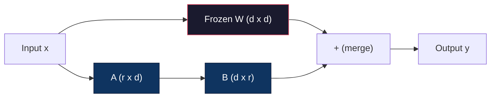
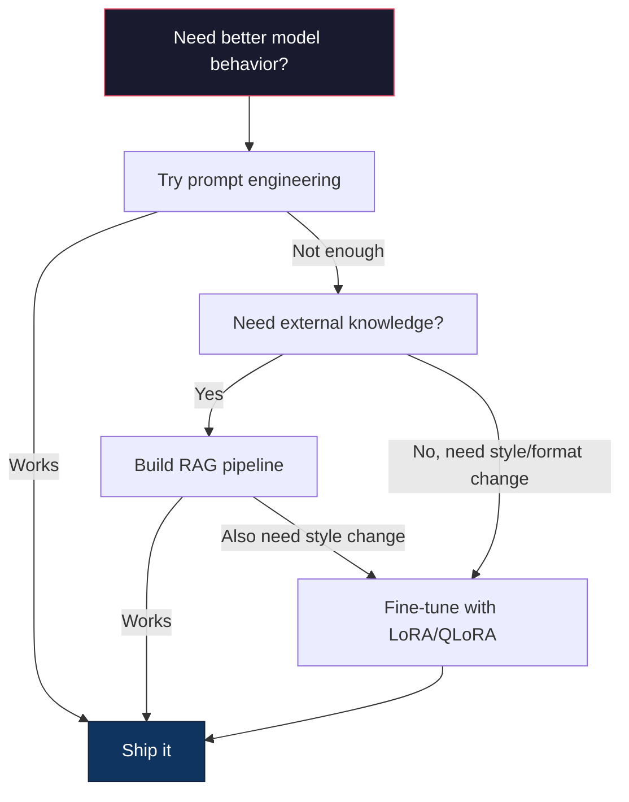

# Utiliza LoRA y QLoRA  realizar el ajuste fino

> Para un modelo 7B hacer un ajuste completo  necesita 56GB de VRAM。 no tienes tanto。 la mayoría de las compañías tampoco tiene。 LoRA                                                                                                                                                                                                                                                                                                                                                                                                                                                                                             

**Type:** Build
**Languages:** Python
**Prerequisites:** Phase 10, Lesson 06 (Instruction Tuning / SFT)
**Time:** ~75 minutes
**Related:**Fase 10 de la fase de la fase de la fase de la fase de la fase de la fase de la fase de la fase de la fase de la fase de la fase de la fase de la fase de la fase de la fase de la fase de la fase de la fase de la fase de la fase de la fase de la fase de la fase de la fase de la fase de la fase de la fase de la fase de la fase de la fase de la fase de la fase de la fase de la fase de la fase de la fase de la fase de la fase de la fase de la fase de la fase de la fase de la fase de la fase de la fase de la fase de la fase de la fase de la fase de la fase de la fase de la fase de la fase de la fase de la fase de la fase de la fase de la fase de la fase de la fase de la fase de la fase de la fase de la fase de la fase de la fase de la fase de la fase de la fase de la fase de la fase de la fase de la fase de la fase de la fase de la fase de la fase de la fase de la fase de la fase de la fase de la fase de la fase de la fase de la fase de la fase de la fase de la fase de la fase de la fase de la fase de la fase de la fase de la fase de la fase de la fase de la fase de la fase de la fase de la fase de la fase de la fase de la fase de la fase de la fase de la fase de la fase de la fase de la fase de la fase de la fase de la fase de la fase de la fase de la fase de la fase de la fase de la fase de la fase de la fase de la fase de la fase de la fase de la fase de la fase de la fase de la fase de la fase de la fase de la fase de la fase de la fase de la fase de la fase de la fase de la fase de la fase de la fase de la fase de la fase de la fase de la fase de la fase de la fase de la fase de la fase de la fase de la fase de la fase de la fase de la fase de la fase de la fase de la fase de la fase de la fase de la fase de la fase de la fase de la fase de la fase de la fase de la fase de la fase de la fase de la fase de la fase de la fase de la fase

## El objetivo del aprendizaje
- 通过将低排适配矩阵(A 和 B) Inserir las capas de atención del modelo preentrenado para lograr LoRA
- 计算 LoRA 相比全细调的参数节省:rank r、d_model 维度时, entrenamiento es 2*r*d 个参数, en lugar de d^2
- Utiliza QLoRA(bases cuantizadas de 4 bits + adaptadores LoRA) afinado un modelo, que hace que su memoria GPU se adapte
- Para utilizar los modelos base de carga, comparar los adaptadores con los adaptadores de carga y la velocidad de inferencia de los adaptadores de carga

##  problemas
Tienes un modelo básico. Llama 3 8B. Tú quieres que lo utilice en el lenguaje de tu empresa.

En el fp16 cada parámetro ocupa 2 bytes. Solo se necesita 16GB. Durante el entrenamiento, también se necesitan gradientes.

A100 80GB 勉强能装下──两张 A100 En los proveedores de nube 上每小时花费 $3-4。用 50,000 个样本训练 3 个 epochs 需要 6-10 小时。每次实验就是 $30-40― para ajustar los hiperparámetros... ejecutar 10 experimentos, antes de desplegar cualquier cosa, ya gastaste 400$.

Si lo extendemos a Llama 3 70B, el número se vuelve desastroso. Sólo se necesita 140 GB.

Hay un problema más profundo. Todo el peso del modelo de ajuste fino se modifica. Si ajustes a los datos de apoyo al cliente, puede dañar la capacidad general del modelo. Esto se llama olvido catastrófico.

Necesitas un método: entrenar menos parámetros, usar menos memoria y no destruir el modelo  ya hay conocimiento 

## 概念
### LoRA: Adaptación de bajo rango

Edward Hu y sus colegas de Microsoft publicaron en junio de 2021 LoRA。Insight of paper is:fine-tuning period weight updates with low-internal rank。You don't need to update a 4096x4096 weight matrix.

Matemáticas como abajo.

```
y = Wx
```

Entre ellos W es una matriz d_out x d_in. Para la proyección de atención 4096x4096, esto es 16,777,216 个参数.

LoRA 结 W,并添加一个低排分解:

```
y = Wx + BAx
```

Entre ellos B es (d_out x r), A es (r x d_in)。ranquear r 远小于 d-- normalmente es 8、16 o 32、

 Para la capa 4096x4096 arriba de r=16:
- El número de elementos: 4996 x 4096 = 16.777.216.
- LoRA 参数:(4096 x 16) + (16 x 4096) = 65,536 + 65,536 = 131,072
-  reducción de la proporción:131,072 / 16,777,216 = 0,78%

Tu entrenamiento tiene un porcentaje de 0,78%, pero obtiene un nivel de calidad del 95-100%.



Un uso随机 Gaussian 初始化──B 初始化为零── esto significa contribución de LoRA desde零开始 -- modelo desde el comportamiento original empezar a entrenar, luego gradualmente aprender a adaptarse──

### El factor de escala: Alfa

LoRA  introduce un factor de escalación alfa, para controlar la actualización de los niveles bajos en el grado de impacto de la salida:

```
y = Wx + (alpha / r) * BAx
```

Cuando alfa = r 时, la escala es 1x。当 alfa = 2r常见默认值) 当, la escala es 2x。 este hiperparámetro 独立于基础学习率 控制 LoRA path的学习率。

实践建议:
- alfa = 2 * rango es habitual comunidad约定(原始论文在多数实验中使用 alfa = rango)
- alfa = rango  proporciona 1x escala, conservado pero estable
- Más alto alfa significa cada paso más actualizaciones, puede aumentar la recepción, también puede causar inestabilidad

### Dónde aplicar el LORA

Un transformador tiene muchas capas lineales. No necesitas darlas a todas.

| Target Layers | Trainable Params (7B) | Quality |
|--------------|----------------------|---------|
| q_proj only | 4.7M | 好 |
| q_proj + v_proj | 9.4M | 更好 |
| q_proj + k_proj + v_proj + o_proj | 18.9M | 对 attention 最好 |
| All linear (attention + MLP) | 37.7M | 边际收益，参数量 2x |

La mayoría de las tareas de la mayoría de las tareas son de la siguiente manera: q_proj + v_proj。 esta serie de preguntas y proyecciones de valor, que controlan el modelo 关注什么以及提取什么信息── añadir capas de MLP para la generación de código y otras tareas complejas ayuda, pero permitirá que el número de entradas se duplique, para las tareas simples los beneficios se reducen──

### Selección de rango

r  control de adaptación de la capacidad de expresión:

| Rank | Trainable Params (per layer) | Best For |
|------|---------------------------|----------|
| 4 | 32,768 | 简单 classification、sentiment |
| 8 | 65,536 | 单领域 Q&A、summarization |
| 16 | 131,072 | 多领域任务、instruction following |
| 32 | 262,144 | 复杂 reasoning、代码生成 |
| 64 | 524,288 | 大多数任务收益递减 |
| 128 | 1,048,576 | 很少值得使用 |

Hu et al.  indicaron que, para tareas simples, r=4  ya puede capturar la mayor parte de la adaptación  r=8 和 r=16 es la opción más común en la práctica                                                                                                                                                                                                                                                                                                                                                                                                                                                                                 

### QLoRA: Cuantización de 4 bits + LoRA

Tim Dettmers y sus colegas de la Universidad de Washington publicaron en mayo de 2023 QLoRA.

Esto cambiará significativamente la memoria.

| Method | Weight Memory (7B) | Training Memory (7B) | GPU Required |
|--------|-------------------|---------------------|-------------|
| Full fine-tune (fp16) | 14GB | ~56GB | 1x A100 80GB |
| LoRA (fp16 base) | 14GB | ~18GB | 1x A100 40GB |
| QLoRA (4-bit base) | 3.5GB | ~6GB | 1x RTX 3090 24GB |

La QLoRA tiene tres contribuciones técnicas:

**NF4 (Normal Float 4-bit)**Un nuevo tipo de datos diseñado para los pesos de la red neuronal. Los pesos de la red neuronal se adaptan a la distribución normal. NF4 coloca sus 16 niveles de cuantificación en los niveles de distribución normal estándar. Para los datos normalmente distribuidos, esto es lo mejor en términos de información. En comparación con la cuantificación uniforme de 4 bits (INT4) o Float4 estándar, pierde menos información.

**Double quantization**:constantes de cuantificación 本身也占存──每 64 个重量的块 需要一个fp32尺寸因子(4字节)──对于7B模型,这将额外占0.4GB──双量化将这些常数量化到fp8,把上空费降至0.1GB──虽然小但会积累──

**Paged optimizers**Durante el entrenamiento, el optimizador en la larga serie estados ((Adam's momentum 和 variance) puede superar la memoria de la GPU。Los optimizadores pagados utilizan la memoria unificada NVIDIA, en la memoria de la GPU 耗尽时自动把 optimizador estados página a la CPU RAM, y en el caso de la página 回来── esto puede evitar que OOM se estrella, el precio es de algunos rendimientos。

### La cuestión de la calidad

¿Reducir los parámetros o cuantizar la base? ¿perjudicará la calidad?

| Method | MMLU (5-shot) | MT-Bench | HumanEval |
|--------|--------------|----------|-----------|
| Full fine-tune (Llama 2 7B) | 48.3 | 6.72 | 14.6 |
| LoRA r=16 | 47.9 | 6.68 | 14.0 |
| QLoRA r=16 (NF4) | 47.5 | 6.61 | 13.4 |
| QLoRA r=64 (NF4) | 48.1 | 6.70 | 14.2 |

LoRA en r=16 ⋅ en la mayoría de los puntos de referencia, comparación con el ajuste fino completo, comparación de menos de 1%.

### Coste real

En 50.000 个样本上调精细的lama 3 8B(3 épocas):

| Method | GPU | Time | Cost |
|--------|-----|------|------|
| Full fine-tune | 2x A100 80GB | 8 hours | ~$32 |
| LoRA r=16 | 1x A100 40GB | 4 hours | ~$8 |
| QLoRA r=16 | 1x RTX 4090 24GB | 6 hours | ~$5 |
| QLoRA r=16 (Unsloth) | 1x RTX 4090 24GB | 2.5 hours | ~$2 |
| QLoRA r=16 | 1x T4 16GB | 12 hours | ~$4 |

En un solo GPU de consumo, el costo de QLoRA no llega a un solo almuerzo. Es por eso que el ajuste de peso abierto en la comunidad se lanzó en 2023, y es por eso que cada marco de entrenamiento de la plataforma en 2026 está dispuesto a proporcionar QLoRA.

### La pila PEFT 2026

| Framework | What it is | Pick when |
|-----------|-----------|-----------|
| **Hugging Face PEFT** | 规范的 LoRA/QLoRA/DoRA/IA3 library | 你想要原始控制权，并且 training loop 已经基于 `transformers.Trainer` |
| **TRL** | HF 的 reinforcement-from-feedback trainers（SFT, DPO, GRPO, PPO, ORPO） | 你在 SFT 后需要 DPO/GRPO；构建在 PEFT 之上 |
| **Unsloth** | forward/backward pass 的 Triton-kernel 重写 | 你想要 2-5x 加速 + 一半 VRAM 且无 accuracy loss；Llama/Mistral/Qwen 系列 |
| **Axolotl** | PEFT + TRL + DeepSpeed + Unsloth 之上的 YAML-config wrapper | 你想要可复现、版本控制的 training runs |
| **LLaMA-Factory** | PEFT + TRL 之上的 GUI/CLI/API | 你想要 zero-code fine-tuning；支持 100+ model families |
| **torchtune** | Native PyTorch recipes，无 `transformers` 依赖 | 你想要最少依赖，且组织已经标准化使用 PyTorch |

经验法则:研究用途或一次性实验 → PEFT──可重复的生产管 line→ 启用Unsloth kernels的 Axolotl──一次性原型→ LLaMA-Factory──

### Adaptadores de fusión

Después del entrenamiento, tienes dos cosas: un modelo base y un pequeño adaptador LoRA (normalmente 10-100MB)

1. **保持分离**:cargar modelo base, en su encima cargar adaptador.

2. **永久合并**:计算 W' = W + (alpha/r) * BA,并把结果保存为一个新的完整模型──merged model与原始模型大小相同──没有推理过费──没有适配器 需要管理──

Si servicio múltiples tareas (客户支持适配器,代码适配器,翻译适配器), mantenerse separado (如果部署单个专用模型,则合并――).

技术 de fusión de varios adaptadores:

- **TIES-Merging**(Yadav et al. 2023): cortar la magnitud 参数, resolver los conflictos de signos, luego合并── reducir los adaptadores 之间的干扰──
- **DARE**(Yu et al. 2023): en la fusión de los parámetros del adaptador, el proceso de fusionamiento se vuelve a reducir y a reducir el resto de la capacidad de combinación en el momento de su ejecución.
- **Task arithmetic**: directamente añadir y reducir los pesos del adaptador. Añadir un adaptador "código" y un adaptador "matemática" en su conjunto, normalmente se obtiene un modelo que sea bueno para ambos.

### Cuando no hay que ajustar

El ajuste es la tercera opción, no la primera.

**第一：prompt engineering。**写一个更好的系统提示――加入几次举例――使用链思念――这没有成本,只需几分钟――如果提示已经能达到80%,你可能不需要细调――

**第二：RAG。**Si el modelo necesita saber tus datos específicos, documentos, base de conocimientos, catálogo de productos, la recuperación de los mismos es más fácil de realizar.

**第三：fine-tuning。**Cuando necesitas un modelo  adoptar un estilo específico format o patrón de razonamiento, y la estimulación  no se puede realizar cuando lo uses ⋅ Cuando necesitas una salida estructurada coherente ⋅ Cuando necesitas poner un modelo más grande destilar hasta un modelo más pequeño ⋅ Cuando la latencia ⋅ es importante, y tú asumieras no de pocos disparos de estimulación ⋅ los tokens adicionales que vienen ⋅ Cuando




```figure
lora-params
```

## Construirlo
Nosotros usamos PyTorch puro desde el zero para implementar LoRA. No hay bibliotecas. No hay magia.

### 步骤 1: La capa de la LORA

```python
import torch
import torch.nn as nn
import math

class LoRALayer(nn.Module):
    def __init__(self, in_features, out_features, rank=8, alpha=16):
        super().__init__()
        self.rank = rank
        self.alpha = alpha
        self.scaling = alpha / rank

        self.A = nn.Parameter(torch.randn(in_features, rank) * (1 / math.sqrt(rank)))
        self.B = nn.Parameter(torch.zeros(rank, out_features))

    def forward(self, x):
        return (x @ self.A @ self.B) * self.scaling
```

Un uso de la reducción posterior a la inicialización de la función de la función B. La inicialización es de 0 a la multiplicidad de la función BA desde el principio, por lo que el modelo se inicia con el comportamiento original.

### 步骤 2: capa lineal envuelta en LoRA

```python
class LinearWithLoRA(nn.Module):
    def __init__(self, linear, rank=8, alpha=16):
        super().__init__()
        self.linear = linear
        self.lora = LoRALayer(
            linear.in_features, linear.out_features, rank, alpha
        )

        for param in self.linear.parameters():
            param.requires_grad = False

    def forward(self, x):
        return self.linear(x) + self.lora(x)
```

La capa lineal original fue definida. Sólo LoRA 参数(A 和 B) es entrenable.

### 步骤 3: Inyectar LoRA en un modelo

```python
def inject_lora(model, target_modules, rank=8, alpha=16):
    for param in model.parameters():
        param.requires_grad = False

    lora_layers = {}
    for name, module in model.named_modules():
        if isinstance(module, nn.Linear):
            if any(t in name for t in target_modules):
                parent_name = ".".join(name.split(".")[:-1])
                child_name = name.split(".")[-1]
                parent = dict(model.named_modules())[parent_name]
                lora_linear = LinearWithLoRA(module, rank, alpha)
                setattr(parent, child_name, lora_linear)
                lora_layers[name] = lora_linear
    return lora_layers
```

Primero,结模型中每个参数──然后穿越模型树,找到与你的目标名匹配的线性层,并使用LoRA-wrapped 版本替换它们──LoRA A和B matrices es el único entrenamiento de los parámetros en todo el modelo──

### 步骤 4: Parámetros de cuenta

```python
def count_parameters(model):
    total = sum(p.numel() for p in model.parameters())
    trainable = sum(p.numel() for p in model.parameters() if p.requires_grad)
    frozen = total - trainable
    return {
        "total": total,
        "trainable": trainable,
        "frozen": frozen,
        "trainable_pct": 100 * trainable / total if total > 0 else 0
    }
```

### Paso 5: Combinar Peso de vuelta

```python
def merge_lora_weights(model):
    for name, module in model.named_modules():
        if isinstance(module, LinearWithLoRA):
            with torch.no_grad():
                merged = (
                    module.lora.A @ module.lora.B
                ) * module.lora.scaling
                module.linear.weight.data += merged.T
            parent_name = ".".join(name.split(".")[:-1])
            child_name = name.split(".")[-1]
            if parent_name:
                parent = dict(model.named_modules())[parent_name]
            else:
                parent = model
            setattr(parent, child_name, module.linear)
```

合并后,LoRA capas 消失──model 与原始模型 大小相同,adaptation 被进重量──没有推理的过分──

### Paso 6: Cuantización de QLoRA simulada

```python
def quantize_to_nf4(tensor, block_size=64):
    blocks = tensor.reshape(-1, block_size)
    scales = blocks.abs().max(dim=1, keepdim=True).values / 7.0
    scales = torch.clamp(scales, min=1e-8)
    quantized = torch.round(blocks / scales).clamp(-8, 7).to(torch.int8)
    return quantized, scales

def dequantize_from_nf4(quantized, scales, original_shape):
    dequantized = quantized.float() * scales
    return dequantized.reshape(original_shape)
```

Esto se realiza a través de los pesos de los 16 niveles de separación de cada bloque de 64 elementos para que se pueda hacer una cuantificación de 4 bits.

### Paso 7: Bucle de entrenamiento

```python
def train_lora(model, data, epochs=5, lr=1e-3, batch_size=4):
    optimizer = torch.optim.AdamW(
        [p for p in model.parameters() if p.requires_grad], lr=lr
    )
    criterion = nn.MSELoss()

    losses = []
    for epoch in range(epochs):
        epoch_loss = 0.0
        n_batches = 0
        indices = torch.randperm(len(data["inputs"]))

        for i in range(0, len(indices), batch_size):
            batch_idx = indices[i:i + batch_size]
            x = data["inputs"][batch_idx]
            y = data["targets"][batch_idx]

            output = model(x)
            loss = criterion(output, y)

            optimizer.zero_grad()
            loss.backward()
            optimizer.step()

            epoch_loss += loss.item()
            n_batches += 1

        avg_loss = epoch_loss / n_batches
        losses.append(avg_loss)

    return losses
```

### Paso 8: Demo completo

```python
def demo():
    torch.manual_seed(42)
    d_model = 256
    n_classes = 10

    model = nn.Sequential(
        nn.Linear(d_model, 512),
        nn.ReLU(),
        nn.Linear(512, 512),
        nn.ReLU(),
        nn.Linear(512, n_classes),
    )

    n_samples = 500
    x = torch.randn(n_samples, d_model)
    y = torch.randint(0, n_classes, (n_samples,))
    y_onehot = torch.zeros(n_samples, n_classes).scatter_(1, y.unsqueeze(1), 1.0)

    data = {"inputs": x, "targets": y_onehot}

    params_before = count_parameters(model)

    lora_layers = inject_lora(
        model, target_modules=["0", "2"], rank=8, alpha=16
    )

    params_after = count_parameters(model)

    losses = train_lora(model, data, epochs=20, lr=1e-3)

    merge_lora_weights(model)
    params_merged = count_parameters(model)

    return {
        "params_before": params_before,
        "params_after": params_after,
        "params_merged": params_merged,
        "losses": losses,
    }
```

Esta demostración  crear un pequeño modelo, colocar LoRA en dos capas, entrenarlo,并把 pesos 合并回去──参数计数 de la capacitación completa 降低到 LoRA 期间约1% capacitable,然后在合并后回到原始架构──

## Usalo
En el contexto de abrazo, para el modelo real, usar LoRA aproximadamente sólo necesita 20 行:

```python
from transformers import AutoModelForCausalLM, AutoTokenizer
from peft import LoraConfig, get_peft_model, TaskType

model = AutoModelForCausalLM.from_pretrained("meta-llama/Llama-3.1-8B")
tokenizer = AutoTokenizer.from_pretrained("meta-llama/Llama-3.1-8B")

lora_config = LoraConfig(
    task_type=TaskType.CAUSAL_LM,
    r=16,
    lora_alpha=32,
    lora_dropout=0.05,
    target_modules=["q_proj", "v_proj"],
)

model = get_peft_model(model, lora_config)
model.print_trainable_parameters()
```

Para QLoRA, añadir la cuantización de bits y bytes:

```python
from transformers import BitsAndBytesConfig

bnb_config = BitsAndBytesConfig(
    load_in_4bit=True,
    bnb_4bit_quant_type="nf4",
    bnb_4bit_compute_dtype=torch.bfloat16,
    bnb_4bit_use_double_quant=True,
)

model = AutoModelForCausalLM.from_pretrained(
    "meta-llama/Llama-3.1-8B",
    quantization_config=bnb_config,
    device_map="auto",
)

model = get_peft_model(model, lora_config)
```

Así mismo, el mismo ciclo de entrenamiento, el mismo flujo de datos, el modelo base, ahora, con 4 bits, los adaptadores LoRA, con fp16 entrenamiento, todo el proceso puede ser instalado en 6 GB.

Uso de Entrenador Facial de Acogida

```python
from transformers import TrainingArguments, Trainer
from datasets import load_dataset

dataset = load_dataset("tatsu-lab/alpaca", split="train[:5000]")

training_args = TrainingArguments(
    output_dir="./lora-llama",
    num_train_epochs=3,
    per_device_train_batch_size=4,
    gradient_accumulation_steps=4,
    learning_rate=2e-4,
    fp16=True,
    logging_steps=10,
    save_strategy="epoch",
    optim="paged_adamw_8bit",
)

trainer = Trainer(
    model=model,
    args=training_args,
    train_dataset=dataset,
)

trainer.train()

model.save_pretrained("./lora-adapter")
```

保存的适配器是10-100MB──base model 保持不变──你可以在 Hugging Face Hub 上分享适配器,而无需重新分发完整模型──

##  entregarlo
本课产 出:
- `outputs/prompt-lora-advisor.md`-- Un prompt, ayudarle para una tarea específica para decidir el rango de LoRA, módulos de objetivo y hiperparámetros
- `outputs/skill-fine-tuning-guide.md`-- Una habilidad, entrenar a los agentes  juzgar cuándo y cómo ajustar el árbol de decisión

##  ejercicios
1. **Rank ablation study。**Utiliza rango 2、4、8、16、32 和 64 运行 demo── dibujar pérdida final vs rango── encontrar puntos de recorte y reducción, es decir, rango 翻倍不再让损失 减半的位置── para las características de 256 dimensiones  上的简单分类任务, This should be located r=8-16 附近──

2. **Target module comparison。**Modificar la inject_lora, hacer que se diferencien sólo la capa objetivo "0""", solo la capa objetivo "2""", sólo la capa objetivo "4" y las tres capas de cada variante  entrenar 20 épocas― comparar velocidad de convergencia y pérdida final― esto se debe en el escenario real seleccionar la meta q_proj、v_proj o todas las capas lineales―

3. **Quantization error analysis。**获取训练模型 在 quantize_to_nf4 / dequantize_from_nf4 前后的重量矩阵――计算平均平方错误、最大绝对错误,以及原始与重重重之间的相关性──尝试 block_size 取值 32、64、128 和 256──

4. **Multi-adapter serving。**En diferentes grupos de datos (incluso índices vs índices impares) entrenar dos adaptadores LoRA── guardar dos adaptadores── sólo cargar una vez el modelo base, luego cambiar los adaptadores,并验证它们 para la misma entrada  producir diferentes resultados── ése es el modo de producción del sistema con una base 服务多个细调模型──

5. **Merge vs. unmerged inference。**Compare igual 100 entradas en el modelo LoRA en merge_lora_weights.

## 关键术语: "El hombre es un hombre"
| Term | What people say | What it actually means |
|------|----------------|----------------------|
| LoRA | "Efficient fine-tuning" | Low-Rank Adaptation：冻结 base weights，训练两个小 matrices A 和 B，其乘积近似完整 weight update |
| QLoRA | "Fine-tune on a laptop" | Quantized LoRA：以 4-bit NF4 加载 base model，在其上用 fp16 训练 LoRA adapters，从而让 7B fine-tuning 能在 6GB VRAM 中完成 |
| Rank (r) | "How much the model can learn" | A 和 B matrices 的内部维度；控制表达能力与参数量之间的权衡 |
| Alpha | "LoRA learning rate" | 应用于 LoRA output 的 scaling factor；alpha/r 会缩放 adaptation 对 final output 的贡献 |
| NF4 | "4-bit quantization" | Normal Float 4：一种 4-bit data type，其 quantization levels 位于 normal distribution quantiles 上，对 Neural Network weights 最优 |
| Adapter | "The small trained part" | 作为单独文件保存的 LoRA A 和 B matrices（10-100MB），可以加载到 base model 的任意副本之上 |
| Target modules | "Which layers to LoRA" | 注入 LoRA adapters 的特定 linear layers（q_proj、v_proj 等） |
| Merging | "Bake it in" | 计算 W + (alpha/r) * BA 并替换原始 weight，从而消除 inference 时的 adapter overhead |
| Paged optimizers | "Don't OOM during training" | 当 GPU memory 耗尽时，将 optimizer states（Adam momentum、variance）offload 到 CPU |
| Catastrophic forgetting | "Fine-tuning broke everything else" | 更新所有 weights 导致 model 丢失先前学到的能力 |

## 延伸阅读
- Hu et al., "LoRA: Adaptación de bajo rango de modelos de lenguaje grande" (2021) -- 介绍低秩分解方法的原始论文,在 GPT-3 175B 上测试,rank 低至 4
- Dettmers et al., "QLoRA: Eficiente ajuste fino de los modelos de lenguaje cuantizado" (2023) --  introducción de NF4、 doble cuantización y optimizadores de páginas, haciendo que la GPU de 48 GB 上 fine-tune 65B  become posible
- Documentación de la biblioteca PEFT (huggingface.co/docs/peft) -- Abrazar la cara 生态中 LoRA、QLoRA 及其他 métodos eficientes en parámetros 的标准图书馆
- Yadav et al., "TIES-Merging: Resolving Interference When Merging Models" (2023) -- 在不降低质量情况下组合多个LoRA adaptadores 的技术
- [Rafailov et al., "Direct Preference Optimization: Your Language Model is Secretly a Reward Model" (NeurIPS 2023)](https://arxiv.org/abs/2305.18290)-- DPO 推导;SFT 后的偏好调整阶段,无需奖励模式──
- [TRL documentation](https://huggingface.co/docs/trl/)- ¿ Qué ?`SFTTrainer`¿Qué es esto?`DPOTrainer`¿Qué es esto?`KTOTrainer`Además, se trata de un informe de la Comisión sobre la aplicación de la legislación comunitaria sobre la protección de las personas con discapacidad.
- [Unsloth documentation](https://docs.unsloth.ai/)-- núcleos fusionados, permite ajustar el rendimiento de la memoria 翻倍并将 memoria 减半;TRL 下方的性能层──
- [Axolotl documentation](https://axolotl-ai-cloud.github.io/axolotl/)-- Entrenador multi-GPU SFT/DPO/QLoRA configurado con YAML;相对于手写脚本的配置-as-code 替代方案──
