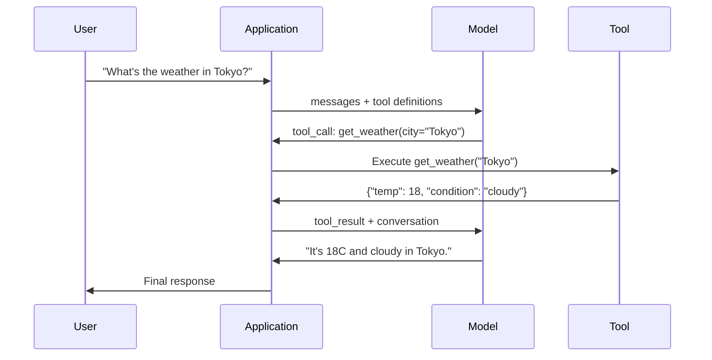

# Función llamada y uso de herramientas

> Los LLM no pueden hacer nada por sí mismos. Ellos generan texto. Ése es todo el poder. Ellos no pueden ver el clima.

**Type:** Build
**Languages:** Python
**Prerequisites:** Phase 11 Lesson 03 (Structured Outputs)
**Time:** ~75 minutes
**Related:**Fase 11 · 14 (Modelo de Protocolo Contextual)  Cuando una herramienta  necesita transcender el host 共享时,应从线上函数调用 升级为 MCP server。本课覆盖线上场景;MCP 覆盖协议 场景。

## El objetivo del aprendizaje
- 实现 una función llamada bucle: definir esquemas de herramientas 解析模型的 herramienta-call JSON 、 ejecutar funciones,并返回结果
- Diseño con descripciones claras y esquemas de herramientas de parámetros tipados, para que el modelo pueda ser manipulado con confianza
- Construir un bucle de agente multi-turn, a través de varias llamadas de funciones en línea para responder a preguntas complejas
- 处理 function calling 边界情况:paralelas llamadas de herramientas ]] error propagation, así como prevenir los bucles de herramientas ilimitados

##  problemas
Usted construyó un chatbot. ¿Qué tiempo hay en Tokio?

模型回答:No tengo acceso a datos meteorológicos en tiempo real, pero basándose en la temporada, es probable que Tokio esté alrededor de 15 grados centígrados...

Es una alucinación del modelo no sabe el tiempo. Nunca lo sabrá. El tiempo cambia cada hora.

Una de las razones que se están perdiendo es que el modelo necesita un protocolo estructurado, que permita que el modelo pueda decir que necesito usar estos argumentos para modificar el tiempo, y que su código lo ejecute, y luego volver a producir el resultado.

Éste es el llamado de función. Ejemplo: modelo de salida estructurada JSON, describe qué argumentos utilizar 调用哪个函数. Su aplicación 执行函数.

 No Función Llamando, LLMs son un libro completo.

## 概念
### La función que llama el bucle

Cada vez que se utiliza la herramienta, la interacción se realiza en el mismo ciclo de 5 pasos.



Paso 1: usuario envía mensaje;. Paso 2: modelo recibe mensaje y las definiciones de herramienta(describir funciones JSON disponibles) Shema) ・ Paso 3: modelo no devuelve directamente al texto, sino que saque una llamada de herramienta, es decir, contiene nombre de función y los argumentos de estructurado objeto JSON。 Paso 4: su código ejecuta función 并捕获结果。 Paso 5: resultados regresan al modelo, el modelo ahora tiene datos reales, puede generar respuesta final。

El modelo nunca ejecuta nada. Sólo decide lo que se utiliza y con qué argumentos se utiliza.

### Definiciones de herramientas: Contrato de esquema JSON

Cada herramienta está definida por un esquema JSON, que le dice al modelo qué hacer, qué argumentos recibir y qué tipo de argumentos deben ser.

```json
{
  "type": "function",
  "function": {
    "name": "get_weather",
    "description": "Get current weather for a city. Returns temperature in Celsius and conditions.",
    "parameters": {
      "type": "object",
      "properties": {
        "city": {
          "type": "string",
          "description": "City name, e.g. 'Tokyo' or 'San Francisco'"
        },
        "units": {
          "type": "string",
          "enum": ["celsius", "fahrenheit"],
          "description": "Temperature units"
        }
      },
      "required": ["city"]
    }
  }
}
```

`description`Los campos 至关重要──模型会读取它们,以决定何时以及如何使用工具──如get weather这样含糊的描述,比Get current weather for a city. Retorna la temperatura en Celsius y condiciones.产生更差的工具选择──描述是用于工具选择的提示──

### Comparación de proveedores

Cada proveedor principal soporta llamadas de función, pero la superficie de la API tiene diferencias.

| Provider | API Parameter | Tool Call Format | Parallel Calls | Forced Calling |
|----------|--------------|-----------------|---------------|----------------|
| OpenAI (GPT-5, o4) | `tools` | `tool_calls[].function` | Yes (multiple per turn) | `tool_choice="required"` |
| Anthropic (Claude 4.6/4.7) | `tools` | `content[].type="tool_use"` | Yes (multiple blocks) | `tool_choice={"type":"any"}` |
| Google (Gemini 3) | `function_declarations` | `functionCall` | Yes | `function_calling_config` |
| Open-weight (Llama 4, Qwen3, DeepSeek-V3) | Native `tools` on Llama 4; Hermes or ChatML on others | Mixed | Model-dependent | Prompt-based or `tool_choice` if supported |

Para 2026, tres proveedores cerrados ya han recibido casi el mismo formato basado en JSON Schema.`tools`campo, forma y OpenAI 匹配──Open-weight fine-tunes 仍然各不相同,其中 Hermes format(NousResearch) es el formato más común de terceros fine-tunes entre los cuales──Para los hosts de transversalidad, prioridad utilizar MCP (Phase 11 · 14), en lugar de llamar a funciones en línea, ya que el servidor para todos los hosts son los mismos──

### Elegir las herramientas: automáticas, requeridas, específicas

Puedes controlar el modelo de cómo usar las herramientas.

**Auto**(默认):模型自行决定是调用工具 还是直接答案──What's 2+2?会直接答──What's the weather?会调用工具──

**Required**El modelo debe utilizar al menos una herramienta. Cuando usted sabe que el usuario tiene que usar la herramienta, puede evitar que el modelo no busque datos reales y conjeture directamente.

**Specific function**: el modelo de fuerza de la función específica.`tool_choice={"type":"function", "function": {"name": "get_weather"}}`Garantizar la herramienta meteorológica se utilizará, sea cual sea la consulta.

### Llamadas para funciones paralelas

GPT-4o y Claude pueden ser utilizados en un solo turno para realizar varias funciones.

```json
[
  {"name": "get_weather", "arguments": {"city": "Tokyo"}},
  {"name": "get_weather", "arguments": {"city": "New York"}}
]
```

Su código se ejecuta en dos casos, en el caso ideal se realiza una ejecución, y luego se devuelve a dos resultados, y el modelo se compone de una respuesta única. Esto reduce las viajes de ida y vuelta de 2 a 1 veces.

### Relación entre las salidas estructuradas y las llamadas de función

Lección 03 covered estructuradas salidas―Función llamada utiliza el mismo conjunto de JSON Schema  mecanismo, pero con diferentes objetivos―

**Structured outputs**: Modelo obligatorio en forma específica generar datos.`{name, price, in_stock}`¿Qué es eso?

**Function calling**Ejemplo::`get_weather(city="Tokyo")`, el modelo es la petición de una acción, en lugar de generar la respuesta final.

Cuando necesitas extracción de datos, utiliza salidas estructuradas. Cuando necesitas modelos con sistemas externos, utiliza llamadas de funciones.

### Seguridad: Reglas inconvenientes

La llamada de función es la capacidad más peligrosa de LLM. Si tu conjunto de herramientas contiene consultas de base de datos, el modelo construirá consultas. Si contiene comandos shell, el modelo los redactará.

**Rule 1: Never pass model-generated SQL directly to a database.**模型可能且确实会生成 DROP TABLE、UNION injections, o devolver cada línea de consultas──始终参数化──始终验证──始终使用操作允许列──

**Rule 2: Allowlist functions.**模型只能调用你明确定义的函数──永远不要构建一个通用按名执行任意函数的工具── Si tienes 50 funciones internas, sólo expone las 5 que el usuario necesita──

**Rule 3: Validate arguments.**模型可能传入一个城市名:`"; DROP TABLE users; --"` ejecutar en función de los tipos de expectativa, rangos y formatos 验证每个参数──

**Rule 4: Sanitize tool results.**Si la herramienta  devuelve datos sensibles API keys PII errores internos), en los primeros pasos del modelo ︎ el modelo va a considerar los resultados de la herramienta como originarios de su respuesta ︎

**Rule 5: Rate limit tool calls.**处于循环中的模型可能调调用工具 数百次──设置一个最大值(每一次对话 10-20次电话是合理的)──打断无限循环──

### Tratamiento de errores

Las herramientas 会失败──APIs 会超时──Databases 会机──Files no existen──Modelo necesita saber herramienta ¿Cuándo ha fallado y por qué ha fallado──

Retribuir errores  como resultados de herramientas de estructuración  en lugar de eliminar excepciones:

```json
{
  "error": true,
  "message": "City 'Toky' not found. Did you mean 'Tokyo'?",
  "code": "CITY_NOT_FOUND"
}
```

模型读取这个结果,调整论点,并重试――Modelos 很擅长从结构化错误信息中自我纠正――它们不擅长从空反应或泛泛的有错误中恢复――

### MCP: Modelo de protocolo de contexto

MCP es un estándar abierto de interoperabilidad de herramientas antropópica. No permite que cada aplicación defina sus propias herramientas, sino que ofrece un protocolo universal: herramientas proporcionadas por los servidores de MCP, y clientes de MCP (como Claude Code, Curso o su aplicación)

Un servidor MCP puede ser utilizado para cualquier cliente que pueda ser compatible Exponer herramientas―Postgres servidor MCP Lea cualquier agente compatible con MCP Lea cualquier agente con acceso a la base de datos―GitHub servidor MCP Lea cualquier agente con acceso al repositorio―Tools Definir una vez, hasta donde usar―

MCP es llamada de funciones, como HTTP es red. Estandariza la capa de transporte, haciendo que las herramientas sean portátiles.


```figure
mx-tool-call-loop
```

## Construirlo
### 步骤 1: Definir el Registro de herramientas

Construir un registro, para la definición de herramientas de almacenamiento  y sus implementaciones. Cada herramienta tiene una definición de esquema JSON.

```python
import json
import math
import time
import hashlib


TOOL_REGISTRY = {}


def register_tool(name, description, parameters, function):
    TOOL_REGISTRY[name] = {
        "definition": {
            "type": "function",
            "function": {
                "name": name,
                "description": description,
                "parameters": parameters,
            },
        },
        "function": function,
    }
```

### 步骤 2: Implementar 5 herramientas

Construir una calculadora ‒buscar tiempo ‒simulador de búsqueda web ‒lector de archivos y ejecutor de código―

```python
def calculator(expression, precision=2):
    allowed = set("0123456789+-*/.() ")
    if not all(c in allowed for c in expression):
        return {"error": True, "message": f"Invalid characters in expression: {expression}"}
    try:
        result = eval(expression, {"__builtins__": {}}, {"math": math})
        return {"result": round(float(result), precision), "expression": expression}
    except Exception as e:
        return {"error": True, "message": str(e)}


WEATHER_DB = {
    "tokyo": {"temp_c": 18, "condition": "cloudy", "humidity": 72, "wind_kph": 14},
    "new york": {"temp_c": 22, "condition": "sunny", "humidity": 45, "wind_kph": 8},
    "london": {"temp_c": 12, "condition": "rainy", "humidity": 88, "wind_kph": 22},
    "san francisco": {"temp_c": 16, "condition": "foggy", "humidity": 80, "wind_kph": 18},
    "sydney": {"temp_c": 25, "condition": "sunny", "humidity": 55, "wind_kph": 10},
}


def get_weather(city, units="celsius"):
    key = city.lower().strip()
    if key not in WEATHER_DB:
        suggestions = [c for c in WEATHER_DB if c.startswith(key[:3])]
        return {
            "error": True,
            "message": f"City '{city}' not found.",
            "suggestions": suggestions,
            "code": "CITY_NOT_FOUND",
        }
    data = WEATHER_DB[key].copy()
    if units == "fahrenheit":
        data["temp_f"] = round(data["temp_c"] * 9 / 5 + 32, 1)
        del data["temp_c"]
    data["city"] = city
    return data


SEARCH_DB = {
    "python function calling": [
        {"title": "OpenAI Function Calling Guide", "url": "https://platform.openai.com/docs/guides/function-calling", "snippet": "Learn how to connect LLMs to external tools."},
        {"title": "Anthropic Tool Use", "url": "https://docs.anthropic.com/en/docs/tool-use", "snippet": "Claude can interact with external tools and APIs."},
    ],
    "MCP protocol": [
        {"title": "Model Context Protocol", "url": "https://modelcontextprotocol.io", "snippet": "An open standard for connecting AI models to data sources."},
    ],
    "weather API": [
        {"title": "OpenWeatherMap API", "url": "https://openweathermap.org/api", "snippet": "Free weather API with current, forecast, and historical data."},
    ],
}


def web_search(query, max_results=3):
    key = query.lower().strip()
    for db_key, results in SEARCH_DB.items():
        if db_key in key or key in db_key:
            return {"query": query, "results": results[:max_results], "total": len(results)}
    return {"query": query, "results": [], "total": 0}


FILE_SYSTEM = {
    "data/config.json": '{"model": "gpt-4o", "temperature": 0.7, "max_tokens": 4096}',
    "data/users.csv": "name,email,role\nAlice,alice@example.com,admin\nBob,bob@example.com,user",
    "README.md": "# My Project\nA tool-use agent built from scratch.",
}


def read_file(path):
    if ".." in path or path.startswith("/"):
        return {"error": True, "message": "Path traversal not allowed.", "code": "FORBIDDEN"}
    if path not in FILE_SYSTEM:
        available = list(FILE_SYSTEM.keys())
        return {"error": True, "message": f"File '{path}' not found.", "available_files": available, "code": "NOT_FOUND"}
    content = FILE_SYSTEM[path]
    return {"path": path, "content": content, "size_bytes": len(content), "lines": content.count("\n") + 1}


def run_code(code, language="python"):
    if language != "python":
        return {"error": True, "message": f"Language '{language}' not supported. Only 'python' is available."}
    forbidden = ["import os", "import sys", "import subprocess", "exec(", "eval(", "__import__", "open("]
    for pattern in forbidden:
        if pattern in code:
            return {"error": True, "message": f"Forbidden operation: {pattern}", "code": "SECURITY_VIOLATION"}
    try:
        local_vars = {}
        exec(code, {"__builtins__": {"print": print, "range": range, "len": len, "str": str, "int": int, "float": float, "list": list, "dict": dict, "sum": sum, "min": min, "max": max, "abs": abs, "round": round, "sorted": sorted, "enumerate": enumerate, "zip": zip, "map": map, "filter": filter, "math": math}}, local_vars)
        result = local_vars.get("result", None)
        return {"success": True, "result": result, "variables": {k: str(v) for k, v in local_vars.items() if not k.startswith("_")}}
    except Exception as e:
        return {"error": True, "message": f"{type(e).__name__}: {e}"}
```

### 步骤 3: Registre todas las herramientas

```python
def register_all_tools():
    register_tool(
        "calculator", "Evaluate a mathematical expression. Supports +, -, *, /, parentheses, and decimals. Returns the numeric result.",
        {"type": "object", "properties": {"expression": {"type": "string", "description": "Math expression, e.g. '(10 + 5) * 3'"}, "precision": {"type": "integer", "description": "Decimal places in result", "default": 2}}, "required": ["expression"]},
        calculator,
    )
    register_tool(
        "get_weather", "Get current weather for a city. Returns temperature, condition, humidity, and wind speed.",
        {"type": "object", "properties": {"city": {"type": "string", "description": "City name, e.g. 'Tokyo' or 'San Francisco'"}, "units": {"type": "string", "enum": ["celsius", "fahrenheit"], "description": "Temperature units, defaults to celsius"}}, "required": ["city"]},
        get_weather,
    )
    register_tool(
        "web_search", "Search the web for information. Returns a list of results with title, URL, and snippet.",
        {"type": "object", "properties": {"query": {"type": "string", "description": "Search query"}, "max_results": {"type": "integer", "description": "Maximum results to return", "default": 3}}, "required": ["query"]},
        web_search,
    )
    register_tool(
        "read_file", "Read the contents of a file. Returns the file content, size, and line count.",
        {"type": "object", "properties": {"path": {"type": "string", "description": "Relative file path, e.g. 'data/config.json'"}}, "required": ["path"]},
        read_file,
    )
    register_tool(
        "run_code", "Execute Python code in a sandboxed environment. Set a 'result' variable to return output.",
        {"type": "object", "properties": {"code": {"type": "string", "description": "Python code to execute"}, "language": {"type": "string", "enum": ["python"], "description": "Programming language"}}, "required": ["code"]},
        run_code,
    )
```

### 步骤 4: Construir la función llamada bucle

Es el motor central. El modelo de diseño decide qué herramienta utilizar, ejecutar la herramienta, y el resultado se retorna.

```python
def simulate_model_decision(user_message, tools, conversation_history):
    msg = user_message.lower()

    if any(word in msg for word in ["weather", "temperature", "forecast"]):
        cities = []
        for city in WEATHER_DB:
            if city in msg:
                cities.append(city)
        if not cities:
            for word in msg.split():
                if word.capitalize() in [c.title() for c in WEATHER_DB]:
                    cities.append(word)
        if not cities:
            cities = ["tokyo"]
        calls = []
        for city in cities:
            calls.append({"name": "get_weather", "arguments": {"city": city.title()}})
        return calls

    if any(word in msg for word in ["calculate", "compute", "math", "what is", "how much"]):
        for token in msg.split():
            if any(c in token for c in "+-*/"):
                return [{"name": "calculator", "arguments": {"expression": token}}]
        if "+" in msg or "-" in msg or "*" in msg or "/" in msg:
            expr = "".join(c for c in msg if c in "0123456789+-*/.() ")
            if expr.strip():
                return [{"name": "calculator", "arguments": {"expression": expr.strip()}}]
        return [{"name": "calculator", "arguments": {"expression": "0"}}]

    if any(word in msg for word in ["search", "find", "look up", "google"]):
        query = msg.replace("search for", "").replace("look up", "").replace("find", "").strip()
        return [{"name": "web_search", "arguments": {"query": query}}]

    if any(word in msg for word in ["read", "file", "open", "cat", "show"]):
        for path in FILE_SYSTEM:
            if path.split("/")[-1].split(".")[0] in msg:
                return [{"name": "read_file", "arguments": {"path": path}}]
        return [{"name": "read_file", "arguments": {"path": "README.md"}}]

    if any(word in msg for word in ["run", "execute", "code", "python"]):
        return [{"name": "run_code", "arguments": {"code": "result = 'Hello from the sandbox!'", "language": "python"}}]

    return []


def execute_tool_call(tool_call):
    name = tool_call["name"]
    args = tool_call["arguments"]

    if name not in TOOL_REGISTRY:
        return {"error": True, "message": f"Unknown tool: {name}", "code": "UNKNOWN_TOOL"}

    tool = TOOL_REGISTRY[name]
    func = tool["function"]
    start = time.time()

    try:
        result = func(**args)
    except TypeError as e:
        result = {"error": True, "message": f"Invalid arguments: {e}"}

    elapsed_ms = round((time.time() - start) * 1000, 2)
    return {"tool": name, "result": result, "execution_time_ms": elapsed_ms}


def run_function_calling_loop(user_message, max_iterations=5):
    conversation = [{"role": "user", "content": user_message}]
    tool_definitions = [t["definition"] for t in TOOL_REGISTRY.values()]
    all_tool_results = []

    for iteration in range(max_iterations):
        tool_calls = simulate_model_decision(user_message, tool_definitions, conversation)

        if not tool_calls:
            break

        results = []
        for call in tool_calls:
            result = execute_tool_call(call)
            results.append(result)

        conversation.append({"role": "assistant", "content": None, "tool_calls": tool_calls})

        for result in results:
            conversation.append({"role": "tool", "content": json.dumps(result["result"]), "tool_name": result["tool"]})

        all_tool_results.extend(results)
        break

    return {"conversation": conversation, "tool_results": all_tool_results, "iterations": iteration + 1 if tool_calls else 0}
```

### 步骤 5: Validación de los argumentos

Construir un validador, en ejecución previa según JSON Schema  inspeccionar los argumentos de llamada de la herramienta。

```python
def validate_tool_arguments(tool_name, arguments):
    if tool_name not in TOOL_REGISTRY:
        return [f"Unknown tool: {tool_name}"]

    schema = TOOL_REGISTRY[tool_name]["definition"]["function"]["parameters"]
    errors = []

    if not isinstance(arguments, dict):
        return [f"Arguments must be an object, got {type(arguments).__name__}"]

    for required_field in schema.get("required", []):
        if required_field not in arguments:
            errors.append(f"Missing required argument: {required_field}")

    properties = schema.get("properties", {})
    for arg_name, arg_value in arguments.items():
        if arg_name not in properties:
            errors.append(f"Unknown argument: {arg_name}")
            continue

        prop_schema = properties[arg_name]
        expected_type = prop_schema.get("type")

        type_checks = {"string": str, "integer": int, "number": (int, float), "boolean": bool, "array": list, "object": dict}
        if expected_type in type_checks:
            if not isinstance(arg_value, type_checks[expected_type]):
                errors.append(f"Argument '{arg_name}': expected {expected_type}, got {type(arg_value).__name__}")

        if "enum" in prop_schema and arg_value not in prop_schema["enum"]:
            errors.append(f"Argument '{arg_name}': '{arg_value}' not in {prop_schema['enum']}")

    return errors
```

### Paso 6: ejecutar la demostración

```python
def run_demo():
    register_all_tools()

    print("=" * 60)
    print("  Function Calling & Tool Use Demo")
    print("=" * 60)

    print("\n--- Registered Tools ---")
    for name, tool in TOOL_REGISTRY.items():
        desc = tool["definition"]["function"]["description"][:60]
        params = list(tool["definition"]["function"]["parameters"].get("properties", {}).keys())
        print(f"  {name}: {desc}...")
        print(f"    params: {params}")

    print(f"\n--- Argument Validation ---")
    validation_tests = [
        ("get_weather", {"city": "Tokyo"}, "Valid call"),
        ("get_weather", {}, "Missing required arg"),
        ("get_weather", {"city": "Tokyo", "units": "kelvin"}, "Invalid enum value"),
        ("calculator", {"expression": 123}, "Wrong type (int for string)"),
        ("unknown_tool", {"x": 1}, "Unknown tool"),
    ]
    for tool_name, args, label in validation_tests:
        errors = validate_tool_arguments(tool_name, args)
        status = "VALID" if not errors else f"ERRORS: {errors}"
        print(f"  {label}: {status}")

    print(f"\n--- Tool Execution ---")
    direct_tests = [
        {"name": "calculator", "arguments": {"expression": "(10 + 5) * 3 / 2"}},
        {"name": "get_weather", "arguments": {"city": "Tokyo"}},
        {"name": "get_weather", "arguments": {"city": "Mars"}},
        {"name": "web_search", "arguments": {"query": "python function calling"}},
        {"name": "read_file", "arguments": {"path": "data/config.json"}},
        {"name": "read_file", "arguments": {"path": "../etc/passwd"}},
        {"name": "run_code", "arguments": {"code": "result = sum(range(1, 101))"}},
        {"name": "run_code", "arguments": {"code": "import os; os.system('rm -rf /')"}},
    ]
    for call in direct_tests:
        result = execute_tool_call(call)
        print(f"\n  {call['name']}({json.dumps(call['arguments'])})")
        print(f"    -> {json.dumps(result['result'], indent=None)[:100]}")
        print(f"    time: {result['execution_time_ms']}ms")

    print(f"\n--- Full Function Calling Loop ---")
    test_queries = [
        "What's the weather in Tokyo?",
        "Calculate (100 + 250) * 0.15",
        "Search for MCP protocol",
        "Read the config file",
        "Run some Python code",
        "Tell me a joke",
    ]
    for query in test_queries:
        print(f"\n  User: {query}")
        result = run_function_calling_loop(query)
        if result["tool_results"]:
            for tr in result["tool_results"]:
                print(f"    Tool: {tr['tool']} ({tr['execution_time_ms']}ms)")
                print(f"    Result: {json.dumps(tr['result'], indent=None)[:90]}")
        else:
            print(f"    [No tool called -- direct response]")
        print(f"    Iterations: {result['iterations']}")

    print(f"\n--- Parallel Tool Calls ---")
    multi_city_query = "What's the weather in tokyo and london?"
    print(f"  User: {multi_city_query}")
    result = run_function_calling_loop(multi_city_query)
    print(f"  Tool calls made: {len(result['tool_results'])}")
    for tr in result["tool_results"]:
        city = tr["result"].get("city", "unknown")
        temp = tr["result"].get("temp_c", "N/A")
        print(f"    {city}: {temp}C, {tr['result'].get('condition', 'N/A')}")

    print(f"\n--- Security Checks ---")
    security_tests = [
        ("read_file", {"path": "../../etc/passwd"}),
        ("run_code", {"code": "import subprocess; subprocess.run(['ls'])"}),
        ("calculator", {"expression": "__import__('os').system('ls')"}),
    ]
    for tool_name, args in security_tests:
        result = execute_tool_call({"name": tool_name, "arguments": args})
        blocked = result["result"].get("error", False)
        print(f"  {tool_name}({list(args.values())[0][:40]}): {'BLOCKED' if blocked else 'ALLOWED'}")
```

## Usalo
### Llamada de la función OpenAI

```python
# from openai import OpenAI
#
# client = OpenAI()
#
# tools = [{
#     "type": "function",
#     "function": {
#         "name": "get_weather",
#         "description": "Get current weather for a city",
#         "parameters": {
#             "type": "object",
#             "properties": {
#                 "city": {"type": "string"},
#                 "units": {"type": "string", "enum": ["celsius", "fahrenheit"]}
#             },
#             "required": ["city"]
#         }
#     }
# }]
#
# response = client.chat.completions.create(
#     model="gpt-4o",
#     messages=[{"role": "user", "content": "Weather in Tokyo?"}],
#     tools=tools,
#     tool_choice="auto",
# )
#
# tool_call = response.choices[0].message.tool_calls[0]
# args = json.loads(tool_call.function.arguments)
# result = get_weather(**args)
#
# final = client.chat.completions.create(
#     model="gpt-4o",
#     messages=[
#         {"role": "user", "content": "Weather in Tokyo?"},
#         response.choices[0].message,
#         {"role": "tool", "tool_call_id": tool_call.id, "content": json.dumps(result)},
#     ],
# )
# print(final.choices[0].message.content)
```

OpenAI va a hacer llamadas a la herramienta  regresar `response.choices[0].message.tool_calls` Cada llamada tiene una `id`, usted debe incluirlo en el resultado de retorno. El modelo utiliza esta ID para que los resultados se ajusten a las llamadas.

### El uso de herramientas antropológicas

```python
# import anthropic
#
# client = anthropic.Anthropic()
#
# response = client.messages.create(
#     model="claude-sonnet-4-20250514",
#     max_tokens=1024,
#     tools=[{
#         "name": "get_weather",
#         "description": "Get current weather for a city",
#         "input_schema": {
#             "type": "object",
#             "properties": {
#                 "city": {"type": "string"},
#                 "units": {"type": "string", "enum": ["celsius", "fahrenheit"]}
#             },
#             "required": ["city"]
#         }
#     }],
#     messages=[{"role": "user", "content": "Weather in Tokyo?"}],
# )
#
# tool_block = next(b for b in response.content if b.type == "tool_use")
# result = get_weather(**tool_block.input)
#
# final = client.messages.create(
#     model="claude-sonnet-4-20250514",
#     max_tokens=1024,
#     tools=[...],
#     messages=[
#         {"role": "user", "content": "Weather in Tokyo?"},
#         {"role": "assistant", "content": response.content},
#         {"role": "user", "content": [{"type": "tool_result", "tool_use_id": tool_block.id, "content": json.dumps(result)}]},
#     ],
# )
```

Antropic va a hacer llamadas de herramienta  regresar por la banda `type: "tool_use"`Los bloques de contenido de la herramienta resultado  puesto  `type: "tool_result"`Nota clave: Antropic Uso `input_schema`definición de parámetros de herramientas, mientras que OpenAI utiliza `parameters`¿Qué es eso?

### Integración de los PMP

```python
# MCP servers expose tools over a standardized protocol.
# Any MCP-compatible client can discover and call these tools.
#
# Example: connecting to a Postgres MCP server
#
# from mcp import ClientSession, StdioServerParameters
# from mcp.client.stdio import stdio_client
#
# server_params = StdioServerParameters(
#     command="npx",
#     args=["-y", "@modelcontextprotocol/server-postgres", "postgresql://localhost/mydb"],
# )
#
# async with stdio_client(server_params) as (read, write):
#     async with ClientSession(read, write) as session:
#         await session.initialize()
#         tools = await session.list_tools()
#         result = await session.call_tool("query", {"sql": "SELECT count(*) FROM users"})
```

MCP va a implementar herramientas y consumir herramientas 解──Postgres servidor 了解 SQL──GitHub servidor 了解 API──Tu agente 只是 descubrimiento 并调用 herramientas, no necesita para cada integración 编写供应商特定代码──

##  entregarlo
本课会产出                                                                                                                                                                                                                                                                                                                                                                                                                                                                                                                         `outputs/prompt-tool-designer.md`, es una plantilla de solicitud de respuesta replicable para diseñar definiciones de herramientas. Si le das una descripción de lo que quieres que haga la herramienta, generará una definición completa de JSON Schema, incluyendo descripciones, tipos y restricciones.

También se producirá.`outputs/skill-function-calling-patterns.md`, es un marco de decisión utilizado en la producción para realizar llamadas de funciones, que cubre el diseño de herramientas, manejo de errores, seguridad y patrones específicos para el proveedor.

##  ejercicios
1. **Add a 6th tool: database query.**实现 una herramienta SQL simulada, utilizar la tabla en memoria。 esta herramienta 接收表名 和过条件(不是 SQL crudo)。验证表名 位于允许列中,并且过操作员 仅限于 `=`¿Qué es esto?`>`¿Qué es esto?`<`¿Qué es esto?`>=`¿Qué es esto?`<=`△将匹配 ramas 作为 JSON 返回──

2. **Implement retry with error feedback.**Cuando la llamada de herramienta 失败时(por ejemplo, la ciudad no se encuentra),把 error mensaje 回 modelo de decisión función,并让它修改参数──记录每次电话 需要多少次重复尝试──为每次工具电话 设置最多3次重复尝试──

3. **Build a multi-step agent.**某些 queries 需要串联工具调用:Lea el archivo de configuración y dime qué modelo está configurado, luego busca en la web el precio de ese modelo. 实现一个循环,持续运行直到模型决定不再需要工具,并把累积结果传进每个决策步――限制为10次回复,以防止无限循环──

4. **Measure tool selection accuracy.**Crear 30 preguntas de prueba de nombres de herramientas esperadas  En todas las 30 preguntas 上运行你的决策功能,并衡量它选择正确工具的比例──识别哪些问题最容易导致工具之间的混──

5. **Implement tool call caching.**Si la misma herramienta en 60 segundos en los mismos argumentos se utiliza, entonces devuelve el resultado almacenado en caché, en lugar de volver a ejecutar.`(tool_name, frozenset(args.items()))`Por ejemplo, el dicionario de la clave, la palabra clave, la palabra clave, la palabra clave, la palabra clave, la palabra clave, la palabra clave, la palabra clave, la palabra clave, la palabra clave, la palabra clave, la palabra clave, la palabra clave, la palabra clave, la palabra clave, la palabra clave, la palabra clave, la palabra clave, la palabra clave, la palabra clave, la palabra clave, la palabra clave, la palabra clave, la palabra clave, la palabra clave, la palabra clave, la palabra clave, la palabra clave, la palabra clave, la palabra clave, la palabra clave, la palabra clave, la palabra clave, la palabra clave, la palabra clave, la palabra clave, la palabra clave, la palabra clave, la palabra clave, la palabra clave, la palabra clave, la palabra clave, la palabra clave, la palabra clave, la palabra clave, la palabra clave, la palabra de la palabra de la palabra, la palabra de la palabra, la palabra de la palabra de la palabra, la palabra de la palabra.

## 关键术语: "El hombre es un hombre"
| Term | What people say | What it actually means |
|------|----------------|----------------------|
| Function calling | “Tool use” | 模型输出结构化 JSON，描述要用特定 arguments 调用的 function，由你的代码执行，而不是模型执行 |
| Tool definition | “Function schema” | 一个 JSON Schema object，描述 tool 的 name、purpose、parameters 和 types，模型读取它来决定何时以及如何使用该 tool |
| Tool choice | “Calling mode” | 控制模型必须调用 tool（required）、可以调用 tool（auto），还是必须调用特定 tool（named） |
| Parallel calling | “Multi-tool” | 模型在单个 turn 中输出多个 tool calls，从而减少 round trips，GPT-4o 和 Claude 都支持这一点 |
| Tool result | “Function output” | 执行 tool 后得到的 return value，作为 message 发回模型，使它能在 response 中使用真实数据 |
| Argument validation | “Input checking” | 在执行 tool 前，验证模型生成的 arguments 是否匹配预期 types、ranges 和 constraints |
| MCP | “Tool protocol” | Model Context Protocol，即 Anthropic 的 open standard，用于通过 servers 暴露 tools，让任何兼容 client 都能发现并调用 |
| Agent loop | “ReAct loop” | model-decides-tool、code-executes-tool、result-feeds-back 的迭代循环，直到模型拥有足够信息作出回答 |
| Tool poisoning | “Prompt injection via tools” | 一种攻击，其中 tool results 包含会操纵模型行为的 instructions，因此要 sanitize 所有 tool outputs |
| Rate limiting | “Call budget” | 设置每个 conversation 中 tool calls 的最大数量，以防止 infinite loops 和失控的 API costs |

## 延伸阅读
- [OpenAI Function Calling Guide](https://platform.openai.com/docs/guides/function-calling) Uso de GPT-4o  autoridad de uso de herramientas, incluyendo llamadas paralelas  llamadas forzadas y argumentos estructurados
- [Anthropic Tool Use Guide](https://docs.anthropic.com/en/docs/tool-use) Implementar el uso de herramientas de Claude, incluyendo respuestas de input_schema、multi-tool y configuración de herramienta_choice
- [Model Context Protocol Specification](https://modelcontextprotocol.io) 跨 AI aplicaciones de herramientas interoperabilidad estándar abierto, que incluye arquitectura de servidor/cliente
- [Schick et al., 2023 — “Toolformer: Language Models Can Teach Themselves to Use Tools”](https://arxiv.org/abs/2302.04761)   sobre el desarrollo de los LLM para decidir cuándo y cómo utilizar las herramientas externas
- [Patil et al., 2023 — “Gorilla: Large Language Model Connected with Massive APIs”](https://arxiv.org/abs/2305.15334)                                                                                                                                                                                                                                                                                                                                                                                                                                                                                                                            
- [Berkeley Function Calling Leaderboard](https://gorilla.cs.berkeley.edu/leaderboard.html) 实时基准, en comparación con GPT-4o、Claude、Gemini y modelos abiertos, la precisión de llamadas de función
- [Yao et al., “ReAct: Synergizing Reasoning and Acting in Language Models” (ICLR 2023)](https://arxiv.org/abs/2210.03629) Localización de pensamiento-acción-observación, es cada llamada de herramienta en el bucle de agentes de la capa externa; este curso termina, está en la fase 14 接续之处──
- [Anthropic — Building effective agents (Dec 2024)](https://www.anthropic.com/research/building-effective-agents) Desde un solo uso de herramientas primitivas 构建出五种可组合模式(prompto cadena, enrutamiento, paralelación, orquestación-trabajadores, evaluador-optimizador)
