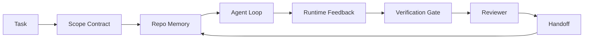

# Ingeniería del banco de trabajo: ¿Por qué el modelo de capacidad fuerte todavía fracasará ?

>                                                                                                                                                                                                                                                               

**Type:** Learn + Build
**Languages:** Python (stdlib)
**Prerequisites:** Phase 14 · 01 (Agent Loop), Phase 14 · 26 (Failure Modes)
**Time:** ~45 minutes

## El objetivo del aprendizaje
- 区分模型能力与执行可靠性.
- ¿Cómo se puede decidir si el agente puede entregar siete superficies de escritorio?
- En una pequeña misión de repos comparar 运行-only-prompto con 运行-guided-workbench.
- producir un informe de modo de falla, que reflejará cada superficie de la falta de los síntomas que la causan.

##  problemas
Usted coloca un modelo fronterizo  ponga en un repo real, deja que añada un certificado de entrada  abre cuatro archivos, escribe código que parece razonable, declara éxito, luego se detiene  Usted ejecuta un test  dos fracasaron  El tercer archivo modificado no tiene nada que ver con el certificado  no hay ningún agente de registro  supone qué  primero intentó qué, o qué más queda por completar 

模型不是不懂Python──它是不懂这个工作──它不知道什么才算完成──它不懂什么才算完成──它不懂什么才算完成──它不懂什么才算完成──它不懂什么才算完成──它不懂什么才算完成──它不懂什么才算完成──它不懂什么才算完成──它不懂什么才算完成──它不懂什么才算完成──它不懂什么才算完成──它不懂什么才算完成──它不懂什么才算完成──它不懂什么才算完成──它不懂什么才算完成──它不懂什么才算完成──它不懂什么才算完成──它不懂什么才算完成──它不懂什么才算完成──它不懂什么才算完成──它不懂什么才算完成──它不懂什么才算完成──它不懂什么才算完成──它不懂它是它是它是它是它是它是它是它是它.

Esto no es un error de modelo. Esto es un error de banco de trabajo. La superficie de un agente que lo rodea es necesaria, no puede convertir la generación de una sola vez en un trabajo de ingeniería fiable y recuperable.

## 概念
El trabajo de la mesa es el modelo de trabajo en el que se realiza la tarea.

| Surface | 它承载什么 | 缺失时的失败 |
|---------|------------|--------------|
| Instructions | 启动规则、禁止动作、完成定义 | Agent 猜测交付意味着什么 |
| State | 当前任务、已触碰文件、blockers、下一步动作 | 每个 session 都从零开始 |
| Scope | 允许文件、禁止文件、验收标准 | 修改泄漏到无关代码 |
| Feedback | 捕获进 loop 的真实命令输出 | Agent 在 400 上宣布成功 |
| Verification | Tests、lint、smoke run、scope check | “看起来不错”进入 main |
| Review | 由不同角色执行的第二遍检查 | Builder 批改自己的作业 |
| Handoff | 改了什么、为什么改、还剩什么 | 下一个 session 重新发现一切 |

trabajo de trabajo 独立于模型──你可以替换模型并保留这些表面──你不能替换表面 还保持可靠性──



Este bucle se cierra en el archivo de estado, no en el historial de chat.

### En el trabajo de la mesa y la ingeniería rápida

Prompting 告诉模型这个轮你想要什么――工作台 告诉模型如何跨轮次、跨会议 地完成工作── la mayoría de los agentes 失败故事,其实是披着快速工程 外衣的工作台 失败──

### En comparación con el marco de trabajo

marco  proporcionar tiempo de ejecución  LangGraph、AutoGen、Agents SDK)  trabajo   proporcionar un trabajo en el tiempo de ejecución  en el que el agente                                                                                                                                                                                                                                           

### Se originó de las teorías primitivas, no de las taxonomías de los vendedores.

Ahora hay una gran cantidad de artículos sobre la ingeniería de arnés. Los artículos de Addy Osmani, OpenAI, Anthropic, LangChain, Martin Fowler, MongoDB, HumanLayer, Augment Code, Thoughtworks, Walkinglabs, así como los artículos de Medium y Hacker News están en discusión.

Una vez que se ejecuta un agente es el proceso y el tiempo de la máquina para que sea fiable, se necesita cualquier sistema de producción que necesita los mismos primitivos.

| Primitive | 它是什么 | 它为 agent 承载什么 |
|-----------|----------|---------------------|
| Function | 类型化 handler。尽可能保持纯。拥有自己的 inputs 和 outputs。 | 一次 tool call、一次 rule check、一个 verification step、一次模型调用 |
| Worker | 拥有一个或多个 functions 和 lifecycle 的长生命周期进程 | builder、reviewer、verifier、一个 MCP server |
| Trigger | 调用 function 的事件源 | Agent loop tick、HTTP request、queue message、cron、file change、hook |
| Runtime | 决定什么在哪里运行、使用什么 timeouts 和 resources 的边界 | Claude Code 的 process、LangGraph 的 runtime、一个 worker container |
| HTTP / RPC | caller 与 worker 之间的网络线缆 | Tool-call protocol、MCP request、model API |
| Queue | trigger 与 worker 之间的持久 buffer；back-pressure、retry、idempotency | task board、feedback log、review inbox |
| Session persistence | 在 crashes、restarts、model swaps 后仍保留的 state | `agent_state.json`、checkpoints、KV stores、repo 本身 |
| Authorization policy | 谁能以什么 scope 调用什么 function | allowed/forbidden files、approval boundaries、MCP capability lists |

Ahora, hay siete superficies de escritorio que se proyectan en estas primitivas.

- **Instructions** política + metadatos de función。Reglas es controlesfunciones)―router`AGENTS.md`) es un principio de seguridad para el inicio de la ejecución.
- **State** Persistencia de sesión―tiempo de ejecución Cada paso de la sesión  Almacenamiento con llave―File、KV o DB;Semanticas de persistencia importante, almacenamiento de backend 不重要―
- **Scope** Política de autorización de cada misión  permitidos/prohibidos globos es ACL  necesita aprobaciones es red de permisos 
- **Feedback** 写入 queue 写入 queue 写入 queue 写入 queue 写入 queue 写入 queue 写入 queue 写入 queue 写入 queue 写入 queue 写入 queue 写入 queue 写入 queue 写入 queue 写入 queue 写入 queue 写入 queue 写入 queue 写入 queue 写入 queue 写入 queue 写入 queue 写入 queue 写入 queue 写入 queue 写入 queue 写入的号召记 写入的每次回召唤 都是记录 持久 写可重放的记录
- **Verification** Una función― a las entradas 确定性― por tarea cerrar 触发―失败时关闭―
- **Review** Un trabajador independiente, con derecho de lectura exclusiva de los artefactos de construcción, con derecho de escritura exclusiva de los informes de revisión.
- **Handoff** El gatillo de inicio de la sesión final emitido por el gatillo de final de sesión 持久记录── 下一个会议的启动触发 会读取它──

El agente de bucle 本身就是一个工人,它消费事件 (eventos),调用函数 (de los usuarios),调用函数 (de los usuarios),调用函数 (de los usuarios),调用函数 (de los usuarios),调用函数 (de los usuarios),调用函数 (de los usuarios),调用函数 (de los usuarios),调用函数 (de los usuarios),调用函数 (de los usuarios),调用函数 (de los usuarios),调用函数 (de los usuarios),调用函数 (de los usuarios),调用函数 (de los usuarios),调用函数 (de los usuarios),调用函数 (de los usuarios),调用函数 (de los usuarios),调用函数 (de los usuarios),调用函数 (de los usuarios),调用函数 (de los usuarios),调用函数 (de los usuarios),调用函数 (de los usuarios),调用函数 (de los usuarios),调用函数 (de los usuarios), y de los usuarios (de los usuarios) (de los usuarios) (de los usuarios) (de los usuarios) (de los usuarios) (de los usuarios) (de los usuarios) (de los usuarios) (de los usuarios) (de los usuarios) (de los usuarios) (de los usuarios) (de los usuarios) (de los usuarios) (de los cuales son) (de los usuarios) (de los cuales son) (de) (de) (de) (de) (de) (de) (de) (de) (de) (de) (de) (de) (de) (de) (de) (de) (de) (de) (de) (de) (de) (de) (de) (de) (de) (de) (de) (de) (de) (de) (de) (de) (de) (de) (de) (de) (de) (de) (de) (de) (de) (de) (de) (de) (de) (de) (de) (de) (de) (de) (de) (de) (de) (de) (de) (de) (de) (de) (de) (de) (de) (de) (de) (de)

### 流行模式,转换为 primitivos

Cada tipo de arnés de uso se puede clasificar en ocho primitivas.

| Vendor or community pattern | 它实际是什么 |
|------------------------------|--------------|
| Ralph Loop（Claude Code、Codex、agentic_harness book）— 当 agent 试图过早停止时，把原始意图重新注入一个新的 context window | 一个将 task 以干净 context 重新入队的 trigger；session persistence 负责把目标向前传递 |
| Plan / Execute / Verify (PEV) | 三个 workers，每个角色一个，通过 state 和 phases 之间的 queue 通信 |
| Harness-compute separation（OpenAI Agents SDK，April 2026）— 将 control plane 与 execution plane 分开 | 对 control-plane / data-plane 的重新表述。比 agent 标签早几十年就存在 |
| Open Agent Passport（OAP，March 2026）— 在执行前根据声明式 policy 签名并审计每次 tool call | 由 pre-action worker 强制执行的 authorization policy，并带有 signed audit queue |
| Guides and Sensors（Birgitta Böckeler / Thoughtworks）— feedforward rules + feedback observability | Authorization policy + verification functions + observability traces |
| Progressive compaction, 5-stage（Claude Code reverse engineering，April 2026） | 一个 state-management worker，像 cron 一样在 session persistence 上运行，使其保持在 budget 内 |
| Hooks / middleware（LangChain、Claude Code）— 拦截 model 和 tool calls | 包裹 runtime invocation path 的 triggers + functions |
| Skills as Markdown with progressive disclosure（Anthropic、Flue） | 一个 function registry，其中 function metadata 会 just-in-time 加载到 context 中 |
| Sandbox agents（Codex、Sandcastle、Vercel Sandbox） | compute plane：具备隔离 filesystem、network 和 lifecycle 的 runtime |
| MCP servers | 通过稳定 RPC 暴露 functions 的 workers，capability lists 作为 authorization |

Cada uno de los elementos de la tabla, son agentes 社区 hasta llegar a una primitiva de nombres ya existentes en los sistemas distribuidos, y luego darle un nuevo nombre.

### recibos  en realidad explican qué

La afirmación de aprovechar el modelo ahora tiene un gran número de datos. Vale la pena entenderlo, ya que también es un argumento de controversia, ya que el modelo más inteligente es el único argumento de honestidad de un buen modelo.

- Terminal Bench 2.0  同一个模型, sólo aprovechar el cambio 就让一个编码代理从前30 之外提升到第五名(LangChain,*Anatomy of an Agent Harness*) 
- Vercel   eliminó el 80% de sus herramientas de agente; tasa de éxito del 80%  saltó al 100% 
- Harvey  agentes legales  sólo a través de la optimización de aprovechamiento 就让 precisión 翻倍以上(MongoDB) 
- El 88% de los proyectos de agentes de IA empresariales no pueden entrar en producción.
- Un estudio de referencia de 2025 en tres marcos de código abierto populares reportó el 50% de la finalización de tareas; WebAgent de largo contexto en condiciones de largo contexto, abajo del 40-50%  bajando al 10% abajo, principalmente debido a los bucles infinitos y la pérdida de objetivos ]]]]

El punto no es el arnés foreverwin out── el modelo absorberá con el tiempo los trucos del arnés── el punto es hoy, el proyecto se desarrolla alrededor del modelo, no dentro del modelo; asumir estas cargas primitivas, es exactamente lo que cada sistema de producción siempre necesita──

### escritos de vendedores 止步的地方

Esta parte de esto no necesita clientes.

- LangChain's *Anatomy of an Agent Harness* 枚挙十一組件  prompts, tools, hooks, sandboxes, orchestration, memory, skills, subagents, as well as a runtime dumb loop── no tiene colas de nombres ‒ como unidades de despliegue de trabajadores ‒ trigger semántica、 como persistencia de sesión de punto de atención independiente, o política de autorización― ‒ utiliza el arnés como un objeto que usted configura, y no como un sistema de implementación―
- Addy Osmani de * Ingeniería de Arneses de Agentes *  propuso `Agent = Model + Harness`El marco y el patrón de ratchet, pero no se explica más qué es el arnés de lo que se compone.
- Antropic y OpenAI sobre superficies  discutidas más profundamente, pero todavía permanecen en su propio tiempo de ejecución 内── abril 2026 Agentes SDK harness-computing separation anuncio es el primer claro confirmable control-plan / data-plan separado pieza de proveedor── esa es una idea primitiva, no es algo nuevo──
- El arnés será el arnés 视为 config objeto (Jaymin West's *Agentic Engineering*, capítulo 6), de los cuales la frase más poderosa es: el arnés es el límite de seguridad primario en un sistema de agentes.
- Los hilos de noticias de hackers han llegado directamente a un mismo lugar. El hilo de abril de 2026 *El arnés del agente pertenece fuera de la caja de arena* 认为 harness 应该位于更像是一个处在一切之外的、并基于背景 和用户 授权访问的超级浏览器──这再次是作为独立平面的授权政策──

Usted no necesita oponerse a ninguno de estos artículos, también puede ver la carencia. Ellos están escribiendo una descripción de UX de un sistema ya existente.`AGENTS.md`色也修不好缺失的队伍──

Así que, cuando escuches en otros lugares harness engineering 时, traduce en primitivos──Prompts 和 rules is policy and functions──Scaffolding is runtime──Guardrails is authorization + verification──Hooks are triggers──Memoria es persistencia de sesión──Ralph Loop is requeue──Subagents are workers──Sandboxes are computing planes──词汇会变;工程不会──workbench is agent-facing UX; en realidad, el siguiente uso del vendor es un proceso de reestructuración, la esencia es funciones、 trabajadores、 triggers、runtimes、 queues、persist y política están correctamente conectadas─


```figure
wb-seven-surfaces
```

## Construirlo
`code/main.py`Se puede realizar una tarea de repositorio de tipo micro 运行两次. La primera es sólo un prompt, la segunda es conectar siete superficies.

La tarea de repo 刻意设计得很小: darle a un único archivo un procesador de estilo FastAPI 添加输入验证,并写一个通过测试──

¿Qué es eso ?

```
python3 code/main.py
```

输出: dos veces operando en el registro de cada uno, una conclusión de sólo ejecutar en el momento `failure_modes.json`, y el veredicto de la mesa de trabajo.

El agente es un pequeño estubón basado en reglas; el foco es superficies, no modelos. En el resto de esta mini-track, pondrás cada superficie en un artefacto real y recopilable.

## Usalo
Tres lugares ya existen en realidad superficies de escritorio, incluso nadie las llama así:

- **Claude Code, Codex, Cursor.** `AGENTS.md`Y `CLAUDE.md`Es la superficie de instrucciones. Los comandos de colisión son el alcance.
- **LangGraph, OpenAI Agents SDK.**Los puntos de control y las tiendas de sesiones son la superficie del estado.
- **真实 repo 上的 CI。**Las pruebas, las líneas y el tipo de verificación son la verificación.

La ingeniería del banco de trabajo es una regla: hacer que estas superficies se vuelvan a utilizar, en lugar de que cada equipo las descubra de nuevo.

##  entregarlo
`outputs/skill-workbench-audit.md`Es una habilidad transponible, para auditar las siete superficies de trabajo existentes de repositorios, y informar qué carencias, qué partes tienen, qué son sanas.

##  ejercicios
1. 选择一个你已经运行代理的 repo――把七个表面从0(缺失) 到2(健康)打分――你最弱的表面是什么?
2. 扩展 `main.py`, dejar que sólo ejecutar el instante también generar una falsa declaración de éxito                                                                                                                                                                                                                                                      
3. Añade la octava superficie a tu propio producto. Explica por qué no puede ser incluido en una de las siete existentes.
4. ¿Con otro agente de extracción de documentos para volver a ejecutar el guión? ¿Qué superficie fue la primera en atraparlo?
5. ¿Qué tipo de modo de diseño de cada superficie debe ser absorbido?

## 关键术语: "El hombre es un hombre"
| Term | What people say | What it actually means |
|------|----------------|------------------------|
| Workbench | “那套 setup” | 围绕模型设计的 engineered surfaces，使工作可靠 |
| Surface | “一个 doc” 或 “一个 script” | agent 每一轮读取或写入的命名、machine-readable input |
| System of record | “那些 notes” | chat history 消失后 agent 视为 truth 的文件 |
| Definition of done | “Acceptance” | 一个客观、file-backed 的 checklist，agent 无法伪造 |
| Workbench audit | “Repo readiness check” | 在工作开始前遍历七个 surfaces，标记缺失部分 |

## 延伸阅读
En la decisión de si se adopta un concepto, primero lo traduzcan a la primitiva (función, trabajador, desencadenante, tiempo de ejecución, HTTP/RPC, cola, persistencia, política).

Enmarcamientos de los proveedores:

- [Addy Osmani, Agent Harness Engineering](https://addyosmani.com/blog/agent-harness-engineering/)¿ Qué es esto ?`Agent = Model + Harness`Y el patrón de ratchet; infraestructura parte más pobre
- [LangChain, The Anatomy of an Agent Harness](https://blog.langchain.com/the-anatomy-of-an-agent-harness/) 十一个组件:puestas, herramientas, ganchos, orquestación, cajas de arena, memoria, habilidades, subgenras, tiempo de ejecución, provincias, colas, despliegue, autoría
- [OpenAI, Harness engineering: leveraging Codex in an agent-first world](https://openai.com/index/harness-engineering/) Codex 团队 sobre su tiempo de ejecución  Surfaces alrededor de la vista
- [OpenAI, Unrolling the Codex agent loop](https://openai.com/index/unrolling-the-codex-agent-loop/) 将 agente de circuito 归约为 funciones llamadas 上一个 `while`
- [Anthropic, Effective harnesses for long-running agents](https://www.anthropic.com/engineering/effective-harnesses-for-long-running-agents) Superficies de largo horizonte en un tiempo de ejecución específico
- [Anthropic, Harness design for long-running application development](https://www.anthropic.com/engineering/harness-design-long-running-apps) 应用型设计笔记
- [LangChain Deep Agents harness capabilities](https://docs.langchain.com/oss/python/deepagents/harness) Superficie de configuración de tiempo de ejecución

Hay detalles disponibles para practicantes:

- [Martin Fowler / Birgitta Böckeler, Harness engineering for coding agent users](https://martinfowler.com/articles/harness-engineering.html) guías  feedforward) + sensores  feedback);
- [HumanLayer, Skill Issue: Harness Engineering for Coding Agents](https://www.humanlayer.dev/blog/skill-issue-harness-engineering-for-coding-agents)   esto no es un problema de modelo, sino de configuración  问题
- [MongoDB, The Agent Harness: Why the LLM Is the Smallest Part of Your Agent System](https://www.mongodb.com/company/blog/technical/agent-harness-why-llm-is-smallest-part-of-your-agent-system) 证据:Vercel 80% a 100%,Harvey 2x precisión,Terminal Bench Top 30 a Top 5
- [Augment Code, Harness Engineering for AI Coding Agents](https://www.augmentcode.com/guides/harness-engineering-ai-coding-agents) la restricción de la primera marcha
- [Sequoia podcast, Harrison Chase on Context Engineering Long-Horizon Agents](https://sequoiacap.com/podcast/context-engineering-our-way-to-long-horizon-agents-langchains-harrison-chase/) preocupaciones de tiempo de ejecución 高于 preocupaciones de modelo

书籍、论文 y implementaciones de referencia:

- [Jaymin West, Agentic Engineering — Chapter 6: Harnesses](https://www.jayminwest.com/agentic-engineering-book/6-harnesses) tratamiento de longitud del libro, será aprovechado 视为 primario límite de seguridad
- [preprints.org, Harness Engineering for Language Agents (March 2026)](https://www.preprints.org/manuscript/202603.1756) 将其作为控制 / agency / runtime 的学术框架
- [walkinglabs/awesome-harness-engineering](https://github.com/walkinglabs/awesome-harness-engineering)  跨背景、评估、可观察性、orchestration   评价的评价名单
- [ai-boost/awesome-harness-engineering](https://github.com/ai-boost/awesome-harness-engineering)  Otra lista seleccionada de herramientas, evaluaciones, memoria, MCP, permisos)
- [andrewgarst/agentic_harness](https://github.com/andrewgarst/agentic_harness) implementación de referencia lista para producción, con memoria respaldada por Redis y suite de eval
- [HKUDS/OpenHarness](https://github.com/HKUDS/OpenHarness) interior de agente personal de apertura del agente arnés

Vale la pena leer sus diferencias y no el consenso  discuss:

- [HN: Effective harnesses for long-running agents](https://news.ycombinator.com/item?id=46081704)
- [HN: Improving 15 LLMs at Coding in One Afternoon. Only the Harness Changed](https://news.ycombinator.com/item?id=46988596)
- [HN: The agent harness belongs outside the sandbox](https://news.ycombinator.com/item?id=47990675) 主张将 autorización 作为独立平面

Referencias cruzadas dentro de este plan de estudios:

- Fase 14 · 23  OpenTelemetry GenAI convenciones: literatura de sensores
- Fase 14 · 26  七个表面 设计来吸收的故障模式目录
- Fase 14 · 27                                                                                                                                                                                                                                                                                                                                                                                                                                                                                                                        
- Fase 14 · 29  Tiempos de ejecución de producción  fila ‧evento ‧ cron:
