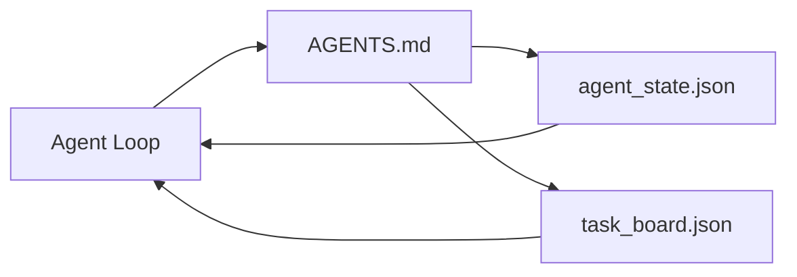

# Último agente de trabajo

> El banco de trabajo más pequeño disponible  solo tiene tres archivos: un router de instrucciones raíz ▌un archivo de estado, así como una tabla de tareas ▌todo lo demás está superpuesto sobre ellos ▌.

**Type:** Build
**Languages:** Python (stdlib)
**Prerequisites:** Phase 14 · 31（为什么强大的模型仍然失败）
**Time:** ~45 分钟

## El objetivo del aprendizaje
- 定义构成最小可行工作台的三个文件──
- Explica por qué un router raíz breve supera un único largo.`AGENTS.md`¿Qué es eso?
- Construir un agente Cada ronda puede leer y escribir en el archivo de estado al final.
- Construir un chat no dependiente de historial 也能支多 sesiones 工作的任务板──

##  problemas
La mayoría de los equipos pasarán por escribir una de 3000 líneas.`AGENTS.md`Para construir un banco de trabajo, entonces se piensa que se ha terminado. El modelo lo carga, ignora las partes que no pueden ser resumidas, y luego sigue en la misma superficie que siempre ha fallado.

Lo que necesitas es algo contrario. Un pequeño archivo raíz, sólo en el momento relevante, para que el agente se viaje a un archivo más profundo.

Tres documentos. Cada documento tiene una función. Cada documento es lo suficientemente legible para poder desarrollarse en un sistema real.

## 概念


### Agentes.md es un router, no manual

Bien , bueno .`AGENTS.md`Es muy corto.

- El archivo del estado (你在哪里)
- Junta de tareas ((还剩什么)
- Más profundas normas`docs/agent-rules.md`¿Qué es eso?
- Comando de verificación (How do you know it can work)

El contenido de la página se puede descargar en el archivo de la página web.

### agent_state.json es un sistema de registro

Estado 携带:activ task id、被触及文件、已做的假设、阻塞者,以及下一步行动──Agent Cada turno todos los días lo leerán──下一个会议 读取它,而不是重放聊天──

El estado exist files, porque el historial de chat es inestable. Las sesiones se terminarán. Las conversaciones se cortarán.

### task_board.json es la cola

Junta de tareas  llevar cada tarea, estado `todo | in_progress | done | blocked`Cuando el estado está en el aire, es la cola de los agentes que llevan las tareas; cuando te preguntas si el agente está en la línea de trabajo, también es la cola de los que estás leyendo.

El consejo de trabajo tiene un objetivo, un propietario.`builder`¿Qué es esto?`reviewer`O `human`(B) y criterios de aceptación. La junta tiene intención de mantenerse pequeña: cuando crece hasta superar una pantalla, se encuentra con un problema de planificación, no un problema de la junta.

### Tres documentos son la línea de fondo, no la línea de arriba.

后续课程将添加范围合同、反运行者、验证门、审查员检查列表和交付包──在这里的三个文件是它们共同假设的基础──


```figure
wb-three-files
```

## Construirlo
`code/main.py`会把最小工作台 写入一个空 repo,并演示单轮代理转,它会:

1. 读取 `agent_state.json`¿Qué es eso?
2. Si el estado es en blanco, desde`task_board.json`¿Qué pasa?
3. En el alcance de la ley, en el alcance de la ley, en el alcance de los documentos.
4. Escribir el estado de actualización posterior.

¿Qué es eso ?

```
python3 code/main.py
```

脚本会在自己旁边创建 `workdir/`, coloca estos tres documentos, ejecuta una ronda, luego imprime la diferencia.

## Usalo
En los productos de agentes de producción, los mismos tres documentos aparecen con diferentes nombres:

- **Claude Code:**¿ Qué ?`AGENTS.md`O `CLAUDE.md`Como router, us `.claude/state.json`Tiendas de estilo como estado, con ganchos como tablero.
- **Codex / Cursor:**Reglas del espacio de trabajo como router, memoria de sesión como estado, barra lateral de chat 中的 tareas en cola 作为板──
- **Custom Python agent:**Es lo que acabas de escribir.

El nombre cambiará.

## Modelo de producción en el escenario real

Cuando se superponen tres patrones en el banco de trabajo mínimo, se pueden experimentar con monorepos reales.

**带 nearest-wins precedence 的嵌套 `AGENTS.md`。**OpenAI publicó 88 en su principal repositorio .`AGENTS.md`文件, cada subcomponente un uno;;Codex、Cursor、Claude Code 和 Copilot 都会从当前工作文件一路向 repo root 遍历,并连接沿途找到的每一个 `AGENTS.md`◊ Subdirectory 文件扩展 root file──Codex 添加了 `AGENTS.override.md`, para sustituir y no para ampliar; el mecanismo de sobresalir es específico del Código, hacer herramientas cruzadas 工作时应避免使用──Augment Code's measurement results才是关键:最好`AGENTS.md`文件带来的质量提升, equivalente a Haiku 升级到Opus; los documentos más pobres harán que la producción de documentos más pobres que ningún otro.

**即使看起来像 coverage，也要拒绝的 anti-patterns。**相互冲突的指示 会把 agent de modo interactivo 降到贪模式(ICLR 2026 AMBIG-SWE:48.8% → 28% de resolución rate);应给优先事项 编号,而不是把它们平铺堆叠――不可验证的风格规则(遵循Google Python Style Guide) Si no hay un comando de aplicación,就会让 agent自行想象遵守; cada条风格规则都应配上精确的 lint command;; en estilo 开头而不是命令 开头,会埋没验证路径; órdenes en pre, en estilo 在后──为人类而不是 agente 写内容浪费文本预算;简洁会是一种特点──

**Cross-tool symlinks。**Un único archivo raíz                                                                                                                                                                                                                                                                                                                                                                                                                                                                                                                        `ln -s AGENTS.md CLAUDE.md`¿Qué es esto?`ln -s AGENTS.md .github/copilot-instructions.md`¿Qué es esto?`ln -s AGENTS.md .cursorrules`), puede permitir que cada agente de codificación utilice la misma fuente de verdad.`nx ai-setup`Se basará en una sola configuración, en Claude Code, Cursor, Copilot, Gemini, Código y OpenCode, para completar automáticamente esto.

##  entregarlo
`outputs/skill-minimal-workbench.md`Se organizará para cualquier nuevo repo.`AGENTS.md`router ∙ un que contiene las claves correctas `agent_state.json`, así como una de los primeros tiempos de la actualidad .`task_board.json`¿Qué es eso?

##  ejercicios
1. - ¿ Qué ?`agent_state.json`Añade uno.`last_run`Si el archivo es de 24 horas, excepto si el operador confirma, o rechaza la ejecución.
2. 给任务板 添加一个 `priority`campo,并修改拉拉, hacer que su siempre sea seleccionar la prioridad de la máxima `todo`¿Qué es eso?
3. ¿ Qué ?`task_board.json`迁移到JSON Lines, hacer que cada tarea 占一行,并让差在版本控制中保持清晰──
4. 编写一个 `lint_workbench.py`, cuando`AGENTS.md`80 行, o citación de documentos inexistentes en el fracaso.
5. Juzgar cuál de estos tres documentos ha perdido el mayor daño.

## 关键术语: "El hombre es un hombre"
| Term | What people say | What it actually means |
|------|----------------|------------------------|
| Router | `AGENTS.md` | 指向更深层 docs 和 files 的简短 root file |
| State file | "The notes" | 记录 agent 所在位置的 machine-readable 记录，每一轮都会写入 |
| Task board | "The backlog" | 带有 status、owner、acceptance 的工作 JSON queue |
| System of record | "Source of truth" | 当 chat 消失时，workbench 视为权威的文件 |

## 延伸阅读
- [agents.md — the open spec](https://agents.md/) 被 Cursor、Codex、Claude Code、Copilot、Gemini、OpenCode  Adopción
- [Augment Code, A good AGENTS.md is a model upgrade. A bad one is worse than no docs at all](https://www.augmentcode.com/blog/how-to-write-good-agents-dot-md-files) 测得的质量提升
- [Blake Crosley, AGENTS.md Patterns: What Actually Changes Agent Behavior](https://blakecrosley.com/blog/agents-md-patterns)¿Qué es efectivo en la práctica, qué es inefficiente?
- [Datadog Frontend, Steering AI Agents in Monorepos with AGENTS.md](https://dev.to/datadog-frontend-dev/steering-ai-agents-in-monorepos-with-agentsmd-13g0) práctica de la precedencia anida
- [Nx Blog, Teach Your AI Agent How to Work in a Monorepo](https://nx.dev/blog/nx-ai-agent-skills) 跨六种工具的单源生成
- [The Prompt Shelf, AGENTS.md Best Practices: Structure, Scope, and Real Examples](https://thepromptshelf.dev/blog/agents-md-best-practices/) 能经受审的 sección ordenando
- [Anthropic, Claude Code subagents and session store](https://docs.anthropic.com/en/docs/agents-and-tools/claude-code/sub-agents)
- Fase 14 · 31  Este mínimo de los modos de fallas de absorción
- Fase 14 · 34  本课预览 del esquema de estado duradero
