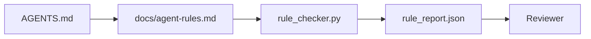

# En el caso de los agentes, las órdenes de ejecución son:

> La instrucción escrita en el ensayo es voluntad. La instrucción escrita en el ensayo es prueba. La oficina de trabajo transforma cada regla en agente.

**类型：**Construcción
**语言：**Python (stdlib)
**前置要求：**Fase 14 · 32 (Punto de trabajo mínimo)
**时间：** 50 minutos

## El objetivo del aprendizaje

- Se separará de las instrucciones de ruta y las reglas de operación.
- Para que las normas de inicio, prohibición de operaciones, finalización de la definición, el procesamiento de incertidumbre y la aprobación exprimen los límites de la limitación de la inspección de la máquina.
- 实现 un revisor de reglas, utilizar el conjunto de reglas para evaluar una operación.
- 让规则集便于变化, para que el examen pueda ver qué ha cambiado.

##  problemas

típico `AGENTS.md`阅读起来像进入职档. 告诉代理 谨慎和充分测试,以及不确定就询问──三天后, Agent 交付了没有测试的变更,写入了被禁止的目录,而且从未询问,因为它根本不知道边界在哪里──

Cuando las instrucciones son operables, son muy fuertes; cuando las instrucciones son sólo visuales, son muy débiles.

## 概念

Las reglas deben ser puestas.`docs/agent-rules.md`En el medio, lejos de la corta de los roots.



### 覆盖大多数规则的五个类别

| 类别 | 规则回答的问题 | 示例 |
|----------|---------------------------|---------|
| Startup | 工作开始前必须满足什么？ | “state file exists and is fresh” |
| Forbidden | 什么事情绝对不能发生？ | “do not edit `scripts/release.sh`” |
| Definition of done | 什么能证明任务已完成？ | “pytest exits 0 and acceptance line passes” |
| Uncertainty | Agent 不确定时该做什么？ | “open a question note instead of guessing” |
| Approval | 什么需要人工审批？ | “any new dependency, any prod write” |

∞ no puede ser incluido en una de estas cinco clases de reglas, normalmente debe ser dividido en dos reglas ∞ obligatoriamente dividido ∞

### La regla es legible

Cada regla tiene una frase, una clase, una línea de descripción y una`check`字段,指向 `rule_checker.py`Una función en el medio― Añadir reglas significa añadir controles; los controles crecen con la plataforma de trabajo―.

### 规则便于不同

规则在一个Markdown文件中,每条规则占据一个标题――重命名在不同中可见――新规则放在其类别的顶部――过时规则应删除,而不是注释掉,因为工作台才是真相来源,不是团队上个季度感受如何的聊天记录――

### 规则与框架 guardrails

框架 guardrails(OpenAI Agents SDK guardrails、LangGraph interrupts) en el funcionamiento en el nivel de las reglas de ejecución。

### Divulgación progresiva: 図書,而不是百科全书

`AGENTS.md`El proceso de ejecución de un documento es muy pequeño, pero es muy poco probable que se elimine una regla. Un año después, el archivo puede tener dos mil líneas; el agente de la primera pantalla puede consumir toda su atención en el presupuesto, sólo puede ejecutar una pequeña parte de ella.

修复方式不是 escribir un archivo más corto, sino escribir un archivo de una capa separada. Router de raíz debe ser pequeño hasta que cada sesión pueda leerse, y sólo guardar la puntuación.

```text
AGENTS.md                  # router，少于 50 行：这个 repo 是什么、去哪里看、5 条硬规则
docs/
  agent-rules.md           # 完整规则集（本课）
  architecture.md          # 任务触及 module boundaries 时加载
  testing.md               # 任务编写或运行 tests 时加载
  deploy.md                # 只在 release 工作中加载，并受 approval rule 保护
feature_list.json          # backlog（Phase 14 · 36）
```

| Tier | 存放位置 | 读取时机 | 大小预算 |
|------|----------|----------|----------|
| Router | `AGENTS.md` | 每个 session，始终读取 | 少于约 50 行 |
| Rules | `docs/agent-rules.md` | 每个 session 启动时 | 每个 category 一屏 |
| Topic docs | `docs/<topic>.md` | 只有任务触及该主题时 | 需要多深就多深 |

两个测试能让分层保持诚实――l primero es el test de accesibilidad: agente 应能从路由器出发,最多两跳抵达任何规则, por lo que el router 必须按路径 链接每个主题 doc,而不是用散文 模糊描述――l segundo es el test de frescura:路由器 足够短,revisor 会在每个 PR 里重读它,这是防止它长回百科全书的唯一方法――指针效失效比缺一条规则更糟糕,所以路由器中断链本身就是启动检查违规――


```figure
wb-rule-checkoff
```

## Construirlo

`code/main.py`提供:

- `agent-rules.md`Parser,将规则加载到数据类 中──
- `rule_checker.py`风格的检查函数, cada uno `check`引用对应一个.
- Un agente demo se ejecuta, viola las reglas, y una vez puede capturar estas infracciones.

¿Qué es eso ?

```
python3 code/main.py
```

输出:解析后的规则集、运行 追踪、每条规则的通过/失败,以及保存在脚本旁边的 `rule_report.json`¿Qué es eso?

## Modelo de producción

Hay tres modelos que pueden diferenciar un conjunto de reglas que puede durar un trimestre, de un conjunto de reglas de recesión en una semana.

**编写时标注严重性。**Cada regla está en juego.`severity`¿Qué es esto ?`block`¿Qué es esto?`warn`O `info` Inspectorado de información;`block`La mayoría de los equipos previamente evaluarán la gravedad, luego la debilitarán bajo la presión del plazo final; en la redacción, la etiqueta obligará al equipo a anticiparse.`block`规则的过失 签入                                                                                                                                                                                                                                                                                                                                                                                                                                                                                                                     `overrides.jsonl`registro de auditoría.

**规则过期作为强制机制。**Cada regla está en juego.`expires_at`Cuando una regla no haya transcurrido durante 60 días sin ninguna infracción, el inspector emitirá una advertencia; la próxima revisión de la cuota de tiempo indicará las razones para retenerla o para debilitarla.`info`, o eliminarla;. Datos de revisión de código de producción de AI de Cloudflare (((2026 4 月,30 天内跨 5,169  repo运行 131,246 次评论) muestran que, con un mecanismo de vencimiento definido, las reglas del mecanismo se pueden mantener dentro de cada regla de 30 条; las reglas del mecanismo sin vencimiento aumentaron hasta 80+, y la mayoría nunca se tocan.

**Markdown 作为 source，JSON 作为 cache。** `agent-rules.md`Es el autor de los documentos de mantenimiento;`agent-rules.lock.json`Es un sistema de control en el camino de acceso.`package.json`- ¿ Qué ?`package-lock.json`Y `Cargo.toml`- ¿ Qué ?`Cargo.lock`Lo mismo.

## Usalo

En la producción:

- Claude Code、Codex、Cursor en la sesión  comienza leer las reglas, y rechazar la operación en la que se citan.
- Los barandillas de SDK de OpenAI Agents serán registrados para los barandillas de entrada y salida de la misma manera.
- LangGraph interrumpe el nodo en ejecución  infra violación de la regla 触发──interrumpe el manipulador 读取规则, interrogat人类,然后恢复──

Este conjunto de reglas puede ser transferido entre tres personas, ya que es sólo un marcador de función.

##  entregarlo

`outputs/skill-rule-set-builder.md`El propietario del proyecto de encuestas, clasificará sus instrucciones de散文式现有分类到五类, y sacará una versión con `agent-rules.md`Además de un dispositivo de inspección.

##  ejercicios

1. Si tu producto realmente necesita una sexta categoría, añadela. Explica por qué no puede ser incluida en una de estas cinco categorías.
2. 扩展检查器,让规则可以携带严重性(`block`¿Qué es esto?`warn`¿Qué es esto?`info`), no se han reportado en función de la gravedad de la concentración.
3. Cuando el nuevo agente de operación tiene una regla de severidad de bloque que falla, entonces deja que la construcción fracase.
4. Por lo que se refiere a la aplicación de la ley, el artículo 90 del Reglamento no se aplica a los Estados miembros.
5. 找一个真实一个 `AGENTS.md`, y lo reescribió en cinco clases de reglas. ¿Cuántas de ellas son operables? ¿Cuántas de ellas son visual?

## 关键术语: "El hombre es un hombre"

| 术语 | 人们的说法 | 它实际意味着什么 |
|------|----------------|------------------------|
| Operational rule | “一条真正的指令” | 工作台可在运行时检查的规则 |
| Aspirational rule | “谨慎一点” | 没有检查的规则；要么删除，要么升级 |
| Definition of done | “Acceptance” | 证明任务已完成的客观、基于文件的证据 |
| Block severity | “硬规则” | 违规会中止运行；没有 operator 不能静默处理 |
| Rule expiry | “过时规则清理” | 在 N 天内没有失败的规则可以考虑退役 |

## 延伸阅读

- [OpenAI Agents SDK guardrails](https://platform.openai.com/docs/guides/agents-sdk/guardrails)
- [LangGraph interrupts](https://langchain-ai.github.io/langgraph/how-tos/human_in_the_loop/breakpoints/)
- [Anthropic, Building Effective Agents](https://www.anthropic.com/research/building-effective-agents)
- [Rick Hightower, Agent RuleZ: A Deterministic Policy Engine](https://medium.com/@richardhightower/agent-rulez-a-deterministic-policy-engine-for-ai-coding-agents-9489e0561edf) Bloqueo/alerta/información 严重性
- [Cloudflare, Orchestrating AI Code Review at Scale](https://blog.cloudflare.com/ai-code-review/) 131k 次 运行,规则组合经验
- [microservices.io, GenAI development platform — part 1: guardrails](https://microservices.io/post/architecture/2026/03/09/genai-development-platform-part-1-development-guardrails.html) 规则 y defensa en profundidad entre CI
- [Type-Checked Compliance: Deterministic Guardrails (arXiv 2604.01483)](https://arxiv.org/pdf/2604.01483) Lean 4  como regla-como-cheque de la límite superior
- [logi-cmd/agent-guardrails](https://github.com/logi-cmd/agent-guardrails) fusion-gate 实现: alcance, pruebas de mutación, presupuestos de violación
- Fase 14 · 32  El reglamento conjunto de conexiones de la mesa de trabajo mínima
- Fase 14 · 38  Puerta de verificación del informe de normas de consumo
- Fase 14 · 39  Agente de evaluación de las normas y normas
