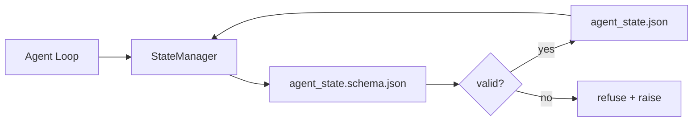

# Repo Memoria y estado duradero

> El historial de chat es fácil de perder. El reporte es duradero.

**Type:** Build
**Languages:** Python (stdlib + `jsonschema` optional)
**Prerequisites:** Phase 14 · 32 (Minimal Workbench)
**Time:** ~60 minutes

## El objetivo del aprendizaje
- 定义什么属于 repo memoria,什么属于聊天历史.
- Por lo tanto ,`agent_state.json`Y `task_board.json`编写 JSON Schemas。
- Construir un gerente de estado, utilizado para la carga, la verificación, los cambios y el estado de perpetuidad en el ámbito atómico 
- Utiliza esquemas en mal escrito para destruir el escritorio de trabajo antes de rechazarlos.

##  problemas
Agente  completó una sesión―chat 关闭了― 下一个会议 打开并询问从哪里开始―model 说让我检查文件,读取过时的笔记,然后重复已经完成的工作―更糟糕的是, se volverá a escribir un documento ya completado, porque nadie le dijo que este documento ya se había completado―

El modo de modificación de workbench es el modo de repos: estado existencia de repos en el JSON 文件里, según el esquema 写入,以原子方式持久化, y en la revisión de código en el medio de la diferencia amiga buena。Chat es un feed temporal; repo es un sistema de registro。

## 概念


### ¿Qué pertenece a la memoria repo

| 属于 | 不属于 |
|---------|-----------------|
| Active task id | 原始 chat transcripts |
| 本 session 触碰过的文件 | Token-level reasoning traces |
| agent 做出的假设 | "The user seemed frustrated" |
| 未解决的 blockers | Sampled completions |
| 下一步 action | Vendor-specific model ids |

判断标准是持久性: ¿Es útil también cuando CI vuelve a funcionar tres meses después?

### Estado del primer esquema

JSON Schema es un acuerdo. Sin él, cada agente desarrollará un nuevo capítulo, cada revisor aprenderá una nueva forma, cada guión de CI tendrá que ser un caso especial para la versión anterior.

esquema 覆盖:

- Necesitas llaves.
- 允许的 `status`Valores
- 禁止的值(例如 arrays 的 `null`)。
- Constrangimientos de patrón`T-\d{3,}`)。
- Utilizando el campo de versión de migraciones.

### Atomic escribe

Estado 写入需要能承受部分失败:写入 tempfile,fsync,然后改名覆盖目标――el archivo de estado es fuente de verdad; escribir hasta la mitad del archivo de estado 比没有文件更糟──

### Migraciones

Cuando el esquema cambia, en el esquema se agita junto a entregar un script de migración.`schema_version`campo;administrador se negará a cargar la versión de archivo que no puede ser movido.


```figure
wb-state-persist
```

## Construirlo
`code/main.py` realización:

- `agent_state.schema.json`Y `task_board.schema.json`¿Qué es eso?
- Una única validación de stdlib se utiliza en el sistema JSON.
- 带有原子 temp-and-rename 写入的 `StateManager.load`¿Qué es esto?`StateManager.update`¿Qué es esto?`StateManager.commit`¿Qué es eso?
- Una demostración: cambio de estado, perpetuidad, recarga, y prueba de ida y vuelta.

¿Qué es eso ?

```
python3 code/main.py
```

El guión 会写入 `workdir/agent_state.json`Y `workdir/task_board.json`, a través de dos giros, los cambia y en cada paso imprime el estado de la prueba.

## Modelo de producción en el escenario real

Cuatro modalidades pueden convertir el mínimo de la clase en un monorepo multi-agente, algo que se puede soportar.

**Atomic temp-and-rename 不是可选项。**Un informe de error del proyecto Hive de marzo de 2026  claramente registró este modo de falla:`state.json` Por el `write_text()`写入,并且例外 被捕后静默忽略──部分写入让会议 在没有信号的情况下基于损坏状态 恢复──修复永远是:在与目标相似的目录中使用`tempfile.mkstemp`, escribe,`fsync`¿ Qué ?`os.replace`(en POSIX y Windows arriba son renombramientos atómicos)`atomic_write`Es lo que hace.

**每个非幂等 tool call 都要有 idempotency keys。**Si el agente en el rodaje de la herramienta 后、checkpoint 结果之前崩, el proceso de recuperación volverá a intentar la llamada de la herramienta ⋅对读安全;对电子邮件、DB inserts、file uploads 危险──模式是:在执行前将每个工具的呼叫 ID 记录到`pending_calls.jsonl` Reprobar el ID; si existe, saltar sobre el uso y utilizar el resultado almacenado en caché──Antropic 和 LangChain han señalado este punto en una guía de 2026; el puntero de control de LangGraph proviene de la misma razón de la permanencia pendiente de los escritos──

**将大型 artifacts 与 state 分离。**No guardes CSVs, transcripciones o archivos generados.`agent_state.json`△将 artefacto 保存为单独文件(或上传到物体存储), estado en el que el medio sólo conserva el camino― controles 保持小而快; artefactos 独立增长―

**Event sourcing 用于 audit，snapshots 用于 resume。**Cada mutación se añade al registro de eventos`state.events.jsonl`); de forma periódica hasta `state.json`✿ Resumen 读取快照,然后播放快照时刻 之后的所有事件──这会消耗更多磁盘,但允许你逐字播放代理决策,这对调试长视线运行至关重要──Postgres 内部用于WAL的也是一样的形状──

**Schema migrations，否则拒绝加载。** `schema_version`Cuando el administrador carga una versión desconocida de un archivo, se niega a leerlo.`tools/migrate_state.py`En cada inicio, el tiempo de funcionamiento.

## Usalo
En la producción:

- **LangGraph checkpointers。**Con la misma idea, diferente almacenamiento. Checkpointer se va a hacer el estado del gráfico permanente a SQLite Postgres o backend personalizado.
- **Letta memory blocks。**带结构化方案的持续块 (Pase 14 · 08) ⋅同样纪律,作用域是长期的人类──
- **OpenAI Agents SDK session store。**Los archivos de fondo enchufables, conocedores de esquemas.

##  entregarlo
`outputs/skill-state-schema.md`会生成一对项目特定JSON Schema(state + board) 、一个连接到原子写的Python `StateManager`, así como un andamio de migración, asegúrese de que la próxima vez el estallido del esquema no dañe el escritorio.

##  ejercicios
1. Añade uno.`last_human_touch`Tempestamp. Rechazar cualquier agente en el transcurso de 5 segundos.
2. 扩展 validador 以支持 `oneOf`, tal tarea puede ser tarea de construcción, también puede ser tarea de revisión, y ambos tienen campos requeridos diferentes.
3. 添加                                                                                                                                                                                                                                                                                                                                                                                                                                                                                                                           `schema_version`campo,并编写 de v1 a v2 de migración`blockers`重命名为 `risks`)。
4. Se moverá el archivo de almacenamiento de archivo local a SQLite.`StateManager`La API no cambia.
5. ¿Qué problema tiene el cambio de nombre atómico? ¿Cómo te ayudará?

## 关键术语: "El hombre es un hombre"
| Term | What people say | What it actually means |
|------|----------------|------------------------|
| Repo memory | "Notes file" | 按 schema 存储在 repo 的 tracked files 中的 state |
| Schema-first | "Validate inputs" | 先定义契约再写 writer，拒绝漂移 |
| Atomic write | "Just rename" | 写入 temp，fsync，rename，因此 partial failures 无法破坏 |
| Migration | "Schema bump" | 将 vN state 转换为 v(N+1) state 的 script |
| System of record | "Source of truth" | workbench 视为权威的 artifact |

## 延伸阅读
- [JSON Schema specification](https://json-schema.org/specification.html)
- [LangGraph checkpointers](https://langchain-ai.github.io/langgraph/concepts/persistence/)
- [Letta memory blocks](https://docs.letta.com/concepts/memory)
- [Fast.io, AI Agent State Checkpointing: A Practical Guide](https://fast.io/resources/ai-agent-state-checkpointing/) Control de los esquemas en primer lugar
- [Fast.io, AI Agent Workflow State Persistence: Best Practices 2026](https://fast.io/resources/ai-agent-workflow-state-persistence/) control de concurrencia  TTL  abastecimiento de eventos
- [Hive Issue #6263 — non-atomic state.json writes silently ignored](https://github.com/aden-hive/hive/issues/6263) proyecto real  Modus de fracaso
- [eunomia, Checkpoint/Restore Systems: Evolution, Techniques, Applications](https://eunomia.dev/blog/2025/05/11/checkpointrestore-systems-evolution-techniques-and-applications-in-ai-agents/) De los sistemas operativos 史、 应用于 agentes de las primitivas de la CR
- [Indium, 7 State Persistence Strategies for Long-Running AI Agents in 2026](https://www.indium.tech/blog/7-state-persistence-strategies-ai-agents-2026/)
- [Microsoft Agent Framework, Compaction](https://learn.microsoft.com/en-us/agent-framework/agents/conversations/compaction) Gerente de los puntos de control del vendedor
- Fase 14 · 08  Bloques de memoria y cálculo del tiempo de sueño
- Fase 14 · 32  本课为其 esquema 化的 tres archivos mínimo
- Fase 14 · 40  De la misma esquema 读取的交付包
