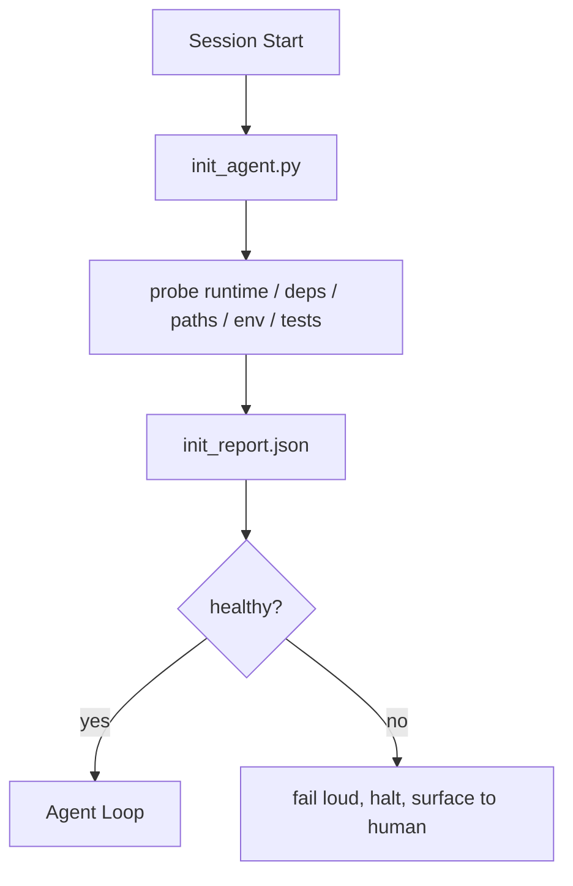

# El guión inicial del agente

> Cada sesión de inicio frío tiene que pagar un precio. El agente lee los mismos archivos, vuelve a intentar la misma búsqueda, y vuelve a encontrar el mismo camino.

**Type:** Build
**Languages:** Python (stdlib)
**先修要求：**Fase 14 · 32 (minimo trabajo), Fase 14 · 34 (memoria de informes)
**Time:** ~45 分钟

## El objetivo del aprendizaje
- El agente de identificación no debe repetir el trabajo realizado en cada sesión.
- Construir un guión de inicio de determinación, para buscar el tiempo de ejecución 、dependencias 和 repo saludƒ
- 持久化查查结果, que el agente 读取它, en lugar de volver a ejecutar la inspección.
- Cuando el inicio fracasa, para responder, rápidamente, fracasa, y proporciona la única posición de búsqueda.

##  problemas
打开一个会议──Agent 猜测 Python version──Guess test command──Para encontrar el punto de entrada, listar la raíz de repo 五次──尝试 importar un paquete que no se haya instalado──Preguntar el archivo de configuración del usuario 在哪里──等到它真正开始编辑时,已经有十万代币花在本本应由一脚本完成的设置工作 上──

修复方式是使用一个初始化脚本: se ejecuta antes de que el agente haga cualquier cosa,并写入一个供代理 启动时读取的 `init_report.json`¿Qué es eso?

## 概念


### Inicial script 探查什么

| Probe | 为什么重要 |
|-------|------------|
| Runtime versions | 错误的 Python 或 Node version 意味着悄无声息的错误版本 bug |
| Dependency availability | 缺失的 package 如果到后面才发现，成本会是现在捕获它的十倍 |
| Test command | Agent 必须知道如何 verify；如果 command 缺失，workbench 就坏了 |
| Repo paths | Hard-coded paths 会漂移；一次性解析并固定下来 |
| Environment variables | 缺失 `OPENAI_API_KEY` 是一个 failure surface，而不是 runtime mystery |
| State + board freshness | 崩溃 session 留下的陈旧 state 是一个 footgun |
| Last-known-good commit | 作为 session 结束时 handoff diff 的锚点 |

### 快速显然失败,并集中在一个失败的地方

La prueba  fracaso significa parar y presentarse a los humanos. No digas que el agente se haga claro. Todo lo que significa es que el trabajo se rompe cuando se niega a iniciar.

### Idempotente

连续运行两次──第二次除刷新时间打印 之外应该是没有开放――Idempotency 让你能把脚本连接到CI、hooks或预任务剪切命令──

### Las reglas de inicio

Reglas (Fase 14 · 33)  描述行动前必须满足什么――Init es establecer estas reglas 可检查的脚本――没有 init的规则将变成要小心──没有规则的 init将变成精致的失败──


```figure
wb-init-probes
```

## Construirlo
`code/main.py` Realizada `init_agent.py`¿Qué es esto ?

- 五个探测器:Python versión 通过`importlib.util.find_spec`列出的依赖性、test command resolvability、required env vars、state file freshness──
- Cada sonda regresa .`(name, status, detail)`¿Qué es eso?
- 脚本写入包含完整探测组 的 `init_report.json`, y en cualquier prueba de severidad de bloque  fracaso en un estado de no-zero retroceder.

¿Qué es eso ?

```
python3 code/main.py
```

脚本会打印探测表,写入 `init_report.json`, en el camino feliz arriba en el estado de cero, o en el estado de no cero en el fracaso y la lista de probas fallidas.

## Modelo de producción en el escenario real

Tres modalidades pueden distinguir un script inicial útil y un sentido ritual.

**Last-known-good commit anchoring.**Se comprometen en el presente con el éxito de la fusión anterior.`LKG`Si el archivo es diferente  más allá del presupuesto 默认 50 文件), rechazar el inicio,并要求 humanos 确认新的基线── esto es exactamente lo que Cloudflare's AI Code Review utiliza para limitar los agentes de revisión 作用域: cada sesión de revisión está determinada a la misma última conocida-buena, no pasará por sesiones 叠加漂移──

**Lock files with TTL.**En la primera exitosa prueba de paso después de escribir`prereqs.lock`◊后续运行会在 N 小时内信任该锁(默认 24h),并跳过昂贵的探测.

**No network, no LLM, no surprises in the hot path.**Las sondas iniciales son plomería de determinación. Se utiliza LLM para clasificar fallas, o para visitar un servicio externo.

## Usalo
En la producción:

- **Claude Code hooks.** `pre-task`Hook 调用 init script, y en el fracaso rechazó iniciar el agente.
- **GitHub Actions.** `setup-agent`trabajo 运行 init script; trabajo del agente depende de ello.
- **Docker entrypoint.**Contenedor de agente en el tiempo de ejecución de un agente ejecutivo 之前运行 init script;失败时呈现日志──

init script es transportable, ya que no utiliza ningún marco específico.

##  entregarlo
`outputs/skill-init-script.md`Proyecto de encuestas, trabajo de creación, investigación y desarrollo de proyectos específicos.`init_agent.py`, y un flujo de trabajo de CI antes de que el agente ejecute cualquier paso.

##  ejercicios
1. Añadir una sonda, para usarla diferente cuando se comite y el último conocido-bueno comite; si cambia más de 50 archivos, se niega a iniciar.
2. Para que el guión se conecte, que se escriba.`prereqs.lock`archivo, y bloquear 超過七天時拒絕啟動──
3. Añade uno.`--fix`bandera, auto instalar la falta de dependencias de desarrollo, pero no aprobado nunca modificar las dependencias de tiempo de ejecución.
4. Se moverán las sondas de las funciones codificadas en el registro de YAML.
5. Para cada sonda, añadir un presupuesto de tiempo.

## 关键术语: "El hombre es un hombre"
| Term | 人们会怎么说 | 它实际意味着什么 |
|------|--------------|------------------|
| Probe | “一个 check” | 返回 `(name, status, detail)` 的确定性函数 |
| Init report | “Setup output” | 与 state 放在一起、写有 probe results 的 JSON |
| Idempotent | “可以安全重新运行” | 连续两次运行会生成除 timestamp 外完全相同的 reports |
| Fail loud | “不要吞掉” | 停止并呈现给 human；没有 silent fallback |
| Setup tax | “Bootstrap cost” | Agent 每个 session 为重新发现显而易见信息所花费的 Token |

## 延伸阅读
- [Anthropic, Effective harnesses for long-running agents](https://www.anthropic.com/engineering/effective-harnesses-for-long-running-agents)
- [GitHub Actions, composite actions for setup](https://docs.github.com/en/actions/sharing-automations/creating-actions/creating-a-composite-action)
- [microservices.io, GenAI 开发平台：guardrails](https://microservices.io/post/architecture/2026/03/09/genai-development-platform-part-1-development-guardrails.html) precomit + CI 检查作为 init
- [Augment Code, How to Build Your AGENTS.md (2026)](https://www.augmentcode.com/guides/how-to-build-agents-md) expectativas iniciales
- [Codex Blog, Codex CLI Context Compaction](https://codex.danielvaughan.com/2026/03/31/codex-cli-context-compaction-architecture/) inicio de sesión como compacción consciente init
- Fase 14 · 33  Este script iniciación juego de reglas
- Fase 14 · 34  El archivo de estado de la producción
- Fase 14 · 38  init script  suministro de puertas de verificación
- Fase 14 · 40  消费 init informe de las últimas entregas conocidas
