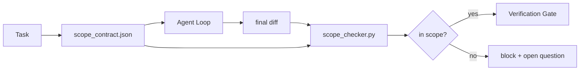

# El alcance del contrato y la frontera de tareas

> modelo No sé dónde termina el trabajo. El contrato de alcance es un archivo por tarea, para explicar el trabajo desde dónde comienza, donde termina y una vez que el trabajo se vuelve a trabajar.

**类型:**Construir
**语言:**Python (stdlib)
**先修:**Fase 14 · 32 (Punto de trabajo mínimo), Fase 14 · 33 (Reglas como restricciones)
**时间:**~ 50 minutos

## El objetivo del aprendizaje

-  redactar un contrato de alcance, hacer que el agente en la misión comience a leer, y hacer que el verificador en la misión termina a leer.
- pecificar archivos permitidos, archivos prohibidos, criterios de aceptación, plan de retroceso y límites de aprobación.
-  realizar un control de alcance, será diferente al contrato comparado y marcará la violación.
- 让范围 creep可见、自动化且可审查──

##  problemas

El agente se arrastra. La tarea es reparar el error de inicio de sesión. Diferencia. Toca en contacto con la ruta de inicio de sesión.

El escopo de la escursión es el modo de fracaso más inadecuado de la labor del agente, porque el agente le cuenta sinceramente cada paso. La solución no es más rápida. La solución es poner un contrato en el disco, explicar lo prometido, y comparar los resultados con los compromisos.

## 概念



### el alcance del contrato incluye

| Field | Purpose |
|-------|---------|
| `task_id` | 链接到 board 上的 task |
| `goal` | reviewer 可以验证的一句话 |
| `allowed_files` | agent 可以写入的 globs |
| `forbidden_files` | agent 即使意外也不得触碰的 globs |
| `acceptance_criteria` | 证明完成的 test commands 或 assertion lines |
| `rollback_plan` | 如果需要 halt，operator 可以执行的一段说明 |
| `approvals_required` | scope 外需要明确 human sign-off 的 actions |

No hay .`forbidden_files`El contrato es incompleto.

### Utiliza globos, en lugar de caminos crudos

¡Recuerde el contrato! ¡Fixado en los globos!`app/**/*.py`¿ Qué ?`tests/test_signup*.py`), así la sesión                                                                                                                                                                                                                                                                                                                                                                                                                                                                                                                         

### El retroceso es parte del alcance .

列出如何滚回会迫使合同作者思考可能出什么问题──不能滚回的合同是不应批准的合同──

### Verificación de alcance es verificación de diferencia

Agente 写出 diff―check 读取 diff―allowed globes、forbidden globes, así como cualquier lista de comandos de aceptación ya ejecutados―cada violación 都是一个带标签的发现,verification gate can reject it―

### Capacidad de trabajo: lista de características y contrato de tareas

el contrato de alcance está limitado a una tarea. Desde entonces no se ha preguntado qué es el alcance de este proyecto, solo responde qué documentos están dentro de este proyecto.

Segundo nivel necesita su propio primitivo: una sesión`feature_list.json`△ Es el archivo de proyectos de la máquina legible  un archivo  agente                                                                                                                                                                                                                                                                                                                                                                                                                                                                                                         `status`Por lo tanto ,`todo`La característica, ponerlo.`id`写入活 scope contract,并被禁止在同一个会议中启动第二个功能. 一次只做一个功能.  不再是提示里代理可以绕过过去的一句话,而一个写在磁盘上的值,也是门可以执行的检查.

```json
{
  "project": "knowledge-base",
  "active": "import-pdf",
  "features": [
    { "id": "import-pdf", "status": "in_progress", "goal": "import a PDF into the library", "done_when": "pytest tests/test_import.py && a sample PDF appears in the library view" },
    { "id": "full-text-search", "status": "todo", "goal": "search document text and rank hits", "done_when": "query returns ranked results with snippets" },
    { "id": "cite-answers", "status": "todo", "goal": "answers carry source citations", "done_when": "every answer renders at least one clickable citation" }
  ]
}
```

| Field | Purpose |
|-------|---------|
| `active` | 当前 session 唯一允许触及的 feature；为空时表示选择一个并设置它 |
| `features[].id` | scope contract 的 `task_id` 指向的稳定 slug |
| `features[].status` | `todo`、`in_progress`、`done`、`blocked`；同一时间最多一个 `in_progress` |
| `features[].goal` | reviewer 能验证的一句话 |
| `features[].done_when` | 将 `in_progress` 翻转为 `done` 的 acceptance line |

两条规则让这个名单成为承重结构,而不是装饰.`at most one in_progress`Esta invariante 本身就是启动检查(Fase 14 · 33): si la lista 里出现两个, sesión 会拒绝启动,直到人类 解决。 Segundo, la lista de características es un archivo, no un mensaje de chat, porque el chat se rodará en contexto, mientras que el archivo se ejecutará a través de las sesiones、 a través de los agentes 持久存在──handoff(Fase 14 · 40) completará el estado de la característica 写回`done`, así que la próxima sesión se abre para ver la tabla de la información, en lugar de re-representar lo que queda.

contrato con lista                                                                                                                                                                                                                                                                                                                                                                                                                                                                                                                           `allowed_files`∞ debe caer en la función activa dentro del alcance de lo que se trata, no puede pasar de la frontera


```figure
wb-scope-bounce
```

## Construirlo

`code/main.py` realización:

- `scope_contract.json`Esquema de JSON (JSON Schema's sub-集, matrices globales)
- Un parser diferente, se tocarán archivos 列表和运行命令 列表转换为 列表转换为`RunSummary`¿Qué es eso?
- Una de ellas .`scope_check`, según el contrato  regresar `(violations, in_scope, off_scope)`¿Qué es eso?
- Dos pruebas: una para mantener el alcance, otra para hacer creep.

运行:

```
python3 code/main.py
```

输出: contrato 两个 ejecuciones  cada ejecución del veredicto, así como la conservación `scope_report.json`¿Qué es eso?

## Los patrones en la producción real

Un experto en el campo de los contratos de uso de un agente de la empresa (excepto en el caso de un agente de cambio, el tipo de conejo-agujero en el período de tres semanas, de 52% a 21%, se produce en el contrato, no en el modelo.

**Violation budgets，而不是 binary failures。** `agent-guardrails`(Claude Code、Cursor、Windsurf、Codex 经由MCP使用的OSS merge gate) para cada tarea 提供 `violationBudget`Las entradas de la línea de trabajo de la Comisión de Asuntos Exteriores se han convertido en una línea de trabajo de la Comisión de Asuntos Exteriores.`violationSeverity: "error" | "warning"`Este presupuesto decide si se va a adoptar o se va a odiar su equipo.

**按 path family 做 severity asymmetry。**¿ Qué ?`docs/**`Es un libro fuera de alcance.`warn`• para`scripts/**`¿Qué es esto?`migrations/**`¿Qué es esto?`config/prod/**`de fuera de alcance escribe 总是 `block`◊ Esta asimetría  debe existir en el contrato, no en el tiempo de ejecución, ya que es específica del proyecto, y cada tarea cambia 

**Time 和 network budgets 与 file budgets 并列。** `time_budget_minutes`campo 约束 reloj de pared; tiempo de ejecución en caso de no reaprobación rechazar continuar sobre él.`network_egress`El objetivo de la investigación es mejorar la calidad de los datos y la calidad de los datos.

**Multi-contract merge semantics（least privilege）。**Cuando dos contratos de alcance, como el contrato de proyecto en general y el contrato específico de tarea, se fusionan, las reglas son:**intersect** `allowed_files`(dos contratos deben permitir este camino),**union** `forbidden_files`(qualquier uno puede prohibir),`time_budget_minutes`取最严格值 (min)`approvals_required`累积── es una gran cantidad de dinero.`network_egress`En el medio,`None`Indicar que no se cumple,`[]`Designación de negar todo,`[...]`Indicar la lista de permisos;merger 时,`None`让位于另一侧,两个列表取交集,否认-all 保持否认-all──把这一点写入合同方案,这样合并就是机械且可审查的──

## Usalo

Modelos de producción:

- **Claude Code slash commands.** `/scope`El comando 写入合同,并将其固定为会议背景──Subbagents 在行动前读取合同──
- **GitHub PRs.**Se trata de un contrato como archivo JSON 推送到PR body 中, o como un artefacto verificado ⋅ CI 会针对 merge 运行范围检查器──
- **LangGraph interrupts.**Violación del alcance 触发 interrupt; manipulador 询问人 是需要扩大合同,还是代理 需要后退──

contrato 随任务 流转――当任务 关闭时,合同 会归档到 `outputs/scope/closed/`¿Qué es eso?

##  entregarlo

`outputs/skill-scope-contract.md`Se trata de una descripción de tareas, se crea un contrato de alcance, así como un control de la operación de cada agente en el CI.

##  ejercicios

1. Añade uno.`network_egress`campo,列出允许的外部主机──拒绝触碰其他主机的运行──
2.  Extensión de control, hacer que sea `docs/**`软失败 对 `scripts/**`硬失败――说明 de esta asimetría razón―
3. Use estática regla fijación(no usar LLM)`goal`campo 推导 `allowed_files`¿Qué problema se plantea en el primer caso?
4. 添加                                                                                                                                                                                                                                                                                                                                                                                                                                                                                                                           `time_budget_minutes`, y el reloj de la pared  sobrepasó después de rechazar continuar.
5. Para el mismo 运行两个合同. Cuando ambos se aplican, ¿qué es la semántica de la fusión correcta?

## 关键术语: "El hombre es un hombre"

| Term | What people say | What it actually means |
|------|----------------|------------------------|
| Scope contract | “任务 brief” | per-task JSON，列出 allowed/forbidden files、acceptance、rollback |
| Scope creep | “它还 touched 了...” | 同一 task 中发生了 contract 外的文件变更 |
| Rollback plan | “我们可以 revert” | 用于 halt 的一段 operator runbook |
| Approval boundary | “需要 sign-off” | contract 中列出的、需要明确 human approval 的 action |
| Diff check | “Path audit” | 将 touched files 与 contract globs 比较 |

## 延伸阅读

- [LangGraph human-in-the-loop 中断](https://langchain-ai.github.io/langgraph/concepts/human_in_the_loop/)
- [OpenAI Agents SDK tool approval policies](https://platform.openai.com/docs/guides/agents-sdk)
- [logi-cmd/agent-guardrails — merge gates 与 scope validation](https://github.com/logi-cmd/agent-guardrails) presupuestos de violación  niveles de gravedad
- [Dev|Journal, Preventing AI Agent Configuration Drift with Agent Contract Testing](https://earezki.com/ai-news/2026-05-05-i-built-a-tiny-ci-tool-to-keep-ai-agent-configs-from-drifting-in-my-repo/) 无 deps externos `--strict`el modo
- [Agentic Coding Is Not a Trap (production logs)](https://dev.to/jtorchia/agentic-coding-is-not-a-trap-i-answered-the-viral-hn-post-with-my-own-production-logs-33d9) recibos de especmaxxing: 52% → 21%
- [OpenCode permission globs](https://opencode.ai/docs/agents/) 细粒度 por alcance de la autorización
- [Knostic, AI Coding Agent Security: Threat Models and Protection Strategies](https://www.knostic.ai/blog/ai-coding-agent-security)  Como el menor privilegio una parte del alcance
- [Augment Code, AI Spec Template](https://www.augmentcode.com/guides/ai-spec-template) Sistema de límites de tres niveles (debe/no debe/nunca)
- Fase 14 · 27  Con cerraduras de alcance 配套的 defensa de inyección rápida
- Fase 14 · 33  Este contrato  para cada tarea  conjunto de reglas especializadas
- Fase 14 · 38  control 汇报 entrada de la puerta de verificación
