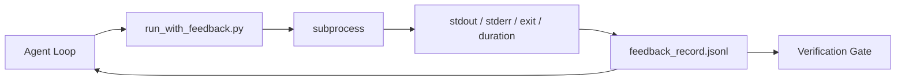

# Los bucles de retroalimentación en tiempo de ejecución

> La respuesta de un ejecutor de datos de datos de datos de datos de datos de datos de datos de datos de datos de datos de datos de datos de datos de datos de datos de datos de datos de datos de datos de datos de datos de datos de datos de datos de datos de datos de datos de datos de datos de datos de datos de datos de datos de datos de datos de datos de datos de datos de datos de datos de datos de datos de datos de datos de datos de datos de datos de datos de datos de datos de datos de datos de datos de datos de datos de datos de datos de datos de datos de datos de datos de datos de datos de datos de datos de datos de datos de datos de datos de datos de datos de datos de datos de datos de datos de datos de datos de datos de datos de datos de datos de datos de datos de datos de datos de datos de datos de datos de datos de datos de datos de datos de datos de datos de datos de datos de datos de datos de datos de datos de datos de datos de datos de datos de datos de datos de datos de datos de datos de datos de datos de datos de datos de datos de datos de datos de datos de datos de datos de datos de datos de datos de datos de datos de datos de datos de datos de datos de datos de datos de datos de datos de datos de datos de datos de datos de datos de datos de datos de datos de datos de datos de datos de datos de datos de datos de datos de datos de datos de datos de datos de datos de datos de datos de datos de datos de datos de datos de datos de datos de datos de datos de datos de datos de datos de datos de datos de datos de datos de datos de datos de datos de datos de datos de datos de datos de datos de datos de datos de datos de datos de datos de datos de datos de datos de datos de datos de datos de datos de datos de datos de datos de datos de datos de datos de datos de datos de datos de datos de datos de datos de datos de datos de datos de datos de datos de datos de datos de datos de datos de datos de datos de datos de datos de datos de datos de datos de datos de datos de datos de datos de datos de datos de datos de datos de datos de datos de datos de datos de datos de datos de datos de datos de datos de datos de datos de datos de datos de datos de datos de datos de datos de datos de datos de datos de datos de datos de datos de datos de datos de datos de

**Type:** Build
**Languages:** Python (stdlib)
**先修要求：**Fase 14 · 32 (minimo banco de trabajo), Fase 14 · 35 (Escrito inicial)
**Time:** ~50 minutes

## El objetivo del aprendizaje
- 区分运行时间反与可观测远程测量――
- Construir un ejecutor de retroalimentación, usarlo para empacar comandos de shell y mantener un registro estructurado ⋅
- En un modo de determinación, cortar las grandes salidas, permita que el ciclo se mantenga en el presupuesto de los tokens.
- Cuando la retroalimentación  falta                                                                                                                                                                                                                                                                                                                                                                                                                                                                                                                       

##  problemas
El agente dice que está ejecutando pruebas ── 下一条消息说 Todas las pruebas han pasado ── Realitad es que no hay ninguna prueba que se ejecute── Agente imagina que ha salido, o ejecutado un comando pero nunca ha leído el resultado, o ha leído el resultado pero ha cortado la línea de falla──

El ejecutor de retroalimentación eliminará esta carencia. Cada comando pasa por el ejecutor. Cada registro contiene el comando. Captura de los datos y los datos.

## 概念


### registro de comentarios Contene lo que

| Field | 为什么重要 |
|-------|----------------|
| `command` | 精确 argv，避免 shell expansion 意外 |
| `stdout_tail` | 最后 N 行，确定性截断 |
| `stderr_tail` | 最后 N 行，与 stdout 分开 |
| `exit_code` | 明确无歧义的成功信号 |
| `duration_ms` | 暴露缓慢探测和失控进程 |
| `started_at` | 用于 replay 的 timestamp |
| `agent_note` | Agent 写下的一行预期说明 |

### La truncation es definitiva

50 MB de registro destruirá el ciclo. El corredor conservará la cabeza y la cola,并加入 `...truncated N lines...`marcador; esto es de certeza, por lo tanto el mismo output generará el mismo registro.

### El retroalimentación frente a la telemetría

Telemetría (Fase 14 · 23, OTel GenAI) para los operadores humanos 跨时间审查 runs。Feedback Used for this next run―: Ellos comparten algunos campos, pero se encuentran en diferentes documentos, retención también diferente―:

### No hay comentarios , rechazo la promoción .

Si el corredor en la salida de captura  antes de salir errores, el registro incluirá `exit_code: null`Y `error: <reason>`◊ El bucle de agentes debe ser rechazado`null`上 exit声称成功──没有 salida,就没有进步──


```figure
wb-feedback-loop
```

## Construirlo
`code/main.py` realización:

- `run_with_feedback(command, agent_note)`: empaquetado`subprocess.run`, capture stdout/stderr/exit/durada, determinación de corte,并追加到 `feedback_record.jsonl`¿Qué es eso?
- Un pequeño cargador, que transmitirá JSONL a la lista Python en el centro.
- Una demo, ejecutar tres comandos, éxito, fracaso, lento, y imprimir el último registro de cada comando.

运行:

```
python3 code/main.py
```

输出: 三条 registros de retroalimentación 会追加到 `feedback_record.jsonl`,并 inline 印印每条的最后一条──跨多次重复运行尾巴这个文件, puedes ver cómo se acumula el ciclo──

## Modelos de producción en la producción real

Hay tres patrones que pueden hacer que el corredor se ponga en marcha.

**写入时 redaction，而不是读取时 redaction。**Cualquier contacto con el equipo o el registro de los equipos puede revelar secretos.`^Bearer `¿Qué es esto?`password=`¿Qué es esto?`api[_-]?key=`¿Qué es esto?`AKIA[0-9A-Z]{16}`¿Qué es eso?`xox[baprs]-`(Slack) 行──读取时编辑是脚枪;文件在磁盘上的文件才是攻击者能获取的东西──每季度根据生产运行时间中观察到的秘密格式 审核编辑模式──

**Rotation policy，而不是单个文件。**¿ Qué ?`feedback_record.jsonl` límite para cada archivo 1 MB; Rotar en el tiempo de salida hasta `.1`¿Qué es esto?`.2`, abandonado`.5`◦ El bucle de agente sólo se utiliza para archivos de carga, por lo que el tiempo de ejecución tiene un costo de almacenamiento de artefactos de CI  Obtener un conjunto completo girado  Sin rotación  Cada llamada de cargador se retira en un cuello de botella 

**用于 retry chains 的 parent-command id。**Cada registro tiene un`command_id`Retiro  llevar `parent_command_id`, indica una vez arriba intento, revisor de los intentos fallidos  lista, fase 14 · 40) y la verificación de la puerta de auditoría se desarrollan a lo largo de esta cadena, no hay este enlace, los intentos parecen ser exitosos independientes, la auditoría se oculta el historial de fracaso.

## Usalo
Modelos de producción:

- **Claude Code Bash tool。**Esta herramienta  ya ha capturado el estdout, el estderr, la salida y la duración── el corredor de esta clase es cualquier producto agente  都能使用的框架-agnostic等价物──
- **LangGraph nodes。**Para que el nodo de la cáscara sea envuelto en el ejecutor, haga que el registro se perpetue en el estado del gráfico fuera.
- **CI logs。**Colocar el tubo JSONL en tu almacén de artefactos CI; los revisores pueden reproducir cualquier comando, sin necesidad de volver a ejecutar la sesión.

Runner es un paquete tenue; puede superar cada migración de marco, ya que posee forma de registro.

##  entregarlo
`outputs/skill-feedback-runner.md`Se generará un proyecto específico `run_with_feedback.py`, contiene un presupuesto de truncado correcto ∞ conectado al escritor JSONL del escritorio de trabajo, así como el cargador de Agencia de cada ronda de lectura ∞

##  ejercicios
1. Por cada registro 添加 `cwd`campo, así que el mismo comando que se ejecuta en diferentes directorios puede ser distinguido.
2. Añade uno.`redaction`El paso, despejar`^Bearer `O `password=`Ya está en el registro de fijación.
3.                                                                                                                                                                                                                                                                                                                                                                                                                                                                                                                              `.1`¿Qué es esto?`.2`文件,将 `feedback_record.jsonl`总大小限制为 1 MB──为轮换政策 辩护──
4. 添加                                                                                                                                                                                                                                                                                                                                                                                                                                                                                                                           `parent_command_id`, deja volver a probar cadenas 可见: ¿Cuál comando  generó el siguiente comando 消费的输入──
5. En el análisis, se incluyen ocho características clave que deben ser mostradas en la revisión.

## 关键术语: "El hombre es un hombre"
| Term | 人们常说 | 实际含义 |
|------|----------------|------------------------|
| Feedback record | “Run log” | 包含 command、output、exit、duration 的结构化 JSONL entry |
| Tail truncation | “Trim the log” | 确定性 head+tail 捕获，让 records 适配 token budget |
| Refuse-on-null | “Block on missing data” | 当 `exit_code` 为 null 时，loop 不得推进 |
| Agent note | “Expectation tag” | Agent 在读取结果前写下的一行预测 |
| Telemetry split | “Two log files” | Feedback 用于下一轮，telemetry 用于 operator |

## 延伸阅读
- [OpenTelemetry GenAI semantic conventions](https://opentelemetry.io/docs/specs/semconv/gen-ai/)
- [Anthropic, Effective harnesses for long-running agents](https://www.anthropic.com/engineering/effective-harnesses-for-long-running-agents)
- [Guardrails AI x MLflow — deterministic safety, PII, quality validators](https://guardrailsai.com/blog/guardrails-mlflow) Los patrones de redacción  como pruebas de regresión
- [Aport.io, Best AI Agent Guardrails 2026: Pre-Action Authorization Compared](https://aport.io/blog/best-ai-agent-guardrails-2026-pre-action-authorization-compared/) herramienta 前/后捕获
- [Andrii Furmanets, 2026 年的 AI Agents：面向 Tools、Memory、Evals、Guardrails 的实用架构](https://andriifurmanets.com/blogs/ai-agents-2026-practical-architecture-tools-memory-evals-guardrails) Interfaces de observación
- Fase 14 · 23  Convenciones de OTel GenAI en el ámbito de la telemetría
- Fase 14 · 24  Plataformas de observación de agentes ((Langfuse, Phoenix, Opik)
- Fase 14 · 33                                                                                                                                                                                                                                                                                                                                                                                                                                                                                                                        
- Fase 14 · 38  读取 JSONL de la puerta de verificación
