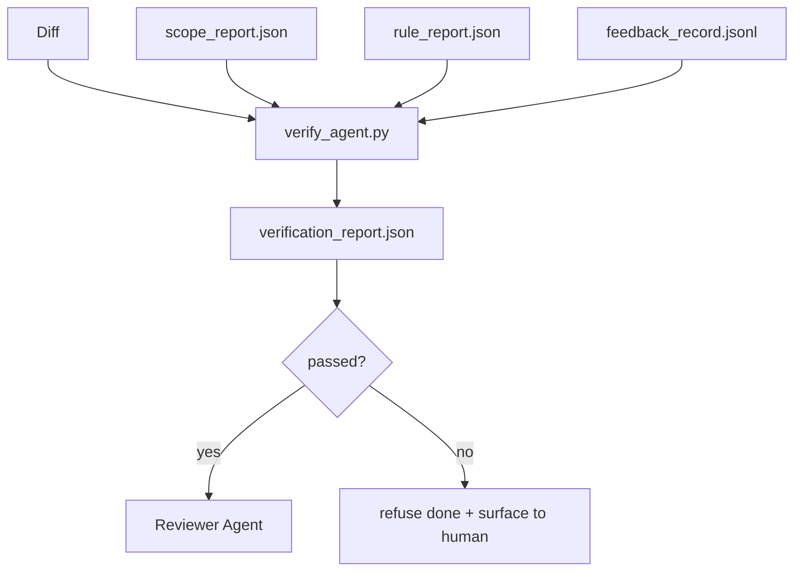

# Puertas de verificación

> El agente no puede marcar su trabajo para completarlo. La puerta de verificación Leer el alcance del contrato.

**Type:** Build
**Languages:** Python (stdlib)
**Prerequisites:** Phase 14 · 33 (Rules), Phase 14 · 36 (Scope), Phase 14 · 37 (Feedback)
**Time:** ~55 分钟

## El objetivo del aprendizaje
- La puerta de verificación será definida como función de determinación de los artefactos de la mesa de trabajo.
- El informe de reglas, el informe de alcance, los registros de retroalimentación y la diferencia se convierten en un veredicto.
- 输出审查员和CI 都能读取的 `verification_report.json`¿Qué es eso?
- Siempre que haya algún fracaso de severidad de bloque, no hay excepción para rechazar la tarea.

##  problemas
Los agentes 太容易宣称成功──三种失败形态最常见:

- Se ve bien. El modelo lee su propia diferencia, y luego se da cuenta de que es verdad.
- 测试通过了──说得很自信──但没有测试实际运行的记录──
-  satisfacer la aceptación Criterios de aceptación se explican lo suficientemente abiertamente, hasta que cualquier cosa como se haya hecho se haya hecho.

La forma de modificación de un workbench es una puerta de verificación, que le da a un agente de verificación de los objetos ya generados y que no toma decisiones.

## 概念


### puerta 检查什么

| Check | Source artifact | Severity |
|-------|-----------------|----------|
| 所有 acceptance commands 都已运行 | `feedback_record.jsonl` | block |
| 所有 acceptance commands 都以零退出码结束 | `feedback_record.jsonl` | block |
| Scope check 没有 forbidden writes | `scope_report.json` | block |
| Scope check 没有 off-scope writes | `scope_report.json` | block or warn |
| 所有 block-severity rules 都通过 | `rule_report.json` | block |
| feedback 中没有 `null` exit codes | `feedback_record.jsonl` | block |
| Touched files 匹配 `scope.allowed_files` | both | warn |

`warn`encontrar el veredicto 添注释;`block`encontrar una solución`passed: true`¿Qué es eso?

### 确定性, y no probabilidad

 Para el mismo conjunto de artefactos, cada vez hay que generar el mismo veredicto―no los jueces de LLM―Los jueces de LLM  pertenecen al lado del revisor  (Fase 14 · 39), donde el objetivo es la evaluación definitiva, no el juicio del estado―

### Un informe, un camino

Cada tarea cerrada, la puerta de la ciudad saldrá una.`verification_report.json`, escribe`outputs/verification/<task_id>.json`✿CI 消费同一个路──使用不同路的多个门 会分叉真理源──

###  No excepción rechazo

Los hallazgos de severidad de bloque no pueden ser superados por agentes. Sólo pueden ser superados por humanos y deben ser registrados.`override_reason`Y `overridden_by`El usuario se ha vuelto a usar para hacer un cambio de nombre, no para hacer una decisión.


```figure
wb-gate-sequence
```

## Construirlo
`code/main.py` realización:

- Cada cargador de artefactos de entrada, todo en el estúb local, hace que este curso se incluya.
- Una de ellas .`verify(task_id, artifacts) -> VerdictReport`Función pura.
- Una impresora, muestra los resultados de cada cheque y el final de paso / fracaso.
- Tres escenarios de tareas de demostración: paso limpio, alcance de la búsqueda, falta de aceptación.

¿Qué es eso ?

```
python3 code/main.py
```

输出: Tres informes de veredicto, cada uno guardado hasta el guión junto.

## Modelo de producción en el escenario real

Cuatro patrones se pondrán en el portón de otro trabajo de la cinta para mejorar la ventaja.

**Defense-in-depth，而不是 single gate。**El gancho precomitido → verificación del estado de CI → gancho pre-herramienta authz → pre-merger gate。 cada una de las capas es definitiva, por lo tanto el fracaso en la primera capa será capturado en la primera.

**通过确定性 check 做 defense，model-judge 只处理细微差别。**En el caso de los sistemas de control de datos, el sistema de control de datos de datos de datos de datos de datos de datos de datos de datos de datos de datos de datos de datos de datos de datos de datos de datos de datos de datos de datos de datos de datos de datos de datos de datos de datos de datos de datos de datos de datos de datos de datos de datos de datos de datos de datos de datos de datos de datos de datos de datos de datos de datos de datos de datos de datos de datos de datos de datos de datos de datos de datos de datos de datos de datos de datos de datos de datos de datos de datos de datos de datos de datos de datos de datos de datos de datos de datos de datos de datos de datos de datos de datos de datos de datos de datos de datos de datos de datos de datos de datos de datos de datos de datos de datos de datos de datos de datos de datos de datos de datos de datos de datos de datos de datos de datos de datos de datos de datos de datos de datos de datos de datos de datos de datos de datos de datos de datos de datos de datos de datos de datos de datos de datos de datos de datos de datos de datos de datos de datos de datos de datos de datos de datos de datos de datos de datos de datos de datos de datos de datos de datos de datos de datos de datos de datos de datos de datos de datos de datos de datos de datos de datos de datos de datos de datos de datos de datos de datos de datos de datos de datos de datos de datos de datos de datos de datos de datos de datos de datos de datos de datos de datos de datos de datos de datos de datos de datos de datos de datos de datos de datos de datos de datos de datos de datos de datos de datos de datos de datos de datos de datos de datos de datos de datos de datos de datos de datos de datos de datos de datos de datos de datos de datos de datos de datos de datos de datos de datos de datos de datos de datos de datos de datos de datos de datos de datos de datos de datos de datos de datos de datos de datos de datos de datos de datos de datos de datos de datos de datos de datos de datos de datos de datos de datos de datos de datos de datos de datos de datos de datos de datos de datos de datos de datos de datos de datos de datos de datos de datos de datos de datos de datos de datos de datos de datos de datos de datos de

**签名 override log，而不是 Slack threads。**Cada vez que se hace una revisión , la ciudad se encuentra en`outputs/verification/overrides.jsonl`En el caso de las empresas de la industria de la información, el sistema de gestión de la información de la información de la información de la información de la empresa es un sistema de gestión de la información de la información de la información de la empresa.

**将 coverage floor 作为一等 check。** `coverage_report.json`¡ ¡ ¡ ¡ ¡ ¡ ¡ ¡ ¡ ¡ ¡ ¡ ¡ ¡ ¡ ¡ ¡ ¡ ¡ ¡ ¡ ¡ ¡ ¡ ¡ ¡ ¡ ¡ ¡ ¡ ¡ ¡ ¡ Qué tan grande es el mundo ! !`coverage_floor`(por defecto 80%) chequear. Si la cobertura de los resultados es inferior al piso, o inferior al piso de la fusión de la última vez, el portal fallará.

**`--strict` mode 会将 warns 提升为 blocks。** para las ramas de liberación  las relaciones públicas de bloqueo de buques o el triaje posterior a los incidentes,`--strict`Las advertencias se vuelven difíciles de cumplir. La bandera se abre por la rama. No es un estándar, porque todo lo que se hace es estricto.

## Usalo
Modelos de producción:

- **CI step。** `verify_agent`Trabajo en el centro de la empresa.`passed: true`, la protección de la fusión se rechazará.
- **Pre-handoff hook。**El tiempo de ejecución del agente en la producción de entrega doc 前调用 gate.
- **Manual triage。**Cuando el agente afirma su éxito y el hombre duda, los operadores leerán el informe.

La puerta es el flujo del banco de trabajo en el centro del borde decisivo. Todas las demás superficies se encuentran en su parte superior.

##  entregarlo
`outputs/skill-verification-gate.md`¿Cuáles son los comandos de aceptación, cuáles son las reglas de severidad de bloqueo, cuáles son las escrituras fuera de alcance?

##  ejercicios
1. Añade uno.`coverage_floor`control:comando de prueba necesita generar un informe de cobertura, y alcanzar al menos el 80%―decidir qué artefacto porta piso―
2. 支持 `--strict`El modo, será cada `warn`提升为 `block` Registrar en modo estricto los escenarios de la cooperación
3. 让 gate además de JSON 另外生成Markdown summary──论证 哪些字段应属于总结──
4. Añade uno.`time_since_last_human_touch`Verifique: pulsación de teclado humana                                                                                                                                                                                                                                                                                                                                                                                                                                                                                                                    
5. En tu producto, el agente real difiere por la puerta de funcionamiento. ¿Cuántos hallazgos son reales, cuánto es ruido?

## 关键术语: "El hombre es un hombre"
| Term | What people say | What it actually means |
|------|----------------|------------------------|
| Verification gate | “阻止事情的 check” | 作用于 workbench artifacts 的确定性函数，生成 pass/fail verdict |
| Block severity | “Hard fail” | 会阻止 `passed: true` 并要求签名 override 的 finding |
| Override log | “我们为什么放行它” | 带有 reason 和 user id 的签名条目，由 review 审计 |
| Acceptance command | “证明” | 一个 shell command，其零退出码就是 `done` 的含义 |
| One report path | “Source of truth” | `outputs/verification/<task_id>.json`，由 CI 和 humans 共同消费 |

## 延伸阅读
- [Anthropic, Harness design for long-running application development](https://www.anthropic.com/engineering/harness-design-long-running-apps)
- [OpenAI Agents SDK guardrails](https://platform.openai.com/docs/guides/agents-sdk/guardrails)
- [microservices.io, GenAI dev platform: guardrails](https://microservices.io/post/architecture/2026/03/09/genai-development-platform-part-1-development-guardrails.html) Precompromiso en profundidad de la defensa entre los CI
- [ICMD, The 2026 Playbook for Agentic AI Ops](https://icmd.app/article/the-2026-playbook-for-agentic-ai-ops-guardrails-costs-and-reliability-at-scale-1776661990431) puertas de aprobación 阶梯(proyecto → aprobación → auto bajo los umbrales)
- [Type-Checked Compliance: Deterministic Guardrails (arXiv 2604.01483)](https://arxiv.org/pdf/2604.01483) Lean 4 作为确定性盖टिंग 的上界
- [logi-cmd/agent-guardrails — merge gate 规范](https://github.com/logi-cmd/agent-guardrails) alcance + puertas de prueba de mutaciones
- [Guardrails AI x MLflow](https://guardrailsai.com/blog/guardrails-mlflow) Validadores deterministas como CI 评分器
- [Akira, Real-Time Guardrails for Agentic Systems](https://www.akira.ai/blog/real-time-guardrails-agentic-systems) herramienta 调用前/后的 puertas
- Fase 14 · 27  Defensa de inyección rápida(puerta de par adversario)
- Fase 14 · 36  El alcance del contrato de ejecución de la puerta
- Fase 14 · 37  El registro de comentarios de la puntuación de la puerta
- Fase 14 · 39  puerta de entrega hasta el agente de la revisión
