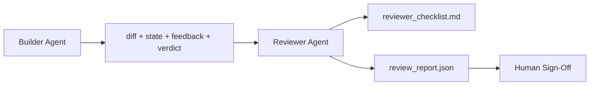

# Agente de la revisión: el constructor y el marcador se separaron

> 写代码的代理 不能给它打分──评论员是第二循环,使用不同的系统提示、不同的目标,并且对构建者 产生的所有内容只有阅读访问权限──构建者与评论员之间的间隔,是大部分可靠性所在──

**Type:** Build
**Languages:** Python (stdlib)
**Prerequisites:** Phase 14 · 38 (Verification Gate)
**Time:** ~55 分钟

## El objetivo del aprendizaje
- Explicar por qué un agente no puede revisar con confianza su trabajo.
- Construir un agente de revisión 循环, consume artefactos de constructores,并输出 estructuralis review report──
- 编写一个评论员分类,按具体维度评分,而不是凭感──
- Voy a poner al revisor en el escritorio, hacer que el revisor artificial empiece a hacer un paso desde el artefacto real.

##  problemas
Usted hace que el agente modifique un error. Edita cuatro archivos, ejecuta un test, y realiza un informe.`passed: true`Dos días después descubres que esta reparación se ha solucionado en la otra mitad del error, no en la otra mitad correcta.

La aceptación es necesaria, pero no suficiente. El revisor preguntará: ¿Acceptación? no puede plantearse la pregunta: ¿es que ha resuelto correctamente el problema? ¿Expandirá el alcance sin explicación? ¿Recordará las suposiciones que debería cuestionarse? ¿Habilitará el banco de trabajo en la siguiente sesión en un estado de interacción?

## 概念


### Rubrico de revisores

五个维度, cada dimensión evalúa de 0 a 2

| Dimension | Question |
|-----------|----------|
| Problem fit | 这个变更是否解决了任务所陈述的问题，而不是相近的问题？ |
| Scope discipline | 编辑是否限制在 contract 内，或者 contract 的扩展是否是有意为之？ |
| Assumptions | 所有隐藏 assumptions 是否都写在了某个可 review 的地方？ |
| Verification quality | acceptance command 是否真的证明了目标，还是只证明了一个更弱的版本？ |
| Handoff readiness | 下一个 session 是否能从当前状态干净地接手？ |

总分 10 分──低于7 分是软失败;低于5 分是硬失败──

### El revisor es un papel independiente, no un modelo independiente.

Se puede usar con el constructor del mismo modelo 运行评论器──关键约束是角色分离: diferentes sistemas de respuesta, diferentes entradas, y a diferencia 没有写权限── la variación de la postura es la variación de la señal──

### reviewer 不能编辑 diff

el revisor 读取 diff、state、feedback、verdict──它写了一份报告──它不补贴不同──如果报告说修复这个,下一轮建设者转去做修复;reviewer 回到 review──混合角色会破坏这个段间隔──

### Rubrico de revisor en relación con la puerta de verificación

Por ejemplo, el estudio de la investigación de la investigación de la investigación de la investigación de la investigación de la investigación de la investigación de la investigación de la investigación de la investigación de la investigación de la investigación de la investigación de la investigación de la investigación de la investigación de la investigación de la investigación de la investigación de la investigación de la investigación de la investigación de la investigación de la investigación de la investigación de la investigación de la investigación de la investigación de la investigación de la investigación de la investigación de la investigación de la investigación de la investigación de la investigación de la investigación de la investigación de la investigación de la investigación de la investigación de la investigación de la investigación de la investigación de la investigación de la investigación de la investigación de la investigación de la investigación de la investigación de la investigación de la investigación de la investigación de la investigación de la investigación de la investigación de la investigación de la investigación de la investigación de la investigación de la investigación de la investigación de la investigación de la investigación de la investigación de la investigación de la investigación de la investigación de la investigación de la investigación de la investigación de la investigación de la investigación de la investigación de la investigación de la investigación de la investigación de la investigación de la investigación de la investigación de la investigación de la investigación de la investigación de la investigación de la investigación de la investigación de la investigación de la investigación de la investigación de la investigación de la investigación de la investigación de la investigación de la investigación de la investigación de la investigación de la investigación de la investigación de la investigación de la investigación de la investigación de la investigación de la investigación de la investigación de la investigación de la investigación de la investigación de la investigación de la investigación de la investigación de la investigación de la investigación de la investigación de la investigación de la investigación de la investigación de la investigación de la investigación de la investigación de la investigación de la investigación de la investigación de la investigación de la investigación de la investigación de la investigación de la investigación de la investigación de la investigación de la investigación de la investigación de la investigación de la investigación de la investigación de la investigación de la investigación de la investigación de la investigación de la investigación de la investigación de la investigación de la investigación de la investigación de los casos en la investigación de la investigación de la investigación de la investigación de la investigación de la investigación de la investigación de la investigación de la investigación de la investigación de cuadro de la investigación de cuadro de cuadro de cuya sobre sobre sobre sobre sobre sobre sobre sobre sobre sobre sobre sobre sobre sobre sobre sobre la cuya cuya cuya cuesta que se trata sobre la cu


```figure
wb-builder-marker
```

## Construirlo
`code/main.py` realización:

- Una de ellas .`ReviewerInputs`Dataclass, usado para hacer un reviso de artefactos.
- Una rubrica puntuación, cada dimensión una función. Cada función es determinación, y para el curso utilizar el grado de stub.
- Una de ellas .`review_report.json`El escritor, contendrá cinco puntos, un total y un veredicto.`pass`¿Qué es esto?`soft_fail`¿Qué es esto?`hard_fail`)。
- Dos casos de demostración: un cambio de calidad, así como un cambio de calidad, problema y error.

运行:

```
python3 code/main.py
```

输出: dos informes de revisión 写入磁盘, y se muestra en la consola

## Modelo de producción en el escenario real

证据如下:Cloudflare en el sistema de revisión de código de IA de abril de 2026, en 30 天内跨 5,169  repos、48,095                                                                                                                                                                                                                                                                                                                                                                                                                                                                                        

Cuatro patrones que permitan que el operador pueda escalarse.

**Specialist pool, not one big reviewer.**Para los reposos en solitario, un revisor de 5 dimensiones de rubrica 足足足。 una vez que la base de código tenga superficies de seguridad-criticas, de rendimiento-criticas y de documentos, se descompone en instancias, más pequeños especialistas, coordinadores, especialistas, desde no funcionan en toda la rubrica, modelo-tier separación también se forma naturalmente: especialistas convenientes, coordinadores costosos。

**Bias mitigation as design requirement, not optimization.**Los jueces de LLM 会表现出四类稳定偏见(Adnan Masood,2026年 4 月):prejuicio de posición(GPT-4 在 (A,B) 与 (B,A) 排序上约40%不一致) 变态性偏见(更长输出有约15%得分通胀) ‧自偏见( jueces 偏好同样模型家族的输出) ‧权威权权 (评级) 评级 会高估对知名作者的引用) ‧缓解方式:同时评估两种排序,只计算一致获胜;使用明确奖励简洁性的 1-4 escalas;跨模型家庭 轮换法官;评分前移除作者姓名──

**Calibration set, not vibes.**Preparar una colección de tareas históricas que contenga 10-20 y que tenga conocidos veredictos correctos  Cada modificación se hace rápidamente  Después de todo el proceso de revisión  Si la conformidad con los registros históricos es inferior al 80%, el rubro en el que se publica el comentario  Necesita revisión  Cada equipo finalmente redescubrirá este punto; es mejor empezar a hacerlo 

**Hybrid norm with the gate.**Puerta de verificación(Fase 14 · 38) Tratar el control de la determinación(aceptación si no se ejecuta, pruebas si no se aprueba, alcance si no se mantiene) ――Revisor 处理语义检查((Ese es el trabajo correcto, suposiciones si no hay registros, concesiones si no se puede utilizar)―Antropic's 2026 guía 明确强调这种分拆:不要让评论员重做门 已经证明的事情―

## Usalo
Modelos de producción:

- **Claude Code subagents.**El subcomitente de la revista en la que se publica el comentario en PR con puntuaciones de rubrica.
- **OpenAI Agents SDK handoffs.**El constructor en la tarea terminada entrega a la revisora.
- **Two-model pairing.**Constructor 运行在更快、更便宜的模型上──Reviewer 运行在更强的模型上, usando更小的背景, enfocarse en el juicio──

Cuando los humanos no pueden completar personalmente cada revisión, el banco de trabajo deja de lado los ojos.

##  entregarlo
`outputs/skill-reviewer-agent.md`生成一个项目专业评论员条目、一个连接建设者文物的评论员代理 stub, así como la integración con la puerta de verificación, hacer una revisión artificial desde el informe escrito 开始, en lugar de comenzar desde la página en blanco 开始──

##  ejercicios
1. Añade el sexto en el dominio de tu producto                                                                                                                                                                                                                                                                                                                                                                                                                                                                                                                   
2. ¿Cuál de ellos producirá un informe humano?
3. Para cada dimensión añadida`confidence`En el caso de los Estados miembros, la confianza en el campo de trabajo es menor que 0,6 horas, rechazo a publicar un informe.
4. Construir un conjunto de calibración: 10 个带有已知正确判决的历史任务闭合――对它们运行审查――它在哪里与历史记录不一致?
5. Añadir una solicitud de más pruebas: ¿qué es, para evitar el ciclo?

## 关键术语: "El hombre es un hombre"
| Term | What people say | What it actually means |
|------|----------------|------------------------|
| Reviewer rubric | “Checklist” | 五维 0-2 评分，每个维度都有一个书面问题 |
| Soft fail | “Needs revisions” | 总分低于 7；builder 获得需要处理的 findings |
| Hard fail | “Reject” | 总分低于 5，或任一维度为 0；暂停并呈现给 human |
| Role separation | “Different prompt” | 同一个 model 可以承担两个角色；关键约束是 inputs 和 posture |
| Confidence floor | “Don't ship low-signal reports” | 当 rubric 不确定时，拒绝输出 verdict |

## 延伸阅读
- [OpenAI Agents SDK handoffs](https://platform.openai.com/docs/guides/agents-sdk/handoffs)
- [Anthropic Claude Code subagents](https://docs.anthropic.com/en/docs/agents-and-tools/claude-code/sub-agents)
- [Cloudflare, Orchestrating AI Code Review at Scale](https://blog.cloudflare.com/ai-code-review/) 7 个 especialista + coordinador 架构,30 天 131k 次 runs
- [Agent-as-a-Judge: Evaluating Agents with Agents (OpenReview / ICLR)](https://openreview.net/forum?id=DeVm3YUnpj) Indicador de referencia de DevAI,366 requisitos de solución jerárquica
- [Adnan Masood, Rubric-Based Evaluations and LLM-as-a-Judge: Methodologies, Biases, Empirical Validation](https://medium.com/@adnanmasood/rubric-based-evals-llm-as-a-judge-methodologies-and-empirical-validation-in-domain-context-71936b989e80) 4 tipos de sesgos y métodos de aceleración
- [MLflow, LLM-as-a-Judge Evaluation](https://mlflow.org/llm-as-a-judge) Utilizado para la producción de herramientas separadas del constructor/evaluador
- [LangChain, How to Calibrate LLM-as-a-Judge with Human Corrections](https://www.langchain.com/articles/llm-as-a-judge) Flujo de trabajo de calibración
- [Evidently AI, LLM-as-a-judge: a complete guide](https://www.evidentlyai.com/llm-guide/llm-as-a-judge)
- [Arize, LLM as a Judge — Primer and Pre-Built Evaluators](https://arize.com/llm-as-a-judge/)
- Fase 14 · 05  Auto-refinado y crítico (baseline de auto-revisas de un solo agente)
- Fase 14 · 30  Desarrollo de agente Eval-driven (generador de conjuntos de calibración)
- Fase 14 · 38  revisor 读取的 verificaciones puerta
- Fase 14 · 40  informe del revisor 输入的交付包
