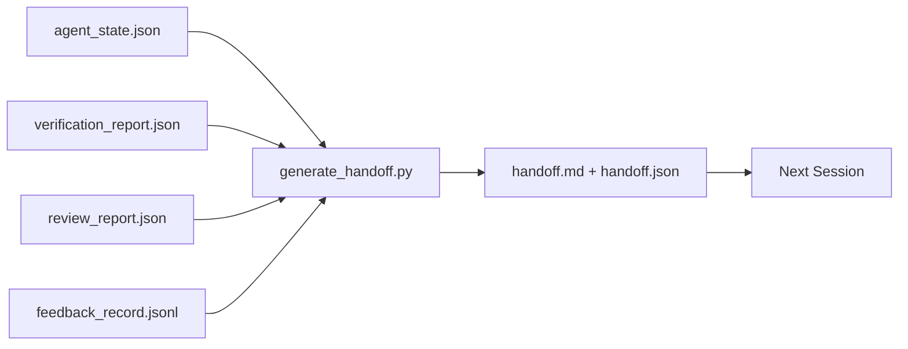

# Transmisión de varias sesiones

> La sesión debe terminar. El trabajo todavía no ha terminado. El paquete de entrega es un artefacto, que hace que el agente trabaje durante una hora.

**类型:**Construir
**语言:**Python (stdlib)
**先修:**Fase 14 · 34 (memoria de informes), Fase 14 · 38 (verificación), Fase 14 · 39 (revisor)
**时间:**~ 50 minutos

## El objetivo del aprendizaje

- Identificar cada paquete de entrega Todo lo que necesitas de siete pasajes.
- Desde los artefactos de la mesa de trabajo 生成手渡, en lugar de manuscriptu说明文字。
- Cumplirá los registros de comentarios de grandes dimensiones y cortará los resúmenes de los mismos.
- 让下一个会议的第一动作具有确定性──

##  problemas

La sesión termina. El agente dice: "Bueno, hemos logrado un progreso". La siguiente sesión se abre. La siguiente pregunta del agente: "¿Dónde estamos la última vez que paramos? La respuesta del primer agente ya no se ha visto.

                                                                                                                                                                                                                                                              

## 概念



### Cada entrega lleva siete fragmentos

| Field | 它回答的问题 |
|-------|---------------------|
| `summary` | 一段话说明完成了什么 |
| `changed_files` | 一眼看清 diff |
| `commands_run` | 实际执行过什么 |
| `failed_attempts` | 尝试过什么，以及为什么没有成功 |
| `open_risks` | 下个 session 可能踩到什么坑，附 severity |
| `next_action` | 下个 session 采取的第一个具体步骤 |
| `verdict_pointer` | 指向 verification + review reports 的路径 |

`next_action`字段是承重字段──una contiene todo el contenido pero falta `next_action`La entrega es un informe de estado, no una entrega.

### La entrega es generada, no escrita.

Handwriting handoff,就是在困难日子里会被跳过的 handoff──Generador 读取工作桌文物并输出包──Agencia de la responsabilidad es hacer que el trabajo de la mesa de trabajo está en el estado del generador se puede concluir, en lugar de escribir un resumen en persona──

### 两种形式: legible por el hombre y legible por la máquina

`handoff.md`供人 阅读。`handoff.json`供下一个代理 加载── ambas provienen de la misma colección de artefactos de origen── si aparecen divisiones, en JSON 为准──

### Registro de comentarios 裁剪

完整的 `feedback_record.jsonl`Puede haber cientos de artículos de registro. Sólo lleve la última K 条, así como los registros de cada sesión de salida.

### 留下干净 estado de trabajo

Handoff 描述工作; clean state 让工作可恢复──它们 no son lo mismo. Si la siguiente sesión 打开时面对是半截截不同、agent 忘了的临时文件、游离分支,以及尚未真正运行就报错的测试, entonces再完美`handoff.md`También no tiene valor. El siguiente agente pasará diez minutos limpiando lo que dejó en una sesión, en lugar de continuar construyendo. Este costo aumentará en cada sesión en el ciclo de vida de la misión.

Así que la sesión no termina en el momento de la función, sino en el momento de la generación, la siguiente sesión termina en el momento de la confianza. La limpieza es su fase, se ejecuta antes de la entrega. Es un cheque, no un hábito, porque los hábitos son lo que más se saltan en los días difíciles.

| Check | Clean means | Dirty blocks because |
|-------|-------------|----------------------|
| Working tree | 每个变更都已 commit，或明确 stash 并附带说明 | 半截 diff 会被下一个 agent 看成有意图的工作 |
| Temp artifacts | 没有 `*.tmp`、scratch dirs、debug prints 或留下的注释块 | 游离文件会污染 diff 和下一个 agent 的 mental model |
| Tests | 绿色，或红色但在 `open_risks` 中命名了失败 | 沉默的红色 test 是下一个 session 会踩进去的陷阱 |
| Feature board | `feature_list.json` status 反映真实状态（Phase 14 · 36） | 过期 board 会把下一个 session 派去做已经完成的工作 |
| Branch | 位于预期 branch，没有 detached HEAD，没有 orphan branches | 错误 branch 会让下一个 session 的第一个 commit 落到错误位置 |

La limpieza 阶段会产出一个 `clean_state.json`, entre ellos se incluyen problemas de bloqueo;空列表是手机发电机 写包 前要断言的前置条件──建立在脏树上的手机 不是手机,而是转发混乱── dos artefactos 成对出现:


```figure
wb-handoff-packet
```

## Construirlo

`code/main.py`实现:

- Un cargador, el estado, el veredicto, la revisión y la retroalimentación`WorkbenchSnapshot`¿Qué es eso?
- Una de ellas .`generate_handoff(snapshot) -> (markdown, payload)`函数──
- Un filtro, selecciona las últimas entradas de retroalimentación K 条, además de todas las salidas de cero.
- Una demostración, en el guión junto a la escritura.`handoff.md`Y `handoff.json`¿Qué es eso?

¿Qué es eso ?

```
python3 code/main.py
```

输出: cuerpo de entrega impreso, así como dos documentos en el disco.

## Modelo en la producción real

El código CLI、Claude Code 和 OpenCode ofrecen diferentes esquemas de compactación; el paquete estructurado de entrega se encuentra en el mismo.

**Compaction 策略各不相同；packet schema 不变。**El código CLI POST /v1/respuestas/compact es un blob opaco de AES en el lado del servidor(OpenAI modelos de rapidez); fallback es un resumen de la oferta local, como`_summary`El código de claude en el contexto alcanza el 95% 时运行五阶段 progresiva compacción。OpenCode utiliza un mensaje basado en el sello de tiempo ocultando además de un resumen de LLM de 5 títulos。

**Fresh-session handoff 不是 compaction。**Compacción 延长一会;handoff 干净地关闭一会,并启动下一个── Hermes Issue #20372 的框架(2026 年 4 月) es对的: Cuando la compresión en el lugar 开始降低质量时,Agent 应写一个紧缩的交付,结束会议,并恢复在新的背景中.

**每个 branch 和 topic 只保留一个 active handoff。**La coordinación multi-agente se desploma más por las entregas obsoletas, en lugar de por el mal modelo de producción.`branch`¿Qué es esto?`last_known_good_commit`, así como`active | superseded | archived`之一的 `status` Las entregas permanentes se archivarán; sólo activas de ese impulso en la siguiente sesión.

**在 50-75% context 之前收尾，不要等到撞墙。**Manual de juego de moda de escritura (CCLUD.md + HANDOVER.md) informó que la sesión en el contexto del presupuesto del 50-75% se terminó, en lugar del 95%, el efecto es mejor.

## Usalo

Modelo de producción:

- **Session-end hook。**tiempo de ejecución en el usuario en el chat 时触发发电机──packet 写入 `outputs/handoff/<session_id>/`¿Qué es eso?
- **PR template。**También puede ser un organismo de relaciones públicas.
- **Cross-agent handoff。**Usando un producto construye (Claude Code), usando otro continúa (Codex) (Paket es el lenguaje de uso).

Los costos de producción son bajos, y los costos de producción se incrementan con cada sesión.

##  Publicarlo

`outputs/skill-handoff-generator.md`Se generará un generador de vías de artefactos adaptados al proyecto, un gancho de final de sesión, y un siguiente agente.`handoff.json`Esquema

##  ejercicios

1. Añade uno.`assumptions_to_validate`字段, exposed constructor recorded 、 pero el revisor 评分 no excede de 1 de cada suposición ⋅
2. Para las carreras fallidas 和 las carreras de paso Use different ways cut feedback summary──为这种不对称辩护──
3. 加入一个 问题的人类 列表――一个问题进入包,而不是进入聊天消息的值是什么?
4. ¿Qué contenido necesita mantenerse estable?
5. Añadir una sección de Pre-Prequisito de la siguiente sesión, especificar la lista de los objetos que deben cargarse en la sesión siguiente.

## 关键术语: "El hombre es un hombre"

| Term | 人们常说 | 实际含义 |
|------|----------------|------------------------|
| Handoff packet | “Session summary” | 携带七个字段的生成 artifact，同时包含 markdown 和 JSON |
| Next action | “首先做什么” | 启动下一个 session 的一个具体步骤 |
| Feedback trim | “Log summary” | 最后 K 条 records 加上每个非零 exit |
| Status report | “我们做了什么” | 缺少 `next_action` 的文档；有用，但不是 handoff |
| Verdict pointer | “Receipt” | 指向 verification + review reports 的路径，用于 traceability |

## 延伸阅读

- [Anthropic，面向 long-running agents 的有效 harnesses](https://www.anthropic.com/engineering/effective-harnesses-for-long-running-agents)
- [OpenAI Agents SDK handoffs](https://platform.openai.com/docs/guides/agents-sdk/handoffs)
- [Codex Blog，Codex CLI Context Compaction：架构、配置、管理长会话](https://codex.danielvaughan.com/2026/03/31/codex-cli-context-compaction-architecture/) POST /v1/respuestas/compact 和 local fallback
- [Justin3go，Shedding Heavy Memories：Context Compaction in Codex, Claude Code, OpenCode](https://justin3go.com/en/posts/2026/04/09-context-compaction-in-codex-claude-code-and-opencode) Compacción de tres vendedores en comparación
- [JD Hodges，Claude Handoff Prompt：如何跨 Sessions 保持 Context (2026)](https://www.jdhodges.com/blog/ai-session-handoffs-keep-context-across-conversations/) CLAUDE.md + HANDOVER.md,50-75% presupuesto de contexto
- [Mervin Praison，Managing Handoffs in Multi-Agent Coding Sessions：Fresh Context Without Losing Continuity](https://mer.vin/2026/04/managing-handoffs-in-multi-agent-coding-sessions-fresh-context-without-losing-continuity/) sistemas distribuidos 视角
- [Hermes Issue #20372 — compression 变得有风险时自动 fresh-session handoff](https://github.com/NousResearch/hermes-agent/issues/20372)
- [Hermes Issue #499 — Context Compaction Quality Overhaul](https://github.com/NousResearch/hermes-agent/issues/499) Codex CLI 中面向交付的提示
- [Microsoft Agent Framework，Compaction](https://learn.microsoft.com/en-us/agent-framework/agents/conversations/compaction)
- [OpenCode，Context Management and Compaction](https://deepwiki.com/sst/opencode/2.4-context-management-and-compaction)
- [LangChain，Context Engineering for Agents](https://www.langchain.com/blog/context-engineering-for-agents)
- Fase 14 · 34  generador 读取的状态文件
- Fase 14 · 38  paquete indicativo de veredicto de verificación
- Fase 14 · 39  打包进包包的 evaluación
