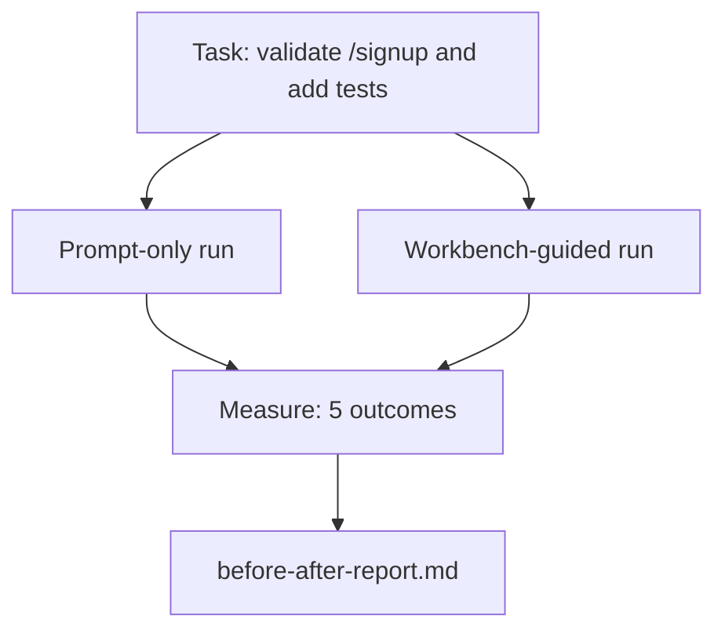

# En realidad Repo 上 utilizar el escritorio

> 十一节 sobre la superficie de un curso, si no puede soportar la verdadera prueba de base de código, es inútil.

**Type:** Build
**Languages:** Python (stdlib)
**Prerequisites:** Phases 14 · 32 to 14 · 40
**Time:** ~60 minutes

## El objetivo del aprendizaje
- Para que las siete superficies de la mesa de trabajo se agrupen en una pequeña aplicación.
- Se puede evaluar el resultado de la misma tarea en dos ocasiones.
- 阅读前/后报告,并判断哪些表面提供最大杆──
- 面对但我的模型 已经足够好的反驳时,为工作桌 辩护

##  problemas
En la tarea de juguete, hacer una demostración, decir que no hay nadie. El valor del escritorio de trabajo debe manifestarse en un repos realista, cuando se complete una tarea realista: menos fracaso, menos reversión, y se produce un paquete de uso en la próxima sesión.

Este curso ofrece este reporte de sentido real, y permite que la misma tarea pase por dos líneas de tubería.

## 概念


### La aplicación muestra

`sample_app/`Un pequeño procesador de FastAPI:

- `app.py`, incluye`/signup`(尚無核准) ☐ No se puede utilizar
- `test_app.py`, contiene una prueba de camino feliz.
- `README.md`Y `scripts/release.sh`, como cebo de la zona prohibida.

### La tarea

> Por lo tanto ,`/signup`Añadir validación de entrada: rechazar la contraseña de 8 caracteres, regresar con el envase de error de tipografía de 422♦ Añadir una prueba para probar nuevos comportamientos♦

### Las dos tuberías

Sólo de inmediato:

1. 阅读 README。
2. 阅读   Cómo es`app.py`¿Qué es eso?
3. 编辑文件。
4. 声称完成──

Guía de trabajo en el escritorio:

1. 运行 init script (Leyción 35)
2. 阅读 contrato de alcance (LECCIÓN 36)
3. 读取 estado (LECCIÓN 34)
4. Sólo editar los documentos permitidos.
5. 通过 feedback runner 运行 el comando de aceptación LECCIÓN 37)。
6. 运行 puerta de verificación (lección 38)
7. 运行 reviewer (Leyción 39)
8. ¿Qué pasa? ¿Qué pasa?

### 衡量五个结果

| Outcome | Why it matters |
|---------|----------------|
| `tests_actually_run` | 大多数“tests passed”声明都无法验证 |
| `acceptance_met` | 证明目标达成的 test 必须就是实际运行过的 test |
| `files_outside_scope` | Scope creep 是主要的静默 failure |
| `handoff_quality` | 下一次 session 会为此付出代价或从中受益 |
| `reviewer_total` | 在 gate 之上的定性判断 |


```figure
wb-ab-runs
```

## Construirlo
`code/main.py`针对同样样应用 fixture 编排两条管道──两条管道 都是脚本的(loop 中没有LLM), por lo tanto la medición 可复现──该脚本会将比较 写入 写入 `before-after-report.md`Y `comparison.json`¿Qué es eso?

运行:

```
python3 code/main.py
```

输出: según pipeline  mostrar la tabla de consola de resultados, guardar hasta el informe de marcado de script 旁边, así como dar a pensar hacer gráficos de los usuarios de JSON。

## Modelos de producción en la producción real

El problema del dudoso es: ¿Cuánta ayuda tiene el banco de trabajo?2026 años de números más convincentes que explicar

**Terminal Bench Top-30 到 Top-5，使用同一个 model。**LangChain de *Anatomía de un Arnés de Agente*((2026 年 4 月): un agente codificador 仅通过改变带,就从终端杆 2.0 的 30 名开外跃升到第 5 名──同一个模型──不同的表面──25 个名次的差距──

**Vercel 通过删除 tools 从 80% 到 100%。**Vercel  informes, eliminar el 80% de herramientas de su agente                                                                                                                                                                                                                                                                                                                                                                                                                                                                                                               

**Harvey 仅靠 harness 实现 2x accuracy。**Los agentes legales por medio de la optimización del aprovechamiento 提升到两倍以上, no hay cambios de modelo 

**88% 的企业 AI agent projects 未能进入 production。**Preprint.org de *Arness Engineering for Language Agents* papel(2026 年 3 月) el fracaso se atribuirá al tiempo de ejecución, en lugar de el razonamiento: estado inestable、 retraso de fragilidad、 contexto de expansión ∼ de recuperación de la capacidad de recuperación de medio error―.

**Long-context collapse。**El resultado de la investigación fue que el equipo de WebAgent logró un éxito del 40-50% en el largo plazo.

**False negatives 仍然存在。**Las tareas factuales de un solo paso, líneas de línea, formatos de ejecuciones, cualquier modelo, con contenido de cada letra, estos sólo se usan en un momento de espera.

结论不是harness 永远获胜──Modelos 会随着时间吸收harness tricks──结论是: Hoy, la carga de ingeniería 落在这七面上, y los números lo demuestran.

## Usalo
Cuando se produzcan las siguientes situaciones, se puede citar este curso como archivo de caso:

- Alguien me pregunta por qué cada PR tiene`agent-rules.md`Y el contrato de alcance.
- El equipo piensa que este sprint se deshace de la puerta de verificación.
- Un nuevo producto de agente se lanza, y necesitas un punto de referencia portátil para determinar si realmente ahorra tiempo.

El número de palabras es más largo que el número de palabras.

##  entregarlo
`outputs/skill-workbench-benchmark.md`Es un arnés de evaluación portátil, puede hacer que cualquier agente producto en un proyecto su propia aplicación de muestra 上跑过两条管线,并报告五个结果──

##  ejercicios
1. 添加第六个结果: tiempo-a-primero-sentido-editar. ¿Cómo hacerlo?
2. En tu base de códigos una tarea real del segundo día de trabajo en la plataforma de trabajo. ¿Cuál es el número de trabajo en la plataforma de trabajo?
3. Añadir un falso negativo pase:列出-only 本会更快、workbench overhead is real cost 之任务──然后为继续保留工作台 辩护──
4. ¿Qué resultado se hará más ruidoso?
5. ¿Qué contenido puede conservarse?

## 关键术语: "El hombre es un hombre"
| Term | What people say | What it actually means |
|------|----------------|------------------------|
| Sample app | “Toy repo” | 足够小，但也足够现实，能够演练全部七个 surface |
| Pipeline | “Workflow” | agent 遵循的 surface read/write 有序序列 |
| Before/after report | “The receipts” | 你交给怀疑者的 artifact |
| False negative | “Workbench overkill” | prompt-only 更快的任务；诚实列出它们很有用 |
| Workbench benchmark | “Reliability score” | 在你的 codebase 上运行 comparison 的 portable harness |

## 延伸阅读
- [LangChain, The Anatomy of an Agent Harness](https://blog.langchain.com/the-anatomy-of-an-agent-harness/) El banco de terminales Top-30 hasta Top-5
- [MongoDB, The Agent Harness: Why the LLM Is the Smallest Part of Your Agent System](https://www.mongodb.com/company/blog/technical/agent-harness-why-llm-is-smallest-part-of-your-agent-system) Vercel + Harvey 数字
- [preprints.org, Harness Engineering for Language Agents](https://www.preprints.org/manuscript/202603.1756) 88%  tasa de fracaso empresarial 
- [HN: Improving 15 LLMs at Coding in One Afternoon. Only the Harness Changed](https://news.ycombinator.com/item?id=46988596) En 15 modelos 上复现
- [Cloudflare, Orchestrating AI Code Review at Scale](https://blog.cloudflare.com/ai-code-review/) producción 中 30 天 / 131k revisiones
- [Anthropic, Building Effective Agents](https://www.anthropic.com/research/building-effective-agents)
- Fases 14 · 32 a 14 · 40  本课端到端演练的表面
- Fase 14 · 19  SWE-bench、GAIA、AgentBench, como referentes macro complementarios de esta clase
- Fase 14 · 30  desarrollo de agente basado en la evaluación, con un mismo arnés puede conectarse entre ellos
