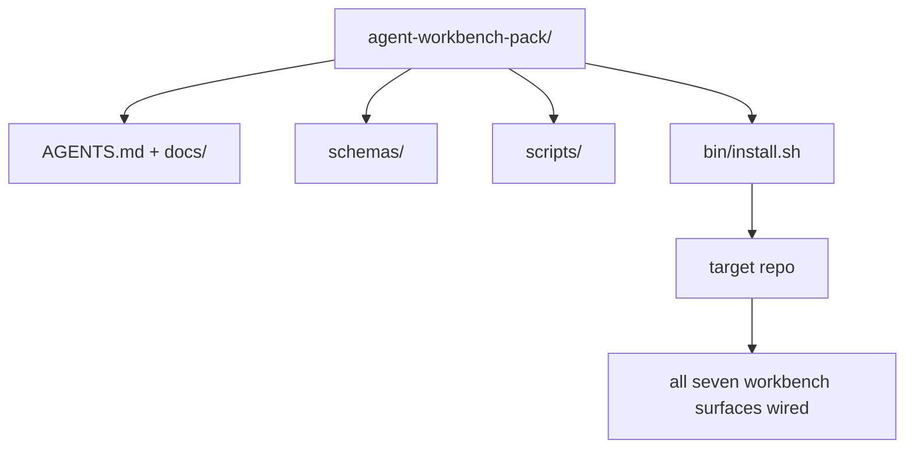

# Capstone: entregar un paquete de trabajo de agente de uso repetible

> Esta mini-track es una que puedes colocar en cualquier paquete de repositorios.`cp -r`Y luego, al día siguiente, vamos a hacer que el agente haga un trabajo estable. Este es el artefacto que realmente entregó el curso.

**类型：**Construir
**语言：**Python (stdlib)
**前置要求：**Fases 14 · 31 hasta 14 · 41
**时间：**~ 75 minutos

## El objetivo del aprendizaje

- Envasar siete superficies de escritorio en un directorio que se pueda colocar directamente.
- Fixed schema、script 和 template, hacer que un nuevo repo  obtenga una línea de base ya disponible―
- Añade un script de instalación, coloca este paquete de la misma manera.
- Decide qué contenido queda en el paquete, qué contenido queda en el exterior, y para cada uno de ellos.

##  problemas

Una de las versiones de un workbench que existe en Google Doc, chat history y tres escritos que sólo se han olvidado, es un workbench que se reconstruye cada trimestre. La solución es un paquete con una versión: un repositorio o un catálogo, que contiene superficie, esquema, script, así como un instalador de orden que se puede ejecutar.

Al final de la clase, se entregará en disco.`outputs/agent-workbench-pack/`, y uno que puede ponerlo en cualquier repo objetivo .`bin/install.sh`¿Qué es eso?

## 概念



### Diseño del paquete

```
outputs/agent-workbench-pack/
├── AGENTS.md
├── docs/
│   ├── agent-rules.md
│   ├── reliability-policy.md
│   ├── handoff-protocol.md
│   └── reviewer-rubric.md
├── schemas/
│   ├── agent_state.schema.json
│   ├── task_board.schema.json
│   └── scope_contract.schema.json
├── scripts/
│   ├── init_agent.py
│   ├── run_with_feedback.py
│   ├── verify_agent.py
│   └── generate_handoff.py
├── bin/
│   └── install.sh
└── README.md
```

### ¿Qué dejar, qué poner afuera?

¿Qué es eso ?

- Esquema de superficie.
- Los cuatro guiones de arriba... son el tiempo de ejecución.
- Cuatro documentos... son la regla y la rúbrica...

 poner fuera:

- 项目特定任务──任务属于目标 repo 的董事会, no pertenece al paquete──
- 供应商 SDK 调用──这个包与框架无关──
- Embordaje 文案── este paquete  colocar el equipo ya ha embarcado 旁边, en lugar de colocar en ella──

### Instalador

Un breve `bin/install.sh`(o `bin/install.py`):

1. No hay .`--force`时, rechazar la instalación hasta que haya un paquete arriba.
2. Se va a empacar en el reporte de la meta.
3. Si existe`.github/workflows/`, entonces se conecta con CI.
4. 打印后续步骤: rellenar el tablero 设置接受命令 运行 init script──

### 版本管理

Este paquete lleva uno .`VERSION`文件──需要迁移的 schema bump 和脚本 变更会出现重大突破──仅 doc 的变更会出现突破补丁──目标 repo 的 文件──需要迁移的 schema bump 和脚本 变更会出现重大突破──仅 doc 的变更会出现突破补丁──目标 repo 的 文件──需要迁移的 schema bump 和脚本──变更会出现重大突破──只有 doc 的变更会出现突破补丁──目标 repo 的 文件──目标 repo 的 文件──`agent_state.json`记录它初始化时对应的包版──


```figure
wb-pack-install
```

## Construirlo

`code/main.py`Me gustaría hacer un paquete junto a la clase.`outputs/agent-workbench-pack/`En el medio, no usas este mini-track como un secuestro de la primera clase y el guión, así como el documento que ya has escrito.

¿Qué es eso ?

```
python3 code/main.py
```

Este script se copia y fija la superficie, se escribe en README, se imprime en el árbol de paquete, y luego se retira a cero.

## Modelo en la producción real

Un paquete sólo tiene valor cuando puede soportar una correa, actualizar y no ser amigable en el aguas arriba.

**`VERSION` 是 contract，不是 marketing。**Gran embrague  necesita migración de estado ∙∙ Embrague menor                                                                                                                                                                                                                                                                                                                                                                                                                                                                                                             `.workbench-version`写入目标 repo; si el objetivo de bloqueo y el paquete de `VERSION`No coincide,`lint_pack.py`¡Me rechazará la entrega!`npm`¿Qué es esto?`Cargo`Y `pyproject.toml`能经受 10 años churn; agente no cambiará estas reglas.

**跨工具分发的单一来源。**No te lo puedo dar .`nx ai-setup`, desde un solo configurado  colocación `AGENTS.md`¿Qué es esto?`CLAUDE.md`¿Qué es esto?`.cursor/rules/`¿Qué es esto?`.github/copilot-instructions.md`Y un servidor MCP. Este paquete también debería hacerlo.`ln -s AGENTS.md CLAUDE.md`), hacer que un solo hecho se despliegue a cada agente de codificación―para apoyar un instrumento y un fork este paquete, es un modo de fracaso―

**`uninstall.sh` 会在存在非平凡 state 时拒绝执行。** Descargar este paquete no puede eliminar el usuario `agent_state.json`¿Qué es esto?`task_board.json`O `outputs/`❖ Uninstaller 会 eliminar esquema, guión, documento y `AGENTS.md`(带 `--keep-agents-md`Opt-out), y si el archivo de estado tiene cualquier cambio no presentado, se niega a continuar.

**Skill-as-publishable。SkillKit-style 分发。**Este paquete  como habilidad de SkillKit 交付:`skillkit install agent-workbench-pack`Se puede colocar en un solo sitio a 32 agentes de IA. En el centro, el paquete de repos es la fuente de datos.

## Usalo

El paquete se entrega en tres lugares:

- **作为一个你放进 repo 的目录。** `cp -r outputs/agent-workbench-pack /path/to/repo`¿Qué es eso?
- **作为一个公开 template repo。**Forja y personalización,并用 `VERSION`Controlando la deriva.
- **作为一个 SkillKit skill。**Entra en tu agente, haz que una orden se complete y coloque.

El paquete es una receta. Cada vez que se instala es una porción.

##  entregarlo

`outputs/skill-workbench-pack.md`Se generará un paquete de ajustes de proyectos: reglas, en función de la historia del equipo, se hará más claro, el alcance global, la dimensión rubrica, se ampliará un ámbito específico.

##  ejercicios

1. Decidir cuál es el quinto documento que vale la pena elevar en el paquete canónico.
2. Usó Python para volver a escribir el instalador,并添加 `--dry-run`La bandera, la ergonomía y el bash.
3. Añade uno.`bin/uninstall.sh`¿Qué es lo que es extraordinario?
4. Añade uno.`lint_pack.py`, envasado  alejamiento `VERSION`时失败──把它连接到包 自身 repo 的CI──
5. ¿Qué orden de operación puede minimizar el tiempo de inactividad?

## 关键术语: "El hombre es un hombre"

| 术语 | 人们常说 | 它实际含义 |
|------|----------------|------------------------|
| Workbench pack | “starter kit” | 一个带版本的目录，携带全部七个 surface |
| Installer | “Setup script” | 以幂等方式放置 pack 的 `bin/install.sh` |
| Pack version | “VERSION” | schema/script 变更使用 major bump，仅 doc 变更使用 patch |
| Drop-in pack | “cp -r and go” | Pack 在第一天无需按 repo 定制即可工作 |
| Forkable template | “GitHub template” | GitHub 的 “Use this template” 可以从中 clone 的公开 repo |

## 延伸阅读

- Fases 14 · 31 a 14 · 41  Este paquete 打包 de cada superficie
- [SkillKit](https://github.com/rohitg00/skillkit) En 32 agentes de IA instalar esta habilidad
- [Nx Blog, Teach Your AI Agent How to Work in a Monorepo](https://nx.dev/blog/nx-ai-agent-skills) 跨六种工具的单一来源发电机
- [agents.md — the open spec](https://agents.md/) El router de su paquete debe implementar el contenido
- [HKUDS/OpenHarness](https://github.com/HKUDS/OpenHarness) paquete equivalente de referencia de realización
- [andrewgarst/agentic_harness](https://github.com/andrewgarst/agentic_harness) 带 eval suite de Redis respaldado 参考实现
- [Augment Code, A good AGENTS.md is a model upgrade](https://www.augmentcode.com/blog/how-to-write-good-agents-dot-md-files) empaque doc 的质量门
- [Anthropic, Effective harnesses for long-running agents](https://www.anthropic.com/engineering/effective-harnesses-for-long-running-agents)
- [Anthropic, Harness design for long-running application development](https://www.anthropic.com/engineering/harness-design-long-running-apps)
- Fase 14 · 30  消费这个包的验证门的评估驱动代理开发
- Fase 14 · 41  Este paquete debe ser mejorado antes/después de la referencia
