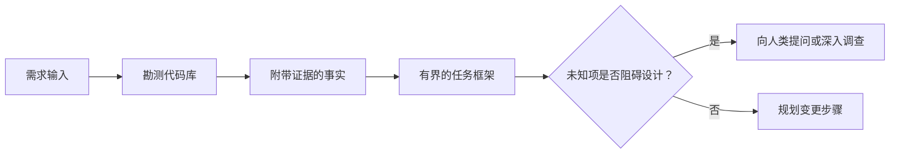

# En el agente 写代码前框定任务

> 编码智能体(Coding Agent) puede lograr muy rápidamente una tarea clara―, también puede lograr muy rápidamente una tarea confusa―, pero el precio es muy diferente―.

**Type:** Learn + Build
**Languages:** Python (stdlib)
**Prerequisites:** Phase 14 第 31 课与第 36 课
**Time:** ~60 分钟

## El objetivo del aprendizaje

- Antes de modificar el código, la necesidad original se convertirá en un marco de tareas con un límite claro.
- Los datos de la base de datos de la base de datos de la base de datos de la base de datos de la base de datos de la base de datos de la base de datos de la base de datos de la base de datos de la base de datos de la base de datos de la base de datos de la base de datos de la base de datos de la base de datos de la base de datos de la base de datos de la base de datos de datos de la base de datos de la base de datos de datos de la base de datos de datos de la base de datos de datos de la base de datos de datos de la base de datos de datos de la base de datos de datos de la base de datos de datos de la base de datos de datos de datos de la base de datos de datos de datos de datos de la base de datos de datos de datos de datos de la base de datos de datos de datos de datos de datos de datos de datos de datos de datos de datos de datos de datos de datos de datos de datos de datos de datos de datos de datos de datos de datos de datos de datos de datos de datos de datos de datos de datos de datos de datos de datos de datos de datos de datos de datos de datos de datos de datos de datos de datos de datos de datos de datos de datos de datos de datos de datos de datos de datos de datos de datos de datos de datos de datos de datos de datos de datos de datos de datos de datos de datos de datos de datos de datos de datos de datos de datos de datos de datos de datos de datos de datos de datos de datos de datos de datos de datos de datos de datos de datos de datos de datos de datos de datos de datos de datos de datos de datos de datos de datos de datos de datos de datos de datos de datos de datos de datos de datos de datos de datos de datos de datos de datos de datos de datos de datos de datos de datos de datos de datos de datos de datos de datos de datos de datos de datos de datos de datos de datos de datos de datos de datos de datos de datos de datos de datos de datos de datos de datos de datos de datos de datos de datos de datos de datos de datos de datos de datos de datos de datos de datos de datos de datos de datos de datos de datos de datos de datos de datos de datos de datos de datos de datos de datos de datos de datos de datos de datos de datos de datos de datos de datos de datos de datos
- 明确定义 permitir la modificación de los caminos, prohibir el contacto y la aceptación de los certificados.
- 判断何时代码勘测(Reconocimiento) ya está suficiente, puede llevar a cabo el trabajo formal―

## 代价高昂的 fracaso

 aumentar la protección de buzones  parece muy claro, pero en realidad no es así  Este único tipo de prueba debe colocarse en la capa API                                                                                                                                                                                                                                              

Un cuerpo inteligente de gran capacidad parece tener una opción razonable para llenar estos vacíos. Esta es la situación más peligrosa: su código puede ser implementado de manera completa, pero no está integrado en el sistema.

Por lo tanto, la primera unidad del código inteligente no es la modificación directa del código, sino la creación de un marco de tareas que se apoya en la base de datos reales de la biblioteca de códigos.

## 任务框架(Cuadro de tareas)

Un marco de tareas práctico contiene seis elementos centrales:

| 字段 | 核心问题 |
|---|---|
| 目标（Goal） | 必须改变哪些可观测的行为？ |
| 代码库事实（Repository facts） | 你在代码、测试、配置或历史提交中验证了什么？ |
| 允许修改路径（Allowed paths） | 变更允许落在哪些位置？ |
| 禁止触碰路径（Forbidden paths） | 哪些文件与目录必须保持原样？ |
| 验收证据（Acceptance evidence） | 哪些具体命令或观测现象能证明目标已达成？ |
| 未知项（Unknowns） | 哪些决策仍需补充证据或依赖人类判断？ |

Los hechos deben estar acompañados de un certificado de autenticidad. Cuando se trata de un comportamiento de movimiento, el resultado de ejecución de un orden es más estable.



## 勘测旨在寻找约束

No intentes leer toda la biblioteca de código. Deberías buscar lo que pueda hacer frente a los cambios en la estructura de los diferentes bordes de la superficie.

1. El comportamiento actual y su uso.
2. El caso de uso de pruebas ya existente más reciente:
3. ¦ ¦ ¦ ¦ ¦ ¦ ¦ ¦ ¦ ¦ ¦ ¦ ¦ ¦ ¦ ¦ ¦ ¦ ¦ ¦ ¦ ¦ ¦ ¦ ¦ ¦ ¦ ¦ ¦ ¦ ¦ ¦ ¦ ¦ ¦ ¦ ¦ ¦ ¦ ¦ ¦ ¦ ¦ ¦ ¦ ¦ ¦ ¦ ¦ ¦ ¦ ¦ ¦ ¦ ¦ ¦ ¦ ¦ ¦ ¦ ¦ ¦ ¦ ¦ ¦ ¦ ¦ ¦ ¦ ¦ ¦ ¦ ¦ ¦ ¦ ¦ ¦ ¦ ¦ ¦ ¦ ¦ ¦ ¦ ¦ ¦ ¦ ¦ ¦ ¦ ¦ ¦ ¦ ¦ ¦ ¦ ¦ ¦ ¦ ¦ ¦ ¦ ¦ ¦ ¦ ¦ ¦ ¦ ¦ ¦ ¦ ¦ ¦ ¦ ¦ ¦ ¦ ¦ ¦ ¦ ¦ ¦ ¦ ¦ ¦ ¦ ¦ ¦ ¦ ¦ ¦ ¦ ¦ ¦ ¦ ¦   ¦                                                                                                                                                                                                                                          
4. 管辖该路径的项目规范与指令──
5. 构建与验证命令──
6. El modelo de código de la región de la actualidad se ha completado de forma similar.

Cuando cada decisión del plan ya tiene evidencia objetiva, se ha autorizado claramente a tomar decisiones, o se ha catalogado como un proyecto desconocido conocido, la exploración puede detenerse.

## No se sabe que se ha hecho un error

El desconocimiento es el espacio de información controlado; mientras que las hipótesis no probadas son las hipótesis sobre el espacio de información no controlado.

Se clasificará cada uno de los siguientes:

- **可探查的（Discoverable）：**La biblioteca de códigos por sí misma o el sistema en funcionamiento puede dar respuestas.
- **可自决的（Decidable）：**任务契约 ha otorgado el derecho de elección autónoma de los cuerpos inteligentes.
- **需人类判断的（Human）：**La elección cambiará el comportamiento del producto, el costo, el riesgo del sistema o la compatibilidad externa.
- **延后处理的（Deferred）：**La selección supera el alcance de la pieza actual, pertenece a no objetivos (no objetivos)

Los cuerpos inteligentes deben procesar de forma autónoma los proyectos desconocidos explorables y autorizados para su decisión; pero cuando se encuentran con proyectos desconocidos que requieren juicio humano, deben suspender y confirmarse de forma activa antes de que la decisión se fije en el código.

## 实现之前先定验收标准

Antes de escribir el correcto, primero escriba la prueba de finalización.

- Una orden de ensayo de unidades o ensayo de integración dirigida a un individuo;
- Un proceso de operación del navegador de extremo a extremo de un puerto de vista especificado y de estado previsto;
- Una solicitud de red y un acuerdo de respuesta totalmente compatible;
- Una medida de rendimiento que alcance un valor determinado;
- Una confirmación de que no hay documentos relacionados se modificaron en el ámbito de la revisión.

 Test passing并非有效证明方案──必须明确确定具有裁决权的试用例及其证明的主张──

## Construirlo

El experimento de esta clase creará uno.`TaskFrame`El objetivo es evaluar la eficacia de los límites y de las pruebas, y exportar.`outputs/task-frame.md`¿Qué es eso?

En el curso de curso en curso:

```bash
python3 code/main.py
python3 -m unittest discover code/tests -v
```

尝试通过四种方式故意破坏示例: eliminar objetivos, eliminar factbili­ties, fabricar caminos permitidos y caminos prohibidos, y eliminar órdenes de recepción.

## En verdadero código de uso

En requerir inteligentes modificaciones de código antes:

1. El objetivo es expresar el comportamiento concreto, y no modificar un documento.
2. 记录两到三条带有确凭证的代码库事实──
3. 指定最小的允许修改路径集合──
4. 明确写出禁止触碰的负空间 (espacio negativo)
5. 编写能够宣告任务闭环的验证命令或观测手段──
6. 列出你目前未查清且没有决定权的决策项──

El marco de tareas debe ser exhibido en una pantalla. Si se extiende de una pantalla, la tarea puede contener varios cambios que pueden ser verificados independientemente, debe ser dividido.

##  ejercicios

1. Para usted, un verdadero error en una base de códigos se fija en un marco de tareas, y el proceso no propone ninguna solución concreta.
2. 找出任务框架中的一条实际上只是主张的主张, sustituyéndolo por evidencia objetiva.
3.  añadir un acuerdo público externo que cambie, por lo tanto, debe ser un factor desconocido de la decisión humana.
4. Se puede dividir un recorrido de seguridad en el recorrido de seguridad mínimo.
5. En el documento de aceptación, se incluye un documento de reconocimiento de alcance utilizado para la protección de la frontera.

## 延伸阅读

- [Nuseibeh and Easterbrook, Requirements Engineering: A Roadmap](https://www.cs.toronto.edu/~sme/papers/2000/ICSE2000.pdf): explorar cómo el software se puede lograr en función de los objetivos del mundo real y de las condiciones de la evolución continua.
- [Yang et al., SWE-agent: Agent-Computer Interfaces Enable Automated Software Engineering](https://arxiv.org/abs/2405.15793): demostró que el sistema de conexión y de unión de código alrededor del cuerpo inteligente tiene un impacto decisivo en el rendimiento de su trabajo.

## 交付物与沉 交付物与沉 交付物与沉

Por favor, mantenga bien la producción.`outputs/task-frame.md` es una entrada directa de la siguiente sección, donde el marco se transformará en un plan de ejecución de la prueba 
