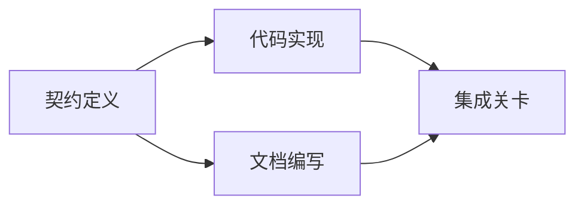

# Construir un plan de ejecución basado en pruebas

> 计划绝对不是 una lista de espera más hermosa ((to-do list) ⋅ es una lista de dependencias: cada una de las modificaciones tiene un fundamento, cada punto terminal tiene una prueba de validación clara―

**Type:** Learn + Build
**Languages:** Python (stdlib)
**Prerequisites:** Phase 14 第 43 课
**Time:** ~65 分钟

## El objetivo del aprendizaje

- Transformar el marco de tareas en proyectos de trabajo con pruebas objetivas y pruebas de verificación.
- Se ejecutará el orden de la construcción en función de la gráfica, y no de los pasos lineales de la forma en que se dicte.
- En la modificación del código antes de la inspección de la falta de hechos, la dependencia desconocida y la dependencia de ciclo.
- 区分哪些步骤可以并行执行,哪些步骤必须按序等.

## ¿Por qué los planes del cuerpo inteligente siempre fracasan?

脆弱的计划只是 para el futuro en el que se repite la necesidad del usuario:

1.  Actualizar la API 
2. 添加测试──
3. 更新文档── y ahora mismo.

En esta lista no se indica por qué se modifican estos documentos, ni por qué se deben modificar los documentos, ni por qué se puede realizar un trabajo.

Un plan sólido para cada trabajo (un artículo de trabajo) se ha hecho cinco compromisos:

| 承诺要素 | 核心作用 |
|---|---|
| 标识符（Identifier） | 用于依赖声明与会话交接（Handoff）的稳定引用 |
| 变更内容（Change） | 最小颗粒度的行为或契约改动 |
| 事实证据（Evidence） | 证明该变更合情合理且必要据实的代码库证据 |
| 前置依赖（Dependencies） | 必须率先完成并成立的前置工作项 |
| 验收证明（Proof） | 能够确凿宣告该工作项闭环的检查手段 |

## En concreto, antes de la realización del acuerdo de planificación

Cuando varios códigos diferentes superficialmente dependen del mismo comportamiento, se debe priorizar la definición del acuerdo de comportamiento. De este modo, los testes, realizaciones y logros de archivo pueden compartir el mismo acuerdo, en lugar de crear cuatro versiones incompatibles.



Esta dependencia muestra claramente la posibilidad de que el código se desarrolle de forma segura: después de fijar el contrato, la implementación del código puede avanzar junto con la redacción del archivo, mientras que la fase final de integración espera que ambos estén listos.

## Los hechos deben tener la capacidad de cambiar el plan.

La realidad de la codebase es que no hay nada que pueda hacerse, pero debe poder afectar de manera real a la planificación de los trabajos:

-  encontrar funciones auxiliares existentes, eliminando así la estrategia abstracta del proyecto original de nueva construcción
- 兼容性测试, la necesidad de incrementar la migración de datos en el plan de urgencia.
- 部署环境的约束,将模式(Schema) cambiar y separarse en otra misión independiente.
- 公共响应类型的格式, modificó el código implementado y el orden posterior de redacción de documentos.

Si una llamada prueba no puede cambiar tu plan, es muy probable que no sea una prueba válida para apoyar esa decisión.

## 面向会话中断而设计 El diseño de la página web

编码智能体的会话往往会无预警中断── un plan con capacidad de recuperación, su tamaño de trabajo es lo suficientemente detallado como para que otro encuentro pueda juzgar inmediatamente:

- 哪项工作已完成;
- 哪项验收证明已经跑通;
- 哪些产品文件已修改;
- 哪些 dependen de proyectos ya han sido desactivados;
- El siguiente trabajo que podemos ejecutar de forma segura es ¿qué?

No se debe guardar el estado de ejecución en el cuadro de selección de la ventana de chat.

## 计划有效性校验

En la ejecución oficial, se debe rechazar directamente el plan si se presentan las siguientes situaciones:

- exist重复工作项标识符;
-  falta de pruebas de hecho de un proyecto de trabajo;
- 某工作项缺乏验收证明;
- Depende de un proyecto que no existe;
- Dependiendo de la figura, existe un ciclo de dependencia;
- En la actualidad, la primera operación irreversible se ha organizado antes de que se elimine la incertidumbre relacionada.

Las cinco primeras inspecciones pueden ser completadas automáticamente mediante un proceso de mecanización; las últimas requieren de capacidad de juicio de ingeniería, que debe ser claramente resaltada en la evaluación.

## Construirlo

`code/main.py`建模了工作项,校验其证证凭证,通过拓排序计算执行波次(Execution Waves),并将结果写入 `outputs/evidence-plan.json`¿Qué es eso?

¿Qué es eso ?

```bash
python3 code/main.py
python3 -m unittest discover code/tests -v
```

En este ejemplo se generan tres ejecuciones: primero ejecutar un acuerdo definido; luego realizar un código con el archivo redactado y ejecutado; y finalmente ejecutar un proceso de integración.

## 配合编码智能体使用

Antes de permitir que el sistema inteligente modifique un archivo de código, requiere que primero publique este plan.

1. Cada camino y comportamiento se basa en el hecho de que cada uno de ellos tenga un código específico.
2. Cada proyecto de trabajo tiene una prueba de su finalización clara y única.
3. Depende de si el trabajo será costoso o irreversible, se retrasará hasta que se elimine la incertidumbre de su dependencia.

La aprobación es un plan concreto y claro, no una frase en el vacío.

##  ejercicios

1. Añadir un proyecto de migración de base de datos que requiere la aprobación humana.
2. Construir un ciclo de dependencia, y explicar las diferencias de productos ocultas detrás de ella.
3. 拆分一包含两条不同证明命令的工作项──
4. Añadir una que pueda ejecutarse en la segunda ola, y no tocar en ningún otro trabajo ya existente.
5. Se planea la presentación en formato Markdown, manteniendo JSON como una única fuente de datos.

## 延伸阅读

- [Nuseibeh and Easterbrook, Requirements Engineering: A Roadmap](https://www.cs.toronto.edu/~sme/papers/2000/ICSE2000.pdf): explorar las relaciones entre objetivos, normas, consenso y desarrollo.
- [Barry Boehm, A Spiral Model of Software Development and Enhancement](https://dl.acm.org/doi/10.1145/12944.12948)En el artículo 5 del Tratado de Maastricht se establece que la política de desarrollo de la tecnología de la información en el ámbito de la información y de la información es una de las principales prioridades de la investigación y desarrollo.

## 交付物与沉 交付物与沉 交付物与沉

Por favor, mantenga bien la producción.`outputs/evidence-plan.json` será el acuerdo de base de la tarea en la siguiente sección.
