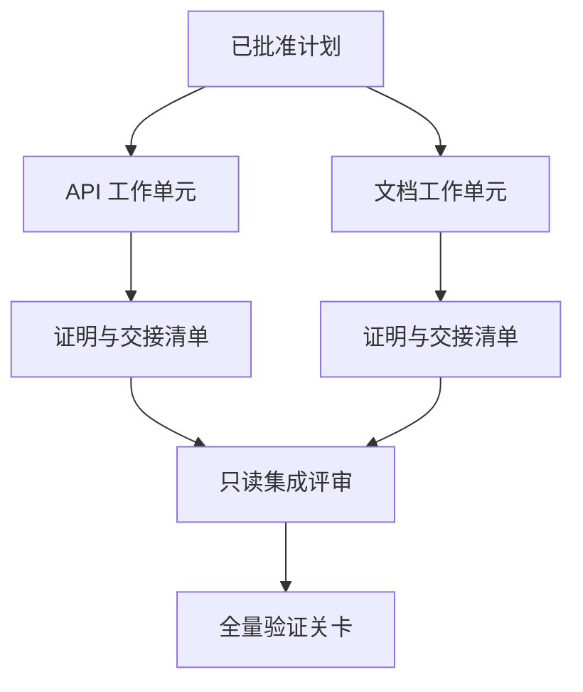

# 带隔离与合并契约的代理委托

> Y los cuerpos inteligentes sólo pueden ahorrar tiempo físico cuando trabajan realmente independientemente de uno al otro. De lo contrario, sólo convertirán una tarea clara en un coste más alto de coordinación, una velocidad más rápida de fracaso y una catástrofe de coordinación.

**Type:** Learn + Build
**Languages:** Python (stdlib)
**Prerequisites:** Phase 14 第 39 课与第 44 课
**Time:** ~70 分钟

## El objetivo del aprendizaje

- De acuerdo con la verdadera independencia de la tarea de juicio de la comisión y la ejecución de la misma es razonable.
- Para cada unidad de trabajo (la) se otorga a los trabajadores el derecho de modificar sus documentos y la prueba de su finalización.
- 基于依赖关系计算安全的执行波次 (basado en la dependencia de la seguridad de las operaciones de ejecución) 
- 设计合并契约 (Contrato de Fusión) para la integración segura de varios productos de trabajo inteligentes.

## Y la prueba de la calidad

No se debe a que haya más inteligencia disponible para realizar tareas ciegas. Sólo cuando se cumple al menos una de las siguientes condiciones, el encargado tiene la racionalidad:

-  dos investigaciones capaces de resolver independientemente diferentes problemas desconocidos;
-  dos códigos que permitan tener una interfaz de documentos y de documentos que no se superpongan entre sí;
- 评审智能体 (revisor) capaz de realizar inspecciones independientemente bajo la premisa de que el producto no haya sido modificado;
- Los controles externos más largos pueden llevarse a cabo en el trabajo local y en el trabajo posterior.

Cuando varios cuerpos inteligentes necesitan modificar el mismo documento, dependiendo de una misma decisión no resuelta, o dependiendo de un mismo entorno variable, deben perseverar en la ejecución en cadena.

## 工作单元就是一份契约 (un trabajo es un acuerdo)

Cada unidad de trabajo encargada debe establecer claramente:

| 字段 | 含义 |
|---|---|
| 目标（Goal） | 单一可观测的结果 |
| 负责人（Owner） | 单一负责执行的工作智能体 |
| 路径（Paths） | 排他的写入所有权 |
| 前置依赖（Dependencies） | 启动前必须已完工的前置单元 |
| 证明（Proof） | 返回给集成者的确凿验证证据 |
| 交接清单（Handoff） | 已修改的文件、已做出的决策以及残留风险 |

 Tratamiento posterior  lógica  no es unidad de trabajo calificada  `app/accounts.py`En la realización de la revisión de los proyectos y mediante pruebas de especialidad dirigidas a la cuenta se ha demostrado que la unidad de trabajo es calificada.

## Sistema de tres niveles separados

1. **文件系统隔离（Filesystem isolation）：**独立工作树 (de trabajo) o de trabajo, para evitar que ocurran accidentes并发共享写入.
2. **所有权隔离（Ownership isolation）：**严格的契约限制, evitar que dos cuerpos inteligentes modificen intencionalmente el mismo camino.
3. **状态隔离（State isolation）：**Registros de logos y salidas independientes, para evitar que un cuerpo inteligente cubra otro cuerpo inteligente.

文件系统隔离无法解决设计所有权问题―― dos árboles de trabajo todavía pueden producir estructuras de conflicto entre sí――合并契约必须在工作开始之前就彻底了解共享接口――



## 集成者不负责重构代码

集成者(Integrador) debe tener las siguientes responsabilidades:

1.  confirmar que los resultados de cada comunicación se encuentran dentro de la extensión de su distribución;
2. 认真审查验证证的输出, y no sólo resumen de sus propios escritos por el trabajo inteligente de los ciegos;
3. 根据依赖关系的时间序依次合并改动;
4. 运行覆盖跨单元的全量验证关卡;
5.  firme rechazo a cualquier extensión de la cobertura;
6. Registrar los conflictos para nuevas decisiones que necesitan ser resueltas, en lugar de modificarlos en silencio privado.

Si la etapa de integración requiere reescribir la mayor parte del producto de código de un trabajo inteligente, explicar que la descomposición de la tarea inicial en sí misma es errónea.

## El papel de la persona humana y el cuerpo inteligente

La tarea de encargo no significa abandonar la capacidad de juicio humana. La humanidad sigue firmemente en pos de las decisiones centrales que cambiarán el comportamiento externo del sistema, los niveles de riesgo, las competencias de seguridad o traer un costo irreversible.

Eso es todo.**校准型自主（Calibrated Autonomy）**El sistema en el que la evidencia es plena y fácil de reproducir le da al cuerpo inteligente una gran libertad, y en los últimos momentos importantes se obliga a establecer un sistema de control humano.

## Construirlo

El programa de experimentación de esta clase examinará los caminos de superposición, verificará las dependencias, ejecutará las ondas de seguridad de cálculo y emitirá los resultados hasta que`outputs/delegation-plan.json`¿Qué es eso?

¿Qué es eso ?

```bash
python3 code/main.py
python3 -m unittest discover code/tests -v
```

尝试修改文档单元, hacer que tenga `app/`El programa debe ser interceptado y informado automáticamente, debido a la superposición de los métodos y de las unidades de API.

##  ejercicios

1. La división de una empresa real en dos unidades de trabajo independientes y un papel integrador.
2. En el caso de los Estados miembros, la Comisión de Asuntos Exteriores ha adoptado una decisión en el marco de la cual se ha establecido un acuerdo de cooperación entre los Estados miembros.
3. 增加一个只读的研究型智能体 (en inglés, "Investigador"), su producto para una presentación de hechos.
4. 增加一个合并关卡(Merge Gate),对照所有工作单元契约检查最终修改的文件集合──
5. Por lo que se refiere a la aplicación de la ley, el artículo 6 de la Ley de la Seguridad Social establece que las medidas de seguridad social deben ser adoptadas en el marco de la legislación nacional.

## 延伸阅读

- [Reid Smith, The Contract Net Protocol](https://doi.org/10.1109/TC.1980.1675516)El estudio clásico de la distribución de tareas y resultados del informe de la formalización temprana.
- [Eric Horvitz, Principles of Mixed-Initiative User Interfaces](https://dl.acm.org/doi/10.1145/302979.303030)En el marco de la investigación, se analizará el mecanismo de automatización: ¿cuándo debería actuar de forma autónoma?

## 交付物与沉 交付物与沉 交付物与沉

Por favor, mantenga bien la producción.`outputs/delegation-plan.json` Registra por qué es seguro el programa de separación, y qué pruebas deben ser aceptadas para cada camino de regreso a la propiedad de quien lo es.
