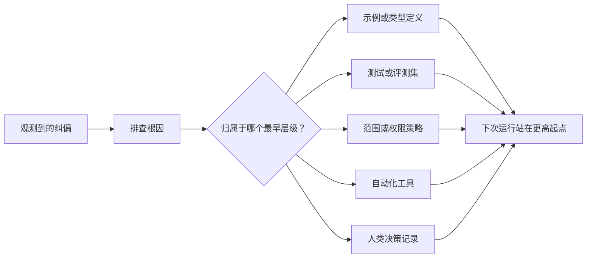

# Cada agente se transformará en mejoramiento del sistema

> Sólo quedarse en el registro de conversaciones puede solucionarse sólo en la ejecución actual, mientras que depender de la prueba, la estrategia de frontera, el ejemplo o el mecanismo de control en la herramienta, puede hacer que cada ejecución posterior sea mejor.

**Type:** Learn + Build
**Languages:** Python (stdlib)
**Prerequisites:** Phase 14 第 37 至 41 课
**Time:** ~65 分钟

## El objetivo del aprendizaje

- Se convertirá en un mecanismo de control de sistema de larga duración para la corrección temporal de los cuerpos inteligentes.
- Cada mecanismo de control se colocará en el nivel más temprano de la capa más temprana para prevenir la repetición de problemas.
- Utiliza la característica de la firma estable para realizar una prueba de la reaprobación de la instrucción.
- 及时退役那些不再 c ceder a las viejas reglas de control del riesgo real.

## El derecho en sí mismo es una prueba valiosa .

Cuando le dices a un cuerpo inteligente que no edite ese archivo, en realidad ya se ha encontrado: límites de alcance existentes (limitados de alcance) falta de restricciones ejecutables. Cuando se señala que este formato de salida es un error, en realidad se encuentra que falta un ejemplo estándar o un examen de automatización. Cuando la configuración ambiental vuelve a reportar errores, se da cuenta de que el conocimiento inicial del ambiente debe estar en el guión de automatización.

 debe considerarse la corrección de los cuerpos inteligentes como una observación de la falta del sistema de trabajo en sí mismo, en lugar de un error de gramática simple en la escritura de Pronto .

## 提升沉到最早有效级别

 seguir las siguientes prioridades de control:

| 频发故障类型 | 长效沉淀去处 |
|---|---|
| 错误计算结果或代码回归 | 自动化测试或评测集（Test / Evaluation） |
| 超范围越界或不安全操作 | 范围契约或权限策略（Scope / Permission Policy） |
| 重复出现的环境配置或命令错误 | 自动化脚本或专用工具（Automation / Tool） |
| 重复出现的输出格式错误 | 标准规范示例外加数据校验器（Canonical Example + Validator） |
| 模糊不清的本地工程惯例 | 附带具体场景检查的指令（Instruction + Scenario Check） |
| 产品层面的分歧与争议 | 人类决策记录（Human Decision Record） |

Cuanto más pronto se produzca el mecanismo de control, más bajo es el costo. Una definición de tipo de estado de total ineficacia desde el nivel de tipo de sistema, más fuerte que las críticas de los últimos controles de código; un análisis de unidades dirigido, también más eficaz que el de la escritura de un artículo en el libro de contundencia.



## 反棘轮记录 (El registro de Ratchet)

完整的记录应包含:

- El síntoma es el síntoma de la enfermedad.
- 根因分析 (la causa raíz);
- 造成的后果(consecuencia);
- 重复出现次数 (cuenta de repeticiones);
- Mecanismo de control seleccionado
- El método de verificación del mecanismo de control
- 责任人(propietario);
- 审查或退役日期 (Revisar / fecha de jubilación)

No se debe fijar permanentemente cada preferencia personal temporal. Sólo cuando la frecuencia de repetición o la gravedad de los efectos potenciales del problema sea suficiente para demostrar la razonabilidad de la complejidad de mantenimiento a largo plazo, se puede elevar a un mecanismo de control permanente.

## 区分根因与表象 区分根因与表象

 el cuerpo inteligente ha modificado README simplemente muestra.

- 任务框架 permite modificar todo el código de código de base;
- 文件文件被默认总是可以安全编辑的; 文件文件被默认总是可以安全编辑的; 文件文件被默认总是可以安全编辑的;
-  ejecutar el plan de ejecución se ejecutará en conjunto con la redacción de documentos;
- 两个工作智能体 existen sobrepuestos de los documentos de propiedad.

Diferentes raíces de respuesta a diferentes medios de control. Si sólo se prohíbe escribir una fotocopiada de forma mecánica, la próxima vez que surja un problema similar en forma de un cambio ligero, el sistema seguirá fallido nuevamente.

##  control rules similar a la decaída

Las reglas de control viejas generarán conflictos, se expandieron en las ventanas de texto, y se consolidarán en las que ya no existen. Cada regla que se ha elevado requiere un control periódico. En los siguientes casos, se debe eliminar o reescribir:

- La estructura de base ha cambiado;
- Se ha puesto en marcha un mecanismo de control ejecutivo más fuerte que lo sustituirá;
- En una ventana de tiempo considerable, este fallo nunca se repitió.
- El obstáculo y el fricción que esta regla causa ya superan los riesgos que se imponen en sí misma.

El objetivo del proyecto no es escribir los documentos de instrucciones más extensos, sino mantener los juicios de ingeniería que no son fáciles de hacer con un mecanismo de sistema minimizado.

## Construirlo

El programa experimental de esta clase se clasificará la corrección, se elevará a un mecanismo de control, se generará una huella para recopilar los proyectos y se escribirán los resultados.`outputs/feedback-ratchet.json`¿Qué es eso?

¿Qué es eso ?

```bash
python3 code/main.py
python3 -m unittest discover code/tests -v
```

Intentar introducir dos expresiones diferentes pero con la misma raíz de corrección de los mismos registros. Continuaremos optimizando en la lógica de la unificación hasta que puedan combinarse en un mecanismo de control unificado, al mismo tiempo que no se cometan errores.

##  ejercicios

1. Desde la edición reciente del discurso seleccionar cinco artículos correctos y contrarios, analizar y darles a los niveles de verdadera caída.
2. Reconstruir una regla de texto en un texto en un ensayo de automatización ejecutable.
3. 增加后果权重 (peso de peso de las consecuencias) evaluación, hacer que graves errores de alto riesgo también puedan ser inmediatamente elevados a un control permanente.
4. En el experimento de producción y salida, el responsable de cada mecanismo de control se completa y se retira de la actividad.
5.  revisar una instrucción de cuerpos inteligentes existente y eliminarla bajo la premisa de que existe un mecanismo de control más fuerte 

## 延伸阅读

- [Basili, Caldiera, and Rombach, The Goal Question Metric Approach](https://www.cs.toronto.edu/~sme/CSC444F/handouts/GQM-paper.pdf)En el marco de la investigación, se analizará cómo convertir los objetivos de alto nivel en indicadores de medida operables y problemáticos.
- [Shinn et al., Reflexion](https://arxiv.org/abs/2303.11366)Introducción: Cómo utilizar el control de la calidad de la toma de decisiones y no se necesita un pequeño peso de los modelos.
- [Madaan et al., Self-Refine](https://arxiv.org/abs/2303.17651)En el círculo cerrado de la tarea se implementa la generación de la auto-reforma.

## 交付物与沉 交付物与沉 交付物与沉

Por favor, mantenga bien la producción.`outputs/feedback-ratchet.json` es el resultado final de la ruta de ingeniería de asesoramiento de inteligencia, es también un futuro desarrollo más profundo de la entrada central del Workbench
