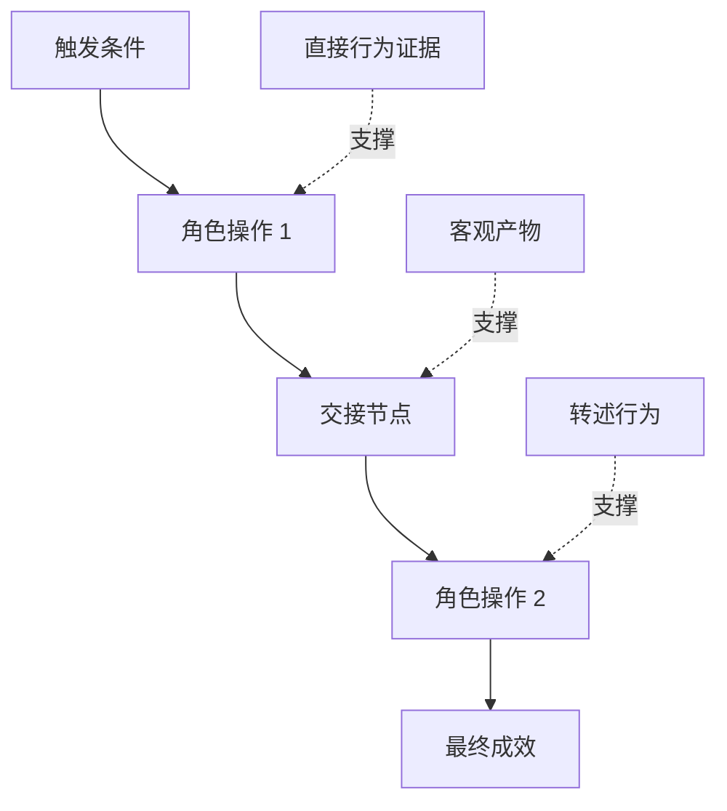

# 发掘人们真正执行的工作流 发掘人们真正执行的工作流 发掘人们真正执行的工作流

> Las necesidades reales nunca se sientan en las salas de reuniones, como vienes a recogerlas.

**Type:** Learn + Build
**Languages:** Python (stdlib)
**Prerequisites:** Phase 14 第 47 课
**Time:** ~70 分钟

## El objetivo del aprendizaje

- La estructura de los trabajos existentes se basará en la secuencia de movimientos de los resultados de los resultados de los estudios.
-  estrictamente distinguir entre observar directamente los hechos y el comportamiento de la traducción o la deducción.
- 定位流程中的摩擦阻力(Fricción) 交接节点(Handoffs) 审批权限(Autoridad) y隐性状态(Estado oculto)
- 保持不确定主张的显而易见性,而非轻率地将其直接转变为硬性需求──

## Desarrollo de un sistema existente

切勿一开始就问用户想要什么功能──你应该做的是回原现在究竟发生了什么──

 para cada paso del flujo de trabajo, registren los siguientes pasajes:

| 字段 | 示例 |
|---|---|
| 执行角色（Actor） | 值班工程师 |
| 触发条件（Trigger） | 生产环境告警到达 |
| 具体操作（Action） | 打开告警详情，随后在监控看板中搜索 |
| 输入信息（Input） | 告警 Payload 与发布记录 |
| 产出结果（Output） | 疑似故障服务及责任人 |
| 摩擦阻力（Friction） | 在三个不同运维工具之间来回切换上下文 |
| 审批权限（Authority） | 事故指挥官批准执行写入操作 |
| 支撑证据（Evidence） | 屏幕录像、事故复盘日志、运维手册 |

El verdadero flujo de trabajo es mucho más amplio que la interfaz que se ve en la pantalla. Incluye tiempo de espera, copia de pegadas, conversación privada en línea, proceso de aprobación, recuperación de errores, así como los movimientos que la gente ya está acostumbrada a hacer y que no se hacen.

## La evidencia es de un nivel fuerte y débil.

建立简单的证据阶梯(Escada de pruebas):

1. **直接行为（Direct behavior）：**现场观测、系统调用追踪(Trace) 、屏幕录屏或系统事件日志──
2. **客观产物（Artifact）：**工单记录、运维手册、审计日志、表单或已完成成果文件──
3. **转述行为（Reported behavior）：**La gente habla de lo que suelen hacer.
4. **主观推断（Inference）：**El equipo concluye que es probable que suceda lo que ocurra.

Estas cuatro fuentes de información tienen valor, pero sólo las dos primeras pueden confirmar directamente el comportamiento real actual.



## 重点搜寻 cuatro grandes elementos

- **摩擦阻力（Friction）：**Reproducción de datos o recuperación de fallas de datos.
- **隐性状态（Hidden state）：** sólo se queda en el cerebro del empleado  Instantáneas de comunicación  Contigo de conversación o información en la cuenta personal privada 
- **审批权限（Authority）：**Tiene derecho a tomar decisiones importantes y de gran impacto sobre el personal o el sistema de control.
- **异常分支（Exceptions）：**El proceso normal ocurre interrumpido, ya no se basa en la situación de los bordes de los trabajos.

La función de la IA se desploma frecuentemente en contacto con el tratamiento de anomalías, a menudo porque inicialmente se diseñó sólo para el camino ideal de todo lo que funciona.

## 切勿通过 求平均 抹杀分歧 切勿通过 求平均 抹杀分歧 切勿通过 求平均 抹杀分歧 切勿通过 求平均 抹杀分歧

 dos usuarios adoptan procesos de operación muy diferentes, a menudo con razones muy justificadas, antes de comprender plenamente su origen profundo, debe conservar completamente estas divisiones, ya que pueden representar:

- Diferentes funciones y responsabilidades de la organización;
- Grados de tolerancia al riesgo distintos;
- 遗留旧流与当前新流的交换;
-  Diferencias entre la experiencia profesional y la habilidad;
- Las estrategias de negocio y la gestión se diferencian.

Un flujo de trabajo en el que se hace una fuerza de trabajo, a menudo no puede describir a ninguna persona real.

## Construirlo

El programa de experimentación de esta clase consiste en un registro de cada paso del flujo de trabajo, un certificado de certificación, un certificado de ejecución y un certificado de confianza, un cálculo de la proporción de pruebas directas y de pruebas directas, y se escribirán los resultados.`outputs/workflow-evidence.json`¿Qué es eso?

¿Qué es eso ?

```bash
python3 code/main.py
python3 -m unittest discover code/tests -v
```

尝试增加一条部署记录缺失的异常分支路径── mantener el orden del proceso en constante estado,并清晰记录该分支的起点位置──

##  ejercicios

1. No entrevistar a nadie, sólo con un sistema de funcionamiento de diario de trabajo completo.
2. Entrevista a un usuario real, marcando su contenido en todo el mundo todavía carece de evidencia directa de apoyo a la información.
3. 增加一处权限审批边界 (limitadas por autoridad) y paso a paso fallar
4.  para la misma situación, se producen dos diferentes variantes de procesos, sin que se hagan cumplir.
5.  encontrar una nueva función de una propuesta: aunque superficialmente elimina un paso visible, no se trata del trabajo oculto detrás.

## 延伸阅读

- [Nuseibeh and Easterbrook, Requirements Engineering: A Roadmap](https://www.cs.toronto.edu/~sme/papers/2000/ICSE2000.pdf)En particular, el enfoque de la información sobre la necesidad de obtener es la liberación, la construcción y la verificación y no la simple captura de información.
- [Gotel and Finkelstein, An Analysis of the Requirements Traceability Problem](https://doi.org/10.1109/ICRE.1994.292398): Analiza los graves desafíos de la relación entre la necesidad de mantenimiento y su base de origen.

## 交付物与沉 交付物与沉 交付物与沉

Por favor, mantenga bien la producción.`outputs/workflow-evidence.json`En la siguiente sección, se transformará la resistencia y la incertidumbre de fricción observada en un mapa de hipótesis.
