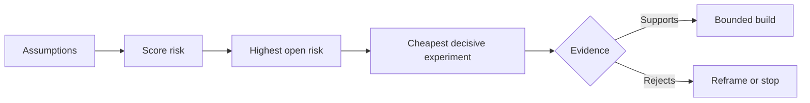

# 理假设并优先化解最高风险 理假设并优先化解最高风险 理假设并优先化化解最高风险

> 产品路线图 (Roadmap) suele ocultar la incertidumbre en la lista de funciones; mientras que el supuesto de un mapa (Assumption Map) revela que antes de que estas funciones valgan la pena construir, se deben confirmar las condiciones previas.

**Type:** Learn + Build
**Languages:** Python (stdlib)
**Prerequisites:** Phase 14 lesson 48
**Time:** ~65 minutes

## El objetivo del aprendizaje

- La propuesta de trabajo se desmantelará y se transformará en una hipótesis clara y clara.
- Se puede evaluar con precisión la situación de la situación de la población en el país.
- 风险排序选择下一个实验, y no con un impulso de calor de la perspectiva.
- Usado para probar y determinar las conclusiones de la decisión en lugar de las hipótesis de la prueba.

## Cada construcción es una apuesta.

Un conjunto de herramientas de búsqueda de fallas (Incident Tool) de valor, puede depender de si cada una de las siguientes hipótesis de fallas es totalmente válida:

- la notificación que figura en el siguiente contenido contiene suficiente información para identificar el servicio de fallas;
- 工程师信任他们并非亲自推出的推结果;
-  El tiempo de respuesta previsto es realmente crucial a nivel de transporte;
- Puede acceder a los datos necesarios bajo la premisa de la Autoridad insegura de no introducir derechos de seguridad;
- La frecuencia de ocurrencia del flujo de trabajo es lo suficientemente alta como para demostrar que el coste de mantenimiento del sistema es razonable.

Estos no son simples codificadores para realizar tareas de implementación, sino que hacen que la construcción sea valiosa, utilizable, viable y segura.

## 假设的类别

| 类别 | 核心问题 |
|---|---|
| 价值（Value） | 产出的最终结果是否足够重要？ |
| 可用性（Usability） | 用户能否理解并据此采取行动？ |
| 可行性（Feasibility） | 现有系统能否利用可获取的数据和约束产出该结果？ |
| 存续性（Viability） | 组织能否长期承受其成本、归属权与运维负担？ |
| 安全性（Safety） | 系统出现故障时是否不会造成无法接受的后果？ |

La hipótesis de que se escriba una declaración falsificable es una hipótesis que puede ser interpretada de manera lógica y que puede ser verificada. La función es útil y no puede ser probada.

## 风险并非单一维度的数字

Este experimento de 1 a 5 minutos evalúa tres dimensiones:

- **影响（Impact）：**Si la hipótesis no se cumple, la magnitud de los daños causados al sistema o al negocio.
- **不确定性（Uncertainty）：**La debilidad de la evidencia en el momento de la obtención de la prueba.
- **不可逆性（Irreversibility）：**En el momento de realizar un compromiso o de invertir, sólo se detectaron errores en el coste de la devolución.

El ejemplo de calificación afectará a la incertidumbre, multiplicada por la irreversibilidad. Este formulario no es un estándar de la cual todos están dispuestos, su objetivo es obligar al equipo a explicar claramente por qué una cosa desconocida debe priorizar a otra solución desconocida.



## design experiments, y no ceremonias de confirmación

Una experiencia realmente valiosa tiene los siguientes elementos:

- Una posible afirmación falsa;
- Muestras de público real o representativas;
- Un resultado de observación de objetividad;
- evaluar el valor del resultado previamente determinado;
-  para el paso de la decisión de los próximos pasos, según el propio método de prueba definido.

 evitar el diseño que sólo se utiliza para demostrar que el equipo tiene la capacidad de hacer esta idea  de la prueba de confirmación ceremonial tipo 

## 可逆性会改变构建顺序

后果严重且不可逆的选择需要更早获得证据支持──只读重放(只读重播) debe ser primero integrada en el entorno de producción; los adaptadores temporales pueden ser antes de la migración de datos a gran escala; las recomendaciones de aprobación artificial deben ser primero ejecutadas totalmente automáticamente──

El ritmo de desarrollo de la construcción del sistema debe estar en consonancia con el ritmo de la resolución de la incertidumbre.

## 动手实现

Este experimento se realiza en la clasificación de las hipótesis, la distinción entre las conclusiones verificadas y no decididas, la selección de las hipótesis no decididas más riesgosas, y la generación.`outputs/assumption-map.json`¿Qué es eso?

```bash
python3 code/main.py
python3 -m unittest discover code/tests -v
```

 modificar el estado de la evidencia en la hipótesis de máximo riesgo, observar el sistema de recomendación de la siguiente experimentación ¿cómo se ajustará el estado de la situación 

## 课后练习 课后练习

1. Para que estés listo para construir una función escriba cinco hipótesis clave.
2. 补充一条你原本的功能列表中遗漏的安全假设──
3. Establecer una que te haga decidir terminar con la dureza de la construcción.
4. El experimento de prueba original de gran tamaño se sustituirá por un experimento de menor costo y de mayor determinación.
5. En comparación con la prioridad de riesgo y la prioridad de la línea de productos originales, y explicó por qué existe un error en el segundo lugar.

## 延伸阅读

- [Barry Boehm, A Spiral Model of Software Development and Enhancement](https://dl.acm.org/doi/10.1145/12944.12948), explorar en un ciclo de desarrollo de riesgo impulsado por una inversión de mayor profundidad para la resolución de la incertidumbre.
- [Dardenne, van Lamsweerde, and Fickas, Goal-Directed Requirements Acquisition](https://doi.org/10.1016/0167-6423(93)90021-G), explorar los objetivos del sistema de refinamiento en el mismo tiempo que los obstáculos y las restricciones de exposición gradual.

## 交付物沉  entrega de objetos

Mantener`outputs/assumption-map.json` La siguiente sección del curso ayudará a la selección de este documento para que pueda producir el menor número de pruebas decisivas.
