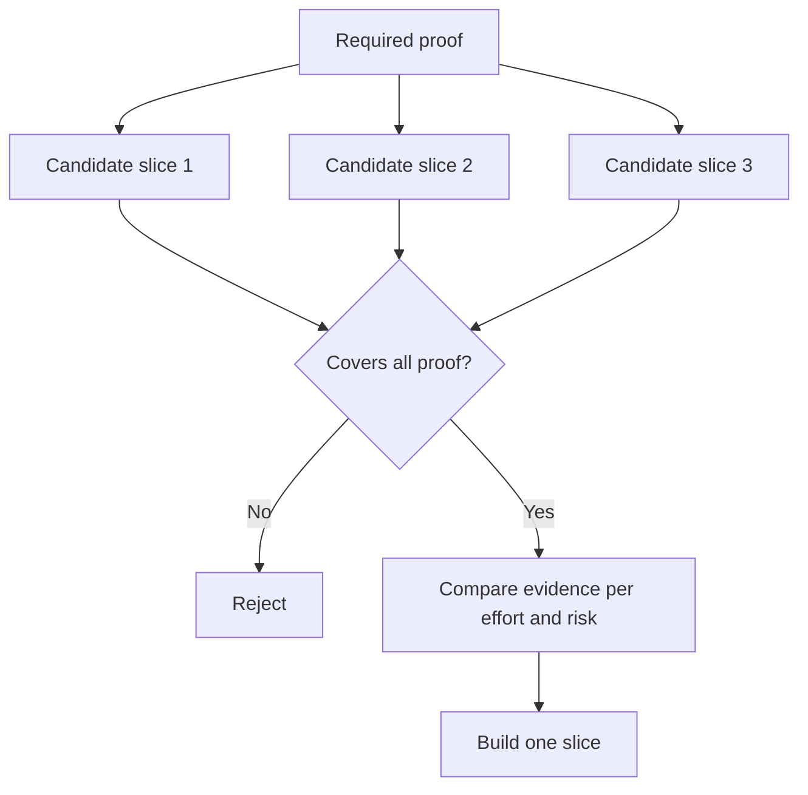

# 选择能够改变决策的最小片

> Sólo cuando el pequeño puede demostrar un problema clave, la simplificación tiene valor. Una pequeña estructura de la decisión siguiente no puede cambiar, su cantidad es sólo una mitad de la producción.

**Type:** Learn + Build
**Languages:** Python (stdlib)
**Prerequisites:** Phase 14 lesson 49
**Time:** ~65 minutes

## El objetivo del aprendizaje

- Según la hipótesis central de que el corte puede ser probado, se define el corte.
- 权衡结果价值 (valor de resultado) 无确定性化解, desarrollo y implicaciones potenciales
-  prioridad para elegir pruebas reales, en lugar de hacer un compromiso de nacimiento prematuro.
- Decide no decidir los falsos pedazos de los que intentan evitar el trabajo.

## 垂直切片 significa el resultado final

垂直切片 (垂直切片) es el mínimo flujo de trabajo real necesario para un resultado de un análisis. Puede ser muy estrecho en cuanto a la cantidad de usuarios, la escala de datos, el ciclo de funcionamiento y el rango de funciones, pero no puede excluir la incertidumbre central del análisis.

Muestras:

- 基于 10 起真故障的只读重放 (en inglés sólo reproducción de lectura), capaz de comprobar la precisión del servicio y la confianza del operador.
- En base a datos sintéticos, el equipo de trabajo puede comprobar la comprensión de la interfaz, pero no puede comprobar la disponibilidad de los datos obtenidos.
- El sistema de reparación de fallas automática en el medio ambiente de producción, intentó probar una vez todos los componentes, pero trajo un riesgo de destrucción insoportable.

## Previamente definido

提取风险最高的未决假设,将将其转化为必要证据集 (需证据集) ──切片候选人只有在完全覆盖该证据集时,才具备入选资格 (需证据集) ──

Se realizará posteriormente una evaluación comparativa entre los fragmentos calificados:

| 评估维度 | 期望方向 |
|---|---|
| 产出价值（Outcome value） | 越大越好 |
| 化解的不确定性（Uncertainty reduced） | 越多越好 |
| 研发投入（Effort） | 越小越好 |
| 潜在后果（Consequence） | 越轻越好 |
| 可逆性（Reversibility） | 越高越好 |

El modelo de evaluación utilizado en este experimento está dispuesto a mantenerse simple, ya que la calificación para ingresar a la escuela es mucho más importante que el cálculo digital en sí mismo.



## 常见的伪极小值陷

- **纯界面极小值（UI-only minimum）：** Evita la obtención y el mantenimiento de datos más importantes 
- **纯基础设施极小值（Infrastructure-only minimum）：**☐ la tecnología ha demostrado su viabilidad, pero no puede comprobar el valor del usuario.
- **纯顺境极小值（Happy-path minimum）：**刻意省略构成大部分风险的异常边界处理.
- **演示极小值（Demo minimum）：**Se ha producido un producto demostrativo muy convincente, pero no puede proporcionar una evaluación cuantitativa real.
- **平台化极小值（Platform minimum）：**En el caso de los sistemas de trabajo individuales, la construcción de componentes de uso común y repetitivo es prematura, hasta que el valor de los mismos no se haya confirmado.

## 预先设定停止规则 预先设定停止规则 预先设定停止规则 预先设定停止规则 预先设定停止规则 预先设定停止规则 预先设定停止规则 预先设定停止规则 预先设定停止规则

Antes de comenzar a realizar, debe hacerse una lista de las medidas que se tomarán si el test fracasa:

-  abandonar el resultado esperado;
- Cambiar el grupo de usuarios o el escenario de negocios objetivo;
- 测试替代的技术机制;
-  recoger pruebas de nivel inferior de calidad superior;
-  más estrecho sistema de ejecuciones 

Si los resultados de cada prueba finalizan en la construcción, entonces este pedazo no es un experimento real.

## 动手实现

Este experimento se basó en la evidencia necesaria de la selección de los participantes, evaluar los participantes, y hacerse una evaluación.`outputs/slice-decision.json`¿Qué es eso?

```bash
python3 code/main.py
python3 -m unittest discover code/tests -v
```

尝试添加一个成本较低但只能验证单项的必要假设的候选片――观察它即使数值总分极高,为什么仍然会直接被资格门禁拦截――

## 课后练习 课后练习

1.  para el mismo resultado esperado, diseñar tres fragmentos de pruebas de diferentes niveles de riesgo de consecuencias.
2. Antes de evaluar los trozos de candidatos, una lista clara de los justificativos necesarios.
3. 尝试裁撤一项功能, al mismo tiempo asegurarse de poder conservar pruebas decisivas clave.
4. Por el programa de prueba complementar una regla de detención de la práctica efectiva.
5.  encontrar una razón para retrasar el proceso de verificación de los fragmentos después de reiniciar el componente de la plataforma general

## 延伸阅读

- [Barry Boehm, A Spiral Model of Software Development and Enhancement](https://dl.acm.org/doi/10.1145/12944.12948), explorar cómo hacer que cada ciclo de desarrollo se adapte a los riesgos que deben ser resueltos en el presente.
- [Lenarduzzi and Taibi, MVP Explained: A Systematic Mapping Study on the Definitions of Minimal Viable Product](https://arxiv.org/abs/1609.07592)En la práctica de la ingeniería de software, el análisis de la información se aplica a la confusión definida entre el mínimo y el mínimo posible.

## 交付物沉  entrega de objetos

Mantener`outputs/slice-decision.json` El documento registra el hecho de que el pedazo sea capaz de cambiar la decisión en base a la evidencia de los pedazos más pequeños
