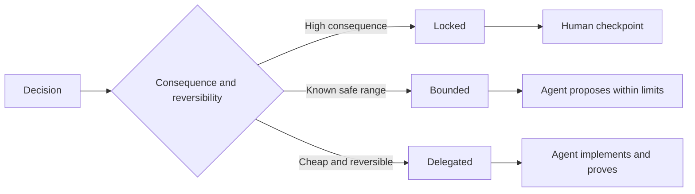

#  redactar las normas de tareas de la conservación del derecho de decisión autónoma

> La norma de valor debe fijarse en la constante y la prueba de la prueba, manteniéndose abierta a la opción de realización inversa.

**Type:** Learn + Build
**Languages:** Python (stdlib)
**Prerequisites:** Phase 14 lesson 50
**Time:** ~75 minutes

## El objetivo del aprendizaje

- La evaluación de los resultados de la investigación y de la investigación de la investigación de la investigación de la investigación de la investigación de la investigación de la investigación de la investigación de la investigación de la investigación de la investigación de la investigación de la investigación de la investigación de la investigación de la investigación de la investigación de la investigación de la investigación de la investigación de la investigación de la investigación de la investigación de la investigación de la investigación de la investigación de la investigación de la investigación de la investigación de la investigación de la investigación de la investigación de la investigación de la investigación de la investigación de la investigación de la investigación de la investigación de la investigación de la investigación de la investigación de la investigación de la investigación de la investigación de la investigación de la investigación de la investigación de la investigación de la investigación de la investigación de la investigación de la investigación de la investigación de la investigación de la investigación de la investigación de la investigación de la investigación de la investigación de la investigación de la investigación de la investigación de la investigación de la investigación de la investigación de la investigación de la investigación de la investigación de la investigación de la investigación de la investigación de la investigación de la investigación de la investigación de la investigación de la investigación de la investigación de la investigación de la investigación de la investigación de la investigación de la investigación de la investigación de la investigación de la investigación de la investigación de la investigación de la investigación de la investigación de la investigación de la investigación de la investigación de la investigación de la investigación de la investigación de la investigación de la investigación de la investigación de la investigación de la ciencia de la ciencia de la ciencia de los resultados de la investigación de la investigación de la investigación de la investigación de la investigación de la ciencia de la ciencia de la ciencia de la ciencia de la ciencia de los resultados de la ciencia de la ciencia de la ciencia de la ciencia de los científicos de la ciencia de la ciencia de la ciencia de los científicos de los científicos de la ciencia de la ciencia de los científicos de la ciencia de los científicos de los científicos de los científicos de la ciencia de la ciencia de la ciencia de la ciencia de los científicos de los científicos de la ciencia de los científicos de la ciencia de los Estados de la ciencia de la ciencia de los Estados de la ciencia de los Estados de la ciencia de los Estados de la ciencia de la ciencia de la ciencia de los Estados de los Estados de los Estados de los Estados de los Estados de los Estados de los Estados de los Estados de los Estados de los Estados de los Estados de los Estados de los Estados de los Estados de los Estados de los Estados
- Se trata de un proyecto de investigación que se desarrolla en el ámbito de la salud y de la salud.
- En la elección de un ciclo de bajo coste y altamente invertible, se reserva plenamente el derecho de decisión independiente del agente.
- En los puntos de control de auditoría artificial (en lo que se refiere a los efectos graves o a la destrucción de la conducta pública) se establecerán puestos de control humanos.

## Dos tipos de extremidades malas

规范不足 (Undeterminado) de las tareas obligan a los agentes a hacer sus propias conjeturas; mientras que exceso de规范 (Over Specified) de las tareas hace que los agentes puedan tener en sí mismos una falta de diseño específico.

El programa de amortización de la inversión**可执行契约（Executable Contract）**¿Qué es esto ?

| 规范要素 | 核心作用 |
|---|---|
| 预期产出（Outcome） | 可直接观测的最终交付结果 |
| 不变量（Invariants） | 必须始终严格成立的前置与后置约束 |
| 范例（Examples） | 能够直观展现真实意图的具体用例 |
| 非目标（Non-goals） | 明确刻意排除在外的周边行为 |
| 决策策略（Decision policy） | 标明哪些选择属于锁定、受限或完全委派 |
| 验证证据（Proof） | 任务验收前必须提供的测试或观测实据 |

## Tres modalidades de decisión

- **锁定（Locked）：**严禁代理 擅自选择;; aplicable para la compatibilidad pública, la escritura de derechos, la seguridad red line, el coste irreversible o la promesa de un producto central;;
- **受限（Bounded）：**允许 el agente en una zona de seguridad definida de forma clara seleccionar libremente.
- **委派（Delegated）：** Autorizado Agente                                                                                                                                                                                                                                                                                                                                                                                                                                                                                                                        



##  Por ejemplo, el comportamiento definido

Con ejemplos concretos, la intención de transmisión es mucho más eficaz que la de los ejemplos de la composición. La producción de ejemplos de producción está lista como una serie de ejemplos de la normalización, ejemplos de la margen, ejemplos de fallas y ejemplos de la prohibición, que pueden proporcionar a los desarrolladores y a los experimentadores una base clara y clara.

范例不能替代不变量: casos de éxito aprobados por primera vez, no se pueden demostrar que las normas generales de seguridad de la organización están garantizadas.

## Los certificados de validación deben coincidir con los niveles de declaración

- 单元测试(Unidad de prueba) para probar la función local契约。
- 传输协议测试 (Wire Test) para probar la secuenciación y el comportamiento de comunicación en red.
- 浏览器旅程(Browser Journey) para probar el usuario de terminal a terminal de la interfaz de usuario.
- 重放测试集(Replay Set) para demostrar el sistema en el escenario representativo.
- 审计日志 审计日志 审计日志 审计日志 审计日志 审计日志 审计日志 审计日志 审计日志 审计日志 审计日志 审计日志 审计日志 审计日志 审计日志 审计日志 审计日志 审计日志 审计日志 审计日志 审计日志 审计日志 审计日志 审计日志 审计日志 审计日志 审计日志 审计日志 审计日志 审计日志 审计日志 审计日志 审计日志 审计日志 审计日记

No se debe considerar el examen de nivel inferior como prueba de aceptación de declaraciones de nivel superior.

## 刻意保留合理的未知空间 (Respeto de espacio desconocido razonable)

                                                                                                                                                                                                                                                              

Con la acumulación de pruebas de conocimiento, la normativa debe evolucionar con el tiempo. Los registros se bloquean y los equipos posteriores pueden ajustar claramente las decisiones en un contexto sin necesidad de codificación.

## 动手实现

En este experimento, se genera la legalidad de cada dimensión del acuerdo de control de la forma de toma de decisiones.`outputs/executable-specification.json`¿Qué es eso?

```bash
python3 code/main.py
python3 -m unittest discover code/tests -v
```

尝试将生产环境写权从锁定调整为委派──分析为什么数据方案 能够通过校验, pero el control de riesgo a nivel de producto no permite este cambio.

## 课后练习 课后练习

1. La transición de un legado de la espera a la norma de la Convención de las seis dimensiones.
2. Usando una regla de constante y dos ejemplos típicos, sustituye las instrucciones de tres
3. Cada decisión de la tarea de etiquetado, y la explicación de la elección de cada lugar bloqueado o restringido.
4. Por lo que se refiere a la norma, cada artículo no cambia en el que se complementa el certificado de validación de los resultados obtenidos.
5. 找出一条既无实证支又不论根据的冗余束并将其删除──

## 延伸阅读

- [Nuseibeh and Easterbrook, Requirements Engineering: A Roadmap](https://www.cs.toronto.edu/~sme/papers/2000/ICSE2000.pdf),descubrir los objetivos, especificar las normas, verificar, reconocer y establecer relaciones entre los sistemas de desarrollo.
- [Zave and Jackson, Four Dark Corners of Requirements Engineering](https://doi.org/10.1145/237432.237434), análisis profundo de las hipótesis ambientales, las necesidades del sistema y las normas técnicas,
- [Gotel and Finkelstein, An Analysis of the Requirements Traceability Problem](https://doi.org/10.1109/ICRE.1994.292398), explorar cómo conservar las causas y su trazabilidad de la demanda.

## 交付物沉  entrega de objetos

Mantener`outputs/executable-specification.json` Se convertirá en un acuerdo de cooperación que se seguirá conjuntamente con los agentes de codificación y los evaluadores humanos.
