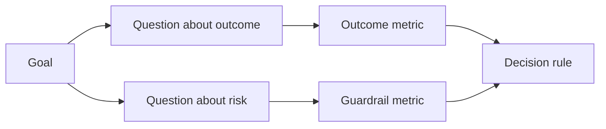

# En el resultado de la producción de indicadores de éxito de diseño

> Los indicadores de medida deben servir a la decisión de acción, no sólo como un decorado de un tablero.

**Type:** Learn + Build
**Languages:** Python (stdlib)
**Prerequisites:** Phase 14 lessons 47 and 51
**Time:** ~70 minutes

## El objetivo del aprendizaje

- Desde los objetivos de resultados esperados se derivan los problemas centrales y los indicadores de medida.
- En la observación de los resultados reales, previamente determinar el valor, la ventana de tiempo, la fuente de datos y la dirección de optimización.
- Se han creado nuevas tecnologías de la información y de la información.
- Para que los elementos de evaluación se ajusten a las decisiones concretas que se tomen para la construcción.

## 目标、问题与标标 (GQM)

Desde el objetivo (Objetivo)

> reducir el tiempo necesario para el servicio de localización afectada, sin aumentar ninguna operación insegura¬¬¬¬¬¬¬¬¬¬¬¬¬¬¬¬¬¬¬¬¬¬¬¬¬¬¬¬¬¬¬¬¬¬¬¬¬¬¬¬¬¬¬¬¬¬¬¬¬¬¬¬¬¬¬¬¬¬¬¬¬¬¬¬¬¬¬¬¬¬¬¬¬¬¬¬¬¬¬¬¬¬¬¬¬¬¬¬¬¬¬¬¬¬¬¬¬¬¬¬¬¬¬¬¬¬¬¬¬¬¬¬¬¬¬¬¬¬¬¬¬¬¬¬¬¬¬¬¬¬¬¬¬¬¬¬¬¬¬¬¬¬¬¬¬¬¬¬¬¬¬¬¬¬¬¬¬¬¬¬¬¬¬¬¬¬¬¬¬¬¬¬¬¬¬¬¬¬¬¬¬¬¬¬¬¬¬¬¬¬¬¬¬¬¬¬¬¬¬¬¬¬¬¬¬¬¬¬¬¬¬¬¬¬¬¬¬¬¬¬¬¬¬¬¬¬¬¬¬¬¬¬¬¬¬¬¬¬¬¬¬¬¬¬¬¬¬¬¬¬¬¬¬¬¬¬¬¬¬¬¬¬¬¬¬¬¬¬¬¬¬¬¬¬¬¬¬¬¬¬¬¬¬¬¬¬¬¬¬¬¬¬¬¬¬¬¬¬¬¬¬¬¬¬¬¬¬¬¬¬¬¬¬¬¬¬¬¬¬¬¬¬¬¬¬¬¬¬¬¬¬¬¬¬¬¬¬¬¬¬¬¬¬¬¬¬¬¬¬¬¬¬¬¬¬¬¬¬¬¬¬¬¬¬¬¬¬¬¬¬¬¬¬¬¬¬¬¬¬¬¬¬¬¬¬¬¬¬¬¬¬¬¬¬¬¬¬¬¬¬¬¬¬¬¬¬¬¬¬¬¬¬¬¬¬¬¬¬¬¬¬¬¬¬¬¬¬¬¬¬¬¬¬¬¬¬¬¬¬¬¬¬¬¬¬¬¬¬¬¬¬¬¬¬¬¬¬¬¬¬¬¬¬¬¬¬¬¬¬¬¬¬¬¬¬¬¬¬¬¬¬¬¬¬¬¬¬¬

推导出问题: ¿Qué es lo que se hace en el mundo?

- ¿Qué velocidad de servicio está?
- ¿Hay una tasa de precisión de servicio de localización muy alta?
- ¿El proceso de diagnóstico se mantiene siempre puro?
- ¿Ha sido el flujo de trabajo el que ha provocado que las alertas sean frecuentemente ignoradas o que la carga del operador se sobreponga?

随后挑选将这些问题操作化 (→ Métricas) →



## Cada indicador necesita un acuerdo de normas

Cada indicador debe tener:

| 契约字段 | 示例 |
|---|---|
| 指标名称（Name） | `median_identification_seconds` |
| 方向（Direction） | 至多不超过（at most） |
| 阈值（Threshold） | 120 |
| 窗口（Window） | 10 次故障事件重放 |
| 数据源（Source） | 重放事件日志 |
| 统计样本（Population） | 参与试点的在岗工程师 |
| 类别（Kind） | 成果指标（outcome）或护栏指标（guardrail） |

Si faltan fuentes de datos y ventanas estadísticas, cualquier número no puede ser reproducido; si faltan valores predefinidos, los indicadores no pueden impulsar decisiones claras.

## Indicadores de resultados, índices de mantenimiento y índices de equilibrio

- **成果指标（Outcome metric）：**¿Es realmente mejorado el estado de la esperanza de mejora?
- **护栏指标（Guardrail）：**¿Se cumplen siempre las condiciones de seguridad y de restricción?
- **制衡指标（Counter-metric）：**¿La optimización local transferirá los costes o la destrucción oculta a otros sectores?

 para el flujo de trabajo de errores, la luz es insuficiente  la precisión  la producción  la interrupción de operaciones  la carga de trabajo de los operadores y la tasa de errores de alerta, constituyen un obstáculo de seguridad para prevenir  la rápida llegada a conclusiones de errores catastróficos 

## Debido de acceso a Internet

离线重放(Offline Replay) muy adecuado para la inspección de la capacidad de reproducción y la cobertura de escenarios de borde;受控试点(Bunded Pilot)

Siempre elegir poder soportar la prueba de costo mínimo de la decisión actual. No puede ser sólo porque el código ya está escrito bien.

## La medida de la decisión

Antes de ver los resultados estadísticos, se debe determinar primero por escrito el camino de acción bajo un escenario de fracaso y confusión.

Ejemplo de la regla:

- 通过(Pass): servicio de la posición de precisión no inferior a 0,9, y la posición de tiempo de la posición no superior a 120 segundos;
- 失败(Fail): cualquier operación de producción ilegal, o la tasa de precisión de la localización inferior a 0,75;
- 模糊(Ambiguo): el rendimiento aunque ha mejorado un poco pero es muy grande, necesita ampliarse y volver a probar el ensayo.

## 动手实现

Este experimento evalúa la integridad del plan de medición de la prueba, incluye el valor de la frontera, el índice de falta de registro, y la producción.`outputs/measurement-report.json`¿Qué es eso?

```bash
python3 code/main.py
python3 -m unittest discover code/tests -v
```

尝试删除在度量计划中的护指标, observe por qué incluso si los índices de resultados siguen existiendo, todo el plan seguirá siendo declarado por el sistema como ilegal.

## 课后练习 课后练习

1. Desde el mismo objetivo de resultados, se derivan tres cuestiones de enfoque diferentes:
2. 补充一条能够捕获因当前优化导致其他角色负担加重的衡量指标──
3. Para cada indicador, especifique su fuente de datos, grupos de muestras estadísticas y ventanas de tiempo.
4. Antes de generar el valor real, preescribir por debajo de la decisión de los tres casos de fracaso y desaprobación.
5. Encontrar una estadística fácil pero fundamentalmente imposible de cambiar cualquier indicador de la decisión, y eliminarla.

## 延伸阅读

- [Basili, Software Modeling and Measurement: The Goal/Question/Metric Paradigm](https://drum.lib.umd.edu/items/8119803a-362b-42ec-b6ce-2311713e7236), introducción de cómo, desde el objetivo definido, se puede derivar un sistema de medición ejecutable (GQM) 范式) 
- [Basili, Caldiera, and Rombach, The Goal Question Metric Approach](https://www.cs.toronto.edu/~sme/CSC444F/handouts/GQM-paper.pdf), explicará este método como práctica de un sistema de mejoras continuas y de un ciclo cerrado de contraste.

## 交付物沉  entrega de objetos

Mantener`outputs/measurement-report.json` Se convertirá en el prototipo original  Prueba  Prueba  Producción  Producción  Etapa de la producción 
