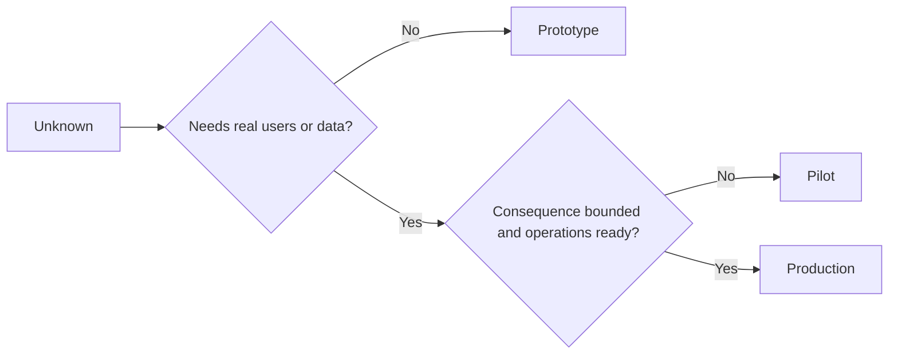

# 审慎择原型、试点还是生产

> Representan un entorno cognitivo muy diferente, y no una mera diferencia de precisión.

**Type:** Learn + Build
**Languages:** Python (stdlib)
**Prerequisites:** Phase 14 lessons 50 to 52
**Time:** ~70 minutes

## El objetivo del aprendizaje

- Según el tipo desconocido, el alcance de la audiencia, la sensibilidad de los datos, la pérdida de resultados y la madurez de la operación, la prudencia de la elección de la construcción de la etapa.
-  establecer medidas de control de cada fase de la actividad  Controls (Controls) y Reglas de salida  Criterios de salida 
-  evitar que el sistema original se transforme en un sistema de producción en el caso de que no haya responsabilidad humana
- En el caso de los sistemas de producción, el sistema de producción y el sistema de producción de producción se ha de aplicar a los sistemas de producción y producción de productos.

## Tres problemas centrales muy diferentes

| 阶段 | 核心问题 |
|---|---|
| 原型（Prototype） | 该技术机制到底能不能产生预期的实证结果？ |
| 试点（Pilot） | 在受控真实受众与真实工况下，它能否安全稳定运行？ |
| 生产（Production） | 组织能否按照既定的可靠性与风险承诺，持续对该系统承担长期责任？ |

Un prototipo técnicamente muy completo, todavía puede ser diseñado para el uso de desechos abandonados; un punto de prueba puede utilizar datos de producción reales, pero su tamaño y capacidad de operación deben ser estrictamente restringidas; y sólo cuando la organización toma formalmente el control y asume la responsabilidad de largo plazo, la fase de producción sólo realmente se abre.

## El primer paso

Cuando se necesita resolver las hipótesis desconocidas sin introducir datos de usuario real o de producción real, se debe adoptar el primer tipo de fase.

- 随时可废弃 (¿¿Discardable?),
- 严格隔离 (Isolado)
- 功能边界狭窄 (estrictamente limitado en el comportamiento);
- 核心验证问题显式明确 (explicito sobre la pregunta de aprendizaje);
- No hace falsas promesas de estabilidad.

En el mecanismo en sí no ha demostrado que vale la pena entrar en la siguiente fase, no optimice demasiado la estructura del sistema completo.

## 试点阶段

Cuando las hipótesis desconocidas deben depender de un comportamiento operativo real, datos reales o flujo de trabajo real para verificar, pero el deterioro de los resultados o la capacidad de desarrollo de la madurez todavía no es suficiente para soportar la publicación completa, la adopción de la fase de prueba.

Un examen de calificación debe tener:

- Indicación de los resultados de la evaluación;
- 明确 responsable de la humanidad;
-  Ciclo de operación y derechos de operación estrictamente restringidos;
-  Auditoría de retroceso y programa de recuperación rápida;
- Indicadores de resultados y de valor de los indicadores de mantenimiento;
- El régimen de expansión, modificación o terminación total del régimen de expansión.

## Producción

La producción está en el mismo nivel que la implementación de código:

- 明确的服务等级目标(SLO);
- Responsables de gestión de los incidentes de trabajo y de fallas;
- Seguridad y privacidad;
- Control de la capacidad de producción y de absorción;
- Mehcanismo completo de recuperación de la caída y la pérdida de capacidad;
- 7x24 小时全天候监控;
- 清晰的退役与下线路径──



## 阶段漂移陷

Cuando el código original, en caso de que no haya establecido un sistema de responsabilidad y funcionamiento, obtiene los derechos de uso reales de los usuarios, datos sensibles o de los núcleos, se vuelve extremadamente peligroso.**阶段漂移（Stage Drift）** debe ser establecido en el sistema de configuración, control de derechos, indicadores de remoción y en el archivo de arquitectura, y el límite de rigidez del prototipo y del piloto debe ser suspendido en la interfaz.

En el caso de los sistemas, el sistema debe ser capaz de ser observado y experimentado directamente en su propio estado de funcionamiento.

## 动手实现

Este experimento, basado en la decisión, se propone automáticamente en la fase adecuada, regresando a las medidas de control necesarias para cada etapa, y se produce.`outputs/stage-decisions.json`¿Qué es eso?

```bash
python3 code/main.py
python3 -m unittest discover code/tests -v
```

La modificación de los ejemplos de los ensayos para tener un resultado negativo y tener una capacidad de desarrollo.

## 课后练习 课后练习

1. 根据认知探索阶段 (en lugar de un estado de implementación de código), re-clasificar los tres proyectos existentes en su cabeza.
2.  redactar un documento que contenga un código de prueba de decisión final de decisión final de decisión
3.  aumentar una medida de control técnico, que impida que el código original se ponga en contacto con los datos de producción ambiental.
4.  encontrar el primer punto que se refiere a la verdadera transformación del sistema en la responsabilidad de la producción en el nivel de la responsabilidad de la producción
5. Para un proyecto de prueba limitada diseñar un conjunto completo de rotulación de operación.

## 延伸阅读

- [Barry Boehm, A Spiral Model of Software Development and Enhancement](https://dl.acm.org/doi/10.1145/12944.12948), explorar cómo hacer que los recursos invertidos de cada generación se ajusten al grado de riesgo ya resuelto.
- [Fagerholm et al., Building Blocks for Continuous Experimentation](https://doi.org/10.1145/2601248.2601276), , , , , , , , , , , , , , , , , , , , , , , , , , , , , , , , , , , , , , , , , , , , , , , , , , , , , , , , , , , , , , , , , , , , , , , , , , , , , , , , , , , , , , , , , , , , , , , , , , , , , , , , , , , , , , , , , , , , , , , , , , , , , , , , , , , , , , , , , , , , , , , , , , , , , , , , , , , , , , , , , , , , , , , , , , , , , , , , , , , , , , , , , , , , , , , , , , , , , , , , , , , , , , , , , , , , , , , , , , , , , , , , , , , , , , , , , , , , , , , , , , , , , , , , , , , , , , , , , , , , , , , , , , , , , , , , , , , , , , , , , , , , , , , , , , , , , , , , , , , , , , , , , , , , , , , , , , , , , , , , , , , , , , , , , , , , , , , , , , , , , , , , , , , , , , , , , , , , , , , , , , , , , , , , , , , , , , , , , , , , , y , , , , , , , , , , , , , , , , , , , , y , , , , , , , , , , , , , , , , , y , , , , , , , , , , , , , , y , , , , , , , , , , , , , , , , , , y , , , , , , , , y , , , , , , , , , , , , y , , , , , , y , , , , , , , , , , , , y , , , , , y , , , , , , ,

## 交付物沉  entrega de objetos

Mantener`outputs/stage-decisions.json` Recoge las razones de la elección de las fases, así como las medidas de control que deben implementarse antes de entrar en la siguiente fase.
