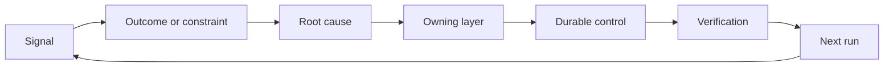

#  Construir una rueda de reincorporation and retirement mechanism

> La publicación de código termina el ciclo de construcción de la época, al mismo tiempo que abre un ciclo de aprendizaje de larga duración.

**Type:** Learn + Build
**Languages:** Python (stdlib)
**Prerequisites:** Phase 14 lessons 46 and 53
**Time:** ~75 minutes

## El objetivo del aprendizaje

- Los eventos de fallas, los datos de evaluación, el comportamiento de los usuarios y la corrección de los errores se transforman en acciones de responsabilidad.
- Se puede utilizar un sistema de control de datos de datos de datos de datos de datos de datos de datos de datos de datos de datos de datos de datos de datos de datos de datos de datos de datos de datos de datos de datos de datos de datos de datos de datos de datos de datos de datos de datos de datos de datos de datos de datos de datos de datos de datos de datos de datos de datos de datos de datos de datos de datos de datos de datos de datos de datos de datos de datos de datos de datos de datos de datos de datos de datos de datos de datos de datos de datos de datos de datos de datos de datos de datos de datos de datos de datos de datos de datos de datos de datos de datos de datos de datos de datos de datos de datos de datos de datos de datos de datos de datos de datos de datos de datos de datos de datos de datos de datos de datos de datos de datos de datos de datos de datos de datos de datos de datos de datos de datos de datos de datos de datos de datos de datos de datos de datos de datos de datos de datos de datos de datos de datos de datos de datos de datos de datos de datos de datos de datos de datos de datos de datos de datos de datos de datos de datos de datos de datos de datos de datos de datos de datos de datos de datos de datos de datos de datos de datos de datos de datos de datos de datos de datos de datos de datos de datos de datos de datos de datos de datos de datos de datos de datos de datos de datos de datos de datos de datos de datos de datos de datos de datos de datos de datos de datos de datos de datos de datos de datos de datos de datos de datos de datos de datos de datos de datos de datos de datos de datos de datos de datos de datos de datos de datos de datos de datos de datos de datos de datos de datos de datos de datos de datos de datos de datos de datos de datos de datos de datos de datos de datos de datos de datos de datos de datos de datos de datos de datos de datos de datos de datos de datos de datos de datos de datos de datos de datos de cuyo de cuyo de cuyo de cuyo cuyo cuyo cuyo cuyo cuyo cuyo cuyo cuyo cuyo cuyo cuyo cuyo cuyo cuyo cuyo cuyo cuyo cuyo cuyo cuyo cuyo cuyo cuyo cuyo cuyo cuyo cuyo cuyo cu
- Se clasificará el riesgo de recaída en primer lugar en función de la gravedad y la frecuencia de la situación.
- Para cada sistema de control del mecanismo de fijar las condiciones de retiro definidas (Condición de retiro)

## La infraestructura también es la misma.

Un equipo puede recopilar una gran cantidad de sistemas de enlace de seguimiento de rastros, registros de evaluación, registros de apoyo y diarios de errores, pero no puede aprender nada de ellos.**晋级通道（Promotion）**En el caso de los datos de la investigación, el análisis de la información y la evaluación de los datos de los datos de la investigación y la investigación de los datos de la investigación y la investigación de los datos de la investigación y la investigación de los datos de la investigación y la investigación de los datos de la investigación y la investigación de los datos de la investigación y la investigación de los datos de la investigación y la investigación de los datos de la investigación y la investigación de la investigación, se puede observar que los datos de la investigación de la investigación de la investigación de la investigación y la investigación de la investigación de la investigación de la investigación de la investigación de la investigación de la investigación de la investigación de la investigación de la investigación de la investigación de la investigación de la investigación de la investigación de la investigación de la investigación de la investigación de la investigación de la investigación de la investigación de la investigación de la investigación de la investigación de la investigación de la investigación de la investigación de la investigación de la investigación de la investigación de la investigación de la investigación de la investigación de la investigación de la investigación de la investigación de la investigación de la investigación de la investigación de la investigación de la investigación de la investigación de la investigación de la investigación de la investigación de la investigación de la investigación de la investigación de la investigación de la investigación de la investigación de la investigación de la investigación de la investigación de la investigación de la investigación de la investigación de la investigación de la investigación de la investigación de la investigación de la investigación de la investigación de la investigación de la investigación de la investigación de la investigación de la investigación de la investigación de la investigación de la investigación de la investigación de la investigación de la investigación de la investigación de la investigación de la investigación de la investigación de la investigación de la investigación de la investigación de la investigación de la investigación de la investigación de la investigación de la investigación de la investigación de la ciencia de los resultados de la investigación de la investigación de la investigación de la investigación de la investigación de la investigación de la investigación de la investigación de la investigación de la investigación de la investigación de la investigación de la investigación de la investigación de la investigación de la investigación de la ciencia de los resultados de la investigación de la investigación de la investigación de la investigación de la investigación de la investigación de la investigación de la ciencia de la ciencia de la ciencia de los resultados de la ciencia de la ciencia de la ciencia de los resultados de la ciencia de la ciencia de la ciencia de la ciencia de la ciencia de la ciencia de los científicos de la ciencia de la ciencia de la ciencia de la

El último ciclo de la serie de reacciones es:

1. 观测到具体实测信号;
2. Relacionar a los resultados de la producción prevista, condiciones de restricción o hipótesis de prepuestos;
3. Identificar los niveles sistémicos más bajos de la responsabilidad de la incidencia;
4. 实施受控的持久化改进;
5. 验证 la probabilidad de que se produzca un fallo de nuevo ha sido reducida;
6. 定期复审该控制机制是否应继续保留──

## 精准路由至应对责任层级 精准路由至应对责任层级

| 信号类型 | 归属目的地 |
|---|---|
| 误报、功能倒退、错误输出结果 | 评测集（Evaluation）或自动化测试 |
| 上下文缺失、重复劳动、过时事实 | 上下文数据源或检索路由策略 |
| 不安全操作或越权漏洞 | 安全策略（Policy）或权限硬边界 |
| 超时、重试风暴、依赖服务不可用 | 运行时控制（Runtime Control） |
| 新的产品需求或尚未决断的权衡取舍 | 经过规范成型（Shaped）的待办项 |

Cuando los controles de automatización o la dureza son suficientes para que el error sea completamente imposible, no hay que añadir un punto de sugerencia en el Prompt.



## La responsabilidad de la pertenencia en sí misma es parte del mecanismo de control.

Cada uno de los proyectos de acción de rotación debe tener claramente:

- 唯一的人类责任人 (propietario único de la empresa);
-  las prioridades basadas en la evaluación integral de los efectos de la destrucción y la frecuencia de repetición;
- 拟修改的目标系统组件 (se puede modificar el objeto objeto objeto de arte)
- provar el programa de verificación de la modificación y su efectividad;
- la ventana de revisión o de pérdida automática;
- 明确的退役条件 (condición de jubilación)

Un llamado programa de mejoras de nadie, lleno de su cantidad es sólo un fragmento de la versión de un pequeño comentario.

## 果断退役过时的控制机制 果断退役过时的控制机制 果断退役过时的控制机制 果断退役过时的控制机制 果断退役过时的控制机制

En el caso de los sistemas de control, las reglas de los sistemas de control deben ser activas y reexaminadas en los siguientes casos:

-  cambios fundamentales en la estructura del sistema o en el flujo de trabajo de las empresas;
- El mecanismo de invariabilidad de la capa inferior ha reemplazado completamente las instrucciones de texto de la capa superior;
- En el período de tiempo previsto, el fallo de prevención nunca se volvió a producir;
- La regulación del control obstaculiza la frecuencia de la realización normal de las actividades, ya superando los beneficios que trae su prevención de los peligros.

El control de la retirada también necesita pruebas, no puede ser sólo porque se ve demasiado tiempo atrás.

## 打通 producto construcción y el bloqueo de agente de codificación

Un mecanismo de rotura similar puede servir simultáneamente a la empresa de productos y el desarrollo de inteligencia en dos trayectorias:

- 产品业务实证驱动预期产出框架、假设图谱、最小切片或量度计划的演化;
- El funcionamiento de un agente de codificación corrección o automatización de pruebas, carga de datos, alcance de operación, optimización de guiones o mecanismos de comunicación de automatización;
- 线上真故障既能促成产品功能边界调整,也能促成代理工作台的加固──

Por eso el marco de tareas no se encuentra en la fase final del código, sino en la fase final de la declaración, que se transfiere en cada cambio que el sistema adopta.

## 动手实现

Este experimento se realiza en el segmento de señales de prueba, se crea un ciclo de acciones de la clasificación de la prioridad, y se produce.`outputs/feedback-backlog.json`¿Qué es eso?

```bash
python3 code/main.py
python3 -m unittest discover code/tests -v
```

尝试添加一个运行时超时信号,验证它将被正确路由至运行时控制层,而不是 generalizarse en la lista de espera de necesidades generales.

## 课后练习 课后练习

1. Se trata de un proyecto de investigación que se desarrolla en el sector de la información y que se desarrolla en el sector de la información.
2. Identificar que puede prevenir de forma fundamental su reaparición en el nivel más bajo del sistema.
3. Para la realización de experimentos, los proyectos de acción complementan con orden de verificación automática o indicadores de observación que sean realmente posibles.
4. Para una normativa de estrategias de seguridad existente, se deben establecer condiciones claras de retirada de la actividad.
5. En el caso de los sistemas de instrucción, el sistema de instrucción de instrucción de instrucción de instrucción de instrucción de instrucción de instrucción de instrucción de instrucción de instrucción de instrucción de instrucción de instrucción de instrucción de instrucción de instrucción de instrucción de instrucción de instrucción de instrucción de instrucción de instrucción de instrucción de instrucción de instrucción de instrucción de instrucción de instrucción de instrucción de instrucción de instrucción de instrucción de instrucción de instrucción de instrucción de instrucción de instrucción de instrucción de instrucción de instrucción de instrucción de instrucción de instrucción de instrucción de instrucción de instrucción de instrucción de instrucción de instrucción de instrucción de instrucción de instrucción de instrucción de instrucción de instrucción de instrucción de instrucción de instrucción de instrucción de instrucción de instrucción de instrucción de instrucción de instrucción de instrucción de instrucción de instrucción de instrucción de instrucción de instrucción de instrucción de instrucción de instrucción de instrucción de instrucción de instrucción de instrucción de instrucción de instrucción de instrucción de instrucción de instrucción de instrucción de instrucción de instrucción de instrucción de instrucción de instrucción de instrucción de instrucción de instrucción de instrucción de instrucción de instrucción de instrucción de instrucción de instrucción de instrucción de instrucción de instrucción de instrucción de instrucción de instrucción de instrucción de instrucción de instrucción de instrucción de instrucción de instrucción de instrucción de instrucción de instrucción de instrucción de instrucción de instrucción de instrucción de instrucción de instrucción de instrucción de instrucción de instrucción de instrucción de instrucción de instrucción de instrucción de instrucción de instrucción de instrucción de instrucción de instrucción de instrucción de instrucción de instrucción de instrucción de instrucción de instrucción de instrucción de instrucción de instrucción de instrucción de instrucción de instrucción de instrucción de instrucción de instrucción de instrucción de instrucción de instrucción de instrucción de instrucción de instrucción de instrucción de instrucción de instrucción de instrucción de instrucción de instrucción de instrucción de instrucción de instrucción de instrucción de instrucción de instrucción de instrucción de instrucción de instrucción

## 延伸阅读

- [Basili, Caldiera, and Rombach, The Goal Question Metric Approach](https://www.cs.toronto.edu/~sme/CSC444F/handouts/GQM-paper.pdf), explorar cómo lograr el conocimiento continuo de la organización a través de mecanismos de medición orientados a objetivos.
- [Fagerholm et al., Building Blocks for Continuous Experimentation](https://doi.org/10.1145/2601248.2601276), el análisis de la realidad de la investigación y desarrollo continuos de los productos en relación con la tecnología y la organización cerrará.
- [Nuseibeh and Easterbrook, Requirements Engineering: A Roadmap](https://www.cs.toronto.edu/~sme/papers/2000/ICSE2000.pdf), explica la necesidad en el punto de vista de la ingeniería en el desarrollo de la actividad del ciclo de vida del sistema entero.

## 交付物沉  entrega de objetos

Mantener`outputs/feedback-backlog.json` It is  product judgment and delivery                                                                                                                                                                                                                                                          
