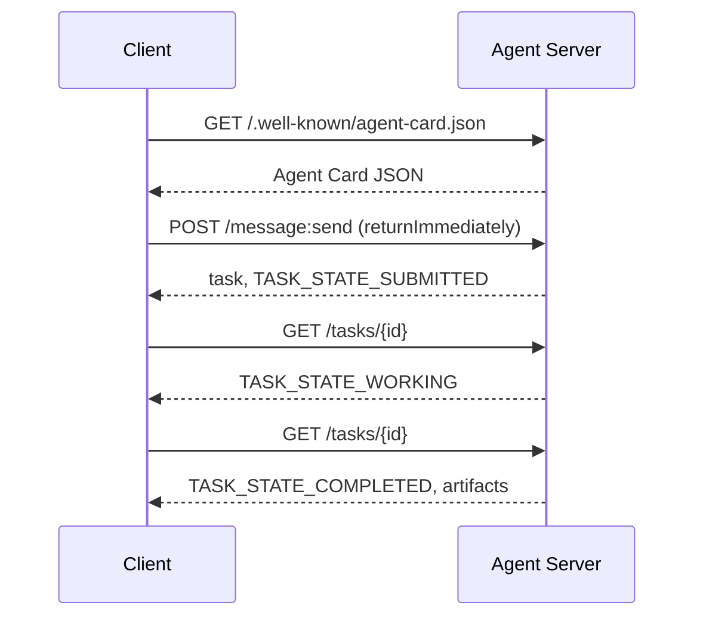

# A2A  智能体间通信协议(Protocolo de agente a agente)

> Google publicó A2A en abril de 2025; hasta abril de 2026, la normativa oficial se ha desarrollado hasta 1.0.1, y obtiene el apoyo de más de 150 organizaciones, incluyendo AWS, Microsoft, Salesforce, etc. A2A es el protocolo de interconexión horizontal de MCP:MCP 聚焦纵向 (MCP  Tools), mientras que A2A 聚焦横向点对点 (MCP  Agent)  (Agent)  (Agent) ).

**Type:** Learn + Build
**Languages:** Python (stdlib, `http.server`, `json`)
**Prerequisites:** Phase 16 · 04（原语模型）
**Time:** ~75 分钟

## 问题背景

Cuando su agente necesita ser llamado a ser desplegado en otro sistema o en otra organización, ¿cómo debe comunicarse? Usted puede exponer un punto final HTTP exclusivo, definir un esquema JSON personalizado, y esperar que el otro pueda usarlo de acuerdo con sus reglas. Pero en ese caso, cada colaboración entre los agentes se convertirá en una integración personalizada de alto costo.

A2A para este transsistema de configuración proporciona un protocolo de línea de uso general (Wire Protocol) ⋅ define la base de datos estándar de servicio, el abrazamiento de tareas estándar, la transferencia de datos estándar y los productos de salida estándar, como la estructura HTTP+REST para el cuerpo inteligente.

## 核心概念 核心概念 核心概念 核心概念

### Cuatro elementos principales

**Agent Card（智能体名片）。**                                                                                                                                                                                                                                                                                                                                                                                                                                                                                                                             `/.well-known/agent-card.json`El documento JSON, para describirlo en su totalidad`supportedInterfaces`(端点 URL、协议绑定、协议版本) 、默认输入和输出媒体类型, así como las necesidades de identificación de derechos de emisión`securitySchemes`Con`securityRequirements`•■■■■■■■■■■■■■■■■■■■■■■■■■■■■■■■■■■■■■■■■■■■■■■■■■■■■■■■■■■■■■■■■■■■■■■■■■■■■■■■■■■■■■■■■■■■■■■■■■■■■■■■■■■■■■■■■■■■■■■■■■■■■■■■■■■■■■■■■■■■■■■■■■■■■■■■■■■■■■■■■■■■■■■■■■■■■■■■■■■■■■■■■■■■■■■■■■■■■■■■■■■■■■■■■■■■■■■■■■■■■■■■■■■■■■■■■■■■■■■■■■■■■■■■■■■■■■■■■■■■■■■■■■■■■■■■■■■■■■■■■■■■■■■■■■■■■■■■■■■■■■■■■■■■■■■■■■■■■■■■■■■■■■■■■■■■■■■■■■■■■■■■■■■■■■■■■■■■■■■■■■■■■■■■■■■■■■■■■■■■■■■■■■■■■■■■■■■■■■■■■■■■■■■■■■■■■■■■■■■■■■■■■■■■■■■■■■■■■■■■■■■■■■■■■■■■■■■■■■■■■■■■■■■■■■■■■■■■■■■■■■■■■■■■■■■■■■■■■■■■■■■■■■■■■■

```http
GET /.well-known/agent-card.json HTTP/1.1
Host: agent.example.com
```

```json
{
  "name": "code-review-agent",
  "description": "审查 Python 与 TypeScript 代码。",
  "version": "1.0.0",
  "supportedInterfaces": [
    {
      "url": "https://agent.example.com",
      "protocolBinding": "HTTP+JSON",
      "protocolVersion": "1.0"
    }
  ],
  "capabilities": {"streaming": false, "pushNotifications": false},
  "securitySchemes": {
    "bearer": {"httpAuthSecurityScheme": {"scheme": "Bearer"}}
  },
  "securityRequirements": [{"schemes": {"bearer": {"list": []}}}],
  "defaultInputModes": ["text/plain", "application/json"],
  "defaultOutputModes": ["application/json"],
  "skills": [
    {
      "id": "review-python",
      "name": "审查 Python 代码",
      "description": "审查传入的 Python 源码并给出改进建议。",
      "tags": ["code-review", "python"]
    },
    {
      "id": "review-typescript",
      "name": "审查 TypeScript 代码",
      "description": "审查传入的 TypeScript 源码并给出类型与逻辑改进建议。",
      "tags": ["code-review", "typescript"]
    }
  ]
}
```

**Task（任务）。**Unidad de trabajo básico. Un objeto de estado diferente con ciclo de vida:`TASK_STATE_SUBMITTED`¿ Qué es esto ?`TASK_STATE_WORKING`¿ Qué es esto ?`TASK_STATE_COMPLETED`- ¿ Qué ?`TASK_STATE_FAILED`- ¿ Qué ?`TASK_STATE_CANCELED` Cliente  envío de mensajes, servidor  creación de tarea, posteriormente el cliente                                                                                                                                                                                                                                                                                                                                                                                                                                                                                                       

**Artifact（产物）。**La tarea  ejecutar completos resultados estructurados                                                                                                                                                                                                                                                                                                                                                                                                                                                                                                                 `text`¿Qué es esto?`raw`¿Qué es esto?`url`O `data`之一并可指明其 `mediaType`¿Qué es eso?

**不透明生命周期（Opaque Lifecycle）。**A2A 绝不规定远程代理 *内部*如何完成任务──客户 仅观察状态转换与最终产品;被调用方完全自由选择任何底层模型和框架──

### MCP y A2A

- **MCP**:Agent  Herramienta。Agent 借助 JSON-RPC 读写工具 Server,核心完全无状态。
- **A2A**Agente  Agente, en el marco de un acuerdo de colaboración, ambas partes de comunicación tienen un cuerpo intelectual completo con capacidad de pensamiento independiente.

En la producción de sistemas multiinteligentes, los dos se coordinan: A2A para el extremo en su lado de la configuración local de herramientas MCP.

### 发现与调用时序 发现与调用时序



Los siguientes caminos siguen las normas de HTTP+JSON, y cada solicitud tiene que ser portada.`A2A-Version: 1.0`En el caso de la solicitud.`SendMessage`Se bloqueará hasta que finalice la tarea, por lo que el cliente se configura con un modo de consulta.`configuration.returnImmediately`Para que se lleve a cabo la tarea.

对于流式传输:`POST /message:stream`返回 Servidor-Enviado Eventos( primero输出 `task`, posteriormente陆续推送`statusUpdate`Con`artifactUpdate`事件), y `/tasks/{id}:subscribe`则用于重新附加到运行中的任务――流在任务进入终态时正常关闭,报文中不包含单独的 `final`标志──

### Identificación y seguridad (autor)

A2A origin生支持三种主流安全模式:

- **Bearer Token**:OAuth2 或不透明 Token`httpAuthSecurityScheme`O `oauth2SecurityScheme`)。
- **mTLS**: doble hacia TLS 认证, organización间强证明身份(`mtlsSecurityScheme`)。
- **API Key**: located request head、URL 查询参数 o clave en la cookie`apiKeySecurityScheme`)。

认证规则在 Agent Card 中公布:`securitySchemes`命名方案,`securityRequirements`规定调用方必须满足的要求──

```figure
sw-agent-card-discovery
```

## 动手实践 动手实践 动手实践 动手实践

`code/main.py` Basado en A2A 1.0 HTTP+JSON  Binding Protocol, puramente usando Python  estándar库 `http.server`Con`json`实现ó 极简的 A2A Server y Client.

-  exposición `/.well-known/agent-card.json`El artículo 1
-  acepta `POST /message:send`调用;
- 管理 tarea  estado 机转换;
- En el`GET /tasks/{id}`Sobre el producto de vuelta.

Funciones del cliente incluyen:

- 拉取并解析 Tarjeta de agente;
-  Enviar con `returnImmediately`La misión de creación de noticias;
-  continuous rounding直至任务完成;
- 读取并验证 Finalidad Artefacto

¿Qué es eso ?

```bash
python3 code/main.py
```

El guión se inicia en el servidor en la línea posterior, y luego el cliente realiza el proceso completo de su implementación, mostrando directamente el proceso completo de descubrimiento, presentación, consulta y obtención de productos.

## 交付物  entrega

本课交付                                                                                                                                                                                                                                                                                                                                                                                                                                                                                                                          `outputs/skill-a2a-integrator.md` Para la planificación del diseño completo de A2A  Integrado: Contenido de la tarjeta de agente Tasco  Actuación  Identificación de los derechos de selección y de la estrategia de gestión y de consulta 

## 核心专业术语

| 术语 | 规范定义 |
|------|---------|
| A2A | 跨系统异构智能体间互相调用的对等开放协议 |
| Agent Card | 暴露于 `/.well-known/agent-card.json` 的元数据卡片，声明技能、端点与鉴权要求 |
| Task | 具备明确生命周期、完成时生成产物的异步工作单元 |
| Artifact | 任务产出的具名、带类型结果（文本、结构化 JSON、音视频媒体等） |
| 不透明生命周期 (Opaque lifecycle) | 内部解决过程对调用方隐藏，仅对外暴露状态流转与产物 |
| 服务发现 (Discovery) | 通过发起 `GET /.well-known/agent-card.json` 获取名片并了解支持能力 |
| MCP 对比 A2A | MCP 属于垂直的 Agent 与工具交互，A2A 属于水平的 Agent 间对等协作 |

## 延伸阅读

- [A2A 规范主站](https://a2a-protocol.org/latest/specification/) 官方权威规范
- [A2A v1.0.1 源码发布](https://github.com/a2aproject/A2A/tree/v1.0.1) Definición de los códigos y normas que sigue este curso
- [Google Developers Blog — A2A 发布说明](https://developers.googleblog.com/en/a2a-a-new-era-of-agent-interoperability/) 官方设计背景
