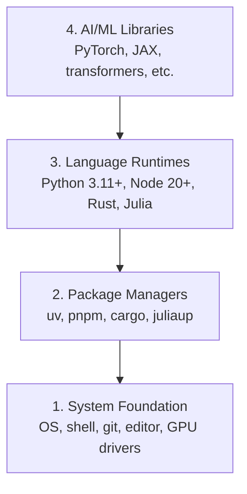

# Environnement de développement

> Vos outils vont façonner votre façon de penser. Une fois, une fois, une fois.

**Type:** Build
**Languages:** Python, Node.js, Rust
**Prerequisites:** None
**Time:** ~45 分钟

## Objectif de l'apprentissage
- Depuis zéro, nous avons mis en place Python 3.11+、Node.js 20+ 和 Rust toolchains
-  Configurer des environnements virtuels et des gestionnaires de paquets, afin de réaliser des constructions réalisables
- Utilisation de l'accès à la GPU CUDA/MPS 验证,并运行一个测试 Tensor operation
- Comprendre les quatre niveaux de stack: systèmes, paquets, temps d'exécution, bibliothèques d'IA

##  problématique
Vous allez utiliser Python, TypeScript, Rust et Julia pour apprendre 200+ sections d'ingénierie AI. Si votre environnement est défectueux, chaque section de la classe deviendra un outil de lutte, et non un outil d'apprentissage.

La plupart des gens sautent la configuration de l'environnement. Ensuite, ils passent quelques heures à déboguer les erreurs d'importation, les conflits de version et l'absence de pilotes CUDA.

## 概念
Un environnement d'ingénierie AI a quatre niveaux:



Nous sommes installés en bas. Chaque étage dépend de la couche inférieure.


```figure
s0-env-stack
```

## - Je le construis.
### 步骤 1: Fondation du système

Check votre système et installer les composants de base.

```bash
# macOS
xcode-select --install
brew install git curl wget

# Ubuntu/Debian
sudo apt update && sudo apt install -y build-essential git curl wget

# Windows (use WSL2)
wsl --install -d Ubuntu-24.04
```

### 步骤 2: Python avec uv

Nous utilisons`uv`Il est 10 à 100 fois plus rapide que le pip et traite automatiquement les environnements virtuels.

```bash
curl -LsSf https://astral.sh/uv/install.sh | sh

uv python install 3.12

uv venv
source .venv/bin/activate  # or .venv\Scripts\activate on Windows

uv pip install numpy matplotlib jupyter
```

验证:

```python
import sys
print(f"Python {sys.version}")

import numpy as np
print(f"NumPy {np.__version__}")
a = np.array([1, 2, 3])
print(f"Vector: {a}, dot product with itself: {np.dot(a, a)}")
```

### 步骤 3: Node.js avec pnpm

Utilisé par TypeScript  cours ]]> agents, serveurs MCP, applications web)

```bash
curl -fsSL https://fnm.vercel.app/install | bash
fnm install 22
fnm use 22

npm install -g pnpm

node -e "console.log('Node', process.version)"
```

### 步骤 4: Rust

Il s'agit d'une approche de la formation et de la formation.

```bash
curl --proto '=https' --tlsv1.2 -sSf https://sh.rustup.rs | sh

rustc --version
cargo --version
```

### 步骤 5: Julia (optionnelle)

Pour Julia, c'est un bon cours de maths.

```bash
curl -fsSL https://install.julialang.org | sh

julia -e 'println("Julia ", VERSION)'
```

### 步骤 6:GPU 设置( si vous avez)

```bash
# NVIDIA
nvidia-smi

# Install PyTorch with CUDA
uv pip install torch torchvision torchaudio --index-url https://download.pytorch.org/whl/cu124
```

```python
import torch
print(f"CUDA available: {torch.cuda.is_available()}")
if torch.cuda.is_available():
    print(f"GPU: {torch.cuda.get_device_name(0)}")
```

没有 GPU?没有问题──大多数课程可在CPU上运行──对于训练重的课程,使用Google Colab或云GPU──

### 步骤 7: Vérifiez tout

运行验证脚本:

```bash
python phases/00-setup-and-tooling/01-dev-environment/code/verify.py
```

## Utilisez-le
Votre environnement est maintenant prêt à être utilisé pour chaque partie du cours.

| Language | Used In | Package Manager |
|----------|---------|-----------------|
| Python | Phases 1-12 (ML, DL, NLP, Vision, Audio, LLMs) | uv |
| TypeScript | Phases 13-17 (Tools, Agents, Swarms, Infra) | pnpm |
| Rust | Phases 12, 15-17 (Performance-critical systems) | cargo |
| Julia | Phase 1 (Math foundations) | Pkg |

## Je le livre.
Ce cours a été créé pour un ouvrage de test que tout le monde peut utiliser pour vérifier sa propre configuration.

Regardez !`outputs/prompt-env-check.md`, dont une aide rapide, à l'aide des assistants d'IA  diagnostiquer les problèmes environnementaux 

## 练习
1. 运行验证脚本并修复 tout échec
2. Pour ce cours, créer un environnement virtuel Python, et installer PyTorch
3. Avec toutes les quatre langues, j'écris un "bonjour au monde", et je fais un tour à tour.
