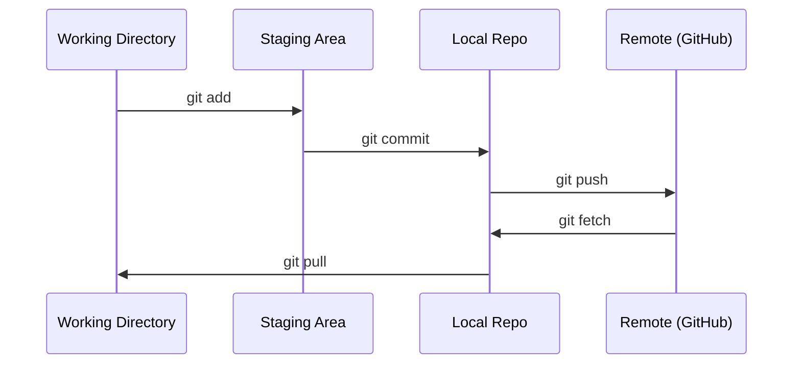

# Git et collaboration

> Le contrôle de version n'est pas une option. Chaque expérience que vous construisez ici doit être suivie.

**Type:** Learn
**Languages:** --
**Prerequisites:** Phase 0, Lesson 01
**Time:** ~30 分钟

## Objectif de l'apprentissage
- 配置 git identity,并使用 add、commit 和 push 的日常工作流
- Pour des expériences séparées, créer et fusionner des branches, éviter de détruire la principale
- 编写一个 `.gitignore`, éliminer les points de contrôle des modèles et les fichiers binaires de grande taille
- Utilisation `git log`浏览 l'histoire du projet, comprendre l'évolution du projet

##  problématique
Vous allez traverser 20 phases  rédiger des centaines de fichiers de code ⋅ sans contrôle de version, vous perdrez votre travail ⋅ détruire quelque chose d'invoyable, ⋅ ne pas pouvoir collaborer avec les autres ⋅

Git est un outil. GitHub est un code qui est là.

## 概念


Je me souviens de trois choses:
1. 经常保存(`git commit`)
2. Poussez à la télécommande`git push`)
3. Pour des expériences  créer une branche`git checkout -b experiment`)


```figure
s0-commit-dag
```

## - Je le construis.
### 步骤 1: Configurer le git

```bash
git config --global user.name "Your Name"
git config --global user.email "you@example.com"
```

### 步骤 2: flux de travail quotidien

```bash
git status
git add file.py
git commit -m "Add perceptron implementation"
git push origin main
```

### Étape 3: Pour l'expérimentation

```bash
git checkout -b experiment/new-optimizer

# ... make changes, commit ...

git checkout main
git merge experiment/new-optimizer
```

### Étape 4: Utilisez ce cours

```bash
git clone https://github.com/cluster1900/ai-engineering-from-scratch-zh.git
cd ai-engineering-from-scratch-zh

git checkout -b my-progress
# work through lessons, commit your code
git push origin my-progress
```

## Utilisez-le
Pour ce cours, vous avez besoin de ces commandes:

| Command | When |
|---------|------|
| `git clone` | 获取 course repo |
| `git add` + `git commit` | 保存你的工作 |
| `git push` | 备份到 GitHub |
| `git checkout -b` | 在不破坏 main 的情况下尝试东西 |
| `git log --oneline` | 查看你做过什么 |

Pour les cours, il n'y a pas besoin de base, de sélection ou de sous-modules.

## 练习
1. Clonner ce référentiel, créer un nommé`my-progress`Une branche, créer un fichier, l'engager, pousser
2. Créer une`.gitignore`, éliminer les dossiers des points de contrôle`.pt`- Je suis là.`.pth`- Je suis là.`.safetensors`)
3. - Je veux le faire .`git log --oneline`查看这个 repo's commit history,并阅读教训是如何被添加的

## 关键术语
| Term | What people say | What it actually means |
|------|----------------|----------------------|
| Commit | “保存” | 你的整个 project 在某个时间点的 snapshot |
| Branch | “一个副本” | 指向某个 commit 的 pointer，会随着你的工作向前移动 |
| Merge | “合并 code” | 把一个 branch 的 changes 应用到另一个 branch |
| Remote | “云端” | 托管在其他地方的 repo 副本（GitHub、GitLab） |
