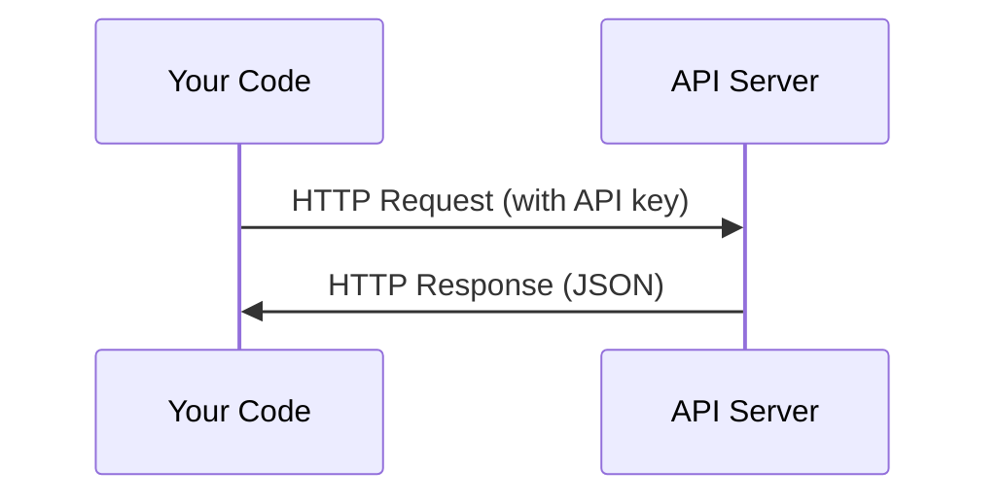

# Les API et les clés

> Chaque API de l'IA fonctionne de la même manière: envoyer une demande, obtenir une réponse.

**Type:** Build
**Languages:** Python, TypeScript
**Prerequisites:** Phase 0, Lesson 01
**Time:** ~30 分钟

## Objectif de l'apprentissage
- Utilisation des variables de l'environnement`.env`fichiers sécurité stockage des clés API
- En même temps en utilisant le SDK Python Anthropic et HTTP brut
- Comparer les formats de requête/réponse basés sur le SDK et le HTTP brut, afin de débogage
- 识别并处理常见 API erreurs, y compris les limites d'authentification et de taux

##  problématique
À partir de la phase 11, vous allez utiliser les API de LLM (Anthropic, Open AI, Google) dans la phase 13-16, vous allez créer des agents dans des boucles utilisant ces API. Vous devez savoir comment les clés API fonctionnent, comment les stocker en toute sécurité et comment lancer votre premier appel API.

## 概念


Chaque appel à l' API a:
1. Un point d'arrêt (URL)
2. Une clé API (authentification)
3. Une requête corps (tu veux quoi)
4. Un corps de réponse (tu as quoi)


```figure
s0-secret-inject
```

## - Je le construis.
### 步骤 1: clés API de stockage sécurisé

绝不要把API keys 放进代码── utiliser des variables environnementales──

```bash
export ANTHROPIC_API_KEY="sk-ant-..."
export OPENAI_API_KEY="sk-..."
```

Ou utiliser `.env`- Je vais le mettre en place.`.gitignore`):

```
ANTHROPIC_API_KEY=sk-ant-...
OPENAI_API_KEY=sk-...
```

### 步骤 2: la première API 调用 (Python)

```python
import anthropic

client = anthropic.Anthropic()

response = client.messages.create(
    model="claude-sonnet-4-20250514",
    max_tokens=256,
    messages=[{"role": "user", "content": "What is a neural network in one sentence?"}]
)

print(response.content[0].text)
```

### 步骤 3: Première fois API 调用 (TypeScript)

```typescript
import Anthropic from "@anthropic-ai/sdk";

const client = new Anthropic();

const response = await client.messages.create({
  model: "claude-sonnet-4-20250514",
  max_tokens: 256,
  messages: [{ role: "user", content: "What is a neural network in one sentence?" }],
});

console.log(response.content[0].text);
```

### 步骤 4: HTTP brut (pas de SDK)

```python
import os
import urllib.request
import json

url = "https://api.anthropic.com/v1/messages"
headers = {
    "Content-Type": "application/json",
    "x-api-key": os.environ["ANTHROPIC_API_KEY"],
    "anthropic-version": "2023-06-01",
}
body = json.dumps({
    "model": "claude-sonnet-4-20250514",
    "max_tokens": 256,
    "messages": [{"role": "user", "content": "What is a neural network in one sentence?"}],
}).encode()

req = urllib.request.Request(url, data=body, headers=headers, method="POST")
with urllib.request.urlopen(req) as resp:
    result = json.loads(resp.read())
    print(result["content"][0]["text"])
```

C'est ce que font les SDK à l'arrière. Comprendre les appels HTTP bruts aide à débogage.

## Utilisez-le
Pour le cours:

| API | When you need it | Free tier |
|-----|-----------------|-----------|
| Anthropic (Claude) | Phases 11-16（agents, tools） | 注册赠送 $5 credit |
| OpenAI | Phase 11（comparison） | 注册赠送 $5 credit |
| Hugging Face | Phases 4-10（models, datasets） | Free |

Vous avez besoin de tout mettre en place.

## Je le livre.
Leçon de l'écriture
- `outputs/prompt-api-troubleshooter.md`- 诊断常见 API erreurs

## 练习
1. Obtenez une clé API Anthropic, et lancez votre premier appel API
2. 尝试 raw HTTP 版本,并将响应格式与SDK 版本进行比较
3. 故意使用错误的API key,并阅读错误消息

## 关键术语
| Term | What people say | What it actually means |
|------|----------------|----------------------|
| API key | "Password for the API" | 一个唯一字符串，用于标识你的 account 并授权 requests |
| Rate limit | "They're throttling me" | 每分钟/每小时最大 requests 数量，用于防止滥用并确保公平使用 |
| Token | "A word"（在 API 语境中） | 一个 billing unit：input 和 output Tokens 会被分别计数并收费 |
| Streaming | "Real-time responses" | 逐词获取 response，而不是等待完整 response |
