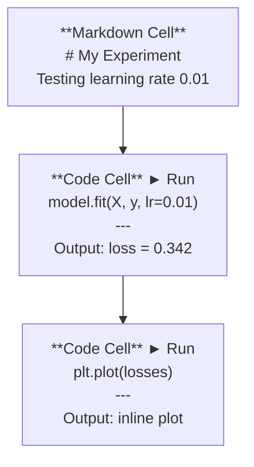
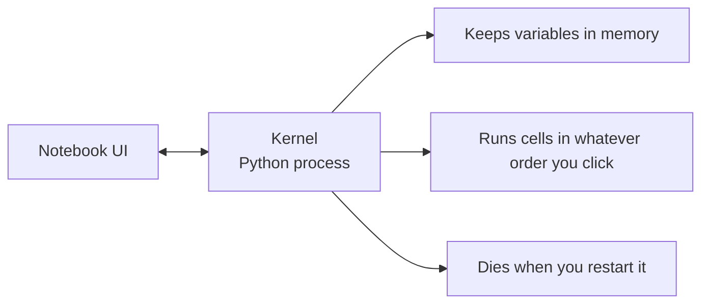

# Les ordinateurs de Jupyter

> Les ordinateurs portables sont une expérience de l'ingénierie de l'IA. Vous en faites un prototype, puis vous mettez la partie efficace en production.

**类型：**Construire
**语言：**Python
**前置要求：**Phase 0, leçon 01
**时间：**Une demi-heure environ.

## Objectif de l'apprentissage

- Installez et démarrez le code VS de JupyterLab、Jupyter Notebook, ou avec l'extension Jupyter
- Utilisez des commandes magiques`%timeit`- Je suis là.`%%time`- Je suis là.`%matplotlib inline`) effectuer des benchmarks et en ligne
- 区分何时使用笔记本、何时使用脚本,并应用在笔记本中探索,在脚本中交付工作流
- 识别并避免常见笔记本 陷:乱序执行、隐藏状态和内存泄漏

##  problématique

Chaque article de l'IA papier、 tutoriel 和 Kaggle compétition utilisent des carnets de notes Jupyter── elles vous permettent de partager des opérations de code、 en ligne 查看输出、混合代码与说明,并快速代── si vous essayez de ne pas utiliser de carnets de notes, apprenez l'IA, comme si vous faites des travaux mathématiques mais pas de papier de dessin──

Mais les carnets de notes ont vraiment des pièges. Les gens les utilisent pour tout, y compris pour les choses qui ne sont pas très bonnes.

## 概念

Notebook est une liste composée d'un groupe de éléments. Chaque élément est un code, un texte.



Le noyau est un processus Python qui fonctionne à l'arrière-plan. Lorsque vous exécutez une cellule, elle envoie le code au noyau, le noyau exécute le code et envoie les résultats. Toutes les cellules partagent le même noyau, de sorte que les variables sont conservées entre les cellules.



Tu fais ce que tu veux Tu fais ce que tu veux C'est super capable, mais aussi facile à piétiner


```figure
s0-cell-order
```

## Construction

### 步骤 1:  choisir votre interface

三种选择, avec une forme:

| Interface | Install | Best for |
|-----------|---------|----------|
| JupyterLab | `pip install jupyterlab` then `jupyter lab` | 完整 IDE 体验、多标签、文件浏览器、terminal |
| Jupyter Notebook | `pip install notebook` then `jupyter notebook` | 简单、轻量、一次一个 notebook |
| VS Code | Install "Jupyter" extension | 已在你的 editor 中、git 集成、debugging |

Je suis en train de lire avec toi.`.ipynb`文件──选你喜欢的即可──JupyterLab est le choix le plus courant dans le travail de l'IA──

```bash
pip install jupyterlab
jupyter lab
```

### 步骤 2: 重要键盘快捷键

Vous allez opérer en deux modes.`Escape`进入 command mode(左侧蓝色), press `Enter`进入 modifier le mode ((绿色) 』

**Command mode（最常用）：**

| Key | Action |
|-----|--------|
| `Shift+Enter` | 运行 cell，移动到下一个 |
| `A` | 在上方插入 cell |
| `B` | 在下方插入 cell |
| `DD` | 删除 cell |
| `M` | 转换为 markdown |
| `Y` | 转换为 code |
| `Z` | 撤销 cell 操作 |
| `Ctrl+Shift+H` | 显示所有快捷键 |

**Edit mode：**

| Key | Action |
|-----|--------|
| `Tab` | Autocomplete |
| `Shift+Tab` | 显示函数签名 |
| `Ctrl+/` | 切换 comment |

`Shift+Enter`Tu l'apprendras tous les jours.

### 步骤 3: Type de cellule

**Code cells**运行 Python 并显示输出:

```python
import numpy as np
data = np.random.randn(1000)
data.mean(), data.std()
```

输出:`(0.0032, 0.9987)`

**Markdown cells**染格式化文本── Utilisez-les pour enregistrer ce que vous faites et pourquoi vous le faites──support les en-têtes、bold、italic、LaTeX math`$E = mc^2$`)、tableaux et images

### 步骤 4: Les commandes magiques

Ce ne sont pas des Python. Ce sont des commandes spéciales de Jupiter.`%`(magie de ligne) ou `%%`(magie cellulaire) Le début...

**为你的代码计时：**

```python
%timeit np.random.randn(10000)
```

输出:`45.2 us +/- 1.3 us per loop`

```python
%%time
model.fit(X_train, y_train, epochs=10)
```

输出:`Wall time: 2.34 s`

`%timeit`Il y a beaucoup de changements dans la répartition des données.`%%time`Je ne fais que le faire une fois.`%timeit`Faites des micro-marquages, utilisez`%%time`Faites des courses d'entraînement.

**启用 inline plots：**

```python
%matplotlib inline
```

Maintenant, tout le monde.`plt.plot()`Ou `plt.show()`Ils sont dans le carnet.

**不离开 notebook 安装 packages：**

```python
!pip install scikit-learn
```

`!`Il faut que tu fasses une commande.

**检查环境变量：**

```python
%env CUDA_VISIBLE_DEVICES
```

### 步骤 5: En ligne  montrer la sortie riche

Les ordinateurs vont automatiquement afficher la dernière expression dans la cellule... mais vous pouvez aussi le contrôler:

```python
import pandas as pd

df = pd.DataFrame({
    "model": ["Linear", "Random Forest", "Neural Net"],
    "accuracy": [0.72, 0.89, 0.94],
    "training_time": [0.1, 2.3, 45.6]
})
df
```

Ceci se traduit par une table HTML formatée, plutôt que par un dépôt de texte.

```python
import matplotlib.pyplot as plt

plt.figure(figsize=(8, 4))
plt.plot([1, 2, 3, 4], [1, 4, 2, 3])
plt.title("Inline Plot")
plt.show()
```

Le plot apparaît dans la cellule, juste en bas. C'est ce que font les ordinateurs.

 Pour les images:

```python
from IPython.display import Image, display
display(Image(filename="architecture.png"))
```

### étape 6: Google Colab

Colab est un ordinateur portable gratuit de Jupyter. Il fournit des bibliothèques GPU, pré-installation et Google Drive.

1. Il y a une autre[colab.research.google.com](https://colab.research.google.com)
2. 上传本课程中的任意 `.ipynb`文件
3. Temps d'exécution > Modifier le type d'exécution > T4 GPU(免费)

Différence entre Colab et Jupiter:
- Fichiers non seront conservés entre les sessions (sauvés à l'arrière ou à la basse)
- 预装:numpy、pandas、matplotlib、torch、tensorflow、sklearn
- Utilisation `from google.colab import files`上传/ download des fichiers
- Utilisation `from google.colab import drive; drive.mount('/content/drive')`Faire un stockage à durée indéterminée
- Les séances de niveau gratuit sont en 90 minutes d' inactivité

## Utilisation

### Notebooks vs Scripts:何时使用哪一个

| Use notebooks for | Use scripts for |
|-------------------|-----------------|
| 探索 dataset | Training pipelines |
| Prototype model | Reusable utilities |
| 可视化结果 | 任何包含 `if __name__` 的东西 |
| 解释你的工作 | 按计划运行的 code |
| 快速 experiments | Production code |
| Course exercises | Packages and libraries |

Règles:**在 notebooks 中探索，在 scripts 中交付**Il y a une autre.

Travail de travail:
1. Dans le carnet d'étude
2. Dans le carnet de notes, le prototype de votre modèle
3. Une fois que c'est possible, on déplace le code.`.py`fichiers
4. Je vais les mettre.`.py`Les fichiers sont importés dans le bloc-notes pour des expériences ultérieures.

### 常见陷

**乱序执行。**Vous pouvez utiliser la cellule 5, réutiliser la cellule 2, réutiliser la cellule 7―Notebook sur votre appareil, mais les autres utilisent la cellule 5 pour la faire fonctionner correctement.

**隐藏状态。**Vous avez supprimé une cellule, mais la variation qu'elle a créée est toujours en mémoire.

**内存泄漏。**Charger un ensemble de données de 4 Go, modèle de formation, recharger un autre ensemble de données, tout n'est pas libéré.`del variable_name`et `gc.collect()`, ou redémarrer le noyau

## 交付

Le cours est ouvert à:
- `outputs/prompt-notebook-helper.md`, pour le référencement

## 练习

1. 打开 JupyterLab, créer un carnet,并使用 `%timeit`Comparer la compréhension de la liste avec la numpy en créant 100 000 个随机数组 时的差异
2. Créer un bloc-notes qui contient des cellules de code et de marquage, charger CSV, afficher un cadre de données, et dessiner un graphique, puis exécuter le noyau > Restarter et exécuter tout
3. Je ne sais pas .`code/notebook_tips.py`Enregistrer le code en utilisant le GPU gratuit

## 关键术语

| Term | What people say | What it actually means |
|------|----------------|----------------------|
| Kernel | “运行我代码的东西” | 一个独立的 Python process，用来执行 cells 并在内存中保存变量 |
| Cell | “一个 code block” | Notebook 中可独立运行的单元，可以是 code 或 markdown |
| Magic command | “Jupyter 技巧” | 以 `%` 或 `%%` 为前缀、用于控制 notebook 环境的特殊命令 |
| `.ipynb` | “Notebook file” | 一个包含 cells、outputs 和 metadata 的 JSON 文件。代表 IPython Notebook |

## 延伸阅读

- [JupyterLab Docs](https://jupyterlab.readthedocs.io/)查看完整功能集
- [Google Colab FAQ](https://research.google.com/colaboratory/faq.html)查看 Colab 特定限制与功能
- [28 Jupyter Notebook Tips](https://www.dataquest.io/blog/jupyter-notebook-tips-tricks-shortcuts/)查看进阶快捷键
