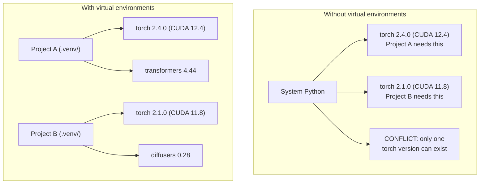

# Environnements Python

> L'enfer de la dépendance est réel.

**Type:** Build
**Languages:** Shell
**Prerequisites:** Phase 0, Lesson 01
**Time:** ~30 分钟

## Objectifs d'apprentissage

- Utilisation `uv`- Je suis là.`venv`Ou `conda`Créer des environnements virtuels isolés
- 编写带有可选依赖性群的 `pyproject.toml`, et générer des fichiers verrouillés pour assurer la réactivité
- 诊断并修复常见陷:installations mondiales pip/conda 混用、CUDA version ne correspond pas
- Pour réaliser des projets de dépendance au conflit  stratégie environnementale par phase 

##  problématique

Vous avez installé PyTorch 2.4 pour un projet de réglage, un autre projet a besoin de PyTorch 2.1, car sa construction CUDA est fixée.

C'est l'enfer de la dépendance. Elle se produit souvent dans le travail de l'IA/ML, parce que:

- PyTorch、JAX 和 TensorFlow sont tous équipés de leurs propres liaisons CUDA
- Les bibliothèques de modèle seront fixées dans des versions de cadre spécifiques
- Tout le monde`pip install`会覆盖 Contenu déjà existant
- CUDA 11.8 construit 不能与 CUDA 12.x les pilotes 配合使用,反之亦然

 solución: chaque projet a son propre environnement d'isolement, ainsi que ses propres forfaits.

## 概念




```figure
s0-env-isolation
```

## Faites-le

### 选项 1:uv venv(推)

`uv`Il est le plus rapide gestionnaire de paquets Python (pipe) ↓比 pip 快 10-100 倍) ↓.

```bash
curl -LsSf https://astral.sh/uv/install.sh | sh

uv python install 3.12

cd your-project
uv venv
source .venv/bin/activate
```

Des paquets de mise en place:

```bash
uv pip install torch numpy
```

Un pas en avant`pyproject.toml`Le projet:

```bash
uv init my-ai-project
cd my-ai-project
uv add torch numpy matplotlib
```

### 选项 2:venv(内置)

Si vous ne pouvez pas l' installer `uv`,Python lui-même`venv`- Le numéro de la liste:

```bash
python3 -m venv .venv
source .venv/bin/activate  # Linux/macOS
.venv\Scripts\activate     # Windows

pip install torch numpy
```

- Je ne sais pas .`uv`Mais ça marche lentement, mais ça peut fonctionner partout où Python est installé.

### 选项 3:conda(需要时使用)

Conda  gérer les kits d'outils CUDA  cuDNN y C bibliothèques etc. autres que les dépendances Python ∙ dans les cas suivants l'utiliser:

- Vous avez besoin de la version de la trousse d'outils CUDA spécifique, mais ne voulez pas installer à l'échelle du système
- Vous êtes dans le cluster partagé, ne peut pas installer les paquets système
- 某某图书馆的安装说明写着 使用公寓 

```bash
# Install miniconda (not the full Anaconda)
curl -LsSf https://repo.anaconda.com/miniconda/Miniconda3-latest-Linux-x86_64.sh -o miniconda.sh
bash miniconda.sh -b

conda create -n myproject python=3.12
conda activate myproject

conda install pytorch torchvision torchaudio pytorch-cuda=12.4 -c pytorch -c nvidia
```

Un article de règle: si vous utilisez un condo dans un environnement, utilisez le condo pour gérer tous les paquets du environnement.`pip install`La confusion entre les condominiums entraîne des conflits de dépendance et provoque une douleur.

### Le programme de formation est basé sur la stratégie de phase

Vous pouvez créer un environnement pour toute la classe. Ne le faites pas.

策略:

```
ai-engineering-from-scratch/
├── .venv/                    <-- phases 0-3 共用的轻量 env
├── phases/
│   ├── 04-neural-networks/
│   │   └── .venv/            <-- PyTorch env
│   ├── 05-cnns/
│   │   └── .venv/            <-- 同一个 PyTorch env（symlink 或 shared）
│   ├── 08-transformers/
│   │   └── .venv/            <-- 可能需要不同的 transformer versions
│   └── 11-llm-apis/
│       └── .venv/            <-- API SDKs，不需要 torch
```

`code/env_setup.sh`Le script central sera utilisé pour créer un environnement de base dans le cours.

## pyproject.toml 基础

Chaque projet Python devrait en avoir un .`pyproject.toml`Il faut remplacer un dossier.`setup.py`- Je suis là.`setup.cfg`et `requirements.txt`Il y a une autre.

```toml
[project]
name = "ai-engineering-from-scratch"
version = "0.1.0"
requires-python = ">=3.11"
dependencies = [
    "numpy>=1.26",
    "matplotlib>=3.8",
    "jupyter>=1.0",
    "scikit-learn>=1.4",
]

[project.optional-dependencies]
torch = ["torch>=2.3", "torchvision>=0.18"]
llm = ["anthropic>=0.39", "openai>=1.50"]
```

Puis on y met:

```bash
uv pip install -e ".[torch]"    # base + PyTorch
uv pip install -e ".[llm]"     # base + LLM SDKs
uv pip install -e ".[torch,llm]" # everything
```

## Fichiers de verrouillage

Le fichier verrouillable fixera chaque dépendance (y compris les dépendances transitives) à une version précise. Cela garantit la réactivité: toute personne installant le fichier verrouillable obtiendra les mêmes paquets.

```bash
# uv generates uv.lock automatically when using uv add
uv add numpy

# pip-tools approach
uv pip compile pyproject.toml -o requirements.lock
uv pip install -r requirements.lock
```

Après avoir cloné le fichier de verrouillage, vous obtiendrez des versions parfaitement compatibles.

## 常见错误

### 1. Tout est installé

```bash
pip install torch  # BAD: installs to system Python

source .venv/bin/activate
pip install torch  # GOOD: installs to virtual environment
```

Check vos colis 会安装到哪里:

```bash
which python       # should show .venv/bin/python, not /usr/bin/python
which pip           # should show .venv/bin/pip
```

### 2. 混用 pip 和 conda

```bash
conda create -n myenv python=3.12
conda activate myenv
conda install pytorch -c pytorch
pip install some-other-package   # BAD: can break conda's dependency tracking
conda install some-other-package # GOOD: let conda manage everything
```

Si vous devez utiliser des pipes dans un condo, certains packs ne font que soutenir des pipes, d'abord installer tous les packs du condo, enfin réinstaller des packs du pipes.

### 3.  oublier activer

```bash
python train.py           # uses system Python, missing packages
source .venv/bin/activate
python train.py           # uses project Python, packages found
```

Votre prompt de coque 应显示 nom de l'environnement:

```
(.venv) $ python train.py
```

### 4. Je vais me mettre à la place de la fille .

```bash
echo ".venv/" >> .gitignore
```

Les environnements virtuels ont généralement 200 Mo à 2 Go. Ils sont locaux et ne peuvent pas être transférés entre les appareils.`pyproject.toml`Et le dossier de verrouillage.

### 5. Ne correspond pas à la version CUDA

```bash
nvidia-smi                # shows driver CUDA version (e.g., 12.4)
python -c "import torch; print(torch.version.cuda)"  # shows PyTorch CUDA version

# These must be compatible.
# PyTorch CUDA version must be <= driver CUDA version.
```

## Utilisez-le

运行 script de configuration  Créer votre environnement de cours:

```bash
bash phases/00-setup-and-tooling/06-python-environments/code/env_setup.sh
```

Ça va être dans la racine repo . Créer une .`.venv`,并安装和验证 dépendances de base, et de la même manière que les autres.

## 练习

1. 运行  référencement`env_setup.sh`Il a confirmé que tous les contrôles ont été passés.
2. Créer un deuxième environnement virtuel, y installer différentes versions de numpy, et confirmer deux environnements séparés
3. Pour un projet en même temps PyTorch et SDK anthropic 编写 `pyproject.toml`
4. Donc, tout le monde a mis en place un paquet, il ne l'a pas activé, il l'a regardé où il est allé, puis il l'a déchargé.

## 关键术语

| Term | What people say | What it actually means |
|------|----------------|----------------------|
| Virtual environment | “A venv” | 一个隔离目录，包含 Python interpreter 和 packages，并与 system Python 分离 |
| Lockfile | “Pinned dependencies” | 一个列出每个 package 及其精确 version 的文件，保证跨机器安装一致 |
| pyproject.toml | “The new setup.py” | 标准 Python project 配置文件，替代 setup.py/setup.cfg/requirements.txt |
| Transitive dependency | “A dependency of a dependency” | Package B 依赖 C；如果你安装依赖 B 的 A，那么 C 就是 A 的 transitive dependency |
| CUDA mismatch | “My GPU isn't working” | PyTorch 编译所用的 CUDA version 与你的 GPU driver 支持的版本不同 |
