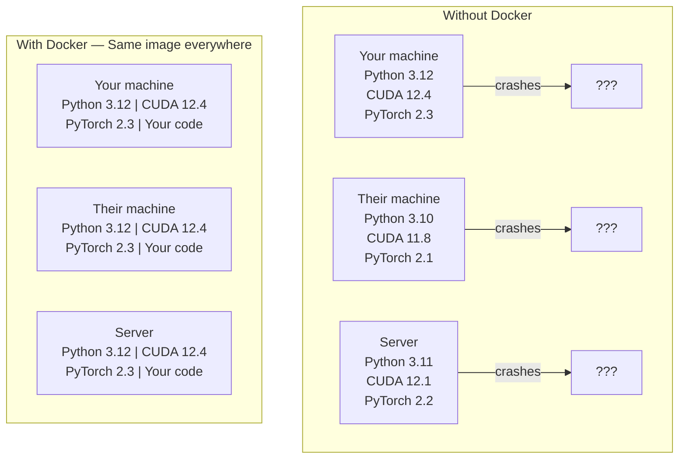

# Docker pour l'IA

> Les conteneurs peuvent être utilisés sur mon appareil.

**Type:** Build
**Languages:** Docker
**Prerequisites:** Phase 0, Lessons 01 and 03
**Time:** ~60 分钟

## Objectifs d'apprentissage

- De Dockerfile Construire une image Docker de GPU activée, contenant des bibliothèques CUDA、PyTorch et AI
- Mettre en place des répertoires hôtes en tant que volumes afin de reconstruire les modèles de contenant, les ensembles de données et le code
- Configurer le kit de contenant NVIDIA, permettre aux conteneurs d'accéder aux GPU à l'intérieur
- Utiliser Docker Composer 编排多服务 applications d'IA(serveur d'inferences + base de données vectorielle)

##  problématique

Vous utilisez PyTorch 2.3 ̊CUDA 12.4 ̊Python 3.12 ̊Trainage d'un modèle‬ Vos collègues utilisent PyTorch 2.1 ̊CUDA 11.8 ̊Python 3.10‬‬ Votre modèle s'effondre sur leur machine‬‬‬‬‬‬‬‬‬‬‬‬‬‬‬‬‬‬‬‬‬‬‬‬‬‬‬‬‬‬‬‬‬‬‬‬‬‬‬‬‬‬‬‬‬‬‬‬‬‬‬‬‬‬‬‬‬‬‬‬‬‬‬‬‬‬‬‬‬‬‬‬‬‬‬‬‬‬‬‬‬‬‬‬‬‬‬‬‬‬‬‬‬‬‬‬‬‬‬‬‬‬‬‬‬‬‬‬‬‬‬‬‬‬‬‬‬‬‬‬‬‬‬‬‬‬‬‬‬‬‬‬‬‬‬‬‬‬‬‬‬‬‬‬‬‬‬‬‬‬‬‬‬‬‬‬‬‬‬‬‬‬‬‬‬‬‬‬‬‬‬‬‬‬‬‬‬‬‬‬‬‬‬‬‬‬‬‬‬‬‬‬‬‬‬‬‬‬‬‬‬‬‬‬‬‬‬‬‬‬‬‬‬‬‬‬‬‬‬‬‬‬‬‬‬‬‬‬‬‬‬‬‬‬‬‬‬‬‬‬‬‬‬‬‬‬‬‬‬‬‬‬‬‬‬‬‬‬‬‬‬‬‬‬‬‬‬‬‬‬‬‬‬‬‬‬‬‬‬‬‬‬‬‬‬‬‬‬‬‬‬‬‬‬‬‬‬‬‬‬‬‬‬‬‬‬‬‬‬‬‬‬‬‬‬‬‬‬‬‬‬‬‬‬‬‬‬‬‬‬‬‬‬‬‬‬‬‬‬‬‬‬‬‬‬‬‬‬‬‬‬‬‬‬‬‬‬‬‬‬‬‬‬‬‬‬‬‬‬‬‬‬‬‬‬‬‬‬‬‬‬‬‬‬‬‬‬‬‬‬‬‬‬‬‬‬‬‬‬‬‬‬‬‬‬‬‬‬‬‬‬‬‬‬‬‬‬‬‬‬‬‬‬‬‬‬‬‬‬‬‬‬‬‬‬‬‬‬‬‬‬‬‬

Les projets d'IA sont des cauchemars de dépendance. Une pile typique comprend Python, PyTorch, CUDA drivers, cuDNN, bibliothèques C au niveau du système, ainsi que des packages spécialisés de versions de compilateur précises comme Flash-attn. Docker va tout mettre en un seul image et les mettre en œuvre de la même manière partout.

## 概念

Docker va mettre votre code, son temps d'exécution, ses bibliothèques et ses outils de système enveloppés dans une unité isolée appelée conteneur. On peut le considérer comme une machine virtuelle de petite taille, simplement elle partage le noyau de l'OS hôte, plutôt que de fonctionner son propre noyau, donc le démarrage ne prend que quelques secondes, et non quelques minutes.



### Pourquoi les projets d'IA ont besoin de Docker plus que la plupart des projets ?

1. **GPU drivers 很脆弱。**CUDA 12.4 code 不能在 CUDA 11.8 上运行──Docker 会隔离容器 内的 CUDA toolkit, simultanément via NVIDIA Container Toolkit 共享主机GPU驱动器──

2. **Model weights 很大。**Un modèle paramètre 7B dans fp16 en bas a 14 Go. Vous ne penserez pas à la recharger à chaque fois que vous la reconstruirez.

3. **Multi-service architectures 很常见。**Une application d'IA réelle n'est pas seulement un script Python. C'est un serveur d'inférence. Il est utilisé pour la base de données vectorielle RAG. Il existe peut-être aussi un frontend web.

### 关键词汇

| Term | What it means |
|------|---------------|
| Image | 只读 template。你的 recipe。由 Dockerfile 构建。 |
| Container | image 的运行实例。你的 kitchen。 |
| Dockerfile | 构建 image 的 instructions。逐层构建。 |
| Volume | 可在 container restarts 后保留的持久化 storage。 |
| docker-compose | 用 YAML 定义 multi-container applications 的工具。 |

### Modèles de conteneurs de l'IA

```
Dev Container
  完整 toolkit。Editor support。Jupyter。Debugging tools。
  用于 development 和 experimentation。

Training Container
  最小化。只有 training script 和 dependencies。
  在 GPU clusters 上运行。没有 editor，没有 Jupyter。

Inference Container
  为 serving 优化。Small image。Fast cold start。
  在 production 中运行于 load balancer 后方。
```


```figure
s0-image-layers
```

## Faites-le

### Étape 1: Installation du Docker

```bash
# macOS
brew install --cask docker
open /Applications/Docker.app

# Ubuntu
curl -fsSL https://get.docker.com | sh
sudo usermod -aG docker $USER
# Log out and back in for group change to take effect
```

验证:

```bash
docker --version
docker run hello-world
```

### Étape 2: Installez le kit d'outils NVIDIA Container avec le logiciel Linux de la GPU NVIDIA)

Cela permet aux conteneurs Docker de pouvoir accéder à votre GPU. MacOS et Windows.

```bash
distribution=$(. /etc/os-release;echo $ID$VERSION_ID)
curl -fsSL https://nvidia.github.io/libnvidia-container/gpgkey | sudo gpg --dearmor -o /usr/share/keyrings/nvidia-container-toolkit-keyring.gpg
curl -s -L https://nvidia.github.io/libnvidia-container/$distribution/libnvidia-container.list | \
    sed 's#deb https://#deb [signed-by=/usr/share/keyrings/nvidia-container-toolkit-keyring.gpg] https://#g' | \
    sudo tee /etc/apt/sources.list.d/nvidia-container-toolkit.list

sudo apt-get update
sudo apt-get install -y nvidia-container-toolkit
sudo nvidia-ctk runtime configure --runtime=docker
sudo systemctl restart docker
```

Dans le conteneur, l'accès à la GPU:

```bash
docker run --rm --gpus all nvidia/cuda:12.4.1-base-ubuntu22.04 nvidia-smi
```

Si vous avez vu des informations sur la GPU, expliquez la boîte à outils.

### Étape 3: Comprendre les images de base

选择正确的基image可以节省几个小时调试时间──

```
nvidia/cuda:12.4.1-devel-ubuntu22.04
  完整 CUDA toolkit。包含 compilers。
  Use for: 构建需要 nvcc 的 packages（flash-attn、bitsandbytes）
  Size: ~4 GB

nvidia/cuda:12.4.1-runtime-ubuntu22.04
  仅 CUDA runtime。没有 compilers。
  Use for: 运行 pre-built code
  Size: ~1.5 GB

pytorch/pytorch:2.3.1-cuda12.4-cudnn9-runtime
  基于 CUDA 预装 PyTorch。
  Use for: 跳过 PyTorch install step
  Size: ~6 GB

python:3.12-slim
  没有 CUDA。仅 CPU。
  Use for: CPU inference、lightweight tools
  Size: ~150 MB
```

### Étape 4: Pour le développement de l'IA 编写 Dockerfile

C' est ça .`code/Dockerfile`Le fichier Docker du milieu.

```dockerfile
FROM nvidia/cuda:12.4.1-devel-ubuntu22.04

ENV DEBIAN_FRONTEND=noninteractive
ENV PYTHONUNBUFFERED=1

RUN apt-get update && apt-get install -y --no-install-recommends \
    python3.12 \
    python3.12-venv \
    python3.12-dev \
    python3-pip \
    git \
    curl \
    build-essential \
    && rm -rf /var/lib/apt/lists/*

RUN update-alternatives --install /usr/bin/python python /usr/bin/python3.12 1

RUN python -m pip install --no-cache-dir --upgrade pip setuptools wheel

RUN python -m pip install --no-cache-dir \
    torch==2.3.1 \
    torchvision==0.18.1 \
    torchaudio==2.3.1 \
    --index-url https://download.pytorch.org/whl/cu124

RUN python -m pip install --no-cache-dir \
    numpy \
    pandas \
    scikit-learn \
    matplotlib \
    jupyter \
    transformers \
    datasets \
    accelerate \
    safetensors

WORKDIR /workspace

VOLUME ["/workspace", "/models"]

EXPOSE 8888

CMD ["python"]
```

- Je le construis.

```bash
docker build -t ai-dev -f phases/00-setup-and-tooling/07-docker-for-ai/code/Dockerfile .
```

La première fois que je vais passer un peu de temps, je vais télécharger une image de base CUDA + PyTorch.

Je vais le faire.

```bash
docker run --rm -it --gpus all \
    -v $(pwd):/workspace \
    -v ~/models:/models \
    ai-dev python -c "import torch; print(f'PyTorch {torch.__version__}, CUDA: {torch.cuda.is_available()}')"
```

Dans le conteneur, le Jupyter:

```bash
docker run --rm -it --gpus all \
    -v $(pwd):/workspace \
    -v ~/models:/models \
    -p 8888:8888 \
    ai-dev jupyter notebook --ip=0.0.0.0 --port=8888 --no-browser --allow-root
```

### Étape 5: Les montants de volume des données et des modèles sont utilisés

Le volume augmente pour l'IA 工作至关重要──没有它们,你的14 GB modèle télécharges 会在容器 停止后消失──

```bash
# Mount your code
-v $(pwd):/workspace

# Mount a shared models directory
-v ~/models:/models

# Mount datasets
-v ~/datasets:/data
```

Dans ton script d'entraînement, de la piste montée

```python
from transformers import AutoModel

model = AutoModel.from_pretrained("/models/llama-7b")
```

modèle 位于 votre système de fichiers hôte 上。 vous pouvez reconstruire le conteneur à volonté, sans avoir à le télécharger à nouveau。

### Étape 6: Composez Docker pour les applications d'IA multi-service

Une application RAG réelle  nécessite un serveur d'inférence 和 une base de données vectorielle──Docker Composer 用一条命令运行两者──

Je vous en prie .`code/docker-compose.yml`- Le numéro de la liste:

```yaml
services:
  ai-dev:
    build:
      context: .
      dockerfile: Dockerfile
    deploy:
      resources:
        reservations:
          devices:
            - driver: nvidia
              count: all
              capabilities: [gpu]
    volumes:
      - ../../../:/workspace
      - ~/models:/models
      - ~/datasets:/data
    ports:
      - "8888:8888"
    stdin_open: true
    tty: true
    command: jupyter notebook --ip=0.0.0.0 --port=8888 --no-browser --allow-root

  qdrant:
    image: qdrant/qdrant:v1.12.5
    ports:
      - "6333:6333"
      - "6334:6334"
    volumes:
      - qdrant_data:/qdrant/storage

volumes:
  qdrant_data:
```

启动所有服务:

```bash
cd phases/00-setup-and-tooling/07-docker-for-ai/code
docker compose up -d
```

Maintenant votre conteneur de développement d'IA peut être utilisé par le nom de service`http://qdrant:6333`访问 vector database──Docker Compose 会自动创建共享网络──

À partir du conteneur d'IA 内测试连接:

```python
from qdrant_client import QdrantClient

client = QdrantClient(host="qdrant", port=6333)
print(client.get_collections())
```

停止所有服务:

```bash
docker compose down
```

À la suite`-v`Il y a aussi le volume de l'article:

```bash
docker compose down -v
```

### Étape 7: commandes Docker utilisées en pratique par l'IA 工作中

```bash
# List running containers
docker ps

# List all images and their sizes
docker images

# Remove unused images (reclaim disk space)
docker system prune -a

# Check GPU usage inside a running container
docker exec -it <container_id> nvidia-smi

# Copy a file from container to host
docker cp <container_id>:/workspace/results.csv ./results.csv

# View container logs
docker logs -f <container_id>
```

## Utilisez-le

Vous avez maintenant un environnement de développement d'IA réalisable.

- Utilisation `docker compose up`En même temps, lancez votre environnement de développement et la base de données vectorielle
- Pour que les volumes soient montés, assurez-vous que rien ne soit perdu entre les reconstructions.
- Quand une partie de la leçon a besoin d'un nouveau paquet Python, ajoutez-le à Dockerfile et reconstruisez-le
- Partagez votre dossier avec vos coéquipiers. Ils auront le même environnement.

### Pas de GPU ?

                                                                                                                                                                                                                                                                                                                                                                                                                                                                                                                             `--gpus all`Le contenant est toujours utilisé pour les leçons basées sur la CPU. PyTorch 会自动检测没有 CUDA,并倒退到CPU.

## 练习

1. Construire Dockerfile et le mettre en contenant `python -c "import torch; print(torch.__version__)"`
2. Initier la pile composée de docker,并验证可从AI container 访问 `http://qdrant:6333/collections`Le Qdrant du haut
3. Il va`flask`添加到Dockerfile, reconstruire, et le port 5000 上运行一个简单API服务器──使用 `-p 5000:5000`carte 端口
4. Utilisation `docker images`Mesurer la taille de l'image.`devel`切换到 `runtime`,并比较大小

## 关键术语

| Term | What people say | What it actually means |
|------|----------------|----------------------|
| Container | “Lightweight VM” | 使用 host kernel 的隔离进程，拥有自己的 filesystem 和 network |
| Image layer | “Cached step” | 每条 Dockerfile instruction 都会创建一个 layer。未变化的 layers 会被 cached，因此 rebuilds 很快。 |
| NVIDIA Container Toolkit | “GPU in Docker” | 一个 runtime hook，通过 `--gpus` flag 将 host GPUs 暴露给 containers |
| Volume mount | “Shared folder” | host 上映射进 container 的目录。container 停止后 changes 仍会保留。 |
| Base image | “Starting point” | 你的 Dockerfile 基于其构建的 `FROM` image。它决定了预装内容。 |
