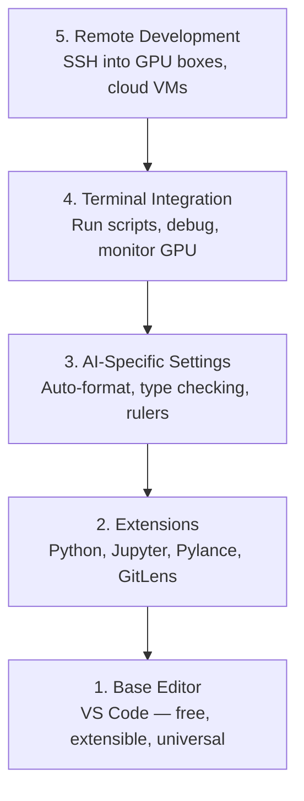

# Configuration de l'éditeur

> Votre éditeur est votre partenaire de collaboration. Configurez-le une fois pour toutes, laissez-le cesser de vous déranger et commencez à jouer un rôle réel.

**Type:** Build
**Languages:** --
**Prerequisites:** Phase 0, Lesson 01
**Time:** ~20 分钟

## Objectif de l'apprentissage
- Installez le code VS, configurez Python、Jupyter、linting et les extensions de base requises par SSH à distance
- Pour les flux de travail de l'IA  configuration de format-on-save ]]> vérification de type et défilement de sortie de notebook
- Configurer SSH à distance, comme éditer local code comme sur le GPU à distance machinerie éditer et déboguer code
- 评估其他编辑器选择(Cursor、Windsurf、Neovim) ainsi que leurs interventions dans le travail de l'IA

##  problématique
Vous passerez des milliers d'heures dans un éditeur: rédiger Python, exécuter des carnets de notes, déboguer des boucles de formation, ainsi que SSH à GPU 机器── un éditeur mal configuré permettra à chaque travail de se remplir d'une résistance: pas de complétion automatique, pas de suggestions de type, pas d'erreurs en ligne, pas besoin de formatage manuel, ainsi que d'un flux de travail terminal lourd──

La mise en place exacte ne prend que 20 minutes.

## 概念
La configuration de l'éditeur de l'ingénierie AI nécessite cinq choses:




```figure
s0-lsp-roundtrip
```

## - Je le construis.
### 步骤 1: Installez le code VS

Il est gratuit, disponible sur tous les systèmes d'exploitation, il est pris en charge par le portable de Jupiter et le mode d'extension couvre tout ce qui est nécessaire pour le travail de l'IA.

De [code.visualstudio.com](https://code.visualstudio.com/)Je suis en train de vous dire...

Dans le terminal:

```bash
code --version
```

Si macOS 上找不到 `code`, ouvrir VS Code, par`Cmd+Shift+P`,输入 "Shell Command", puis sélectionnez "Installer la commande "code" dans PATH"。

### 步骤 2: Installation nécessaire pour l'expansion

Dans le code VS, le terminal intégré est ouvert.`Ctrl+`` `Ou `` Cmd+```), installer des travaux d'IA 需要的扩展:

```bash
code --install-extension ms-python.python
code --install-extension ms-python.vscode-pylance
code --install-extension ms-toolsai.jupyter
code --install-extension eamodio.gitlens
code --install-extension ms-vscode-remote.remote-ssh
code --install-extension ms-python.debugpy
code --install-extension ms-python.black-formatter
code --install-extension charliermarsh.ruff
```

Chaque extension de l'action:

| Extension | Why |
|-----------|-----|
| Python | Language 支持、virtual env 检测、run/debug |
| Pylance | 快速 type checking、autocomplete、import resolution |
| Jupyter | 在 VS Code 内运行 notebooks、variable explorer |
| GitLens | 查看谁改了什么、inline git blame |
| Remote SSH | 像本地一样打开远程 GPU 机器上的文件夹 |
| Debugpy | Python 的 step-through debugging |
| Black Formatter | 保存时自动格式化，保持风格一致 |
| Ruff | 快速 linting，捕获常见错误 |

Dans le cours`code/.vscode/extensions.json`文件包含完整推列表──当你打开项目文件时,VS Code 会提示你安装它们──

### 步骤 3: Configuration de la mise en page

复制本课 `code/.vscode/settings.json`En milieu de réglages, ou par`Settings > Open Settings (JSON)`Application manuelle

Les paramètres clés du travail de l'IA:

```jsonc
{
    "python.analysis.typeCheckingMode": "basic",
    "editor.formatOnSave": true,
    "editor.rulers": [88, 120],
    "notebook.output.scrolling": true,
    "files.autoSave": "afterDelay"
}
```

Pourquoi c'est important ?

- **Type checking on basic**: en cours de fonctionnement capturer des types d'arguments erronés, et debug des déséquilibres de forme du tensor, et de temps de défaut des paramètres API.
- **Format on save**Il n'est pas nécessaire de penser à la mise en forme.
- **Rulers at 88 and 120**:Noir dans 88 处换行──120 标记显示docstrings 和 comments 什么时候过长──
- **Notebook output scrolling**Les boucles d'entraînement seront imprimées en plusieurs milliers de lignes.
- **Auto-save**Vous allez oublier de sauvegarder. Votre script d'entraînement fonctionnera avec le code.

### 步骤 4: Terminal 集成

Le terminal intégré de VS Code est le lieu où vous utilisez des scripts de formation, des systèmes de gestion de processeur, des environnements de gestion.

Il est configuré correctement:

```jsonc
{
    "terminal.integrated.defaultProfile.osx": "zsh",
    "terminal.integrated.defaultProfile.linux": "bash",
    "terminal.integrated.fontSize": 13,
    "terminal.integrated.scrollback": 10000
}
```

Un clavier rapide utile:

| Action | macOS | Linux/Windows |
|--------|-------|---------------|
| Toggle terminal | `` Ctrl+` `` | `` Ctrl+` `` |
| New terminal | `Ctrl+Shift+`` ` | `Ctrl+Shift+`` ` |
| Split terminal | `Cmd+\` | `Ctrl+\` |

Terminals divisés  très utile: un pour faire fonctionner votre script, un autre pour utiliser `nvidia-smi -l 1`Ou `watch -n 1 nvidia-smi`- Je suis en train de surveiller la GPU.

### 步骤 5: développement à distance(SSH à GPU 机器)

C'est l'extension la plus importante du travail de l'IA. Vous serez entraîné sur des machines à distance.

- Le réglage:

1. Installation de l'extension SSH à distance ((já está en étape 2 完成)
2. 按 `Ctrl+Shift+P`(ou `Cmd+Shift+P`),输入 "Remote-SSH: Connectez-vous à l'hôte"―
3. 输入 `user@your-gpu-box-ip`Il y a une autre.
4. Le code VS sera automatiquement installé sur un serveur de machine à distance.

Si vous avez besoin d'un accès sans mot de passe, configurez les clés SSH:

```bash
ssh-keygen -t ed25519 -C "your-email@example.com"
ssh-copy-id user@your-gpu-box-ip
```

Pour la facilité, tu peux ajouter l'hôte.`~/.ssh/config`- Le numéro de la liste:

```
Host gpu-box
    HostName 203.0.113.50
    User ubuntu
    IdentityFile ~/.ssh/id_ed25519
    ForwardAgent yes
```

Je suis là.`Remote-SSH: Connect to Host > gpu-box`Je vais tout de suite me connecter.

## Les alternatives

### Le curseur

[cursor.com](https://cursor.com)Il utilise la même extension, le même mode et le même format de réglage. Si vous utilisez Cursor, tout le contenu de ce cours est toujours applicable.`settings.json`et `extensions.json`Il y a une autre.

### Surf à vent

[windsurf.com](https://windsurf.com)Il s'agit d'un autre forge de code VS d'IA-première. La situation est la même: les mêmes extensions, les mêmes paramètres, le même format, le même support SSH à distance.

### Vim/Neovim

Si vous avez déjà utilisé Vim ou Neovim et que l'efficacité est très élevée, alors continuez à utiliser。 La configuration minimale du travail d'AI Python:

- **pyright**Ou **pylsp**Pour vérifier le type (à travers Mason ou manuel)
- **nvim-lspconfig**Utilisé pour l'intégration du serveur de langue
- **jupyter-vim**Ou **molten-nvim**Utilisé pour une exécution de type notebook
- **telescope.nvim**Utilisé pour la recherche de fichiers / symboles
- **none-ls.nvim**搭配 black 和 ruff utilisé pour le formatage/linting

Si vous n'utilisez pas encore Vim, ne commencez pas maintenant.

## Utilisez-le
Avec ce kit, votre flux de travail quotidien ressemble à ceci:

1. Dans VS Code, ouvrez le dossier du projet (ou via SSH à distance)
2. Dans l'éditeur, éditer Python, utiliser des indices de type et des erreurs de ligne.
3. Utiliser l'extension de Jupyter 内联运行 Jupyter notebooks。
4. Utilisez des scripts de formation en terminal intégré`uv pip install`Et la surveillance par GPU.
5. 提交前用 GitLens révision des changements。

## 练习
1. Installation VS Code et étape 2
2. Le cours sera suivi`settings.json`复制到你的 VS Code config 中
3. 打开一个Python文件,验证Pylance 显示类型提示,并且黑会在保存时格式化
4. Si vous pouvez accéder à un appareil à distance, configurez SSH à distance et ouvrez un fichier dessus

## 关键术语
| Term | What people say | What it actually means |
|------|----------------|----------------------|
| LSP | "Autocomplete engine" | Language Server Protocol：一种标准，让 editors 可以从特定 language 的 server 获取 type info、completions 和 diagnostics |
| Pylance | "The Python plugin" | Microsoft 的 Python language server，使用 Pyright 进行 type checking 和 IntelliSense |
| Remote SSH | "Working on the server" | VS Code extension，在远程机器上运行轻量 server，并将 UI stream 到本地 editor |
| Format on save | "Auto-prettier" | 每次保存时 editor 都会运行 formatter（Black、Ruff），因此 code style 始终一致 |
