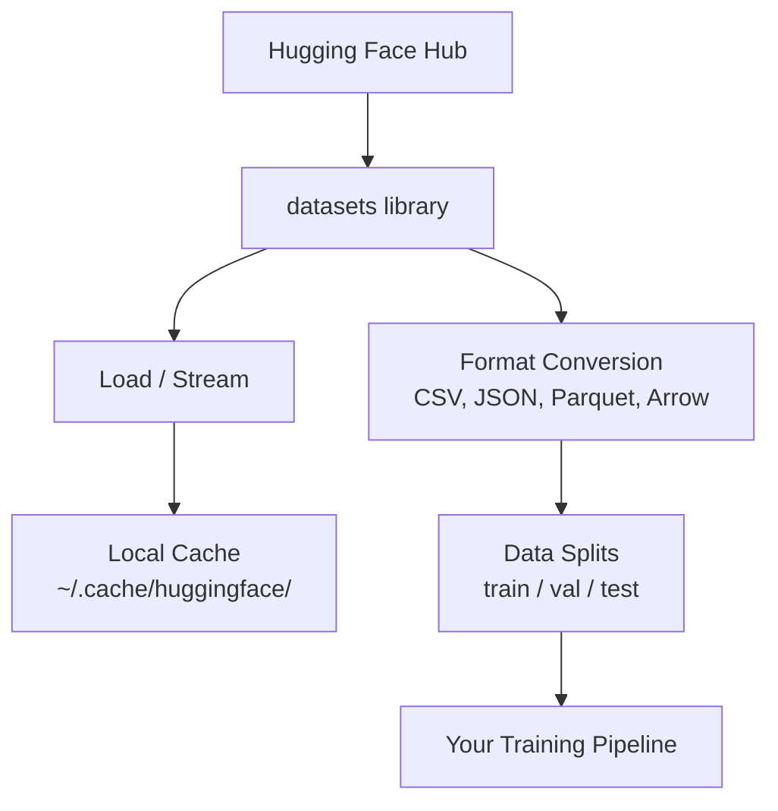

# Gestion des données

> Les données sont le carburant. Comment vous les gérez, c'est vous qui décidez.

**Type:** Build
**Language:**Python
**Prerequisites:** Phase 0, Lesson 01
**Time:** ~45 分钟

## Objectif de l'apprentissage
- Utilisez le visage en train de s' embrasser`datasets`bibliothèque surcharges, flux et cache
- Transfert entre les formats CSV、JSON、Parquet et Arrow, et expliquer leur utilisation
- Utilisation de semences aléatoires fixes  créer un train / validation / test
- Utilisation `.gitignore`、Git LFS ou DVC 管理大型模型 和数据集文件

##  problématique
Chaque projet d'IA est basé sur des données. Vous devez trouver des ensembles de données, les télécharger, les transformer entre les formats, les décomposer pour les entraîner et les évaluer, faire des versions, faire des expériences réalisables.

## 概念


Une face en train de s' embrasser`datasets`La bibliothèque est une méthode standard pour le travail de l'IA.


```figure
s0-data-pipeline
```

## - Je le construis.
### 步骤 1: Installez une bibliothèque de données

```bash
pip install datasets huggingface_hub
```

### 步骤 2: Charger un ensemble de données

```python
from datasets import load_dataset

dataset = load_dataset("imdb")
print(dataset)
print(dataset["train"][0])
```

Ceci sera téléchargé sur IMDB 电影评论数据集.`~/.cache/huggingface/datasets/`Le cache est chargé.

### Étape 3: Processus de traitement de grands ensembles de données

Certains ensembles de données sont trop grands pour être intégrés dans un disque.

```python
dataset = load_dataset("wikimedia/wikipedia", "20220301.en", split="train", streaming=True)

for i, example in enumerate(dataset):
    print(example["title"])
    if i >= 4:
        break
```

Le streaming vous donnera un .`IterableDataset` Vous serez dans les rangées jusqu'à ce que vous les traitiez.

### 步骤 4: Les formats des ensembles de données

`datasets`bibliothèque basse utilise Apache Arrow. Vous pouvez le convertir en d'autres formats en fonction des besoins du pipeline.

```python
dataset = load_dataset("imdb", split="train")

dataset.to_csv("imdb_train.csv")
dataset.to_json("imdb_train.json")
dataset.to_parquet("imdb_train.parquet")
```

Format par rapport à:

| Format | Size | Read Speed | Best For |
|--------|------|-----------|----------|
| CSV | 大 | 慢 | Human readability、spreadsheets |
| JSON | 大 | 慢 | APIs、nested data |
| Parquet | 小 | 快 | Analytics、columnar queries |
| Arrow | 小 | 最快 | In-memory processing（`datasets` 内部使用的格式） |

Pour le travail de l'IA, le Parquet est le meilleur format de stockage. Arrow est le format utilisé dans la mémoire.

### 步骤 5: Les données sont divisées

Chaque projet de formation doit être divisé en trois parties:

- **Train**:model de ici apprendre (habituellement 80%)
- **Validation**: vous êtes en train de suivre un examen de progression (habituellement 10%)
- **Test**: formation 完成后的最终评估 (habituellement 10%)

Certains ensembles de données sont déjà divisés.

```python
dataset = load_dataset("imdb", split="train")

split = dataset.train_test_split(test_size=0.2, seed=42)
train_val = split["train"].train_test_split(test_size=0.125, seed=42)

train_ds = train_val["train"]
val_ds = train_val["test"]
test_ds = split["test"]

print(f"Train: {len(train_ds)}, Val: {len(val_ds)}, Test: {len(test_ds)}")
```

始终设置种子以保证复制性──同一种子每次都产生相同的分化──

### 步骤 6: télécharger le modèle de stockage

Les modèles sont de grands documents.`huggingface_hub`bibliothèque 会处理 téléchargement et mise en cache.

```python
from huggingface_hub import hf_hub_download, snapshot_download

model_path = hf_hub_download(
    repo_id="sentence-transformers/all-MiniLM-L6-v2",
    filename="config.json"
)
print(f"Cached at: {model_path}")

model_dir = snapshot_download("sentence-transformers/all-MiniLM-L6-v2")
print(f"Full model at: {model_dir}")
```

Les modèles seront cachés jusqu' à`~/.cache/huggingface/hub/`                                                                                                                                                                                                                                                              

### Étape 7: Traiter les grands fichiers

Les poids de modèle et les grands ensembles de données ne devraient pas entrer dans git.

**Option A: .gitignore（最简单）**

```
*.bin
*.safetensors
*.pt
*.onnx
data/*.parquet
data/*.csv
models/
```

**Option B: Git LFS（在 git 中跟踪大型文件）**

```bash
git lfs install
git lfs track "*.bin"
git lfs track "*.safetensors"
git add .gitattributes
```

Git LFS dans votre repo, et le stockage des fichiers réels sur un serveur séparé. GitHub fournit 1 Go de charge gratuite.

**Option C: DVC（data version control）**

```bash
pip install dvc
dvc init
dvc add data/training_set.parquet
git add data/training_set.parquet.dvc data/.gitignore
git commit -m "Track training data with DVC"
```

DVC 会创建小型 `.dvc`文件, pointing towards your data──Data est stockée en S3、GCS ou dans d'autres backend de stockage à distance──

| Approach | Complexity | Best For |
|----------|-----------|----------|
| .gitignore | 低 | 个人项目、可重新获取的 downloaded data |
| Git LFS | 中 | 通过 git 共享 model weights 的团队 |
| DVC | 高 | 可复现 experiments、大型 datasets、团队 |

Pour le cours,`.gitignore`已足够── lorsque vous avez besoin de trans-machiner Reproduire des expériences précises 时, reutilisez DVC──

### 步骤 8: Modèles de stockage

**Local storage** Adapté à des ensembles de données de ~ 10 Go.

**Cloud storage** adapté à un contenu plus large, ou nécessitant un partage entre les appareils:

```python
import os

local_path = os.path.expanduser("~/.cache/huggingface/datasets/")

# s3_path = "s3://my-bucket/datasets/"
# gcs_path = "gs://my-bucket/datasets/"
```

DVC peut être directement associé à S3 et GCS 集成:

```bash
dvc remote add -d myremote s3://my-bucket/dvc-store
dvc push
```

Pour ce cours, le stockage local est suffisant. Le stockage en nuage sera associé à des instances de GPU à distance.

## Les données utilisées dans le cours

| Dataset | Lessons | Size | What It Teaches |
|---------|---------|------|----------------|
| IMDB | Tokenization、classification | 84 MB | Text classification 基础 |
| WikiText | Language modeling | 181 MB | Next-token prediction |
| SQuAD | QA systems | 35 MB | Question answering、spans |
| Common Crawl (subset) | Embeddings | 不定 | Large-scale text processing |
| MNIST | Vision basics | 21 MB | Image classification fundamentals |
| COCO (subset) | Multimodal | 不定 | Image-text pairs |

Tu n'as pas besoin de télécharger tout ça. Chaque partie expliquera ce qu'il faut.

## Utilisez-le
运行 script utilitaire 验证一切正常:

```bash
python code/data_utils.py
```

Il téléchargera un petit ensemble de données, le transformera, le divisera, et imprimera un résumé.

## Je le livre.
Le programme de formation
- `code/data_utils.py`- L'utilitaire de chargement et de mise en cache de données à recycler
- `outputs/prompt-data-helper.md`- Utilisé pour la tâche de trouver un ensemble de données adapté

## 练习
1. Utilisation `mrpc`config 加载 `glue`Les données sont données par un ensemble de données,并检查前 5 个例子
2. Retour `c4`un ensemble de données,并统计 10 秒内
3. Transformer un ensemble de données en parquet, et réduire la taille du fichier par rapport au CSV
4. Utilisation de semences fixes 创建 70/15/15 train/val/test split,并验证 size

## 关键术语
| Term | What people say | What it actually means |
|------|----------------|----------------------|
| Dataset split | "Training data" | 一个命名 subset（train/val/test），用于 ML lifecycle 的不同阶段 |
| Streaming | "Load it lazily" | 从远程 source 逐行处理 data，而不下载完整 dataset |
| Parquet | "Compressed CSV" | 一种 columnar file format，针对 analytical queries 和 storage efficiency 优化 |
| Arrow | "Fast dataframe" | `datasets` library 内部使用的 in-memory columnar format，用于 zero-copy reads |
| Git LFS | "Git for big files" | 一个 extension，将大型文件存储在 git repo 外，同时在 version control 中保留 pointers |
| DVC | "Git for data" | 一个用于 datasets 和 models 的 version control system，可与 cloud storage 集成 |
| Cache | "Already downloaded" | 之前获取过的 data 的本地副本，默认存储在 ~/.cache/huggingface/ |
