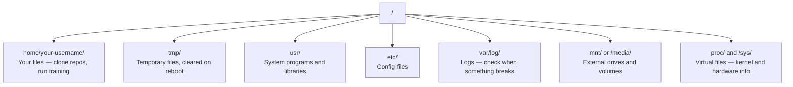

# Face vers l'IA de Linux

> La plupart des IA fonctionnent sur Linux. Vous devez comprendre le degré de non-encombrement.

**类型：**Apprendre à apprendre
**语言：**- Je suis désolé.
**先修要求：**Phase 0, leçon 01
**时间：**- 30 minutes

## Objectif de l'apprentissage

- 浏览 Linux file system,并从命令行执行基本文件操作
- Utilisation `chmod`et `chown`administrer les autorisations de fichier, pour résoudre les erreurs "Permission refusée"
- Utilisation `apt`Installez des paquets système,并为AI 工作设置一台新GPU box
- Identifier lorsque vous passez de macOS à Linux, le développeur est toujours sur un puits sur des machines à distance

##  problématique

Vous êtes sur macOS ou Windows, mais une fois que vous avez accès à la boîte de GPU cloud, loué une instance Lambda, ou lancé une machine EC2, vous entrez dans Ubuntu. Le terminal est votre seule interface.

C'est un guide de survie. Il ne couvre que le contenu nécessaire pour faire du travail sur une machine Linux distante.

## Système de fichiers 布局

Linux tout organisé dans une seule racine .`/`Il n'y a pas de`C:\`Ou `/Volumes`你实际会接触的目录:



Votre répertoire de domicile est`~`Ou `/home/your-username`La plupart des opérations se passent ici.

## Les commandes

Voici 15 commandes qui couvrent votre boîte de GPU à distance.

###  Mobilité

```bash
pwd                         # Where am I?
ls                          # What's here?
ls -la                      # What's here, including hidden files with details?
cd /path/to/dir             # Go there
cd ~                        # Go home
cd ..                       # Go up one level
```

### 文件和目录

```bash
mkdir my-project            # Create a directory
mkdir -p a/b/c              # Create nested directories in one shot

cp file.txt backup.txt      # Copy a file
cp -r src/ src-backup/      # Copy a directory (recursive)

mv old.txt new.txt          # Rename a file
mv file.txt /tmp/           # Move a file

rm file.txt                 # Delete a file (no trash, it's gone)
rm -rf my-dir/              # Delete a directory and everything inside
```

`rm -rf`Il n'y a pas de résiliation.

### 读取文件

```bash
cat file.txt                # Print entire file
head -20 file.txt           # First 20 lines
tail -20 file.txt           # Last 20 lines
tail -f log.txt             # Follow a log file in real time (Ctrl+C to stop)
less file.txt               # Scroll through a file (q to quit)
```

###  recherche

```bash
grep "error" training.log           # Find lines containing "error"
grep -r "learning_rate" .           # Search all files in current directory
grep -i "cuda" config.yaml          # Case-insensitive search

find . -name "*.py"                 # Find all Python files under current dir
find . -name "*.ckpt" -size +1G     # Find checkpoint files larger than 1GB
```

## Autorisations

Chaque fichier de Linux a un propriétaire et des bits d'autorisation. Lorsque les scripts ne peuvent pas être exécutés, ou que vous ne pouvez pas écrire dans un répertoire, vous rencontrez ce problème.

```bash
ls -l train.py
# -rwxr-xr-- 1 user group 2048 Mar 19 10:00 train.py
#  ^^^             owner permissions: read, write, execute
#     ^^^          group permissions: read, execute
#        ^^        everyone else: read only
```

常见修复方式:

```bash
chmod +x train.sh           # Make a script executable
chmod 755 deploy.sh         # Owner: full, others: read+execute
chmod 644 config.yaml       # Owner: read+write, others: read only

chown user:group file.txt   # Change who owns a file (needs sudo)
```

Quand on dit "permission refusée", il y a toujours des permissions.`chmod +x`Ou `sudo`La plupart des cas peuvent être réparés.

## Gestion des colis (adaptation)

Ubuntu 使用 `apt`C'est la façon d'installer un logiciel au niveau du système.

```bash
sudo apt update             # Refresh the package list (always do this first)
sudo apt install -y htop    # Install a package (-y skips confirmation)
sudo apt install -y build-essential  # C compiler, make, etc. Needed by many Python packages
sudo apt install -y tmux    # Terminal multiplexer (keep sessions alive after disconnect)

apt list --installed        # What's installed?
sudo apt remove htop        # Uninstall
```

Vous trouverez dans une nouvelle boîte de GPU des paquets installés:

```bash
sudo apt update && sudo apt install -y \
    build-essential \
    git \
    curl \
    wget \
    tmux \
    htop \
    unzip \
    python3-venv
```

## Utilisateurs et sudo

Vous êtes habituellement un utilisateur ordinaire.

```bash
whoami                      # What user am I?
sudo command                # Run a single command as root
sudo su                     # Become root (exit to go back, use sparingly)
```

Dans les instances de GPU dans le cloud, vous êtes généralement le seul utilisateur et vous avez déjà accès à sudo.

## Processus et système

Lorsque vous êtes en train de travailler, ou vous avez besoin de vérifier le contenu en cours:

```bash
htop                        # Interactive process viewer (q to quit)
ps aux | grep python        # Find running Python processes
kill 12345                  # Gracefully stop process with PID 12345
kill -9 12345               # Force kill (use when graceful doesn't work)
nvidia-smi                  # GPU processes and memory usage
```

Si vous utilisez des serveurs d'inférence, vous pourrez utiliser:

```bash
sudo systemctl start nginx          # Start a service
sudo systemctl stop nginx           # Stop it
sudo systemctl restart nginx        # Restart it
sudo systemctl status nginx         # Check if it's running
sudo systemctl enable nginx         # Start automatically on boot
```

## 磁盘空间

L'espace disque des boîtes GPU est généralement limité.

```bash
df -h                       # Disk usage for all mounted drives
df -h /home                 # Disk usage for /home specifically

du -sh *                    # Size of each item in current directory
du -sh ~/.cache             # Size of your cache (pip, huggingface models land here)
du -sh /data/checkpoints/   # Check how big your checkpoints are

# Find the biggest space hogs
du -h --max-depth=1 / 2>/dev/null | sort -hr | head -20
```

常见省空间方式:

```bash
# Clear pip cache
pip cache purge

# Clear apt cache
sudo apt clean

# Remove old checkpoints you don't need
rm -rf checkpoints/epoch_01/ checkpoints/epoch_02/
```

## Réseaux

Vous allez télécharger des modèles, transmettre des fichiers, et utiliser des API.

```bash
# Download files
wget https://example.com/model.bin                   # Download a file
curl -O https://example.com/data.tar.gz              # Same thing with curl
curl -s https://api.example.com/health | python3 -m json.tool  # Hit an API, pretty-print JSON

# Transfer files between machines
scp model.bin user@remote:/data/                     # Copy file to remote machine
scp user@remote:/data/results.csv .                  # Copy file from remote to local
scp -r user@remote:/data/checkpoints/ ./local-dir/   # Copy directory

# Sync directories (faster than scp for large transfers, resumes on failure)
rsync -avz --progress ./data/ user@remote:/data/
rsync -avz --progress user@remote:/results/ ./results/
```

 Pour tout transport de grande taille, utilisation prioritaire `rsync`Au lieu de`scp`Il ne peut transmettre que des octets changeants, et peut traiter les interruptions de connexion.

## tmux: garder Sessions 存活

Quand tu arrives à la boîte à distance, le portable tue tes entraînements.

```bash
tmux new -s train           # Start a new session named "train"
# ... start your training, then:
# Ctrl+B, then D            # Detach (training keeps running)

tmux ls                     # List sessions
tmux attach -t train        # Reattach to session

# Inside tmux:
# Ctrl+B, then %            # Split pane vertically
# Ctrl+B, then "            # Split pane horizontally
# Ctrl+B, then arrow keys   # Switch between panes
```

La tâche de formation à long terme est toujours en cours de fonctionnement.

## Face vers Windows utilisateur WSL2

Si vous utilisez Windows, WSL2 peut fournir un véritable environnement Linux sans double démarrage.

```bash
# In PowerShell (admin)
wsl --install -d Ubuntu-24.04

# After restart, open Ubuntu from Start menu
sudo apt update && sudo apt upgrade -y
```

WSL2 运行真实Linux kernel──本课中的所有内容都能在其中工作──从 WSL 内部看, vos fichiers Windows 位于 `/mnt/c/Users/YourName/`Il y a une autre.

Le système d'exploitation de la GPU est en phase avec le système d'exploitation de Windows.

## MacOS à Linux

Si vous venez de macOS, ces choses vous vivront:

| macOS | Linux | 说明 |
|-------|-------|-------|
| `brew install` | `sudo apt install` | package names 有时不同。`brew install htop` 和 `sudo apt install htop` 效果相同，但 `brew install readline` 和 `sudo apt install libreadline-dev` 不同。 |
| `open file.txt` | `xdg-open file.txt` | 但远程 box 上通常没有 GUI。使用 `cat` 或 `less`。 |
| `pbcopy` / `pbpaste` | 不可用 | SSH 上不存在 pipe 到/来自 clipboard 的能力。 |
| `~/.zshrc` | `~/.bashrc` | macOS 默认使用 zsh。大多数 Linux servers 使用 bash。 |
| `/opt/homebrew/` | `/usr/bin/`, `/usr/local/bin/` | Binaries 位于不同位置。 |
| `sed -i '' 's/a/b/' file` | `sed -i 's/a/b/' file` | macOS sed 需要在 `-i` 后加一个空字符串。Linux 不需要。 |
| Case-insensitive filesystem | Case-sensitive filesystem | 在 Linux 上，`Model.py` 和 `model.py` 是两个不同文件。 |
| Line endings `\n` | Line endings `\n` | 相同。但 Windows 使用 `\r\n`，会破坏 bash scripts。运行 `dos2unix` 修复。 |

## 快速参考卡

```
Navigation:     pwd, ls, cd, find
Files:          cp, mv, rm, mkdir, cat, head, tail, less
Search:         grep, find
Permissions:    chmod, chown, sudo
Packages:       apt update, apt install
Processes:      htop, ps, kill, nvidia-smi
Services:       systemctl start/stop/restart/status
Disk:           df -h, du -sh
Network:        curl, wget, scp, rsync
Sessions:       tmux new/attach/detach
```


```figure
s0-process-fork
```

## 练习

1. SSH vers n'importe quelle machine Linux ((( ou ouvrir WSL2),并导航到您的家庭目录──创建一个项目文件,其中使用`touch` Créer trois fichiers vides, puis utiliser `ls -la`Je les ai mises en place.
2. Uzal apt installation `htop`Je vais essayer de trouver le processus qui utilise le plus de mémoire.
3. Initier une session tmux, en fonctionnement `sleep 300`, détach, séances de départ, puis reattacher.
4. Utilisation `df -h`检查可用磁盘空间, puis utiliser `du -sh ~/.cache/*`找出 cache 中占占空间的内容──
5. Utilisation `scp`Transférer un fichier d'une machine locale à une machine à distance, puis l'utiliser.`rsync`Faites la même transmission, et comparez l'expérience.
