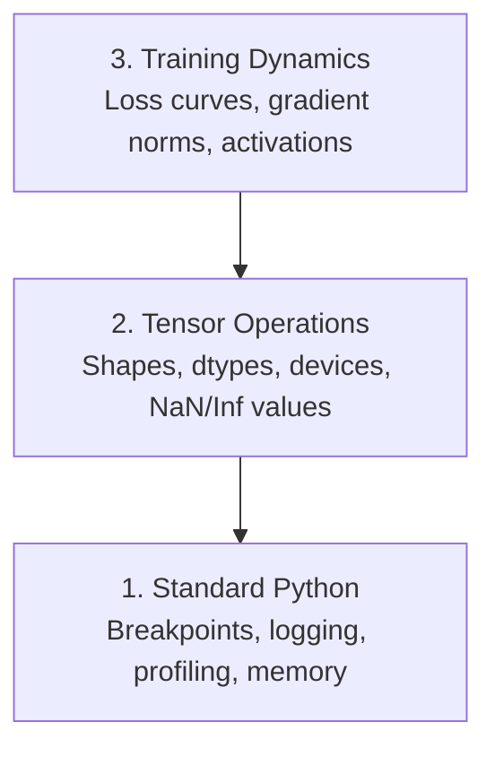

# Débug et profilage

> Les pires bugs d'IA ne s'effondrent pas. Ils s'entraînent silencieusement sur les données de déchets et rapportent une belle courbe de perte.

**类型：**Construction
**语言：**Python
**先修要求：**Leçon 1 ((Environnement de la nature), PyTorch de base 熟悉度
**时间：**- 60 minutes

## Objectif de l'apprentissage

- Utilisation des conditions`breakpoint()`et `debug_print`En train de vérifier les formes tensores, les types et les valeurs NaN
- Utilisation `cProfile`- Je suis là.`line_profiler`et `tracemalloc`Profil  entraînement cycle, trouver des goulots d'étranglement
- 检测常见 bugs de l'IA: désaccords de forme, perte de NaN, fuite de données et tenseurs de mauvais appareil
- setting TensorBoard pour visualiser les courbes de perte, les histogrammes de poids et les distributions de gradients

##  problématique

Le code de l'IA échoue différemment du code ordinaire. L'application web entraînera une trace de pile de l'effondrement. La configuration de la boucle de formation erronée fonctionnera pendant 8 heures, brûle 200 $ de temps de GPU, puis produit un modèle de valeur moyenne prévue pour chaque entrée.`.detach()`, ou des étiquettes  évacuer dans les caractéristiques 

Vous avez besoin d'outils de débogage, pour perdre votre temps et votre calcul avant de les saisir.

## 概念

La débogage de l'IA est divisée en trois niveaux:



La plupart des gens sautent directement au troisième niveau, mais 80% des bugs sont dans le premier et le deuxième niveau.


```figure
s0-flame-hot
```

## - Je le construis.

### Partie 1: Impression Débogage ((是的,它有效)

Le débogage d'impression est souvent négligé, mais il ne faut pas le faire. Pour le code tensor, une déclaration d'impression ciblée est souvent plus efficace que le testateur progressif, car vous avez besoin de voir une fois pour toutes les formes, les types et les gammes de valeurs.

```python
def debug_print(name, tensor):
    print(f"{name}: shape={tensor.shape}, dtype={tensor.dtype}, "
          f"device={tensor.device}, "
          f"min={tensor.min().item():.4f}, max={tensor.max().item():.4f}, "
          f"mean={tensor.mean().item():.4f}, "
          f"has_nan={tensor.isnan().any().item()}")
```

Dans chaque opération douteuse, il faut le modifier.

### Partie 2: Débugger Python (pdb 和 point de rupture)

Le débogageur interne a été sous-estimé dans le travail de l'IA.`breakpoint()`放进训练循环,并交互式检查门子──

```python
def training_step(model, batch, criterion, optimizer):
    inputs, labels = batch
    outputs = model(inputs)
    loss = criterion(outputs, labels)

    if loss.item() > 100 or torch.isnan(loss):
        breakpoint()

    loss.backward()
    optimizer.step()
```

Lorsque le débogageur stop down arrive, des commandes utiles:

- `p outputs.shape`检查 formes
- `p loss.item()`查看 valeur de la perte
- `p torch.isnan(outputs).sum()`统计 NAN
- `p model.fc1.weight.grad`检查 gradients
- `c`continuer,`q` Retrait

C'est le débogage conditionnel. Pour les 10 000 étapes de formation, c'est très important.

### Partie 3: Logging Python

Lorsque vous débogagez 超出快速检查范围时, utilisez le journal 替换打印语句──

```python
import logging

logging.basicConfig(
    level=logging.INFO,
    format="%(asctime)s [%(levelname)s] %(message)s",
    handlers=[
        logging.FileHandler("training.log"),
        logging.StreamHandler()
    ]
)
logger = logging.getLogger(__name__)

logger.info("Starting training: lr=%.4f, batch_size=%d", lr, batch_size)
logger.warning("Loss spike detected: %.4f at step %d", loss.item(), step)
logger.error("NaN loss at step %d, stopping", step)
```

Logging  fournir des timestamps、 niveaux de sévérité 和 sortie de fichier。 Lorsque l'entraînement se déroule à 3 heures du matin, lorsque vous ne parvenez pas, vous voulez le fichier de journal, et non la sortie du terminal du écran―

### Partie 4: Pour la période de code

Le temps passe où, c'est la première étape de l'optimisation.

```python
import time

class Timer:
    def __init__(self, name=""):
        self.name = name

    def __enter__(self):
        self.start = time.perf_counter()
        return self

    def __exit__(self, *args):
        elapsed = time.perf_counter() - self.start
        print(f"[{self.name}] {elapsed:.4f}s")

with Timer("data loading"):
    batch = next(dataloader_iter)

with Timer("forward pass"):
    outputs = model(batch)

with Timer("backward pass"):
    loss.backward()
```

常见发现: le chargement de données occupe 60% du temps de formation.`num_workers > 0`Au lieu de changer de GPU plus rapide.

### Partie 5: cProfil et ligne_profiler

Quand vous avez besoin de plus d'informations que les chronométrages manuels:

```bash
python -m cProfile -s cumtime train.py
```

Ceci affichera chaque appel de fonction, et selon le temps cumulé 排序──若要逐行配置:

```bash
pip install line_profiler
```

```python
@profile
def train_step(model, data, target):
    output = model(data)
    loss = F.cross_entropy(output, target)
    loss.backward()
    return loss

# Run with: kernprof -l -v train.py
```

### Partie 6: Profilisation de la mémoire

#### Utilisez tracemalloc 查看 mémoire du processeur

```python
import tracemalloc

tracemalloc.start()

# your code here
model = build_model()
data = load_dataset()

snapshot = tracemalloc.take_snapshot()
top_stats = snapshot.statistics("lineno")
for stat in top_stats[:10]:
    print(stat)
```

#### Utilisez le profil de mémoire 查看 CPU mémoire

```bash
pip install memory_profiler
```

```python
from memory_profiler import profile

@profile
def load_data():
    raw = read_csv("data.csv")       # watch memory jump here
    processed = preprocess(raw)       # and here
    return processed
```

- Je veux le faire .`python -m memory_profiler your_script.py`运行,以查看逐行 mémoire de l'utilisation

#### Utilisez PyTorch 查看 mémoire GPU

```python
import torch

if torch.cuda.is_available():
    print(torch.cuda.memory_summary())

    print(f"Allocated: {torch.cuda.memory_allocated() / 1e9:.2f} GB")
    print(f"Cached: {torch.cuda.memory_reserved() / 1e9:.2f} GB")
```

Quand tu te retrouves avec OOM (extérieur à la mémoire):

1. 减小批量 (永远是第一个要尝试的)
2. Utilisation `torch.cuda.empty_cache()`释放 mémoire en cache
3. Pour les grands intermédiaires`del tensor`, puis调用 `torch.cuda.empty_cache()`
4. Utilisation de précision mixte`torch.cuda.amp`) réduira la consommation de mémoire
5. Pour les modèles très profonds, utilisez le point de contrôle des gradients

### Partie 7: 常见AI Bugs et comment les capturer

#### Des écarts de forme

La forme la plus courante d'un tenseur est`[batch, features]`, mais le modèle 期望 `[batch, channels, height, width]`Il y a une autre.

```python
def check_shapes(model, sample_input):
    print(f"Input: {sample_input.shape}")
    hooks = []

    def make_hook(name):
        def hook(module, inp, out):
            in_shape = inp[0].shape if isinstance(inp, tuple) else inp.shape
            out_shape = out.shape if hasattr(out, "shape") else type(out)
            print(f"  {name}: {in_shape} -> {out_shape}")
        return hook

    for name, module in model.named_modules():
        hooks.append(module.register_forward_hook(make_hook(name)))

    with torch.no_grad():
        model(sample_input)

    for h in hooks:
        h.remove()
```

Utilisez un échantillon de lot 运行一次──它会映射模型中每一次形状转变──

#### Perte de la valeur

La perte de NaN indique que certaines choses ont explosé.

- Taux d'apprentissage 太高
- Perte sur mesure
- Pour le log de n'importe quel nombre
- RNN en moyenne des gradients  explosion

```python
def detect_nan(model, loss, step):
    if torch.isnan(loss):
        print(f"NaN loss at step {step}")
        for name, param in model.named_parameters():
            if param.grad is not None:
                if torch.isnan(param.grad).any():
                    print(f"  NaN gradient in {name}")
                if torch.isinf(param.grad).any():
                    print(f"  Inf gradient in {name}")
        return True
    return False
```

#### Fuite de données

Votre modèle est dans le test de haute précision de 99%...

```python
def check_data_leakage(train_set, test_set, id_column="id"):
    train_ids = set(train_set[id_column].tolist())
    test_ids = set(test_set[id_column].tolist())
    overlap = train_ids & test_ids
    if overlap:
        print(f"DATA LEAKAGE: {len(overlap)} samples in both train and test")
        return True
    return False
```

Il faut aussi vérifier la fuite temporelle: avec futur données pré测过去──split 前先按时间标签 排序──

#### Faute de dispositif

Les tensors sur les différents appareils (CPU vs GPU) entraînent des erreurs de temps d'exécution. Mais parfois, un tensor reste silencieux sur le CPU, tandis que tout le reste est sur le GPU, l'entraînement fonctionne très lentement.

```python
def check_devices(model, *tensors):
    model_device = next(model.parameters()).device
    print(f"Model device: {model_device}")
    for i, t in enumerate(tensors):
        if t.device != model_device:
            print(f"  WARNING: tensor {i} on {t.device}, model on {model_device}")
```

### Partie 8: Tableau de tension 基础

Le TensorBoard va montrer ce qui s'est passé au cours de l'entraînement.

```bash
pip install tensorboard
```

```python
from torch.utils.tensorboard import SummaryWriter

writer = SummaryWriter("runs/experiment_1")

for step in range(num_steps):
    loss = train_step(model, batch)

    writer.add_scalar("loss/train", loss.item(), step)
    writer.add_scalar("lr", optimizer.param_groups[0]["lr"], step)

    if step % 100 == 0:
        for name, param in model.named_parameters():
            writer.add_histogram(f"weights/{name}", param, step)
            if param.grad is not None:
                writer.add_histogram(f"grads/{name}", param.grad, step)

writer.close()
```

- Je vous en prie !

```bash
tensorboard --logdir=runs
```

Pour vous occuper de quoi:

- **Loss 不下降**: taux d'apprentissage trop bas, ou architecture de modèle  problème
- **Loss 剧烈震荡**: taux d'apprentissage 太高
- **Loss 变成 NaN**:Instabilité numérique ((see above of NaN 部分)
- **Train loss 下降，val loss 上升**Réglage des pièces:
- **Weight histograms 坍缩到零**Gradients disparus
- **Gradient histograms 爆炸**: besoin de coupe de gradient

### Partie 9: Débugger de code VS

Pour le débogage de l'interface, utilisez`launch.json`配置 VS Code:

```json
{
    "version": "0.2.0",
    "configurations": [
        {
            "name": "Debug Training",
            "type": "debugpy",
            "request": "launch",
            "program": "${file}",
            "console": "integratedTerminal",
            "justMyCode": false
        }
    ]
}
```

Cliquez sur le boîtier  définir les points de rupture。 utiliser le volet Variables  vérifier les propriétés du tensor。 Débug Console 让你在执行中途运行任意Python expressions。

Ceci est très utile pour les pipelines de pré-traitement des données, surtout lorsque vous voulez voir chaque transformation.

## Utilisez-le

Voici le débogage du flux de travail qui peut capturer la plupart des bugs de l'IA:

1. **训练前**:用 échantillon lot 运行 `check_shapes` l'essai des dimensions d'entrée et de sortie  conforme à l'expectation.
2. **前 10 步**: à la perte, aux sorties et aux gradients`debug_print` confirmer qu'il n'y a pas de NaN, et des valeurs dans une plage raisonnable
3. **训练期间**Les résultats de l'étude ont été obtenus en fonction des résultats obtenus par la Commission.
4. **出问题时**: dans le point de défaillance  placer `breakpoint()`◊ Les tensors de contrôle de l'interaction
5. **针对性能**:计时数据 loading、forward、backward pass──若接近 OOM,则配置存储──

## Je le livre.

运行 script de débogage du kit d'outils:

```bash
python phases/00-setup-and-tooling/12-debugging-and-profiling/code/debug_tools.py
```

Regardez !`outputs/prompt-debug-ai-code.md`, dont une aide pour diagnostiquer des bugs spécifiques à l'IA.

## 练习

1. 运行  référencement`debug_tools.py`, lire chaque section de sortie,, modifier le modèle de mannequin  introduire un NaN(Proposition: dans le passage avant, distinguer à zéro), observer le détecteur  saisir ⋅
2. Utilisation `cProfile`Un cycle d'entraînement, il identifie la fonction la plus lente.
3. Utilisation `tracemalloc`找出数据 loading pipeline 中哪一行分配了最多的内存──
4. Pour une simple formation, la mise en place de TensorBoard, et la reconnaissance du modèle,
5. Dans la boucle d'entraînement`breakpoint()`◊ Exercice de débogage prompt  vérifier les formes tensors、appareils 和 valeurs de gradient。
